<h1 align="center">Informe de Trabajo Final</h1>

  

**Universidad Peruana de Ciencias Aplicadas**

**Ingeniería de Software**

**6to Ciclo**

**Código del curso:** 1ACC0238

**Nombre del curso:** Aplicaciones para Dispositvos Móviles

**NRC:** 1795

**Nombre del profesor:** Jorge Luis Mayta Guillermo

**Nombre del Startup:** UniPafi

**Nombre del Producto:** InnoSpace

### Relación de Integrantes

| **Código** | **Apellidos y Nombres**             |
| ---------- | ----------------------------------- |
| U20211B293 | Cabrera Buitron, Diego Ivan |
| U202313172 | Coca Lavado, Carlos Andres |
| U20231A500 | Palomino Fiestas, Erick Leonardo    |
| U20231D974 | Rivera Ratachi, Renzo Sebastian     |
| U202310988 | Santur Tello, Andrea Elizabeth     |

**Agosto 2025**

---

**Registro de Versiones del Informe**

<table align="center">
  <tr>
    <td><strong>Versión</strong></td>
    <td><strong>Fecha</strong></td>
    <td><strong>Autor(es)</strong></td>
    <td><strong>Descripción de cambios</strong></td>
  </tr>
  <tr>
    <td>1.00</td>
    <td>02/09/25</td>
    <td>
    Rivera
    </td>
    <td>Creación del documento en markdown.</td>
  </tr>
  <tr>
    <td>1.01</td>
    <td>05/09/25</td>
    <td>
    Rivera, 
    Palomino, 
    Coca, 
    Cabrera, Santur
    </td>
    <td>Creacion del Descripcion del Startup y perfil de los integrantes.</td>
  </tr>
  <tr>
    <td>1.02</td>
    <td>09/09/25</td>
    <td>
    Rivera, 
    Palomino, 
    Coca, 
    Cabrera, Santur
    </td>
    <td>Creación Antecedentes y problematica, ademas del Lean UX Proccess y la descripcion de los segmentos objetivos.</td>
  </tr>
  <tr>
    <td>1.03</td>
    <td>14/09/25</td>
    <td>
    Rivera, 
    Palomino, 
    Coca, 
    Cabrera, Santur
    </td>
    <td>Creacion del analis competitivo, estrategias y tacticas frenete a los competidores, ademas se realizaron las entrevistas, todo el apartado del Needfinding y del Ubiquitous Language.</td>
  </tr>
  <tr>
    <td>1.04</td>
    <td>18/09/25</td>
    <td>
    Rivera, 
    Palomino, 
    Coca, 
    Cabrera, Santur
    </td>
    <td>Creación del EventStorming, Context Mapping, Software Architecture y del Tactical-Level Domain-Driven Desing de los Bounded Context.</td>
  </tr>
</table>

---

## Contenido

- [Student Outcome](#student-outcome)
- [Capítulo I: Introducción](#capítulo-i-introducción)

  - [1.1. Startup Profile](#11-startup-profile)
    - [1.1.1. Descripción de la Startup](#111-descripción-de-la-startup)
    - [1.1.2. Perfiles de integrantes del equipo](#112-perfiles-de-integrantes-del-equipo)
  - [1.2. Solution Profile](#12-solution-profile)
    - [1.2.1. Antecedentes y problemática](#121-antecedentes-y-problemática)
    - [1.2.2. Lean UX Process](#122-lean-ux-process)
      - [1.2.2.1. Lean UX Problem Statements](#1221-lean-ux-problem-statements)
      - [1.2.2.2. Lean UX Assumptions](#1222-lean-ux-assumptions)
      - [1.2.2.3. Lean UX Hypothesis Statements](#1223-lean-ux-hypothesis-statements)
      - [1.2.2.4. Lean UX Canvas](#1224-lean-ux-canvas)
  - [1.3. Segmentos objetivo](#13-segmentos-objetivo)

- [Capítulo II: Requirements Development and Software Solution Design](#capítulo-ii-requirements-development-and-software-solution-design)
  - [2.1. Competidores](#21-competidores)
    - [2.1.1. Análisis competitivo](#211-análisis-competitivo)
    - [2.1.2. Estrategias y tácticas frente a competidores](#212-estrategias-y-tácticas-frente-a-competidores)

  - [2.2. Entrevistas](#22-entrevistas)
    - [2.2.1. Diseño de entrevistas](#221-diseño-de-entrevistas)
    - [2.2.2. Registro de entrevistas](#222-registro-de-entrevistas)
    - [2.2.3. Análisis de entrevistas](#223-análisis-de-entrevistas)
  - [2.3. Needfinding](#23-needfinding)
    - [2.3.1. User Personas](#231-user-personas)
    - [2.3.2. User Task Matrix](#232-user-task-matrix)
    - [2.3.3. User Journey Mapping](#233-user-journey-mapping)
    - [2.3.4. Empathy Mapping](#234-empathy-mapping)
    - [2.3.5. Ubiquitous Language](#235-ubiquitous-language)
  - [2.4. Requirements Specification](#24-requirements-specification)
    - [2.4.1. User Stories](#241-user-stories)
    - [2.4.2. Impact Mapping](#242-impact-mapping)
    - [2.4.3. Product Backlog](#243-product-backlog)
  - [2.5. Strategic-Level Domain-Driven Design](#25-Strategic-level-domain-driven-design)
    - [2.5.1. EventStorming](#251-eventstorming)
      - [2.5.1.1. Candidate Context Discovery](#2511-Candidate-Context-Discovery)
      - [2.5.1.2. Domain Message Flows Modeling](#2512-domain-message-flows-modeling)
      - [2.5.1.3. Bounded Context Canvases](#2513-bounded-context-canvases)
    - [2.5.2. Context Mapping](#252-context-mapping)
    - [2.5.3. Software Architecture](#253-software-architecture)
      - [2.5.3.1. Software Architecture Context Level Diagrams](#2531-software-architecture-context-level-diagrams)
      - [2.5.3.2. Software Architecture Container Level Diagrams](#2532-software-architecture-container-level-diagrams)
      - [2.5.3.3. Software Architecture Deployment Diagrams](#2533-software-architecture-deployment-diagrams)
  - [2.6. Tactical-Level Domain-Driven Design](#26-tactical-level-domain-driven-design)

    - [2.6.1. Bounded Context: Student Projects](#261-bounded-context-student-projects)
      - [2.6.1.1. Domain Layer](#2611-domain-layer)
      - [2.6.1.2. Interface Layer](#2612-interface-layer)
      - [2.6.1.3. Application Layer](#2613-application-layer)
      - [2.6.1.4. Infrastructure Layer](#2614-infrastructure-layer)
      - [2.6.1.5. Bounded Context Software Architecture Component Level Diagrams](#2615-bounded-context-software-architecture-component-level-diagrams)
      - [2.6.1.6. Bounded Context Software Architecture Code Level Diagrams](#2616-bounded-context-software-architecture-code-level-diagrams)
        - [2.6.1.6.1. Bounded Context Domain Layer Class Diagrams](#26161-bounded-context-domain-layer-class-diagrams)
        - [2.6.1.6.2. Bounded Context Database Design Diagram](#26162-bounded-context-database-design-diagrams)

    - [2.6.2. Bounded Context: Company Opportunities](#262-bounded-context-company-opportunities)
      - [2.6.2.1. Domain Layer](#2621-domain-layer)
      - [2.6.2.2. Interface Layer](#2622-interface-layer)
      - [2.6.2.3. Application Layer](#2623-application-layer)
      - [2.6.2.4. Infrastructure Layer](#2624-infrastructure-layer)
      - [2.6.2.5. Bounded Context Software Architecture Component Level Diagrams](#2625-bounded-context-software-architecture-component-level-diagrams)
      - [2.6.2.6. Bounded Context Software Architecture Code Level Diagrams](#2626-bounded-context-software-architecture-code-level-diagrams)
        - [2.6.2.6.1. Bounded Context Domain Layer Class Diagrams](#26261-bounded-context-domain-layer-class-diagrams)
        - [2.6.2.6.2. Bounded Context Database Design Diagrams](#26262-bounded-context-database-design-diagrams)

    - [2.6.3. Bounded Context: Project Collaboration](#263-bounded-context-project-collaboration)
      - [2.6.3.1. Domain Layer](#2631-domain-layer)
      - [2.6.3.2. Interface Layer](#2632-interface-layer)
      - [2.6.3.3. Application Layer](#2633-application-layer)
      - [2.6.3.4. Infrastructure Layer](#2634-infrastructure-layer)
      - [2.6.3.5. Bounded Context Software Architecture Component Level Diagrams](#2635-bounded-context-software-architecture-component-level-diagrams)
      - [2.6.3.6. Bounded Context Software Architecture Code Level Diagrams](#2636-bounded-context-software-architecture-code-level-diagrams)
        - [2.6.3.6.1. Bounded Context Domain Layer Class Diagrams](#26361-bounded-context-domain-layer-class-diagrams)
        - [2.6.3.6.2. Bounded Context Database Design Diagrams](#26362-bounded-context-database-design-diagrams)

    - [2.6.4. Bounded Context: Student Applications](#264-bounded-context-student-applications)
      - [2.6.4.1. Domain Layer](#2641-domain-layer)
      - [2.6.4.2. Interface Layer](#2642-interface-layer)
      - [2.6.4.3. Application Layer](#2643-application-layer)
      - [2.6.4.4. Infrastructure Layer](#2644-infrastructure-layer)
      - [2.6.4.5. Bounded Context Software Architecture Component Level Diagrams](#2645-bounded-context-software-architecture-component-level-diagrams)
      - [2.6.4.6. Bounded Context Software Architecture Code Level Diagrams](#2646-bounded-context-software-architecture-code-level-diagrams)
        - [2.6.4.6.1. Bounded Context Domain Layer Class Diagrams](#26461-bounded-context-domain-layer-class-diagrams)
        - [2.6.4.6.2. Bounded Context Database Design Diagram](#26462-bounded-context-database-design-diagrams)

- [Conclusiones](#conclusiones)
- [Bibliografía](#bibliografía)
- [Anexos](#anexos)

---
## Student Outcome

<table>
  <thead>
    <tr>
      <th style="text-align: left;">Criterio específico</th>
      <th style="text-align: left;">Acciones realizadas</th>
      <th style="text-align: left;">Conclusiones</th>
    </tr>
  </thead>
  <tbody>
    <tr>
      <td>1. Actualiza conceptos y conocimientos necesarios para su desarrollo profesional y en especial para su proyecto en soluciones de software.</td>
      <td>
          TB1:Santur Tello, Andrea Elizabeth:
Participó en Eventstorming para identificar eventos del sistema. Realizó entrevistas a usuarios y definió la arquitectura de software (Context, Container y Deployment). Desarrolló Problem Statements y Assumptions con Lean UX, y trabajó en un lenguaje ubicuo para unificar la comunicación del proyecto.
  

Palomino Fiestas, Erick Leonardo:
Colaboró en Eventstorming y documentó antecedentes y problemáticas. Hizo un análisis de competidores y entrevistas a segmentos objetivos. Elaboró diagramas de componentes en Bounded Context y definió User Stories que orientaron el desarrollo.  

Rivera Ratachi, Renzo Sebastián:
Elaboró el Solution Profile y el Startup Profile. Desarrolló User Journey Mapping y User Empathy Mapping para comprender mejor al usuario. Participó en Eventstorming, diseñó Bounded Context Canvases y definió capas de la aplicación (Application, Interface, Domain, Infrastructure).  

Coca Lavado, Carlos Andrés:
Realizó entrevistas a usuarios y ayudó a definir User Stories. Organizó y priorizó el Product Backlog y creó User Personas que guiaron el diseño del proyecto.
  
Cabrera Buitrón, Diego Iván:
Apoyó en Eventstorming y en la definición de antecedentes y problemáticas. Además, diseñó los diagramas de base de datos para estructurar la información del sistema.   
      </td>
      <td>
        TB1: Como grupo, actualizamos conceptos clave de ingeniería de software y los aplicamos de manera efectiva en el proyecto. La investigación previa, el análisis de problemas y el uso de metodologías como Eventstorming y Lean UX nos permitieron adquirir nuevos conocimientos y reforzar habilidades necesarias para el desarrollo profesional, garantizando que cada integrante ampliara su dominio en áreas específicas del proyecto.
      </td>
    </tr>
    <tr>
      <td>2. Reconoce la necesidad del aprendizaje permanente para el desempeño profesional y el desarrollo de proyectos en soluciones de software.</td>
      <td>
         TB1: Santur Tello, Andrea Elizabeth:
Participó en Eventstorming para identificar eventos del sistema. Realizó entrevistas a usuarios y definió la arquitectura de software (Context, Container y Deployment). Desarrolló Problem Statements y Assumptions con Lean UX, y trabajó en un lenguaje ubicuo para unificar la comunicación del proyecto.  

Palomino Fiestas, Erick Leonardo:
Colaboró en Eventstorming y documentó antecedentes y problemáticas. Hizo un análisis de competidores y entrevistas a segmentos objetivos. Elaboró diagramas de componentes en Bounded Context y definió User Stories que orientaron el desarrollo.  

Rivera Ratachi, Renzo Sebastián:
Elaboró el Solution Profile y el Startup Profile. Desarrolló User Journey Mapping y User Empathy Mapping para comprender mejor al usuario. Participó en Eventstorming, diseñó Bounded Context Canvases y definió capas de la aplicación (Application, Interface, Domain, Infrastructure).  

Coca Lavado, Carlos Andrés:
Realizó entrevistas a usuarios y ayudó a definir User Stories. Organizó y priorizó el Product Backlog y creó User Personas que guiaron el diseño del proyecto.
  
Cabrera Buitrón, Diego Iván:
Apoyó en Eventstorming y en la definición de antecedentes y problemáticas. Además, diseñó los diagramas de base de datos para estructurar la información del sistema.    
 
      </td>
      <td>
        TB1:El equipo reconoció la importancia del aprendizaje continuo en cada fase del proyecto. La constante búsqueda de nuevas técnicas, la adaptación a distintos enfoques de diseño y el uso de herramientas actuales reflejaron nuestro compromiso con el crecimiento profesional permanente. Este enfoque nos permitió responder de forma más eficiente a los retos del proyecto y prepararnos mejor para futuros escenarios en el ámbito de la ingeniería de software.  
      </td>
    </tr>
  </tbody>
</table>

## Objetivos SMART

**Palomino Fiestas Erick Leonardo**

Objetivo 1: Obtener un puesto como desarrollador backend en una empresa de tecnología y, a la par, fortalecer mis competencias en desarrollo fullstack. Para lograrlo, me propongo alcanzar al menos dos certificaciones reconocidas en estas áreas y dedicar un mínimo de seis horas semanales a proyectos personales.

Objetivo 2: Desarrollar las competencias necesarias en ciberseguridad y liderazgo que me permitan ingresar en este sector de seguridad. Para ello, planeo obtener certificados especializados en ciberseguridad, invirtiendo horas en estudios y actividades vinculadas a comunidades tecnológicas. Este objetivo lo proyecto en un plazo de cuatro años tras la graduación, con el fin de sentar las bases de un crecimiento profesional.

**Coca Lavado Carlos Andrés**

Objetivo 1: Desarrollar y lanzar una interfaz de usuario intuitiva para la plataforma InnoSpace con el objetivo de mejorar la experiencia de los usuarios, asegurando que los usuarios registrados tengan una navegación intuitiva y fluida en la aplicación.

Objetivo 2: Adquirir conocimientos y experiencia en el desarrollo de aplicaciones móviles, con el fin de seguir mejorando respecto a la accesibilidad y experiencia de usuario, mientras continúo desarrollando mis habilidades técnicas y profesionales en el ámbito del desarrollo móvil.

**Rivera Ratachi Renzo Sebastian**

Objetivo 1: Especializarme en seguridad de aplicaciones móviles, aplicando técnicas de pentesting y auditoría para garantizar la protección de datos, logrando en 3 años obtener experiencia práctica en al menos 2 proyectos de pruebas de seguridad.

Objetivo 2: Desarrollar una carrera en ciberseguridad dentro del área de Blue Team y DFIR, alcanzando en 5 años certificaciones reconocidas internacionalmente que respalden mi perfil profesional.

**Santur Tello Andrea Elizabeth**

Objetivo 1: Especializarme en el desarrollo de aplicaciones móviles multiplataforma, logrando en 2 años dominar frameworks como Flutter o React Native para mejorar proyectos como InnoSpace.

Objetivo 2: Fortalecer mi experiencia en diseño y despliegue de apps móviles, participando en al menos 3 implementaciones reales en los próximos 3 años para consolidar mis habilidades profesionales.

**Cabrera Buitron Diego Ivan**

Objetivo 1: Implementar y validar los módulos de gestión de proyectos estudiantiles en la plataforma InnoSpace, de modo que al finalizar el ciclo académico al menos el 70% de los estudiantes registrados pueda crear, publicar y actualizar sus proyectos de forma exitosa, contribuyendo a la construcción de su portafolio profesional.

Objetivo 2: Fortalecer mis competencias técnicas en arquitectura de software basada en Domain-Driven Design (DDD) y el desarrollo de APIs RESTful con persistencia en MySQL, aplicando buenas prácticas de ingeniería durante el ciclo académico, para consolidar mi perfil como futuro ingeniero de software especializado en backend y diseño de soluciones escalables.

## Capítulo I: Introducción

### 1.1. Startup Profile

#### 1.1.1. Descripción de la Startup

Unipafi es una startup tecnológica que busca convertirse en un referente en la vinculación entre el talento joven y el ecosistema empresarial. Nacemos con la convicción de que la innovación no surge únicamente en los laboratorios corporativos, sino también en las aulas, los proyectos académicos y las ideas emergentes de estudiantes con visión de futuro. Desde Unipafi impulsamos un modelo de colaboración que une creatividad, impacto social y desarrollo profesional, construyendo un espacio en el que la innovación y el talento se encuentren para transformar realidades.

**Visión:**

En 4 años, consolidarnos como la startup líder en Latinoamérica en la creación de puentes entre universidades y empresas, reconocidos por fomentar el talento emergente, la innovación colaborativa y el crecimiento sostenible.

**Misión:**

Promover el desarrollo profesional de estudiantes universitarios y recién egresados a través de la creación de espacios donde puedan conectar con organizaciones, demostrar sus capacidades y generar soluciones de alto impacto que aporten al progreso económico y social.

#### 1.1.2. Perfiles de integrantes del equipo

<table border="1">
  <thead>
    <tr>
      <th>Fotos del Integrantes</th>
      <th>Nombres y Apellidos</th>
      <th>Código de estudiante</th>
      <th>Conocimiento técnicos y hablidades </th>
    </tr>
  </thead>
  <tbody>
    <tr>
      <td></td>
      <td>Palomino Fiestas, Erick Leonardo</td>
      <td>U20231A500</td>
      <td>Hola, Soy Erick Leonardo Palomino Fiestas, un estudiante entusiasta de quinto ciclo en Ingeniería de Software. Mi conjunto de habilidades técnicas incluye C++, HTML, CSS, fundamentos de JavaScript y experiencia con bases de datos SQL y MongoDB. Me considero una persona responsable, con sólidas habilidades de comunicación para trabajar en equipo y una perspectiva optimista. También tengo un nivel básico de inglés. </td>
    </tr>
      <tr>
      <td></td>
      <td>Renzo Sebastian Rivera Ratachi</td>
      <td>U20231D974</td>
      <td>Soy Renzo Sebastian Rivera Ratachi y soy estudiante de la carrera de Ingeniería de Software. Actualmente estoy cursando el 6to ciclo de mi carrera y tengo conocimientos intermedios de HTML, CSS, JavaScript y C++. Me considero una persona responsable y puntual. </td>
    </tr>
    <tr>
      <td></td>
      <td>Carlos Andres Coca Lavado</td>
      <td>U202313172</td>
      <td>Mi Nombre es Carlos Andrés Coca, tengo 19 años, actualmente me encuentro cursando el sexto ciclo de la carrera de Ingeniería de Software. Cuento con conocimientos en C++, Python y HTML. y desde muy joven me ha interesado la ciberseguridad y el desarrollo de Software. Teniendo en cuenta el gran impacto que presentan a día de hoy.  </td>
    </tr>
    <tr>
      <td></td>
      <td>Andrea Elizabeth Santur Tello </td>
      <td>U202310988</td>
      <td>Estoy cursando el sexto ciclo de mi carrera Ingeniería de Software, soy una persona responsable que le gusta resolver desafíos a la par con el trabajo responsable y en equipo tengo la capacidad de líder y me gusta aprender nuevas cosas dia a dia.</td>
    </tr>
    <tr>
      <td></td>
      <td>Diego Ivan Cabrera Buitron </td>
      <td>U20211B293</td>
      <td>Estoy cursando el sexto ciclo de mi carrera Ingeniería de Software, soy una persona responsable que le gusta resolver desafíos a la par con el trabajo responsable y en equipo tengo la capacidad de líder y me gusta aprender nuevas cosas dia a dia.</td>
    </tr>
  </tbody>
</table>

### 1.2. Solution Profile

#### 1.2.1. Antecedentes y problemática

Who (¿Quién?)

Los principales actores son los estudiantes universitarios y recién egresados, quienes constituyen una fuente de talento emergente con alto potencial de innovación. Según la UNESCO (2021), en América Latina la población joven representa más del 25% de la población total, un grupo estratégico para impulsar el desarrollo económico. A ello se suman las empresas, que requieren perfiles creativos e innovadores para mantenerse competitivas, pero carecen de canales efectivos para conectarse con este talento (OECD, 2020). Finalmente, la sociedad en general se ve afectada, pues el desaprovechamiento de estas capacidades limita el desarrollo económico y social de la región.

What (¿Qué?)

El problema central es la ausencia de un modelo articulado y sostenible que vincule el talento joven con el ecosistema empresarial. Si bien existen mecanismos como pasantías, ferias laborales o incubadoras, estos son parciales y no garantizan una conexión efectiva. De acuerdo con el Banco Interamericano de Desarrollo (BID, 2019), gran parte de las ideas innovadoras generadas en las universidades no logra convertirse en soluciones aplicables al mercado o a la sociedad, generando una pérdida de capital humano y creativo.

Where (¿Dónde?)

La problemática se da especialmente en Latinoamérica, una región con gran cantidad de jóvenes que enfrentan altas tasas de desempleo y subempleo. Además, los sistemas educativos suelen estar desalineados de las necesidades laborales, lo que genera una desconexión entre la formación académica y las competencias que demandan las empresas.

When (¿Cuándo?)

Este es un problema vigente en la actualidad y que se ha intensificado en los últimos años con la digitalización, la globalización y los cambios en los modelos de trabajo. Las demandas del mercado evolucionan más rápido que los sistemas educativos, lo que amplía la brecha entre lo que aprenden los estudiantes y lo que necesitan las organizaciones.

Why (¿Por qué?)

- Los planes de estudio universitarios no se actualizan con suficiente rapidez frente a las demandas del mercado.

- Los mecanismos tradicionales de empleabilidad, como ferias laborales, no permiten demostrar plenamente el potencial innovador de los jóvenes (BID, 2019).

- Las empresas carecen de canales efectivos para conectarse con talento emergente de forma dinámica y sostenible (OECD, 2020).

How (¿Cómo?)

- La conexión actual se limita a prácticas profesionales, incubadoras o programas aislados.

- Estas iniciativas no cuentan con alcance regional ni continuidad suficiente.

- Como consecuencia, gran parte del talento joven se desaprovecha y sus proyectos no logran trascender más allá de las aulas.

How Much (¿Cuánto?)

Actualmente, miles de estudiantes universitarios y recién egresados en Latinoamérica no cuentan con canales efectivos para vincularse con las empresas y demostrar su talento. En Latinoamérica, miles de estudiantes y egresados carecen de oportunidades para vincularse con empresas de manera efectiva, limitando sus perspectivas profesionales. La OIT (2022) estima que esta desconexión afecta directamente el desarrollo de competencias y reduce la productividad regional. Para cerrar esta brecha, UniPafi plantea el desarrollo de una aplicación móvil que facilite la vinculación entre talento universitario y empresas.

Desarrollo de la App Móvil

- Diseño UI/UX y desarrollo multiplataforma: S/ 3,000 – S/ 4,500

- Backend y API de conexión con empresas: S/ 1,200 – S/ 2,000

- Servidores, dominio y hosting (anual): S/ 500 – S/ 900

Marketing y Alianzas

- Campañas en redes y universidades: S/ 800 – S/ 1,200

Mantenimiento y Soporte

- Actualizaciones y mejoras (anual): S/ 1,200 – S/ 2,000

Total Estimado Inicial: S/ 6,700 – S/ 10,600 

#### 1.2.2. Lean UX Process

##### 1.2.2.1. Lean UX Problem Statements

El propóstivo de InnoSpace es ser el puente entre el mundo académico y el empresarial en el Perú.

En el cual, por un lado, los estudiantes y profesores universitarios, quienes podrán subir proyectos, investigaciones, tesis o ideas innovadoras. Además, podrán explorar retos reales publicados por empresas y organizaciones, con la posibilidad de trabajar y mostrar su talento en un entorno competitivo y profesional.

Por otro lado, las empresas, ingenieros, administradores, técnicos y médicos, quienes podrán publicar problemas o necesidades que enfrenta su sector. De esta manera podrán tener acceso a un ecosistema de propuestas frescas e innovadoras de estudiantes y docentes, con lo que podrán evaluar un financiamiento o contratar soluciones concretas.

Y ante esta problemática nos surge la siguiente pregunta: ¿Cómo podríamos hacer que las personas universitarias puedan tener un ámbito laboral y estable, sin importar en el sector en el que estén?

- Domain: Personas con una visión laboral en base a la Universidad en la que se encuentran.
- Customer Segments: Estudiantes y profesores de una Universidad, que quieren dar el salto del estudio al centro laboral.
- Pain Points: Falta de personal joven que quieran tener un futuro en el ámbito laboral, falta de atención en el mundo laboral y bajos recursos para contratar profesionales de buen desempeño individual.
- Gap: No existe una solución en el mercado que se dedique al conocimiento y a la conexión entre personas universitarias y el ámbito laboral. Así como también, las empresas requieren de personal joven para mantener una estabilidad económica aceptable.
- Vision/Strategy: Crear una plataforma accesible cuyos estudiantes y profesores de una Universidad, puedan darse a conocer mediante sus trabajos, tesis, asignaciones y que tengan oportunidad en el mundo laboral, obteniendo múltiples propuestas.
- Initial Segment: Estudiantes y profesores universitarios que buscan dar el paso entre la Universidad y el centro laboral, también, contar con empresas de peso, para la contratación de nuevo personal.

##### 1.2.2.2. Lean UX Assumptions

##### Business Assumptions  
1. **Creo en que nuestros usuarios,** ya sean estudiantes o profesores universitarios, puedan dar el gran paso desde la Universidad a un centro laboral.

2. **Estas necesidades se pueden satisfacer** una plataforma web que conecte a estudiantes y profesores lanzando sus materiales importantes a personas que quieran sobresalir.

3. **Nuestros clientes iniciales serán** estudiantes y profesores universitarios, de carreras al azar, que buscan un trabajo en cualquier empresa.

4. **El valor más importante que un cliente quiere de nuestros servicios es** poder conseguir trabajos y publicar sus logros y materiales anteriores para poder tener un historial llamativo.

5. **El cliente también va a obtener** flexibilidad de horarios, ingresos adicionales, desarrollo de habilidades blandas y validación en su perfil.

6. **Se va a obtener a la gran mayoría de clientes mediante** las redes sociales (Facebook, X, Instagram, TikTok), alianzas con empresas peruanas e internacionales y campañas digitales en varios foros universitarios.

7. **Se van a obtener ingresos mediante** comisiones por publicación de materiales u obtener una suscripción permium para empresas de mayor jerarquía.

8. **Nuestra competencia en el mercado serán** plataformas como Indeed, LinkedIn Jobs, Glassdoor, etc.

9. **Vamos a tener ventaja frente a nuestra competencia debido a** que estamos centrados en el mercado nacional e internacional, sin barreras como un título o años de experiencia.

10. **El mayor riesgo del servicio es** la baja participación de estudiantes y profesores o la desconfianza de las empresas en contratar a personal sin tener preparación seria.

11. **Lo resolveremos realizando** incentivos por primeras contrataciones, sistema de reputación de candidatos, alianzas con universidades y empresas y casos de éxito visible.

12. **Otro riesgo que debemos considerar es que** los estudiantes y los profesores no tengan el tiempo, ni la motivación para postularse para otros centros laborales durante su carrera.

##### User Assumptions  
1. <b>¿Quién es el usuario?</b>

Estudiantes y profesores universitarios, con habilidades en los centros laborales, que apuntan a un futuro mejor y además, de contar con un trabajo en una empresa mostrando sus trabajos, tesis y demás.

2. <b>¿Dónde encaja nuestro producto en su vida?</b>

Durante la última etapa universitaria. Permitiendo aplicar conocimientos en proyectos reales, ganar reputación y generar ingresos.

3. <b>¿Qué problemas resuelve nuestro producto?</b>

InnoBridge se centra en resolver problemas como: Validación de trabajos y tesis, obtener oportunidades laborales a nivel nacional e internacional, poca preocupación en los nuevos empleados a las empresas, falta de contratación de plantel por bajos recursos.

4. <b>¿Cuándo y cómo se usa nuestro producto?</b>

En el tiempo libre de los estudiantes y profesores, acceden a la aplicación, crean su perfil, suben sus trabajos, tesis y más, buscan oportunidades mediante esos archivos y se visualizan las empresas de quienes están interesados por contar con dicha persona.

5. <b>¿Qué características son importantes?</b>

- Interfaz sencilla y fácil de aprender.
- Filtro de búsqueda de habilidades.
- Sistema de reputación.
- Mensajes internos.
- Perfil con insignias.

6. <b>¿Cómo debería lucir y comportarse el producto?</b>

Debe ser moderno, amigable, accesible, con diseño responsivo, colores neutros y una experiencia clara e intuitiva que no distraiga ni complique al usuario.

##### Feature Assumptions  
- **Creemos que** la aplicación debe contar una interfaz de usuario clara, responsiva y fácil de navegar que permitirá a estudiantes y empleadores a utilizar la plataforma sin necesidad de capacitación previa ni conocimientos técnicos avanzados.

- **Creemos que** la plataforma debe proporcionar notificaciones automáticas y personalizables que mantendrán informados a los usuarios sobre contrataciones recibidas, nuevas oportunidades, mensajes o estados de contratación.

- **Creemos que** la aplicación debe contar con un sistema de reputación y validación de desempeño, que permitirá a los clientes calificar los trabajos, las tesis tanto de otros estudiantes y profesores, para así, construir un historial profesional verificable.

- **Creemos que** la aplicación debe ofrecer una sección de perfil personal con un historial digital, donde los estudiantes puedan mostrar trabajos y tesis previas, habilidades destacadas y contar con una base preparada dentro y fuera de la plataforma.

- Creemos que la aplicación debe permitir la publicación rápida y sencilla de proyectos por parte de las empresas o clientes, incluendo la posibilidad de establecer plazos, presupuestos y requerimientos específicos.
##### 1.2.2.3. Lean UX Hypothesis Statements

- **Hypothesis Statement 01:**

  *Creemos que* los estudiantes universitarios estarán dispuestos a adoptar la plataforma InnoBridge para compartir sus trabajos, tesis y proyectos, con el fin de obtener experiencia laboral y aumentar su visibilidad profesional.

  *Sabremos que hemos tenido éxito:*

  *Cuando* al menos un 70% de los estudiantes registrados completen su perfil y suban al menos un proyecto o tesis dentro del primer mes de uso.

- **Hypothesis Statement 02:**

  *Creemos que* InnoBridge facilitará la conexión entre pequeñas y medianas empresas con talento universitario al ofrecer un entorno accesible, flexible y confiable, sin las barreras de experiencia previa exigidas por otras plataformas.

  *Sabremos que hemos tenido éxito:*

  *Cuando* al menos un 60% de los proyectos publicados sean completados exitosamente y reciban una calificación positiva por parte de los estudiantes, validando así la calidad del talento.

- **Hypothesis Statement 03:**

  *Creemos que* la incorporación de un sistema de reputación, portafolio y mensajería interna permitirá a los empleadores seleccionar candidatos más efectivamente, sin necesidad de pasar por procesos de contratación tradicionales.

  *Sabremos que hemos tenido éxito:*

  *Cuando* el 75% de los empleadores indiquen que encontraron al candidato adecuado usando únicamente las funcionalidades de la plataforma (perfil, reputación, portafolio y mensajería).

- **Hypothesis Statement 04:**

  *Creemos que* ofrecer notificaciones automáticas personalizables a los usuarios sobre nuevas oportunidades, contratación o mensajes de empresas incrementará la tasa de engagement y retención de la plataforma.

  *Sabremos que hemos tenido éxito:*

  *Cuando* el 80% de los usuarios registrados respondan a al menos un mensaje o postulación dentro del primer mes de uso.

- **Hypothesis Statement 05:**

  *Creemos que* los incentivos iniciales, como el acceso a proyectos destacados y descuentos en funciones premium, motivarán a los estudiantes y empresas a adoptar la plataforma rápidamente.

  *Sabremos que hemos tenido éxito:*

  *Cuando* al menos el 50% de los estudiantes nuevos completen su perfil y postulen a proyectos dentro de los primeros 15 días después de registrarse, y al menos un 30% de las empresas paguen por suscripciones premium para acceder a perfiles destacados.

##### 1.2.2.4. Lean UX Canvas

  

  Lean UX Canvas - Elaboración propia

### 1.3. Segmentos Objetivo

### Estudiantes Universitarios Innovadores

**Descripción:**
Jóvenes estudiantes, entre 18 y 27 años, que se encuentran cursando estudios en carreras STEM (Ciencia, Tecnología, Ingeniería y Matemáticas). Son personas motivadas por la innovación, el desarrollo tecnológico y buscan visibilizar sus talentos para acceder a mejores oportunidades profesionales.

**Características demográficas y comportamiento:**

* Están inscritos en universidades de nivel superior, principalmente en áreas urbanas como Lima, Arequipa, Trujillo y otras ciudades universitarias.
* Tienen acceso a internet y plataformas digitales para aprender, investigar y conectar con otros jóvenes o empresas.
* Están interesados en proyectos colaborativos, hackatones y otros espacios que les permitan mostrar sus habilidades.
* Son activos en redes sociales y plataformas profesionales como LinkedIn, donde buscan oportunidades de trabajo o prácticas profesionales.

**Sustento estadístico:**

* Según la Superintendencia Nacional de Educación Superior Universitaria (SUNEDU), el 45% de los estudiantes universitarios en Perú están en carreras STEM. Esta es una base de jóvenes con interés en áreas de alta demanda como programación, ingeniería, y ciencias aplicadas.
* El Instituto Nacional de Estadística e Informática (INEI) menciona que el 80% de los jóvenes de 18 a 29 años en Perú usan internet, por lo que este grupo tiene un alto potencial de interactuar en plataformas digitales que los conecten con el mercado laboral.

---

### Gerentes de Empresas en Innovación y Talento

**Descripción:**
Gerentes o profesionales con experiencia en la gestión de equipos de innovación, recursos humanos o talento. Buscan detectar talento emergente, especialmente en áreas relacionadas con la tecnología, la digitalización y la innovación, para incorporarlos a sus organizaciones.

**Características demográficas y comportamiento:**

* Edad promedio entre 30 y 50 años, con estudios universitarios en administración, ingeniería o áreas afines.
* Trabajan en sectores relacionados con la innovación, startups, empresas tecnológicas o empresas tradicionales que buscan transformarse digitalmente.
* Interesados en soluciones ágiles y flexibles para acceder a talento emergente, a través de plataformas que conecten con jóvenes innovadores o freelancers.
* Valoran la capacidad de los nuevos talentos para adaptarse rápidamente a entornos cambiantes y su disposición para aportar ideas frescas.

**Sustento estadístico:**

* Según el Ministerio de la Producción de Perú (Produce), el 72% de las medianas y grandes empresas están implementando proyectos de transformación digital, lo que implica una creciente demanda de profesionales jóvenes con habilidades tecnológicas.
* El 55% de los gerentes en empresas tecnológicas en Perú buscan constantemente incorporar talento especializado a sus equipos, y prefieren contratar freelancers o nuevos egresados con un perfil innovador para cubrir necesidades puntuales.

## Capítulo II: Requirements Elicitation & Analysis

### 2.1. Competidores

#### 2.1.1. Análisis competitivo

<table border="1">
  <thead>
    <tr>
      <th colspan="5">Competitive Analysis Landscape</th>
    </tr>
  </thead>
  <tbody>
    <!-- OBJETIVO -->
    <tr>
      <td>¿Por qué llevar a cabo este análisis?</td>
      <td colspan="4">Analizar a la competencia permite entender el mercado en el que se introducirá nuestro producto, ofreciendo una visión clara de las funcionalidades que ofrecen y cómo satisfacen las necesidades de sus clientes.</td>
    </tr>
    <!-- CABECERA -->
    <tr>
      <td>(Nombre y logo de cada competidor)</td>
      <td></td>
      <td>InnoSpace 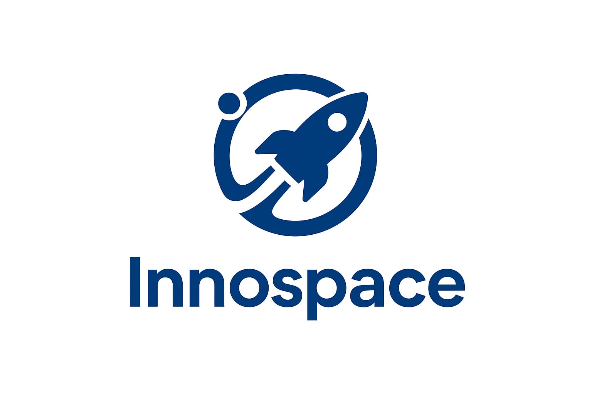</td>
      <td>LinkedIn  </td>
      <td>AngelList (Wellfound)  </td>
      <td>Behance  </td>
    </tr>
    <!-- PERFIL -->
    <tr>
      <td rowspan="3">Perfil</td>
      <td>Overview</td>
      <td>Plataforma móvil donde estudiantes publican ideas innovadoras y startups para atraer inversión, participar en proyectos empresariales y conectar con empresas.</td>
      <td>Red social profesional global que conecta profesionales y empresas para networking, empleos y contenido.</td>
      <td>Plataforma que conecta startups con inversionistas y talento especializado, muy centrada en ecosistema emprendedor.</td>
      <td>Plataforma para creativos y diseñadores donde muestran proyectos y buscan oportunidades de colaboración.</td>
    </tr>
    <tr>
      <td>Ventaja competitiva  ¿Qué valor ofrece a los clientes?</td>
      <td>Conecta estudiantes con empresas de forma bidireccional (ideas <-> proyectos), fomenta innovación y aprendizaje colaborativo.</td>
      <td>Gran base de usuarios, networking masivo y posicionamiento de marca fuerte.</td>
      <td>Acceso directo a startups, talento e inversores, muy nichado en el ecosistema.</td>
      <td>Visibilidad global para proyectos creativos y portafolios.</td>
    </tr>
    <tr>
      <td>Mercado objetivo</td>
      <td>Estudiantes universitarios, jóvenes emprendedores, empresas que buscan innovación y talento emergente.</td>
      <td>Profesionales de todos los sectores y empresas de cualquier tamaño.</td>
      <td>Startups, inversionistas y profesionales del sector tecnológico y emprendedor.</td>
      <td>Diseñadores, artistas, creativos y empresas del sector visual.</td>
    </tr>
    <!-- PERFIL DE MARKETING -->
    <tr>
      <td rowspan="2">Perfil de Marketing</td>
      <td>Estrategias de marketing</td>
      <td>Marketing digital en universidades, incubadoras y redes sociales. Enfoque en innovación y talento joven.</td>
      <td>Publicidad en la misma plataforma, marketing de contenido y presencia en medios profesionales.</td>
      <td>Eventos de startups, aceleradoras, networking en ecosistemas emprendedores.</td>
      <td>Colaboraciones con escuelas de diseño, concursos y portafolios online.</td>
    </tr>
    <tr>
      <td>Mercado objetivo</td>
      <td>Estudiantes, startups en etapa temprana, empresas innovadoras.</td>
      <td>Profesionales, empresas medianas y grandes.</td>
      <td>Startups tecnológicas, inversores, emprendedores.</td>
      <td>Creativos, diseñadores freelance, agencias.</td>
    </tr>
    <!-- PERFIL DE PRODUCTO -->
    <tr>
      <td rowspan="3">Perfil de Producto</td>
      <td>Productos & Servicios</td>
      <td>Publicación de ideas y startups, proyectos de empresas, exploración de estudiantes con habilidades alineadas.</td>
      <td>Ofertas de empleo, networking, cursos, grupos profesionales.</td>
      <td>Ofertas de empleo en startups, conexión con inversores y talento.</td>
      <td>Portafolios creativos, exposición de proyectos, búsqueda de empleo creativo.</td>
    </tr>
    <tr>
      <td>Precios & Costos</td>
      <td>Modelo freemium (básico gratis, premium para empresas o estudiantes destacados).</td>
      <td>Gratis con funciones premium de pago (LinkedIn Premium, LinkedIn Ads).</td>
      <td>Gratis con servicios premium para empleadores e inversores.</td>
      <td>Gratis con opciones premium para mayor visibilidad.</td>
    </tr>
    <tr>
      <td>Canales de distribución (Web y/o Móvil)</td>
      <td>App móvil (iOS/Android) y versión web.</td>
      <td>App móvil y web.</td>
      <td>App móvil y web.</td>
      <td>App móvil y web.</td>
    </tr>
    <!-- SWOT -->
    <tr>
      <td rowspan="4">Análisis SWOT</td>
      <td>Fortalezas</td>
      <td>Innovación en el enfoque educación-empresa, espacio exclusivo para estudiantes.</td>
      <td>Base de usuarios masiva, marca reconocida.</td>
      <td>Nicho claro en startups e inversión.</td>
      <td>Alta visibilidad para creativos y artistas.</td>
    </tr>
    <tr>
      <td>Debilidades</td>
      <td>Startup nueva, sin base de usuarios inicial fuerte.</td>
      <td>Demasiada competencia interna, saturación de usuarios.</td>
      <td>Menor popularidad que LinkedIn, limitado fuera del sector tech.</td>
      <td>No cubre sectores fuera del diseño/creatividad.</td>
    </tr>
    <tr>
      <td>Oportunidades</td>
      <td>Aliarse con universidades, incubadoras y empresas innovadoras.</td>
      <td>Expansión a nuevos servicios de educación y formación.</td>
      <td>Crecimiento del ecosistema emprendedor global.</td>
      <td>Mayor demanda de portafolios digitales y talento creativo.</td>
    </tr>
    <tr>
      <td>Amenazas</td>
      <td>Competidores grandes con más recursos, barreras de entrada altas.</td>
      <td>Pérdida de interés por parte de usuarios jóvenes.</td>
      <td>Dependencia del ecosistema startup e inversión.</td>
      <td>Alta competencia en redes creativas (Dribbble, ArtStation).</td>
    </tr>
  </tbody>
</table>

#### 2.1.2. Estrategias y tácticas frente a competidores

## Afrontando las fortalezas de nuestros competidores:

**Fortalezas de competidores:**
- LinkedIn: base de usuarios masiva y marca consolidada.  
- AngelList: nicho en startups e inversión.  
- Behance: visibilidad global para creativos.  
- InnoSpace: innovación en el vínculo educación–empresa.  

## Comprendemos que nuestras fortalezas son:
- Enfoque exclusivo en estudiantes y talento emergente.  
- Integración bidireccional: empresas publican proyectos, estudiantes aportan ideas.  
- Nicho menos saturado, con alto potencial de crecimiento en universidades.  

## Estrategias:
- Diferenciarnos mediante el **posicionamiento educativo–empresarial**, no solo profesional.  
- Crear comunidad cerrada y validada de estudiantes para garantizar **calidad y confianza**.  
- Alianzas estratégicas con universidades e incubadoras.  

## Tácticas:
- Implementar programas piloto con universidades y ferias de empleo.  
- Incentivar a empresas innovadoras a publicar proyectos reales.  
- Marketing digital en redes sociales universitarias y canales académicos.  

---

## Afrontando las debilidades de nuestros competidores:

**Debilidades de competidores:**
- LinkedIn: saturación, competencia interna.  
- AngelList: limitado fuera del ecosistema startup.  
- Behance: no cubre sectores fuera de lo creativo.  
- InnoSpace: aún sin masa crítica de usuarios.  

## Comprendemos que nuestras debilidades son:
- Startup nueva con poca base de usuarios.  
- Recursos limitados frente a grandes plataformas.  

## Estrategias:
- Crecer a través de **nichos específicos** antes de expandir.  
- Apoyarnos en **alianzas institucionales** para atraer usuarios sin grandes inversiones.  

## Tácticas:
- Campañas de captación en universidades.  
- Programas de referidos entre estudiantes y empresas.  
- Construir una primera comunidad sólida en un sector (ej. ingeniería, innovación tecnológica).  

---

## Afrontando las oportunidades de nuestros competidores:

**Oportunidades de competidores:**
- Expansión de la educación digital (LinkedIn).  
- Crecimiento del ecosistema emprendedor (AngelList).  
- Demanda de portafolios digitales (Behance).  
- Integración universidad–empresa (InnoSpace).  

## Comprendemos que nuestras oportunidades son:
- Conectar talento joven con innovación empresarial.  
- Posicionarnos como la **plataforma de early talent**.  
- Aprovechar el auge de incubadoras, hackathons y proyectos de innovación abierta.  

## Estrategias:
- Crear un espacio que combine **empleabilidad temprana + innovación colaborativa**.  
- Aliarnos con incubadoras y hubs de emprendimiento universitario.  

## Tácticas:
- Organizar retos de innovación con empresas patrocinadoras.  
- Promocionar historias de éxito de estudiantes para dar visibilidad a la plataforma.  
- Ofrecer planes gratuitos iniciales a startups emergentes para ganar tracción.  

---

## Afrontando las amenazas de nuestros competidores:

**Amenazas de competidores:**
- Recursos y posicionamiento de grandes plataformas (LinkedIn, Behance).  
- Alta competencia en redes profesionales y creativas.  
- Barreras de entrada y dependencia de ecosistemas externos.  

## Comprendemos que nuestras amenazas son:
- Riesgo de que grandes plataformas incorporen funcionalidades similares.  
- Dificultad de escalar sin financiamiento fuerte.  

## Estrategias:
- Enfocarnos en ser **más ágiles y especializados** que los grandes competidores.  
- Desarrollar una propuesta de valor difícil de replicar: **ecosistema académico–empresarial cerrado**.  

## Tácticas:
- Innovar en funcionalidades (ej. “match” entre ideas de estudiantes y retos empresariales).  
- Fidelizar a la comunidad con beneficios exclusivos (certificados, visibilidad, mentorías).  
- Monitorear tendencias para adaptar rápidamente la plataforma.  

### 2.2. Entrevistas

#### 2.2.1. Diseño de entrevistas

*Preguntas Estudiantes universitarios innovadores*

---

**Preguntas Directas:**

1. ¿Podrías proporcionarnos tu nombre completo, tu edad y qué carrera estás estudiando actualmente?

2. ¿Has tenido la oportunidad de desarrollar alguna idea o proyecto innovador durante tus estudios? ¿Cómo fue esa experiencia?

3. ¿Qué dificultades enfrentas actualmente para dar a conocer tus ideas o proyectos a empresas o posibles inversionistas?

4. ¿Has participado en concursos, hackathons o ferias de innovación? ¿Qué aprendiste de esas experiencias?

5. ¿Qué tan fácil o difícil ha sido para ti encontrar espacios donde mostrar tu talento y tus habilidades?

6. ¿Qué te motiva más: que te reconozcan por tus ideas, que te apoyen con mentoría o que te den financiamiento para llevarlas a cabo?

7. ¿Qué habilidades técnicas o personales tuyas consideras que serían más valiosas para una empresa que busque talento joven?

8. ¿Qué plataformas, redes sociales o medios digitales utilizas hoy para difundir tus proyectos o buscar oportunidades?

9. ¿Qué temores o dudas tendrías al publicar tus ideas en una aplicación que conecta estudiantes con empresas?

10. Si existiera una app donde pudieras subir tus ideas, explorar proyectos de empresas y conectar directamente con gerentes, ¿la usarías? ¿Por qué sí o por qué no?  

**Preguntas Complementarias:**

11. ¿Qué tan importante es para ti que una plataforma valide o certifique tu participación en proyectos reales?

12. ¿Qué te gustaría aprender o reforzar al colaborar con empresas en proyectos de innovación?   

*Preguntas Gerentes/profesionales de innovación y talento*

**Preguntas Directas:**

1. ¿Podrías darnos tu nombre completo, edad y cargo actual en la empresa?

2. Cuéntame un poco sobre tu empresa: ¿en qué sector operan y cómo gestionan actualmente los proyectos de innovación?

3. ¿Qué tan frecuente es que busquen nuevas ideas o startups jóvenes para resolver retos internos?

4. ¿Qué dificultades encuentras al identificar y contactar estudiantes con habilidades alineadas a tus proyectos?

5. ¿Han intentado colaborar con universidades o estudiantes en el pasado? ¿Qué resultados tuvieron?

6. ¿Qué características valoras más en un estudiante o joven innovador al momento de incluirlo en un proyecto?

7. ¿Qué riesgos o preocupaciones tendrías al usar una aplicación que conecta directamente con talento emergente?

8. ¿Qué tan dispuesto estarías a publicar proyectos o retos de tu empresa en una plataforma abierta a estudiantes?

9. ¿Qué funcionalidades considerarías indispensables en una app como InnoSpace para que realmente sea útil para tu empresa?

10. Si existiera una app local que te brinde acceso directo a ideas innovadoras y perfiles de estudiantes con portafolio visible, ¿la usarías? ¿Por qué sí o por qué no?  

**Preguntas Complementarias:**

11. ¿Qué tan importante sería para tu empresa contar con métricas de impacto o informes sobre la colaboración con estudiantes?

12. ¿Qué expectativas tendrías de la relación con los estudiantes a través de una plataforma como esta (ideas, prototipos, contratación futura, etc.)?   

#### 2.2.2. Registro de entrevistas

*Entrevistas a Estudiantes*
---
  

<table align="center">
  <tr>
    <th colspan="2" style="text-align:center">Entrevista 1</th>
  </tr>
  <tr>
    <td><strong>Entrevistado</strong></td>
    <td>Estefano Solis</td>
  </tr>
  <tr>
    <td><strong>Edad</strong></td>
    <td>20</td>
  </tr>
  <tr>
    <td><strong>Distrito</strong></td>
    <td>Pueblo Libre</td>
  </tr>
  <tr>
    <td><strong>Timing</strong></td>
    <td>0:05 - 6:59</td>
  </tr>
  <tr>
    <td><strong>URL</strong></td>
    <td>
      
  `https://upcedupe-my.sharepoint.com/:v:/g/personal/u202313172_upc_edu_pe/ETIrSGpEPvRLpIKO-WCKbugBi5G1VwGVTmBdKGfewB1PrA?nav=eyJwbGF5YmFja09wdGlvbnMiOnsic3RhcnRUaW1lSW5TZWNvbmRzIjo1LCJ0aW1lc3RhbXBlZExpbmtSZWZlcnJlckluZm8iOnsic2NlbmFyaW8iOiJDaGFwdGVyU2hhcmUiLCJhZGRpdGlvbmFsSW5mbyI6eyJpc1NoYXJlZENoYXB0ZXJBdXRvIjpmYWxzZX19fSwicmVmZXJyYWxJbmZvIjp7InJlZmVycmFsQXBwIjoiU3RyZWFtV2ViQXBwIiwicmVmZXJyYWxWaWV3IjoiU2hhcmVDaGFwdGVyTGluayIsInJlZmVycmFsQXBwUGxhdGZvcm0iOiJXZWIiLCJyZWZlcnJhbE1vZGUiOiJ2aWV3In19&e=2imy1h`

  </td>
  </tr>
  <tr>
    <td colspan="2" style="text-align:justify">
      Resumen:  
      Estefano Solis Campos, estudiante de 20 años de Ingeniería de Software en la UPC, comentó que ha desarrollado ideas innovadoras aunque con limitaciones de tiempo y recursos, y que la mayor dificultad para difundir proyectos es la falta de canales directos con empresas, lo que hace que muchos se queden en el ámbito académico; ha participado en hackatones y ferias donde aprendió a trabajar bajo presión, ser recursivo y colaborar en equipos multidisciplinarios, pero considera que fuera de la universidad es difícil encontrar espacios constantes para mostrar talento; valora más la mentoría que el financiamiento, pues la guía de expertos convierte una idea en un proyecto exitoso, y resalta sus habilidades en frontend y backend con React, además de su adaptabilidad, aprendizaje rápido y orientación a la resolución de problemas; utiliza LinkedIn y GitHub para difundir sus proyectos, aunque le preocupan la propiedad intelectual y la calidad de los contactos, pero afirma que usaría una plataforma que conecte estudiantes con empresas porque resolvería la falta de conexión con el mundo real, destacando también la importancia de que otorgue certificaciones en proyectos reales, y expresa su interés en aprender sobre toma de decisiones de negocio, gestión de proyectos, trabajo en equipos multidisciplinarios y medición del impacto de productos en el mercado
    </td>
  </tr>
  <tr>
    <td colspan="2"> 
       
    </td>
  </tr>
</table>

<table align="center">
  <tr>
    <th colspan="2" style="text-align:center">Entrevista 2</th>
  </tr>
  <tr>
    <td><strong>Entrevistado</strong></td>
    <td>Adrian Moreno</td>
  </tr>
  <tr>
    <td><strong>Edad</strong></td>
    <td>24</td>
  </tr>
  <tr>
    <td><strong>Distrito</strong></td>
    <td>Cercado de Lima</td>
  </tr>
  <tr>
    <td><strong>Timing</strong></td>
    <td>6:59 - 12:01</td>
  </tr>
  <tr>
    <td><strong>URL</strong></td>
    <td>
      
  `https://upcedupe-my.sharepoint.com/:v:/g/personal/u202313172_upc_edu_pe/ETIrSGpEPvRLpIKO-WCKbugBi5G1VwGVTmBdKGfewB1PrA?nav=eyJwbGF5YmFja09wdGlvbnMiOnsic3RhcnRUaW1lSW5TZWNvbmRzIjo0MTkuNjEyLCJ0aW1lc3RhbXBlZExpbmtSZWZlcnJlckluZm8iOnsic2NlbmFyaW8iOiJDaGFwdGVyU2hhcmUiLCJhZGRpdGlvbmFsSW5mbyI6eyJpc1NoYXJlZENoYXB0ZXJBdXRvIjpmYWxzZX19fSwicmVmZXJyYWxJbmZvIjp7InJlZmVycmFsQXBwIjoiU3RyZWFtV2ViQXBwIiwicmVmZXJyYWxWaWV3IjoiU2hhcmVDaGFwdGVyTGluayIsInJlZmVycmFsQXBwUGxhdGZvcm0iOiJXZWIiLCJyZWZlcnJhbE1vZGUiOiJ2aWV3In19&e=fTkCf5`

  </td>
  </tr>
  <tr>
    <td colspan="2" style="text-align:justify">
      Resumen:  
      Adrián Moreno Nole, estudiante de 24 años de Marketing y Administración, ha trabajado en proyectos con pymes locales, principalmente diseñando estrategias digitales para redes sociales. Reconoce que una de sus mayores dificultades es la falta de confianza que enfrentan los estudiantes al buscar inversionistas, ya que suelen preferir proyectos más grandes y visibles. Ha participado en concursos organizados por la universidad, donde aprendió a trabajar en equipo y bajo presión, aunque considera que los espacios para mostrar talento son limitados en un entorno competitivo. Valora más la mentoría que el financiamiento, pues considera que el acompañamiento de expertos aporta mayor aprendizaje. Entre sus principales habilidades destaca el análisis de mercado, estrategias digitales y manejo de herramientas como Google Analytics y Google Ads. Utiliza LinkedIn, Instagram, Twitter y foros especializados para difundir proyectos, aunque teme que al publicarlos alguien pueda apropiarse de sus ideas. Afirma que sí usaría una aplicación que conecte estudiantes con empresas, ya que acortaría la distancia entre ambos mundos y daría mayor visibilidad a los proyectos, resaltando la importancia de que estas plataformas otorguen certificaciones para fortalecer la credibilidad profesional. Finalmente, le gustaría reforzar su capacidad de gestión con presupuestos limitados, mejorar en negociación y perfeccionar sus habilidades de presentación.
    </td>
  </tr>
  <tr>
    <td colspan="2"> 
       
    </td>
  </tr>
</table>

  

<table align="center">
  <tr>
    <th colspan="2" style="text-align:center">Entrevista 3</th>
  </tr>
  <tr>
    <td><strong>Entrevistado</strong></td>
    <td>Marcelo Barrientos Quispe</td>
  </tr>
  <tr>
    <td><strong>Edad</strong></td>
    <td>20</td>
  </tr>
  <tr>
    <td><strong>Distrito</strong></td>
    <td>San Isidro</td>
  </tr>
  <tr>
    <td><strong>Timing</strong></td>
    <td>12:01 - 21:54</td>
  </tr>
  <tr>
    <td><strong>URL</strong></td>
    <td>
    
  `https://upcedupe-my.sharepoint.com/:v:/g/personal/u202313172_upc_edu_pe/ETIrSGpEPvRLpIKO-WCKbugBi5G1VwGVTmBdKGfewB1PrA?nav=eyJwbGF5YmFja09wdGlvbnMiOnsic3RhcnRUaW1lSW5TZWNvbmRzIjo3MjEuNDksInRpbWVzdGFtcGVkTGlua1JlZmVycmVySW5mbyI6eyJzY2VuYXJpbyI6IkNoYXB0ZXJTaGFyZSIsImFkZGl0aW9uYWxJbmZvIjp7ImlzU2hhcmVkQ2hhcHRlckF1dG8iOmZhbHNlfX19LCJyZWZlcnJhbEluZm8iOnsicmVmZXJyYWxBcHAiOiJTdHJlYW1XZWJBcHAiLCJyZWZlcnJhbFZpZXciOiJTaGFyZUNoYXB0ZXJMaW5rIiwicmVmZXJyYWxBcHBQbGF0Zm9ybSI6IldlYiIsInJlZmVycmFsTW9kZSI6InZpZXcifX0&e=jmLSzk`

  </td>
  </tr>
  <tr>
    <td colspan="2" style="text-align:justify">
      Resumen:  
      Marcelo Barrientos, un estudiante de Ingeniería de Software de 20 años, comentó sobre el desarrollo de proyectos innovadores durante sus estudios. Marcelo destaca la importancia de la motivación universitaria para crear soluciones a problemáticas actuales, el valor del trabajo en equipo y la presión positiva en hackathons, así como las dificultades para comunicar y difundir ideas fuera de esos espacios. Subraya la relevancia del reconocimiento y la mentoría como primeros pasos para atraer financiamiento, y enfatiza la necesidad de aprender constantemente y adaptarse tecnológicamente. Además, valora las plataformas digitales como GitHub y LinkedIn para mostrar su trabajo y considera esencial la certificación de participación en proyectos reales para fortalecer su perfil profesional. Finalmente, expresa interés en adquirir habilidades de marketing para mejorar el impacto social y comercial de sus desarrollos.
    </td>
  </tr>
  <tr>
    <td colspan="2"> 
      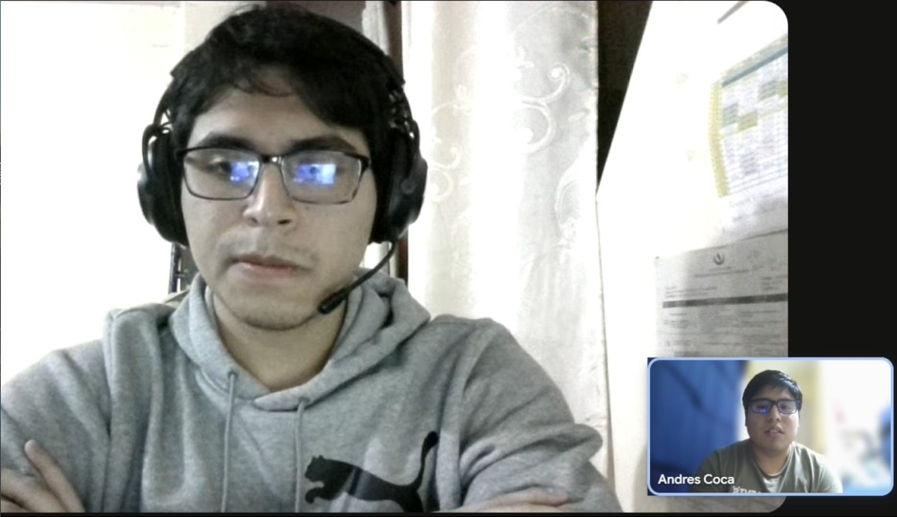 
    </td>
  </tr>
</table>

  

*Entrevistas a Gerentes*
---

<table align="center">
  <tr>
    <th colspan="2" style="text-align:center">Entrevista 1</th>
  </tr>
  <tr>
    <td><strong>Entrevistado</strong></td>
    <td>Manuel Alejandro Jara</td>
  </tr>
  <tr>
    <td><strong>Edad</strong></td>
    <td>31</td>
  </tr>
  <tr>
    <td><strong>Distrito</strong></td>
    <td>Miraflores</td>
  </tr>
  <tr>
    <td><strong>Timing</strong></td>
    <td>21:54 - 43:12</td>
  </tr>
  <tr>
    <td><strong>URL</strong></td>
    <td>

  `https://upcedupe-my.sharepoint.com/:v:/g/personal/u202313172_upc_edu_pe/ETIrSGpEPvRLpIKO-WCKbugBi5G1VwGVTmBdKGfewB1PrA?nav=eyJwbGF5YmFja09wdGlvbnMiOnsic3RhcnRUaW1lSW5TZWNvbmRzIjoxMzE0LjM3NywidGltZXN0YW1wZWRMaW5rUmVmZXJyZXJJbmZvIjp7InNjZW5hcmlvIjoiQ2hhcHRlclNoYXJlIiwiYWRkaXRpb25hbEluZm8iOnsiaXNTaGFyZWRDaGFwdGVyQXV0byI6ZmFsc2V9fX0sInJlZmVycmFsSW5mbyI6eyJyZWZlcnJhbEFwcCI6IlN0cmVhbVdlYkFwcCIsInJlZmVycmFsVmlldyI6IlNoYXJlQ2hhcHRlckxpbmsiLCJyZWZlcnJhbEFwcFBsYXRmb3JtIjoiV2ViIiwicmVmZXJyYWxNb2RlIjoidmlldyJ9fQ&e=S3eA6j`

  </td>
  </tr>
  <tr>
    <td colspan="2" style="text-align:justify">
      Resumen:  
      Manuel Alejandro Jara, coordinador de proyectos inmobiliarios de 31 años, ofrece una visión profunda sobre la gestión y la innovación en el sector inmobiliario en Lima. Manuel hace enfasis en la integración de tecnologías como la inteligencia artificial para optimizar procesos y la importancia de buscar jóvenes talentos innovadores que aporten soluciones frescas. También resalta la relevancia de habilidades analíticas y de resolución de problemas por encima del conocimiento teórico puro. Además, comenta sobre la colaboración con universidades a través de prácticas preprofesionales y la potencial utilidad de plataformas digitales para conectar empresas con estudiantes, facilitando así la innovación abierta y el desarrollo profesional. Finalmente, subraya la importancia de métricas claras para evaluar la contribución de los estudiantes y la necesidad de interacciones auténticas y colaborativas en estas plataformas.
    </td>
  </tr>
  <tr>
    <td colspan="2"> 
      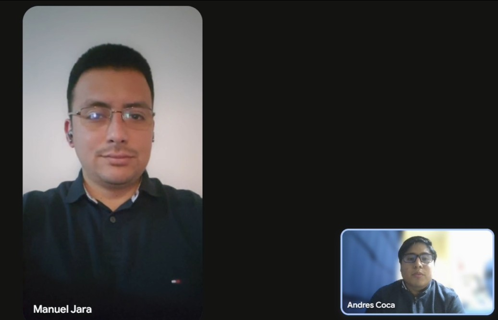 
    </td>
  </tr>
</table>

  

<table align="center">
  <tr>
    <th colspan="2" style="text-align:center">Entrevista 2</th>
  </tr>
  <tr>
    <td><strong>Entrevistado</strong></td>
    <td>Manuel David Niño Torres Grandez.</td>
  </tr>
  <tr>
    <td><strong>Edad</strong></td>
    <td>39</td>
  </tr>
  <tr>
    <td><strong>Distrito</strong></td>
    <td>Los Olivos</td>
  </tr>
  <tr>
    <td><strong>Timing</strong></td>
    <td>43:12 - 1:01:57</td>
  </tr>
  <tr>
    <td><strong>URL</strong></td>
    <td>

  `https://upcedupe-my.sharepoint.com/:v:/g/personal/u202313172_upc_edu_pe/ETIrSGpEPvRLpIKO-WCKbugBi5G1VwGVTmBdKGfewB1PrA?nav=eyJwbGF5YmFja09wdGlvbnMiOnsic3RhcnRUaW1lSW5TZWNvbmRzIjoyNTkyLjMzMSwidGltZXN0YW1wZWRMaW5rUmVmZXJyZXJJbmZvIjp7InNjZW5hcmlvIjoiQ2hhcHRlclNoYXJlIiwiYWRkaXRpb25hbEluZm8iOnsiaXNTaGFyZWRDaGFwdGVyQXV0byI6ZmFsc2V9fX0sInJlZmVycmFsSW5mbyI6eyJyZWZlcnJhbEFwcCI6IlN0cmVhbVdlYkFwcCIsInJlZmVycmFsVmlldyI6IlNoYXJlQ2hhcHRlckxpbmsiLCJyZWZlcnJhbEFwcFBsYXRmb3JtIjoiV2ViIiwicmVmZXJyYWxNb2RlIjoidmlldyJ9fQ&e=5717fT` 

  </td>
  </tr>
  <tr>
    <td colspan="2" style="text-align:justify">
      Resumen: 
      Manuel David Niño Torres Grandez, de 39 años, fundador y administrador de su empresa dedicada a la manufactura, explicó que gestionan los proyectos de innovación a través de un comité interno y metodologías colaborativas, apoyándose en equipos multidisciplinarios. Además, indicó que suelen buscar nuevas ideas y startups jóvenes ocasionalmente, especialmente cuando requieren soluciones tecnológicas emergentes, aunque señaló como principal dificultad la falta de visibilidad y experiencia de los estudiantes, lo que dificulta identificar perfiles adecuados. No obstante, destacó que han colaborado en el pasado con universidades y colegios mediante proyectos de investigación aplicada, obteniendo resultados positivos en creatividad e innovación, aunque con algunos problemas de compromiso por parte de los estudiantes. Asimismo, valoró en los jóvenes la proactividad, la capacidad de aprendizaje rápido, el trabajo en equipo y la comunicación. Respecto a plataformas como InnoSpace, consideró indispensables funcionalidades como filtros avanzados para encontrar perfiles, portafolios visibles, acuerdos de confidencialidad y herramientas de comunicación directa, ya que una de sus principales preocupaciones es la seguridad de la información y la seriedad de los participantes. Finalmente, aseguró que sí utilizaría una aplicación de este tipo porque agilizaría la búsqueda de talento joven, permitiría validar resultados antes de invertir recursos mayores y facilitaría la creación de una cantera de futuros profesionales, lo que beneficiaría tanto a la empresa como a los estudiantes al establecer una relación de aprendizaje mutuo.
    </td>
  </tr>
   <tr>
    <td colspan="2"> 
       
    </td>
  </tr>
</table>

  

<table align="center">
  <tr>
    <th colspan="2" style="text-align:center">Entrevista 3</th>
  </tr>
  <tr>
    <td><strong>Entrevistado</strong></td>
    <td>Luis Sanchez Santur</td>
  </tr>
  <tr>
    <td><strong>Edad</strong></td>
    <td>68</td>
  </tr>
  <tr>
    <td><strong>Distrito</strong></td>
    <td>Los Olivos</td>
  </tr>
  <tr>
    <td><strong>Timing</strong></td>
    <td>1:01:57 - 1:13:14</td>
  </tr>
  <tr>
    <td><strong>URL</strong></td>
    <td>
      
  `https://upcedupe-my.sharepoint.com/:v:/g/personal/u202313172_upc_edu_pe/ETIrSGpEPvRLpIKO-WCKbugBi5G1VwGVTmBdKGfewB1PrA?nav=eyJwbGF5YmFja09wdGlvbnMiOnsic3RhcnRUaW1lSW5TZWNvbmRzIjozNzE3LjkxLCJ0aW1lc3RhbXBlZExpbmtSZWZlcnJlckluZm8iOnsic2NlbmFyaW8iOiJDaGFwdGVyU2hhcmUiLCJhZGRpdGlvbmFsSW5mbyI6eyJpc1NoYXJlZENoYXB0ZXJBdXRvIjpmYWxzZX19fSwicmVmZXJyYWxJbmZvIjp7InJlZmVycmFsQXBwIjoiU3RyZWFtV2ViQXBwIiwicmVmZXJyYWxWaWV3IjoiU2hhcmVDaGFwdGVyTGluayIsInJlZmVycmFsQXBwUGxhdGZvcm0iOiJXZWIiLCJyZWZlcnJhbE1vZGUiOiJ2aWV3In19&e=sW4NBN`

  </td>
  </tr>
  <tr>
    <td colspan="2" style="text-align:justify">
      Resumen: 
      Luis, empresario de 68 años y representante de la empresa Santurlo F.C.A., dedicada a edificaciones y obras viales, explicó que gestionan la innovación incorporando nuevas tecnologías como el software BIM y materiales modernos en sus proyectos. Asimismo, resaltó que para integrar estudiantes o jóvenes innovadores en su empresa considera fundamental la actitud positiva, la disposición para aprender y la capacidad de aportar ideas, ya que estos factores pesan incluso más que los conocimientos técnicos. Aunque han realizado convocatorias en universidades, aclaró que no han establecido alianzas formales, lo cual representa una oportunidad de mejora. Además, destacó que las nuevas generaciones, al estar familiarizadas con herramientas digitales, contribuyen a la automatización y agilización de procesos dentro de la empresa. En cuanto a plataformas como InnoSpace, señaló que serían útiles para conectar con talento emergente; sin embargo, manifestó cierta preocupación por la seguridad y la privacidad de la información. No obstante, consideró valioso que estas aplicaciones incluyan métricas de impacto y fomenten una colaboración tripartita entre universidad, estudiante y empresa. Finalmente, afirmó que sí estaría dispuesto a usar una herramienta de este tipo, puesto que contribuiría a visibilizar el talento, generar nuevas ideas y fortalecer la relación con futuros profesionales.
    </td>
  </tr>
   <tr>
    <td colspan="2"> 
       
    </td>
  </tr>
</table>

#### 2.2.3. Análisis de entrevistas

*Segmento Estudiantes*

<table>
  <tr>
    <td>Caracteristicas</td>
    <td>Estudiantes que lo mencionan</td>
    <td>Porcentaje</td>
  </tr>
  <tr>
    <td>Participación en hackatones/concursos</td>
    <td>2</td>
    <td>67%</td>
  </tr>
  <tr>
    <td>Uso de LinkedIn/GitHub para difundir proyectos</td>
    <td>2</td>
    <td>67%</td>
  </tr>
  <tr>
    <td>Carrera Ingeniería de Software</td>
    <td>2</td>
    <td>67%</td>
  </tr>
  <tr>
    <td>Perciben falta de canales de conexión con empresas</td>
    <td>3</td>
    <td>100%</td>
  </tr>
  <tr>
    <td>Valoración de certificaciones en proyectos reales</td>
    <td>3</td>
    <td>100%</td>
  </tr>
  <tr>
    <td>Valoran más la mentoría que el financiamiento</td>
    <td>3</td>
    <td>100%</td>
  </tr>
  <tr>
    <td>Temor a pérdida de propiedad intelectual</td>
    <td>2</td>
    <td>67%</td>
  </tr>
</table>

**Resumen del analisis de entrevistas de estudiantes:**

Los estudiantes tienen entre 20 y 24 años, con perfiles en Ingeniería de Software y Marketing. Comparten experiencia en concursos, hackatones y trabajos con pymes, pero sienten que fuera de la universidad los espacios son reducidos. Valoran mucho la mentoría y certificación en proyectos reales como puerta hacia la empleabilidad. Usan LinkedIn/GitHub/redes sociales, aunque existe preocupación por la seguridad y la propiedad intelectual. Buscan fortalecer habilidades de gestión, negociación y trabajo en equipos multidisciplinarios.

*Segmento Gerentes*

<table>
  <tr>
    <td>Caracteristicas</td>
    <td>Gerentes que lo mencionan</td>
    <td>Porcentaje</td>
  </tr>
  <tr>
    <td>Uso de tecnologías emergentes (IA, BIM, materiales modernos)</td>
    <td>3</td>
    <td>100%</td>
  </tr>
  <tr>
    <td>Colaboración previa con universidades</td>
    <td>2</td>
    <td>67%</td>
  </tr>
  <tr>
    <td>Interés en plataformas digitales para conectar con estudiantes</td>
    <td>3</td>
    <td>100%</td>
  </tr>
  <tr>
    <td>Ven falta de visibilidad/experiencia en estudiantes como barrera</td>
    <td>2</td>
    <td>67%</td>
  </tr>
  <tr>
    <td>Interés en innovación abierta y colaboración con jóvenes</td>
    <td>3</td>
    <td>100%</td>
  </tr>
</table>

**Resumen del analisis de entrevistas de gerentes:**

Los gerentes van desde 31 a 68 años y pertenecen a sectores diversos (inmobiliario, manufactura y construcción). Coinciden en la necesidad de innovación y en valorar la actitud, proactividad y capacidad de aprendizaje de los jóvenes más que la experiencia. Tienen interés en plataformas digitales como InnoSpace, pero expresan preocupación por la seguridad de datos y la seriedad de los participantes. Ven en los estudiantes una fuente de creatividad, aunque notan la falta de visibilidad y experiencia como una barrera.

**Puntos relevantes**

- Ambos valoran la mentoría y los espacios de conexión real entre estudiantes y empresas.
- Estudiantes priorizan el aprendizaje y la visibilidad de sus proyectos.
- Gerentes priorizan la proactividad y confiabilidad de los estudiantes.

### 2.3. Needfinding

En esta sección, se crearán las User Personas basándonos en la información obtenida de las entrevistas con nuestros usuarios potenciales. Consideraremos aspectos fundamentales como la edad, la ocupación, las preocupaciones y las metas de los entrevistados para entender mejor sus necesidades, comportamientos y expectativas. Además, se examinarán las características y preferencias de los usuarios a través del análisis de nuestros competidores, lo que nos ayudará a identificar áreas de oportunidad para mejorar.

#### 2.3.1. User Personas

- #### User Persona Estudiante Universitario

  

  User Persona Estudiante Universitario - Elaboración propia

- #### User Persona Gerente de empresa

  

  User Persona Gerente de empresa - Elaboración propia

#### 2.3.2. User Task Matrix

En este apartado se presenta la User Task Matrix, que refleja las tareas de los dos segmentos principales: estudiantes universitarios que buscan financiar sus proyectos innovadores y participar en proyectos de empresas, y gerentes que buscan contratar talento joven para el desarrollo de sus proyectos.

<table border="1">
  <thead>
    <tr>
      <th></th>
      <th colspan="2">Estudiante</th>
      <th colspan="2">Gerente</th>
    </tr>
  </thead>
  <tbody>
    <tr>
      <td>TASK</td>
      <td>FREQUENCY (Estudiante)</td>
      <td>IMPORTANCE (Estudiante)</td>
      <td>FREQUENCY (Gerente)</td>
      <td>IMPORTANCE (Gerente)</td>
    </tr>
    <tr>
      <td>Publicar ideas o startups innovadoras</td>
      <td>Sometimes</td>
      <td>High</td>
      <td>Never</td>
      <td>Low</td>
    </tr>
    <tr>
      <td>Buscar proyectos disponibles</td>
      <td>Often</td>
      <td>High</td>
      <td>Sometimes</td>
      <td>Low</td>
    </tr>
    <tr>
      <td>Postular a ofertas</td>
      <td>Sometimes</td>
      <td>High</td>
      <td>Never</td>
      <td>Low</td>
    </tr>
    <tr>
      <td>Editar o actualizar su perfil profesional</td>
      <td>Rarely</td>
      <td>High</td>
      <td>Sometimes</td>
      <td>Medium</td>
    </tr>
    <tr>
      <td>Consultar el estado de sus postulaciones</td>
      <td>Sometimes</td>
      <td>High</td>
      <td>Never</td>
      <td>Low</td>
    </tr>
    <tr>
      <td>Asistir a entrevistas</td>
      <td>Rarely</td>
      <td>High</td>
      <td>Sometimes</td>
      <td>High</td>
    </tr>
    <tr>
      <td>Asistir al daily scrum</td>
      <td>Always</td>
      <td>High</td>
      <td>Rarely</td>
      <td>Medium</td>
    </tr>
    <tr>
      <td>Registrar requerimientos de proyecto</td>
      <td>Never</td>
      <td>Low</td>
      <td>Sometimes</td>
      <td>Medium</td>
    </tr>
    <tr>
      <td>Publicar convocatorias de proyecto</td>
      <td>Never</td>
      <td>Low</td>
      <td>Sometimes</td>
      <td>Medium</td>
    </tr>
    <tr>
      <td>Chatear con miembros del equipo</td>
      <td>Sometimes</td>
      <td>Medium</td>
      <td>Sometimes</td>
      <td>Medium</td>
    </tr>
    <tr>
      <td>Ver postulaciones recibidas</td>
      <td>Never</td>
      <td>Low</td>
      <td>Sometimes</td>
      <td>Medium</td>
    </tr>
    <tr>
      <td>Validar postulantes</td>
      <td>Never</td>
      <td>Low</td>
      <td>Rarely</td>
      <td>High</td>
    </tr>
    <tr>
      <td>Aprobar entregables</td>
      <td>Never</td>
      <td>Low</td>
      <td>Often</td>
      <td>High</td>
    </tr>
    <tr>
      <td>Planificación del sprint</td>
      <td>Often</td>
      <td>High</td>
      <td>Often</td>
      <td>High</td>
    </tr>
  </tbody>
</table>

### 2.3.3. User Journey Mapping

Esta sección muestra un Journey Map por cada segmento objetivo, detallando el proceso en el que descubren e interactuan con la aplicación.

  - User Journey Map Jeremy Vega:

Este Journey map detalla la experiencia de Jeremy Vega, un universitario de 22 años que descubre la aplicación móvil InnoSpace y la utiliza para presentar sus ideas.

  User Journey Map Jeremy Vega - Elaboración propia

 - User Journey Map Carlos Fernandez:

Este Journey map detalla la experiencia de Carlos Fernández, un ingeniero dirigente de una empresa del sector tecnológico. Carlos escucha sobre la aplicación y decida probarla, explora perfiles de estudiantes e ideas de proyectos innovadoras.

  User Journey Map Carlos Fernandez - Elaboración propia

### 2.3.4. Empathy Mapping

Empathy Map Segmento 1:

  Empathy Map Segmento 1 - Elaboración propia

Empathy Map Segmento 2:

  Empathy Map Segmento 2 - Elaboración propia

### 2.3.5. Ubiquitous Language

| Término (Inglés)         | Término (Español)          | Definición                                                                                                       |
| ------------------------ | -------------------------- | ---------------------------------------------------------------------------------------------------------------- |
| Student                  | Estudiante                 | Usuario que busca oportunidades para postular, compartir ideas y participar en proyectos innovadores.            |
| Manager                  | Gerente                    | Usuario que representa a la empresa, encargado de publicar proyectos y seleccionar talento joven para colaborar. |
| Project Creation          | Publicación de ideas       | Acción realizada por el estudiante para compartir propuestas o startups innovadoras en la plataforma.            |
| Opportunity Posting          | Publicación de proyecto    | Acción realizada por el gerente para dar a conocer convocatorias de proyectos disponibles.                       |
| Application              | Postulación                | Proceso por el cual un estudiante se inscribe a un proyecto disponible o a una convocatoria de empresa.          |
| Profile                  | Perfil profesional         | Información personal y académica que un estudiante o gerente edita para mostrar sus capacidades y experiencia.   |
| Application Status       | Estado de postulación      | Información sobre si la postulación de un estudiante está en revisión, aprobada o rechazada.                     |
| Requirement Registration | Registro de requisitos | Proceso en el que el gerente detalla las necesidades específicas del proyecto.                                   |

## 2.4. Requirements specification

### 2.4.1. User Stories

<table border ="1" >
  <tbody>
    <tr>
      <td>Epic / Story ID</td>
      <td>Título</td>
      <td>Descripción</td>
      <td>Criterios de Aceptación</td>
      <td>Relación con Epic</td>
    </tr>
    <tr>
    <td>EP01</td>
      <td>Registro y Onboarding de Usuarios</td>
      <td>
        <strong>Como</strong> nuevo usuario de la plataforma, <strong>quiero</strong> registrarme y completar un perfil profesional guiado, <strong>para</strong> poder acceder a oportunidades o gestionar talento según mi rol.
      </td>
      <td>No corresponde</td>
      <td>No corresponde</td>
    </tr>
    <tr>
      <td>EP02</td>
      <td>Gestión de Oportunidades y Proyectos</td>
      <td>
        <strong>Como</strong> gerente de una empresa, <strong>quiero</strong> publicar proyectos con requisitos personalizados, <strong>para</strong> atraer a estudiantes con el perfil adecuado y resolver tareas específicas de mi organización.
      </td>
      <td>No corresponde</td>
      <td>No corresponde</td>
    </tr>
    <tr>
      <td>EP03</td>
      <td>Exploración y Postulación a Proyectos</td>
      <td>
        <strong>Como</strong> estudiante universitario, <strong>quiero</strong> explorar y postularme a proyectos compatibles con mis habilidades e intereses, <strong>para</strong> ganar experiencia práctica y construir un portafolio sólido.</td>
      <td>No corresponde</td>
      <td>No corresponde</td>
    </tr>
    <tr>
      <td>EP04</td>
      <td>Evaluación y Retroalimentación</td>
      <td>
        <strong>Como</strong> gerente, <strong>quiero</strong> evaluar el desempeño de los estudiantes durante y al finalizar el proyecto, <strong>para</strong> asegurar la calidad del trabajo y fomentar una cultura de mejora continua.</td>
      <td>No corresponde</td>
      <td>No corresponde</td>
    </tr>
    <tr>
      <td>EP05</td>
      <td>Creación y Visualización de Portafolio</td>
      <td>
        <strong>Como</strong> estudiante, <strong>quiero</strong> subir proyectos y evidencias de mis habilidades en un portafolio digital, <strong>para</strong> mostrar mi experiencia a futuras oportunidades laborales.</td>
      <td>No corresponde</td>
      <td>No corresponde</td>
    </tr>
      <td>US01</td>
      <td>Registro de usuario</td>
      <td>
        <strong>Como</strong> usuario nuevo, <strong>quiero</strong> crear una cuenta, <strong>para</strong> poder acceder a las funciones de aplicación.
      </td>
      <td>
      <strong>Escenario 1: Estudiante crea una cuenta     </strong> 
        <strong>Dado</strong> que el estudiante está en la pantalla de registro,
        <strong>Y</strong>   selecciona la opción “Registrarse como Estudiante”,
        <strong>cuando</strong> el estudiante ingresa un nombre de usuario, un correo electrónico y una contraseña válidos, 
        <strong>Y</strong> presiona el botón “Registrarse”,
        <strong>entonces</strong> la cuenta debe crearse correctamente.
          
        <strong>Escenario 2: Gerente crea una cuenta     </strong> 
        <strong>Dado</strong> que el gerente está en la pantalla de registro, <strong>Y</strong> selecciona la opción “Registrarse como Gerente”, 
        <strong>cuando</strong> el gerente ingresa un nombre de usuario, un correo electrónico y una contraseña válidos,
        <strong>Y</strong> presiona el botón “Registrarse”,
        <strong>entonces</strong> la cuenta debe crearse correctamente.
      </td>
      <td>EP01</td>
    </tr>
    <tr>
      <td>US02</td>
      <td>Inicio de sesión</td>
      <td>
        <strong>Como</strong> usuario registrado, <strong>quiero</strong> iniciar sesión, <strong>para</strong> acceder a mi cuenta y explorar los proyectos.
      </td>
      <td>
      <strong>Escenario 1: Estudiante crea una cuenta     </strong> 
        <strong>Dado</strong> que el usuario está en la pantalla de inicio de sesión y tiene una cuenta válida,
        <strong>cuando</strong> ingresa su nombre de usuario y contraseña correctos, 
        <strong>Y</strong> presiona el botón “Iniciar sesión”,
        <strong>entonces</strong> debería acceder a su cuenta correctamente.
      </td>
      <td>EP01</td>
    </tr>
    <tr>
      <td>US03</td>
      <td>Cierre de Sesión</td>
      <td>
        <strong>Como</strong> usuario, <strong>quiero</strong> cerrar sesión de mi cuenta, <strong>para</strong> proteger mi información personal.</td>
      <td>
      <strong>Escenario 1: Usuario cierra sesión
      </strong> 
        <strong>Dado</strong> que el usuario está autenticado y en su panel principal,
        <strong>cuando</strong> presiona el botón de “Cerrar sesión”, 
        <strong>entonces</strong> el usuario debe ser redirigido a la pantalla de inicio de sesión y la sesión debe cerrarse correctamente.
      </td>
      <td>EP01</td>
    </tr>
    <tr>
      <td>US04</td>
      <td>Recuperar contraseña</td>
      <td>
        <strong>Como</strong> usuario, <strong>quiero</strong> recuperar mi contraseña, <strong>para</strong> poder acceder a mi cuenta si la olvido.</td>
      <td>
      <strong>Escenario 1: Usuario envía solicitud de recuperación
      </strong> 
        <strong>Dado</strong> que el usuario está en la pantalla de inicio de sesión,
        <strong>cuando</strong> haga clic en el enlace de “¿Olvidaste tu contraseña?”,
        <strong>Y</strong> proporciona su correo electrónico registrado, 
        <strong>entonces</strong> debe recibir un correo electrónico con un enlace para restablecer su contraseña.
      </td>
      <td>EP01</td>
    </tr>
    <tr>
      <td>US05</td>
      <td>Explorar proyectos de empresa</td>
      <td>
        <strong>Como</strong> estudiante, <strong>quiero</strong> explorar proyectos de empresas, <strong>para</strong> encontrar oportunidades de colaboración.</td>
      <td>
      <strong>Escenario 1: Estudiante explora proyectos de empresas
      </strong> 
        <strong>Dado</strong> que el estudiante está en la plataforma y ha iniciado sesión,
        <strong>cuando</strong> selecciona la opción “Explorar proyectos de empresas”,
        <strong>entonces</strong> el estudiante debe ver una lista de proyectos de empresas disponibles para unirse o colaborar.
      </td>
      <td>EP03</td>
    </tr>
    <tr>
      <td>US06</td>
      <td>Gerente publica nuevo proyecto</td>
      <td>
        <strong>Como</strong> gerente, <strong>quiero
        </strong> completar un formulario con los detalles de un proyecto, <strong>para</strong> publicarlo y que los estudiantes puedan verlo y postularse.
        </td>
      <td>
      <strong>Escenario 1: Gerente crea un proyecto exitosamente
      </strong> 
        <strong>Dado</strong> que el gerente ha iniciado sesión y está en la sección "Publicar Proyecto",
        <strong>cuando</strong> Cuando complete los campos (título, descripción, habilidades requeridas, categoría),
        <strong>Y</strong> haga clic en "Publicar",
        <strong>entonces</strong> el proyecto debe mostrarse.
      </td>
      <td>EP02</td>
    </tr>
    <tr>
      <td>US07</td>
      <td>Estudiante publica nuevo idea innovadora</td>
      <td>
        <strong>Como</strong> usuario, <strong>quiero</strong> publicar una descripción de mi idea o startup innovadora, <strong>para</strong> atraer la atención e inversión de empresas interesadas.
        </td>
      <td>
      <strong>Escenario 1: Estudiante pública una idea
      </strong> 
        <strong>Dado</strong> que el estudiante ha iniciado sesión y navega a "Publicar mi Idea",
        <strong>cuando</strong> ingrese un título, descripción detallada y el sector de la idea,
        <strong>Y</strong> haga clic en "Publicar Idea",
        <strong>entonces</strong> la idea debe ser listada.
      </td>
      <td>EP04</td>
    </tr>
    <tr>
      <td>US08</td>
      <td>Editar Perfil de Usuario</td>
      <td>
        <strong>Como</strong> usuario registrado, <strong>quiero</strong> vditar la información de mi perfil en cualquier momento, <strong>para</strong> mantener mi perfil actualizado.</td>
      <td>
      <strong>Escenario 1: Edición exitosa exitosa
      </strong> 
        <strong>Dado</strong> que el usuario está en la página de su perfil,
        <strong>cuando</strong> hace clic en el botón "Editar Perfil", modifica los diferentes campos de su perfil y presiona "Guardar",
        <strong>entonces</strong> se actualiza la información y se muestran los cambios en su perfil.
      </td>
      <td>EP01</td>
    </tr>
    <tr>
      <td>US09</td>
      <td>Explorar Ideas de estudiantes</td>
      <td>
        <strong>Como</strong> gerente, <strong>quiero</strong> explorar una lista de ideas innovadoras publicadas por estudiantes, <strong>para</strong> encontrar oportunidades potenciales en las que mi empresa pueda invertir.</td>
      <td>
        <strong>Escenario 1: Navegación por la lista de ideas</strong> 
        <strong>Dado</strong> que el gerente ha iniciado sesión y está en el dashboard, <strong>cuando</strong> navega a la sección "Ideas Innovadoras",
        <strong>Y</strong> el gerente puede hacer clic en "Ver Detalles" para obtener más información, <strong>entonces</strong> el sistema muestra una lista de ideas, cada una con su título, descripción corta y el nombre del autor.
      </td>
      <td>EP05</td>
    </tr>
    <tr>
      <td>US10</td>
      <td>Búsqueda filtrada de convocatorias</td>
      <td>
        <strong>Como</strong> estudiante universitario, <strong>quiero</strong> buscar proyectos según filtros (habilidades, área académica, nivel de experiencia), <strong>para</strong> identificar oportunidades que se ajusten a mi perfil.</td>
      <td>
        <strong>Escenario 1: Búsqueda con resultados disponibles</strong> 
        <strong>Dado</strong> que el estudiante ha iniciado sesión y se encuentra en la sección “Proyectos”, <strong>cuando</strong> aplica filtros por habilidades y área académica, <strong>entonces</strong> el sistema muestra una lista de proyectos compatibles, ordenados por relevancia, y el estudiante puede marcar algunos como favoritos.
          
        <strong>Escenario 2: Búsqueda sin resultados     </strong> 
        <strong>Dado</strong> que el estudiante ha iniciado sesión y aplica filtros demasiado específicos, <strong>Y</strong> selecciona la opción “Registrarse como Gerente”, 
        <strong>cuando</strong> se ejecuta la búsqueda,
        <strong>entonces</strong> el sistema no muestra proyectos disponibles y presenta el mensaje “No se encontraron proyectos” con la sugerencia de ampliar los filtros.
      </td>
      <td>EP03</td>
    </tr>
    <tr>
      <td>US11</td>
      <td>Visualización de detalles del proyecto</td>
      <td>
        <strong>Como</strong> estudiante universitario, <strong>quiero</strong> ver la descripción completa de un proyecto publicado, <strong>para</strong> decidir si postular o no.</td>
      <td>
        <strong>Escenario 1: Proyecto vigente con opción de postulación</strong> 
        <strong>Dado</strong> qque el estudiante selecciona un proyecto activo desde la lista de proyectos, <strong>cuando</strong> abre la página de detalle, <strong>entonces</strong> el sistema muestra los requisitos, duración, beneficios, empresa y fecha límite, y el botón de “Postular” está habilitado.
          
        <strong>Escenario 2: Proyecto caducado sin opción de postulación</strong> 
        <strong>Dado</strong> que el estudiante selecciona un proyecto cuya fecha límite de postulación ya venció, 
        <strong>cuando</strong> abre la página de detalle,
        <strong>entonces</strong> el sistema muestra toda la información del proyecto pero el botón de “Postular” aparece deshabilitado junto al mensaje “Cerrado”.
      </td>
      <td>EP03</td>
    </tr>
    <tr>
      <td>US12</td>
      <td>Postulación en línea</td>
      <td>
        <strong>Como</strong> estudiante universitario, <strong>quiero</strong> postular a un proyecto cargando mi CV o perfil digital, <strong>para</strong> para mostrar mis habilidades y experiencia al reclutador.
      </td>
      <td>
        <strong>Escenario 1: Postulación exitosa con perfil completo cada bloque</strong> 
        <strong>Dado</strong> que el estudiante tiene su perfil completo en la plataforma, <strong>cuando</strong> postula en “Postular” y adjunta su CV, <strong>entonces</strong> el sistema registra la postulación y muestra el mensaje “Postulación enviada con éxito”.
          
        <strong>Escenario 2: Postulación rechazada por perfil incompleto</strong> 
        <strong>Dado</strong> que el estudiante no completó la información mínima de su perfil, 
        <strong>cuando</strong> intenta postular a un proyecto,
        <strong>entonces</strong> el sistema muestra el mensaje “Completa tu perfil antes de postular” y no registra la solicitud.
      </td>
      <td>EP03</td>
    </tr>
    <tr>
      <td>US13</td>
      <td>Seguimiento de postulaciones</td>
      <td>
        <strong>Como</strong> estudiante universitario, <strong>quiero</strong>ver el estado de mis postulaciones (en revisión, aceptado, rechazado), <strong>para</strong> organizar mis próximos pasos.
      </td>
      <td>
        <strong>Escenario 1: Panel con postulaciones activas</strong> 
        <strong>Dado</strong> que el estudiante ya postuló a varios proyectos, <strong>cuando</strong> ingresa al panel de postulaciones, <strong>entonces</strong> el sistema muestra cada proyecto con su estado actualizado (en revisión, aceptado o rechazado).
      </td>
      <td>EP03</td>
    </tr>
    <tr>
      <td>US14</td>
      <td>Construcción de portafolio</td>
      <td>
        <strong>Como</strong> estudiante universitario, <strong>quiero</strong> que los proyectos en los que participé exitosamente se registren en mi portafolio, <strong>para</strong> demostrar mi experiencia a futuras empresas.
      </td>
      <td>
        <strong>Escenario 1: Proyecto validado agregado al portafolio</strong> 
        <strong>Dado</strong> que el estudiante ha finalizado un proyecto y la empresa lo marcó como “Completado”, <strong>cuando</strong> crevisa su portafolio, <strong>entonces</strong> el sistema muestra automáticamente el proyecto con el rol desempeñado, duración y competencias aplicadas.
          
        <strong>Escenario 2: Proyecto pendiente de validación</strong> 
        <strong>Dado</strong> que el estudiante finalizó un proyecto pero la empresa aún no confirma la finalización, 
        <strong>cuando</strong> revisa su portafolio,
        <strong>entonces</strong> el sistema no muestra el proyecto y aparece la nota “Pendiente de validación”.
      </td>
      <td>EP03</td>
    </tr>
    <tr>
      <td>US15</td>
      <td>Guardado de Convocatorias Favoritos</td>
      <td>
        <strong>Como</strong> estudiante, <strong>quiero</strong> guardar proyectos como favoritos, <strong>para</strong> revisarlos más tarde antes de postular.
      </td>
      <td>
        <strong>Escenario 1: Guardar proyecto como favorito</strong> 
        <strong>Dado</strong> que un estudiante navega por proyectos, <strong>cuando</strong> haga clic en “Guardar en Favoritos”, <strong>entonces</strong> entonces el proyecto debe añadirse a su lista personal.
          
        <strong>Escenario 2: Postular desde el listado de favoritos</strong> 
        <strong>Dado</strong> que el estudiante revisa su lista de favoritos, <strong>cuando</strong> da click en la opción "favoritos", <strong>entonces</strong> debe ver todos los proyectos marcados con la opción de postular directamente desde ahí.
      </td>
      <td>EP03</td>
    </tr>
    <tr>
      <td>US16</td>
      <td>Filtrado de estudiantes</td>
      <td>
        <strong>Como</strong> gerente, <strong>quiero</strong>  filtrar estudiantes por habilidades y nivel académico, <strong>para</strong> para identificar candidatos adecuados más rápido.
      </td>
      <td>
        <strong>Escenario 1: Filtrado exitoso por habilidades</strong> 
        <strong>Dado</strong> que el gerente aplica filtros, <strong>cuando</strong> selecciona habilidades específicas, <strong>entonces</strong> aparece la lista de estudiantes que cumplen.
          
        <strong>Escenario 2: Manejo de filtros sin resultados</strong> 
        <strong>Dado</strong> que el gerente aplica filtros, <strong>cuando</strong> cuando no hay coincidencias, <strong>entonces</strong> entonces el sistema muestra el mensaje “No se encontraron estudiantes con estos criterios”.
      </td>
      <td>EP03</td>
    </tr>
    <tr>
      <td>US17</td>
      <td>Registro inmediato desde la landing</td>
      <td>
        <strong>Como</strong> usuario nuevo, <strong>quiero</strong>  acceder rápidamente al formulario de registro, <strong>para</strong> comenzar a usar la plataforma sin perder tiempo.
      </td>
      <td>
        <strong>Escenario 1: Acceso directo desde el encabezado</strong> 
        <strong>Dado</strong> qque soy un usuario que visita la landing por primera vez, <strong>cuando</strong> shago clic en el botón "Empieza" ubicado en el encabezado, <strong>entonces</strong> soy redirigido al formulario de registro correspondiente (estudiante o gerente).
      </td>
      <td>EP01</td>
    </tr>
    <tr>
      <td>US18</td>
      <td>Llamados a la acción claros en cada sección</td>
      <td>
        <strong>Como</strong> usuario, <strong>quiero</strong> encontrar botones de acción relevantes a lo largo de la landing, <strong>para</strong> tomar decisiones sin tener que regresar al inicio.
      </td>
      <td>
        <strong>Escenario 1: CTA visibles al finalizar cada bloque</strong> 
        <strong>Dado</strong> que estoy navegando por secciones como “¿Cómo funciona?” o “Casos de éxito”, <strong>cuando</strong> llego al final de una sección, <strong>entonces</strong> encuentro un botón como “Regístrate ahora” o “Publica tu primer proyecto” de forma clara y destacada.
      <td>EP01</td>
    </tr>
  </tbody>
</table>

 

### 2.4.2. Impact Mapping

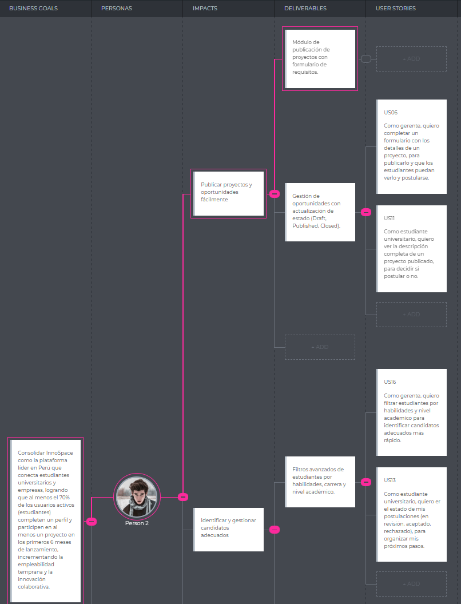
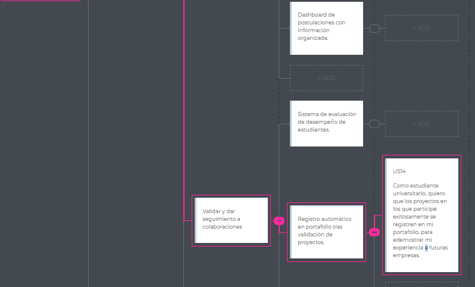

  Impact Mapping 1 - Elaboración propia

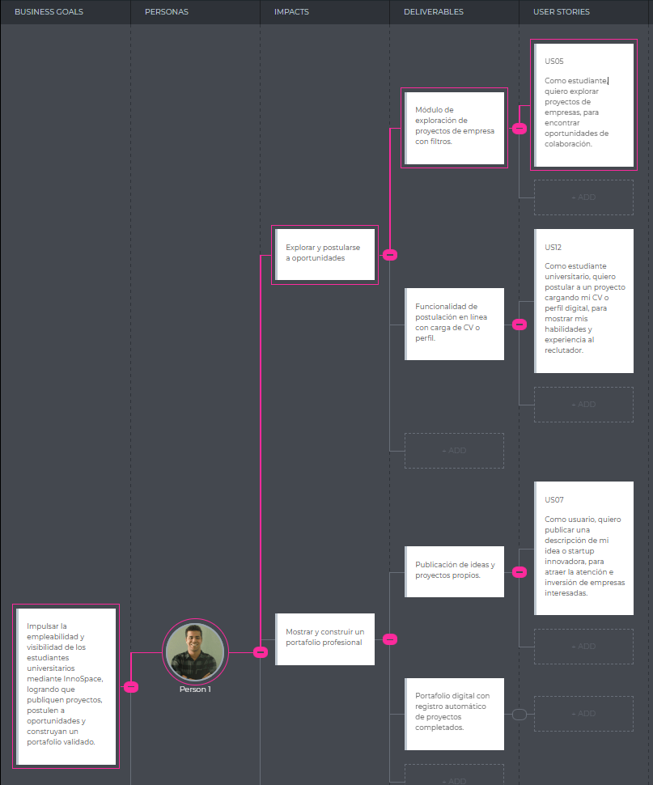
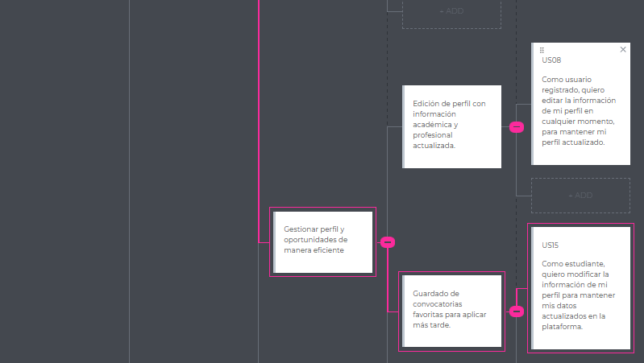

  Impact Mapping 2 - Elaboración propia

### 2.4.3. Product Backlog

<table border="1">
  <thead>
    <tr>
      <th># Orden</th>
      <th>User Story Id</th>
      <th>Título</th>
      <th>Descripción</th>
      <th>Story Points (1 / 2 / 3 / 5 / 8)</th>
    </tr>
  </thead>
  <tbody>
    <tr>
      <td>1</td>
      <td>US18</td>
      <td>Llamados a la acción claros</td>
      <td>Como visitante de la landing page, quiero contar con un encabezado visible en todo momento, para moverme fácilmente entre las secciones sin hacer scroll manualmente.</td>
      <td>3</td>
    </tr>
    <tr>
      <td>2</td>
      <td>US17</td>
      <td>Registro inmediato desde la landing</td>
      <td>Como usuario nuevo, quiero acceder rápidamente al formulario de registro, para comenzar a usar la plataforma sin perder tiempo.</td>
      <td>3</td>
    </tr>
    <tr>
      <td>3</td>
      <td>US01</td>
      <td>Registro de usuario</td>
      <td>Como usuario nuevo, quiero crear una cuenta, para poder acceder a las funciones de la aplicación.</td>
      <td>3</td>
    </tr>
    <tr>
      <td>4</td>
      <td>US02</td>
      <td>Inicio de sesión</td>
      <td>Como usuario registrado, quiero iniciar sesión, para acceder a mi cuenta y explorar los proyectos.</td>
      <td>2</td>
    </tr>
    <tr>
      <td>5</td>
      <td>US04</td>
      <td>Recuperar contraseña</td>
      <td>Como usuario registrado, quiero recuperar mi contraseña, para poder acceder a mi cuenta si la olvido.</td>
      <td>e</td>
    </tr>
    <tr>
      <td>6</td>
      <td>US08</td>
      <td>Editar Perfil de Usuario</td>
      <td>Como usuario registrado, quiero editar la información de mi perfil en cualquier momento, para mantener mi perfil actualizado.</td>
      <td>3</td>
    </tr>
    <tr>
      <td>7</td>
      <td>US03</td>
      <td>Cierre de Sesión</td>
      <td>Como usuario, quiero cerrar sesión de mi cuenta, para proteger mi información personal.</td>
      <td>1</td>
    </tr>
    <tr>
      <td>8</td>
      <td>US06</td>
      <td>Gerente publica nuevo proyecto</td>
      <td>Como gerente, quiero completar un formulario con los detalles de un proyecto, para publicarlo y que los estudiantes puedan verlo y postularse.</td>
      <td>5</td>
    </tr>
    <tr>
      <td>9</td>
      <td>US10</td>
      <td>Búsqueda filtrada de convocatorias</td>
      <td>Como estudiante universitario, quiero buscar proyectos según filtros (habilidades, área académica, nivel de experiencia), para identificar oportunidades que se ajusten a mi perfil.</td>
      <td>5</td>
    </tr>
    <tr>
      <td>10</td>
      <td>US05</td>
      <td>Explorar proyectos de empresa</td>
      <td>Como estudiante, quiero explorar proyectos de empresas, para encontrar oportunidades de colaboración.</td>
      <td>3</td>
    </tr>
    <tr>
      <td>11</td>
      <td>US11</td>
      <td>Visualización de detalles del proyecto</td>
      <td>Como estudiante universitario, quiero ver la descripción completa de un proyecto publicado, para decidir si postular o no.</td>
      <td>3</td>
    </tr>
    <tr>
      <td>12</td>
      <td>US12</td>
      <td>Postulación en línea</td>
      <td>Como estudiante universitario, quiero postular a un proyecto cargando mi CV o perfil digital, para mostrar mis habilidades y experiencia al reclutador.</td>
      <td>5</td>
    </tr>
    <tr>
      <td>13</td>
      <td>US13</td>
      <td>Seguimiento de postulaciones</td>
      <td>Como estudiante universitario, quiero er el estado de mis postulaciones (en revisión, aceptado, rechazado), para organizar mis próximos pasos.</td>
      <td>3</td>
    </tr>
    <tr>
      <td>14</td>
      <td>US15</td>
      <td>Guardado de Convocatorias Favoritos</td>
      <td>Como estudiante, quiero modificar la información de mi perfil para mantener mis datos actualizados en la plataforma.</td>
      <td>3</td>
    </tr>
    <tr>
      <td>15</td>
      <td>US16</td>
      <td>Filtrado de estudiantes</td>
      <td>Como gerente, quiero filtrar estudiantes por habilidades y nivel académico para identificar candidatos adecuados más rápido.</td>
      <td>5</td>
    </tr>
    <tr>
      <td>16</td>
      <td>US07</td>
      <td>Estudiante publica nueva idea innovadora</td>
      <td>Como usuario, quiero publicar una descripción de mi idea o startup innovadora, para atraer la atención e inversión de empresas interesadas.</td>
      <td>4</td>
    </tr>
    <td>17</td>
      <td>US09</td>
      <td>Explorar Ideas de estudiantes</td>
      <td>Como gerente, quiero explorar una lista de ideas innovadoras publicadas por estudiantes, para encontrar oportunidades potenciales en las que mi empresa pueda invertir.</td>
      <td>3</td>
    </tr>
    </tr>
    <td>18</td>
      <td>US14</td>
      <td>Construcción de portafolio</td>
      <td>Como estudiante universitario, quiero que los proyectos en los que participé exitosamente se registren en mi portafolio, para edemostrar mi experiencia a futuras empresas.</td>
      <td>8</td>
    </tr>
  </tbody>
</table>

  

  

  Product Backlog - Elaboración propia

 

Link del Trello: https://trello.com/invite/b/68cb965276edf7d589375471/ATTI3f30e253b26ba9715ccd503bb929f0c6A295F7FE/product-backlog-unipafi

---

## 2.5. Strategic-Level Domain-Driven Design

### 2.5.1. EventStorming

Como equipo realizamos una sesión de EventStorming con el objetivo de comprender el dominio del problema y plantear una primera aproximación al modelado general de Innospace. La actividad tuvo una duración de alrededor de 1-2 horas, donde identificamos los principales eventos, actores y reglas que definen las interacciones entre estudiantes y empresas.

Durante la sesión usamos una herramienta colaborativa para organizar y visualizar los elementos, lo que nos permitió discutir, consensuar y delimitar los primeros bounded contexts del sistema. El resultado es un mapa inicial del dominio que servirá como base para el análisis y diseño detallado en las siguientes etapas.

  

    Event Storming - Elaboración propia

#### 2.5.1.1. Candidate Context Discovery

Tras concluir la sesión de Event Storming con la herramienta Miro, se llevó a cabo un análisis detallado de los eventos detectados con el fin de identificar los contextos candidatos más relevantes para el dominio. Este trabajo incluyó reconocer patrones y vínculos entre los eventos y creando flujos a partir de ellos. Como resultado, se organizaron conjuntos de eventos que correspondían a un mismo proceso dentro de la aplicación.

### Onboarding 

  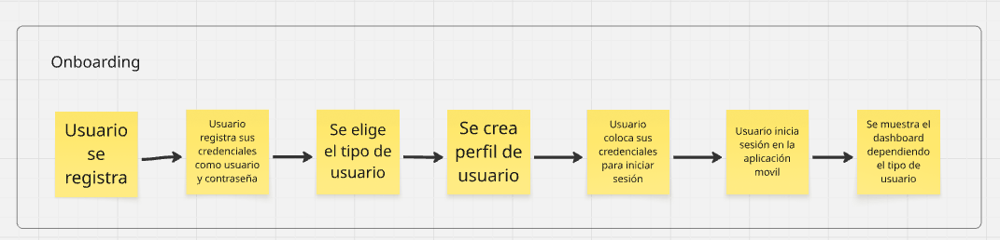

     Elaboración propia

### Creación de convocatoria 

  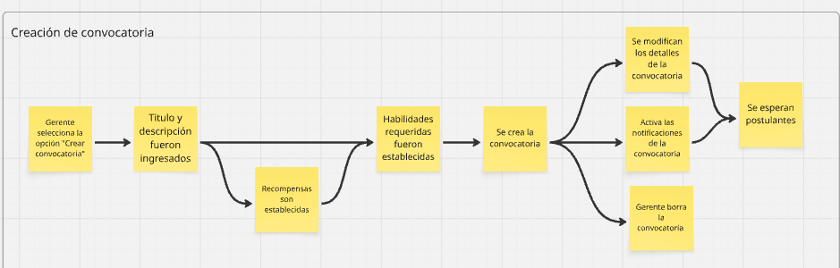

     Elaboración propia

### Colaboración y financiamiento

  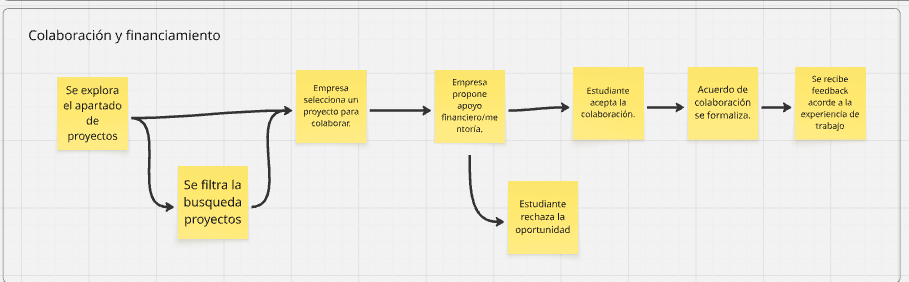

     Elaboración propia

### Creación de proyectos estudiantiles

  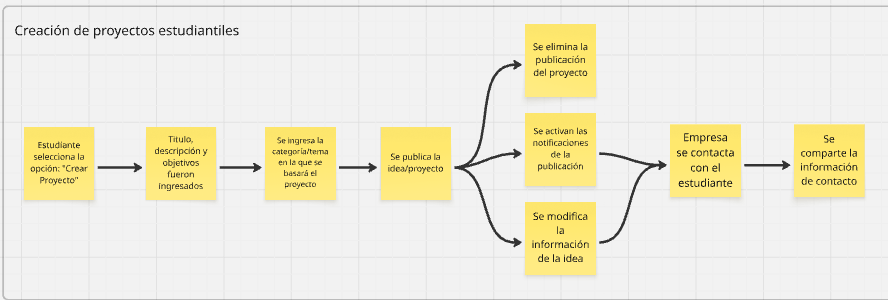

     Elaboración propia

### Postulación a convocatorias de empresa

  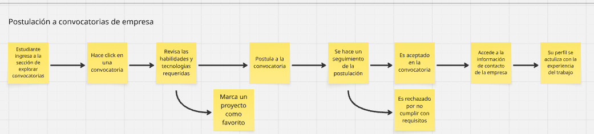

     Elaboración propia

Después de mostrar los flujos de eventos que suceden dentro de la aplicación, los pivotal points (eventos que cambian el curso del sistema) son estos:

- La creación de un proyecto estudiantil

- La publicación de una oportunidad por parte de la empresa

- La postulación de un estudiante a una oportunidad

- La decisión de colaboración de una empresa sobre un proyecto

- La aceptación o rechazo de la colaboración por parte del estudiante

Al identificar estos pivotal points, se puede observar cómo los eventos se agrupan en contextos distintos, quedando definidos los siguientes bounded contexts:

- Student Projects: Gestión del ciclo de vida de proyectos estudiantiles.

- Company Opportunities: Creación y publicación de convocatorias de empresas.

- Student Applications: Administración de postulaciones de estudiantes a oportunidades.

- Project Collaboration: Decisiones de colaboración y respuestas de estudiantes.

 
 
 
 

Luego de realizar estos pasos, se utilizó la herramienta Miro para dividir estos Bounded Contexts, detallando los agregados, eventos y entidades:

### Student Projects:

  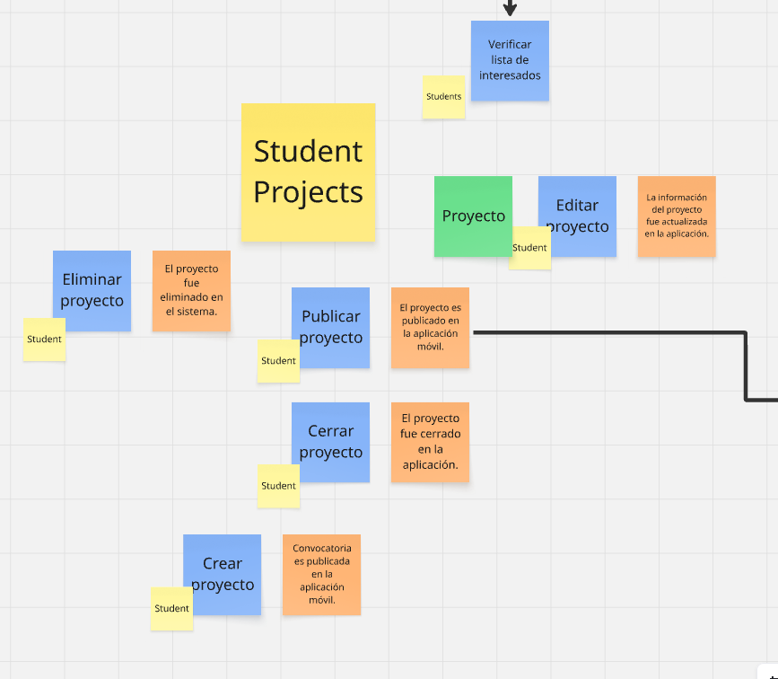

     Elaboración propia

### Student Applications

  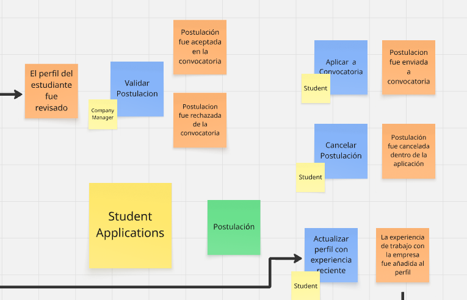

     Elaboración propia

### Project Collaboration:

  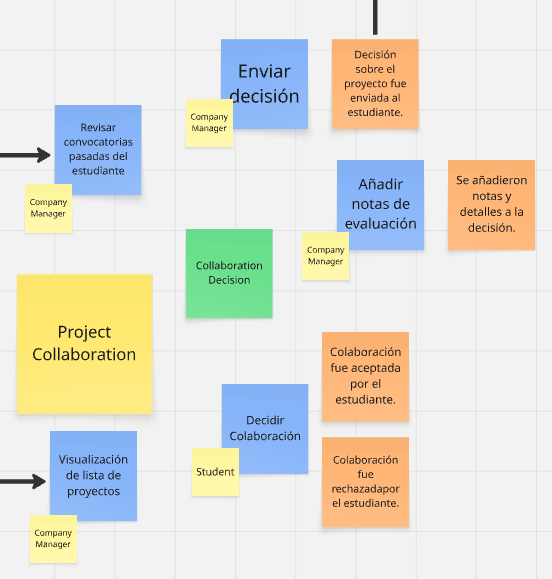

     Elaboración propia

### Company Opportunities

  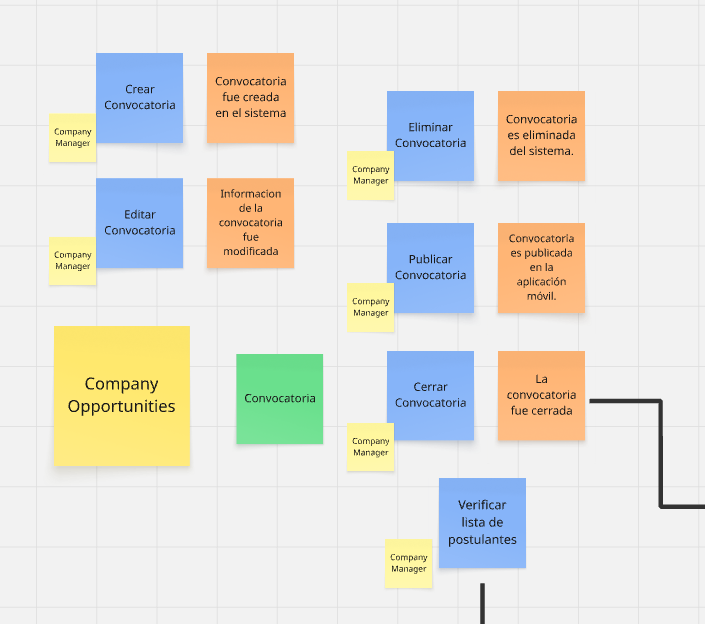

     Elaboración propia

#### 2.5.1.2. Domain Message Flows Modeling

Ahora se mostrarán los eventos en los cuales se comunican los bounded contexts hallados previamente.

<strong>Company Opportunities y Student Applications:</strong> Cuando un estudiante postula a una convocatoria, se mostrará en la lista de postulantes del gerente, luego el gerente podrá revisar el perfil del postulante y validar su postulación

  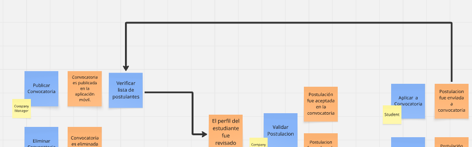

     Elaboración propia

<strong>Company Opportunities y Student Applications:</strong> Cuando una convocatoria acaba y el estudiante elegido participa en ella, entonces el perfil del estudiante se actualizará con la convocatoria en la que participó.

  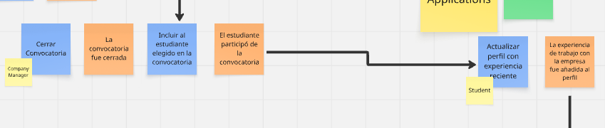

     Elaboración propia

<strong>Project Collaboration y Student Applications:</strong> Cuando el estudiante gana experiencia después de una convocatoria, el gerente puede corroborar su experiencia antes de colaborar en un proyecto del estudiante.

  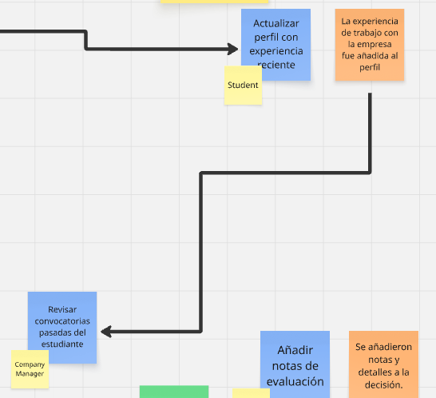

     Elaboración propia

<strong>Project Collaboration y Student Projects:</strong> Cuando el estudiante publica un proyecto, un gerente podrá verlo en la aplicación y enviar la decisión al estudiante, finalmente el estudiante aceptará si decidir la colaboración o no.

  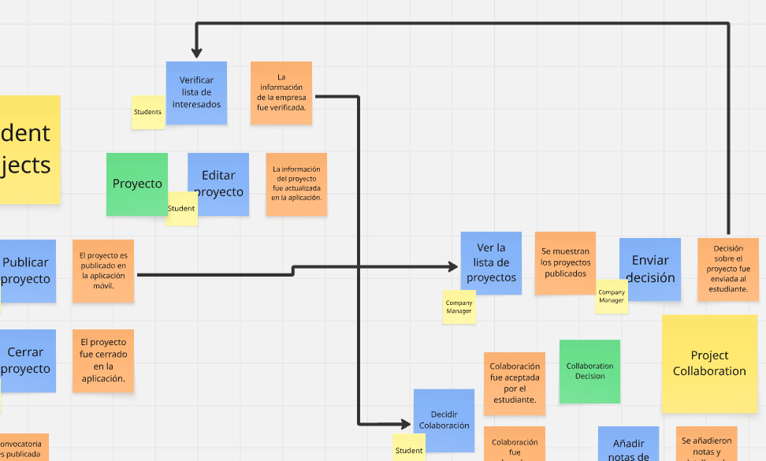

     Elaboración propia

 

Aca se muestra el diagrama completo que incluye los 4 Bounded Contexts: 

  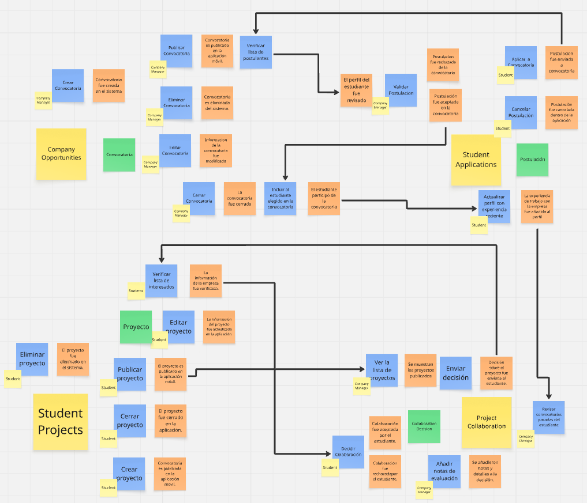

     Elaboración propia

Enlace al Miro Board: https://miro.com/app/board/uXjVJKRuXIw=/?share_link_id=238987388336

#### 2.5.1.3. Bounded Context Canvases

En esta parte se lleva a cabo la descomposición estratégica del dominio a través de la construcción de Bounded Context Canvases, con el propósito de reconocer y delimitar áreas funcionales claras dentro del sistema. Esta actividad es clave en el enfoque de Domain-Driven Design (DDD), ya que ayuda a definir con precisión los límites semánticos y técnicos entre los distintos módulos, reduciendo la complejidad y permitiendo que cada componente pueda evolucionar de manera independiente.

### Student Projects

  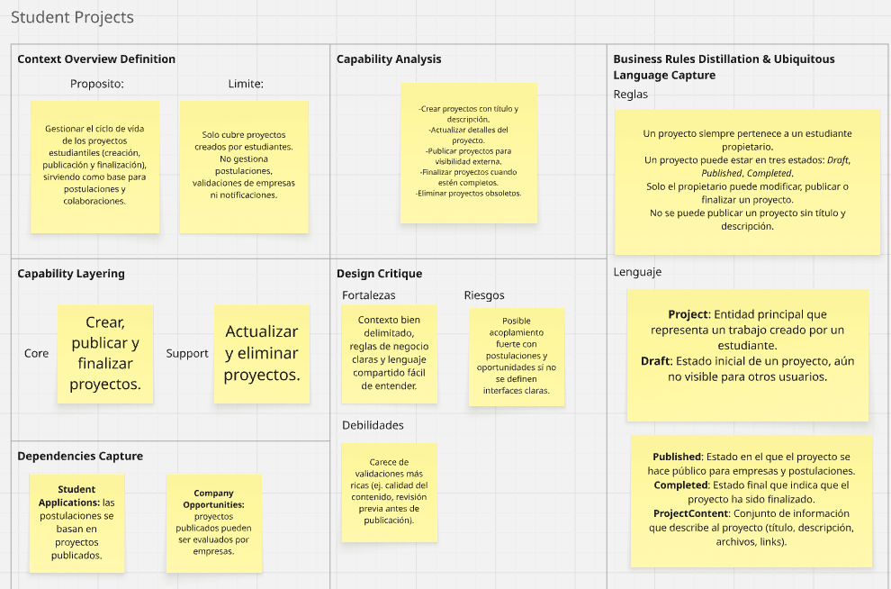

     Elaboración propia

### Company Opportunities

  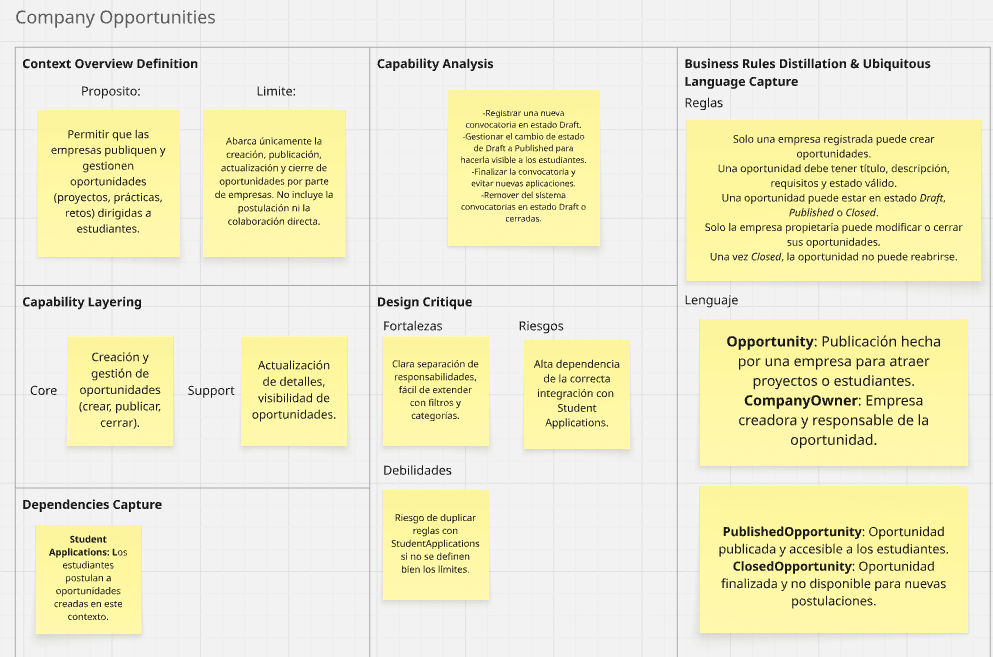

     Elaboración propia

### Student Applications

  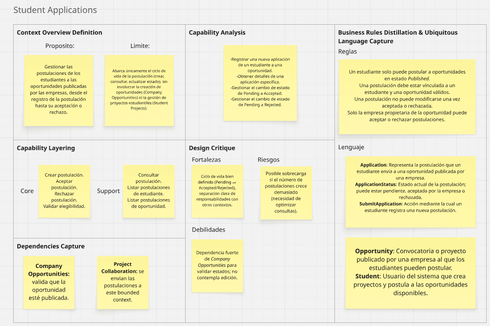

     Elaboración propia

### Project Collaboration

  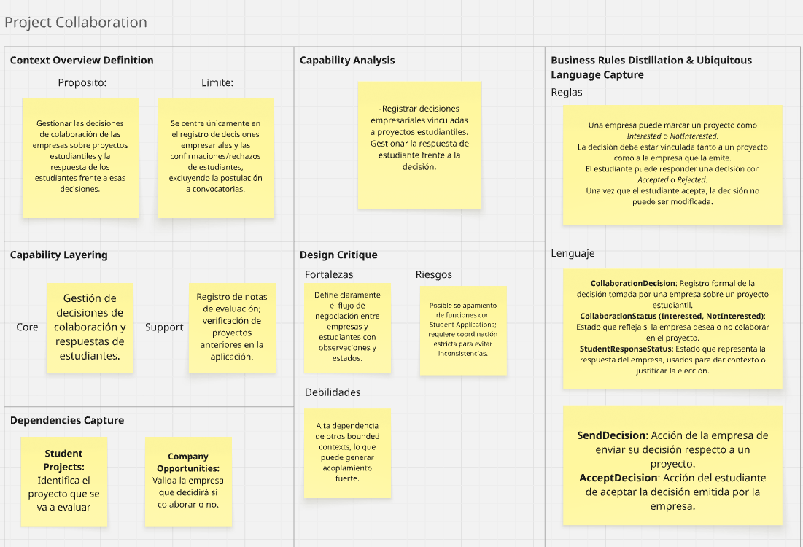

     Elaboración propia

### 2.5.2. Context Mapping

Esta sección documenta el proceso de análisis y diseño estructural de la aplicación, centrándose en la identificación y relación de los bounded contexts. Utilizando la metodología de Context Mapping de Domain-Driven Design, se evaluaron diversas alternativas para definir los límites de cada contexto y los patrones de interacción entre ellos. 

El proceso involucró un análisis crítico de capacidades, considerando escenarios de descomposición, consolidación y reorganización de funcionalidades. A través de iteraciones y preguntas estratégicas, se establecieron las relaciones más apropiadas—Partnership, Customer-Supplier con Anti-corruption Layer y Shared Kernels—que garantizan autonomía, consistencia y escalabilidad del sistema. 

A continuación se muestran los escenarios planteados:

#### Escenario 1: ¿Partir "Student Projects" en contextos más pequeños?
- Análisis: Evaluamos dividirlo en "Project Creation" y "Project Management".

- Decisión: No. El ciclo de vida del proyecto es cohesivo. La división añadiría acoplamiento innecesario y overhead de comunicación.

#### Escenario 2: ¿Duplicar el perfil del estudiante en "Student Applications"?
- Análisis: Consideramos duplicar datos para romper la dependencia con "Student Projects".

- Decisión: No. Se optó por un Anti-corruption Layer (ACL). La duplicación genera inconsistencia. El ACL mantiene la autonomía con una sola fuente de verdad.

##### Escenario 3: ¿Consolidar "Project Collaboration" y "Company Opportunities" en "Company Engagement"?
- Análisis: Evaluamos unirlos por ser ambos iniciativas de la empresa.

- Decisión:  No. Sus capacidades centrales son distintas (convocatorias abiertas vs. contacto proactivo). Mantenerlos separados con una Partnership ofrece mayor cohesión.

  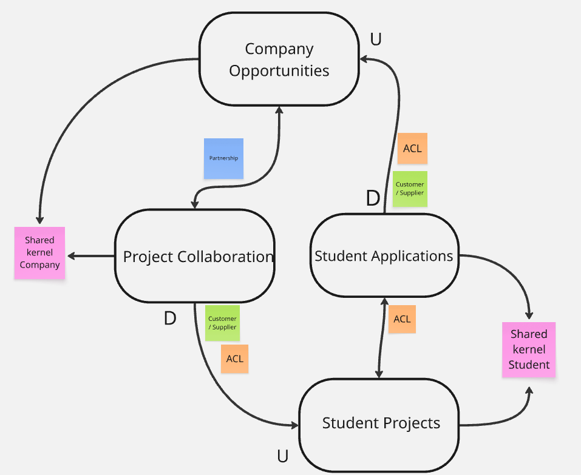

     Elaboración propia

| Destino (Downstream)       | Origen (Upstream)           | Tipo de Relación         | Comentario                                                                                               |
| -------------------------- | --------------------------- | ------------------------ | -------------------------------------------------------------------------------------------------------- |
| Project Collaboration      | Student Projects            | Customer/Supplier + ACL  | Consume información de proyectos y estudiantes, traduciendo modelos mediante Anti-Corruption Layer       |
| Student Applications       | Student Projects            | ACL  | Utiliza datos de estudiantes y proyectos, protegiendo su modelo con ACL                                  |
| Student Applications       | Company Opportunities       | Customer/Supplier + ACL  | Consume convocatorias, adaptando el modelo upstream a sus necesidades con ACL                            |
| Project Collaboration      | Company Opportunities       | Partnership              | Coordinación activa para gestión unificada de interacciones empresa-estudiante                           |

### 2.5.3. Software Architecture

#### 2.5.3.1.Software Architecture Context Level Diagrams  
Este diagrama representa la visión de más alto nivel del sistema InnoSpace Platform, mostrando las interacciones externas que mantienen los actores con la plataforma.

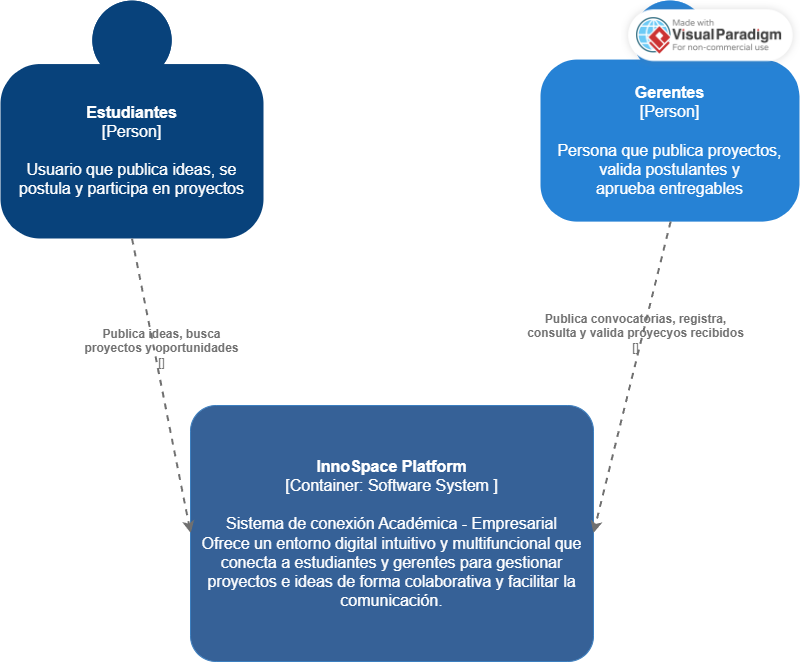

  Elaboración propia

#### 2.5.3.2.Software Architecture Container Level Diagrams  
En este nivel la arquitectura se organiza en tres contenedores principales: la Mobile App, que ofrece el acceso de los usuarios; la API Application, que gestiona la lógica de negocio y comunica la app con el sistema; y la Database, donde se almacenan usuarios, proyectos y postulaciones.

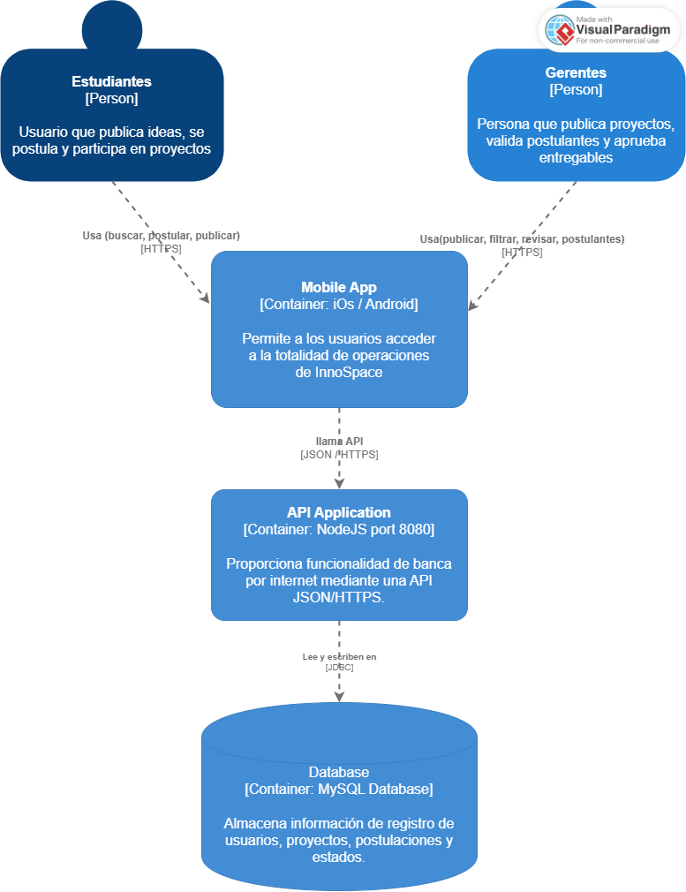

  Elaboración propia

#### 2.5.3.3. Software Architecture Deployment Diagrams  
El diagrama de despliegue muestra que la Mobile App, la API Application se aloja en un servidor cloud para asegurar disponibilidad y escalabilidad, y la Database se despliega en un servidor independiente dentro de la misma nube, garantizando integridad y persistencia de los datos.

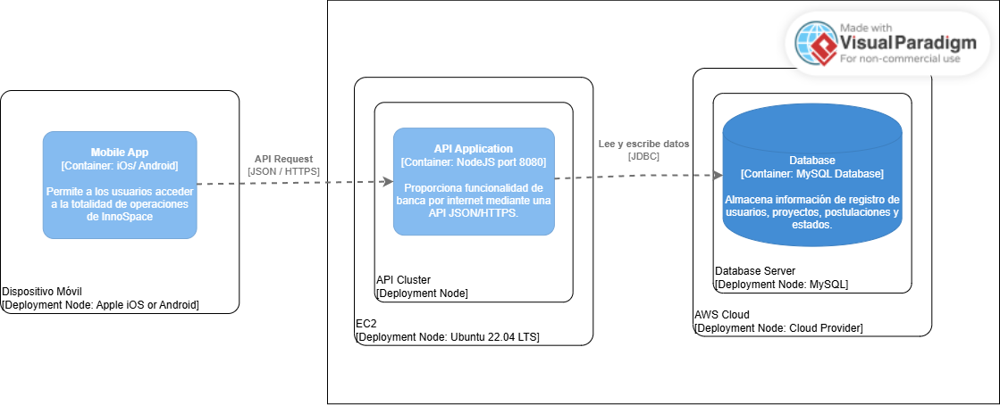

  Elaboración propia

## 2.6. Tactical-Level Domain-Driven Design

### 2.6.1. Bounded Context: Student Projects

#### 2.6.1.1. Domain Layer

El agregado Project encapsula el ciclo de vida de un proyecto estudiantil, permitiendo crearlo, actualizarlo, publicarlo y marcarlo como completado, asegurando que el estado (Draft, Published, Completed) y los contenidos asociados se mantengan consistentes y válidos.

### Aggregate: `Project`
**Descripción:** Representa un proyecto o idea innovadora creada por un estudiante, con ciclo de vida completo desde borrador hasta finalizado, incluyendo contenido y estado.

| Atributos      | Tipo de dato     | Visibilidad | Descripción                                     |
|----------------|-----------------|------------|------------------------------------------------|
| projectId      | Long            | Private    | Identificador único del proyecto.             |
| studentId      | Long            | Private    | Identificador del estudiante propietario.    |
| title          | String          | Private    | Título del proyecto.                          |
| description    | String          | Private    | Descripción detallada del proyecto.          |
| status         | ProjectStatus   | Private    | Estado del proyecto (`Draft`, `Published`, `Completed`). |
| creationDate   | Timestamp       | Private    | Fecha de creación del proyecto.              |
| lastUpdate     | Timestamp       | Private    | Fecha de última actualización.               |

| Métodos                         | Tipo de retorno | Visibilidad | Descripción                                      |
|---------------------------------|----------------|------------|------------------------------------------------|
| getProjectId()                  | Long           | Public     | Devuelve el ID del proyecto.                   |
| getStudentId()                  | Long           | Public     | Devuelve el ID del estudiante propietario.    |
| getTitle()                      | String         | Public     | Devuelve el título del proyecto.              |
| getDescription()                | String         | Public     | Devuelve la descripción del proyecto.        |
| getStatus()                     | ProjectStatus  | Public     | Devuelve el estado actual del proyecto.       |
| publish()                       | void           | Public     | Cambia el estado del proyecto a `Published`. |
| update(title, description)      | void           | Public     | Actualiza los campos modificables del proyecto.|
| finalize()                      | void           | Public     | Cambia el estado del proyecto a `Completed`. |
| getCreationDate()               | Timestamp      | Public     | Devuelve la fecha de creación.                |
| getLastUpdate()                 | Timestamp      | Public     | Devuelve la fecha de última actualización.   |

### Value Objects

| Value Object   | Descripción                                                                 |
|----------------|-----------------------------------------------------------------------------|
| ProjectStatus  | Representa el estado del proyecto: `Draft`, `Published`, `Completed`.      |
| ProjectContent | Contiene archivos, imágenes, prototipos o documentación asociada al proyecto.|

#### Clase: `ProjectQueryService`

| Título       | ProjectQueryService |
|--------------|----------------------|
| Descripción  | Interfaz de servicio de consultas para operaciones de lectura relacionadas con proyectos de estudiantes |

##### Métodos

| Método                             | Descripción                                               |
|-----------------------------------|-----------------------------------------------------------|
| handle(GetProjectByIdQuery)        | Obtiene los detalles completos de un proyecto por su ID   |
| handle(GetAllStudentProjectsQuery) | Obtiene todos los proyectos asociados a un estudiante     |
| handle(ValidateProjectOwnershipQuery) | Verifica si un estudiante es propietario del proyecto |

---

#### Clase: `ProjectCommandService`

| Título       | ProjectCommandService |
|--------------|------------------------|
| Descripción  | Interfaz de servicio de comandos para operaciones de escritura relacionadas con proyectos de estudiantes |

##### Métodos

| Método                           | Descripción                                                        |
|---------------------------------|--------------------------------------------------------------------|
| handle(CreateProjectCommand)     | Crea un nuevo proyecto con la información proporcionada            |
| handle(UpdateProjectCommand)     | Actualiza la información básica del proyecto (título, descripción, contenido) |
| handle(PublishProjectCommand)    | Cambia el estado del proyecto a publicado                          |
| handle(FinalizeProjectCommand)   | Cambia el estado del proyecto a completado                         |
| handle(DeleteProjectCommand)     | Elimina un proyecto del sistema     

#### 2.6.1.2. Interface Layer

El ProjectController expone endpoints REST que permiten a los estudiantes gestionar sus proyectos, desde la creación hasta el cierre, utilizando assemblers para mapear recursos REST a comandos de dominio y conectando las solicitudes del cliente con los servicios de aplicación.

### Controlador: `ProjectController`

**Título:** ProjectController  
**Descripción:** Controlador REST que maneja las operaciones CRUD y gestión de proyectos de estudiantes.

#### Métodos

| Método           | Ruta                              | Descripción                                               |
|-----------------|----------------------------------|-----------------------------------------------------------|
| getProjectById   | GET /api/v1/projects/{id}        | Obtiene los detalles de un proyecto específico por su ID |
| getAllStudentProjects | GET /api/v1/projects/student/{studentId} | Obtiene todos los proyectos asociados a un estudiante |
| createProject    | POST /api/v1/projects            | Crea un nuevo proyecto a partir de los datos proporcionados |
| updateProject    | PUT /api/v1/projects/{id}        | Actualiza los detalles de un proyecto existente          |
| publishProject   | POST /api/v1/projects/{id}/publish | Cambia el estado del proyecto a publicado              |
| finalizeProject  | POST /api/v1/projects/{id}/finalize | Cambia el estado del proyecto a completado            |
| deleteProject    | DELETE /api/v1/projects/{id}     | Elimina un proyecto del sistema                          |

#### Dependencias

| Dependencia                         | Descripción                                                                 |
|------------------------------------|-----------------------------------------------------------------------------|
| ProjectQueryService                 | Servicio para consultas y recuperación de datos de proyectos               |
| ProjectCommandService               | Servicio para ejecutar comandos de creación, actualización, publicación y eliminación de proyectos |
| CreateProjectCommandFromResourceAssembler | Convierte recursos REST en comandos de creación de proyectos           |
| UpdateProjectCommandFromResourceAssembler | Convierte recursos REST en comandos de actualización de proyectos      |
| DeleteProjectCommandFromResourceAssembler | Convierte recursos REST en comandos de eliminación de proyectos         |
| ProjectResourceFromEntityAssembler  | Convierte entidades de proyecto en recursos REST para la respuesta        |

#### 2.6.1.3. Application Layer

Los servicios ProjectCommandServiceImpl y ProjectQueryServiceImpl implementan los casos de uso definidos en el dominio, coordinando la creación, actualización, publicación, finalización y consulta de proyectos, sin exponer detalles de persistencia ni de transporte.

#### Clase: `ProjectQueryServiceImpl`

| Título       | ProjectQueryServiceImpl |
|--------------|--------------------------|
| Descripción  | Implementación del servicio de consultas para operaciones de lectura relacionadas con proyectos de estudiantes |

##### Dependencias

| Dependencia            | Descripción                                   |
|-------------------------|-----------------------------------------------|
| ProjectRepository       | Repositorio para acceso a datos de proyectos  |
| ProjectQueryService     | Interfaz de consultas definida en el dominio  |

---

#### Clase: `ProjectCommandServiceImpl`

| Título       | ProjectCommandServiceImpl |
|--------------|----------------------------|
| Descripción  | Implementación del servicio de comandos para operaciones de escritura relacionadas con proyectos de estudiantes |

##### Dependencias

| Dependencia            | Descripción                                   |
|-------------------------|-----------------------------------------------|
| ProjectRepository       | Repositorio para acceso a datos de proyectos  |
| ProjectCommandService   | Interfaz de comandos definida en el dominio   |

#### 2.6.1.4 Infrastructure Layer

El ProjectRepository provee los mecanismos de persistencia para proyectos, con operaciones CRUD y consultas específicas (por ID o por estudiante), integrando las entidades de dominio con representaciones en la base de datos mediante ProjectEntity.

### Clase: `ProjectRepository`

| Título       | ProjectRepository |
|-------------|------------------|
| Descripción | Interfaz de persistencia para operaciones CRUD y consultas específicas de proyectos de estudiantes |

#### Métodos

| Método             | Descripción                                           |
|-------------------|-------------------------------------------------------|
| save(ProjectEntity) | Persiste un nuevo proyecto o actualiza uno existente |
| deleteById(Long)   | Elimina un proyecto por su ID                        |
| findById(Long)     | Obtiene un proyecto por su ID                        |
| findAllByStudentId(Long) | Obtiene todos los proyectos asociados a un estudiante |

#### Dependencias

| Dependencia    | Propósito                                                   |
|---------------|-------------------------------------------------------------|
| Student       | Clase que representa al estudiante en el sistema           |
| ProjectEntity | Clase que representa la entidad de proyecto en la base de datos |

#### 2.6.1.5. Bounded Context Software Architecture Component Level Diagrams

Este diagrama de componentes representa un sistema monolítico que gestiona proyectos estudiantiles dentro de la plataforma. Una aplicación Movil interactúa con el `ProjectController`.

El controlador delega la lógica en dos servicios principales: `ProjectQueryService`, para recuperar y validar proyectos, y `ProjectCommandService`, para crearlos, actualizarlos, publicarlos o finalizarlos.

Ambos servicios utilizan el `ProjectRepository`, que gestiona la persistencia mediante JPA en una base de datos MySQL.

  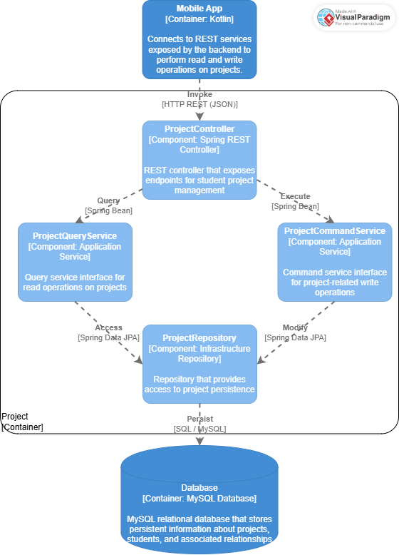

  Elaboración propia

#### 2.6.1.6. Bounded Context Software Architecture Code Level Diagrams

#### 2.6.1.6.1. Bounded Context Domain Layer Class Diagrams

  

    Bounded Context Class Diagram - Elaboración propia

#### 2.6.1.6.2. Bounded Context Database Design Diagrams

  

  Elaboración propia

### 2.6.2. Bounded Context: Company Opportunities

#### 2.6.2.1. Domain Layer

El agregado Opportunity encapsula la lógica de negocio de una convocatoria publicada por una empresa, controlando su ciclo de vida (Draft, Published, Closed), validando criterios y actualizaciones, y garantizando consistencia mediante Value Objects como OpportunityStatus y OpportunityRequirements.

### Aggregate: `Opportunity`
**Descripción:** Representa una convocatoria u oportunidad publicada por una empresa, con detalles, criterios de selección y estado.

| Atributos      | Tipo de dato       | Visibilidad | Descripción                                           |
|----------------|------------------|------------|-----------------------------------------------------|
| opportunityId  | Long             | Private    | Identificador único de la oportunidad             |
| companyId      | Long             | Private    | Identificador de la empresa que publica la oportunidad |
| title          | String           | Private    | Título de la convocatoria                           |
| description    | String           | Private    | Descripción detallada de la oportunidad            |
| requirements   | List<String>     | Private    | Lista de habilidades o criterios requeridos        |
| status         | OpportunityStatus| Private    | Estado de la oportunidad (`Draft`, `Published`, `Closed`) |
| creationDate   | Timestamp        | Private    | Fecha de creación                                   |
| lastUpdate     | Timestamp        | Private    | Fecha de última actualización                        |

### Métodos

| Método                  | Tipo de retorno | Visibilidad | Descripción                                     |
|-------------------------|----------------|------------|------------------------------------------------|
| getOpportunityId()      | Long           | Public     | Devuelve el ID de la oportunidad             |
| getCompanyId()          | Long           | Public     | Devuelve el ID de la empresa                 |
| getTitle()              | String         | Public     | Devuelve el título de la oportunidad        |
| getDescription()        | String         | Public     | Devuelve la descripción de la oportunidad   |
| getRequirements()       | List<String>   | Public     | Devuelve los requisitos o habilidades       |
| getStatus()             | OpportunityStatus | Public  | Devuelve el estado actual                    |
| publish()               | void           | Public     | Cambia el estado de la oportunidad a `Published` |
| close()                 | void           | Public     | Cambia el estado de la oportunidad a `Closed` |
| update(title, description, requirements) | void | Public | Actualiza los datos básicos de la oportunidad |
| getCreationDate()       | Timestamp      | Public     | Devuelve la fecha de creación               |
| getLastUpdate()         | Timestamp      | Public     | Devuelve la fecha de última actualización   |

### Value Objects

| Value Object           | Descripción                                      |
|------------------------|--------------------------------------------------|
| OpportunityStatus       | Representa el estado de la oportunidad: `Draft`, `Published`, `Closed` |
| OpportunityRequirements | Contiene las habilidades y criterios que la empresa espera de los postulantes |

#### Clase: `OpportunityQueryService`

| Título       | OpportunityQueryService |
|--------------|--------------------------|
| Descripción  | Interfaz de servicio de consultas para operaciones de lectura relacionadas con oportunidades de empresa |

##### Métodos

| Método                                | Descripción                                               |
|--------------------------------------|-----------------------------------------------------------|
| handle(GetOpportunityByIdQuery)       | Obtiene los detalles completos de una oportunidad por su ID |
| handle(GetAllCompanyOpportunitiesQuery) | Obtiene todas las oportunidades asociadas a una empresa   |
| handle(ValidateOpportunityOwnershipQuery) | Verifica si una empresa es propietaria de la oportunidad |

---

#### Clase: `OpportunityCommandService`

| Título       | OpportunityCommandService |
|--------------|-----------------------------|
| Descripción  | Interfaz de servicio de comandos para operaciones de escritura relacionadas con oportunidades de empresa |

##### Métodos

| Método                          | Descripción                                                       |
|--------------------------------|-------------------------------------------------------------------|
| handle(CreateOpportunityCommand) | Crea una nueva oportunidad con la información proporcionada       |
| handle(UpdateOpportunityCommand) | Actualiza los detalles de la oportunidad (título, descripción, requisitos) |
| handle(PublishOpportunityCommand) | Cambia el estado de la oportunidad a publicada                    |
| handle(CloseOpportunityCommand)   | Cambia el estado de la oportunidad a cerrada                      |
| handle(DeleteOpportunityCommand)  | Elimina una oportunidad del sistema                               |

#### 2.6.2.2. Interface Layer

El OpportunityController expone endpoints REST que permiten a clientes externos crear, actualizar, publicar, cerrar y consultar convocatorias, utilizando assemblers para mapear recursos REST a comandos y entidades de dominio, y conectándose a los servicios de aplicación para ejecutar la lógica correspondiente.

### Controlador: `OpportunityController`

**Título:** OpportunityController  
**Descripción:** Controlador REST que maneja las operaciones CRUD y gestión de oportunidades/convocatorias de empresas.

#### Métodos

| Método               | Ruta                                  | Descripción                                               |
|---------------------|--------------------------------------|-----------------------------------------------------------|
| getOpportunityById   | GET /api/v1/opportunities/{id}       | Obtiene los detalles de una oportunidad específica por su ID |
| getAllCompanyOpportunities | GET /api/v1/opportunities/company/{companyId} | Obtiene todas las oportunidades asociadas a una empresa |
| createOpportunity    | POST /api/v1/opportunities           | Crea una nueva oportunidad a partir de los datos proporcionados |
| updateOpportunity    | PUT /api/v1/opportunities/{id}       | Actualiza los detalles de una oportunidad existente     |
| publishOpportunity   | POST /api/v1/opportunities/{id}/publish | Cambia el estado de la oportunidad a publicada        |
| closeOpportunity     | POST /api/v1/opportunities/{id}/close   | Cambia el estado de la oportunidad a cerrada          |
| deleteOpportunity    | DELETE /api/v1/opportunities/{id}    | Elimina una oportunidad del sistema                     |

#### Dependencias

| Dependencia                               | Descripción                                                                 |
|------------------------------------------|-----------------------------------------------------------------------------|
| OpportunityQueryService                   | Servicio para consultas y recuperación de datos de oportunidades           |
| OpportunityCommandService                 | Servicio para ejecutar comandos de creación, actualización, publicación, cierre y eliminación de oportunidades |
| CreateOpportunityCommandFromResourceAssembler | Convierte recursos REST en comandos de creación de oportunidades         |
| UpdateOpportunityCommandFromResourceAssembler | Convierte recursos REST en comandos de actualización de oportunidades    |
| DeleteOpportunityCommandFromResourceAssembler | Convierte recursos REST en comandos de eliminación de oportunidades       |
| OpportunityResourceFromEntityAssembler   | Convierte entidades de oportunidad en recursos REST para la respuesta     |

#### 2.6.2.3. Application Layer

Los servicios OpportunityCommandServiceImpl y OpportunityQueryServiceImpl implementan los casos de uso de creación, actualización, publicación, cierre y consulta de oportunidades, actuando como orquestadores entre el dominio y la infraestructura, sin exponer detalles técnicos.

#### Clase: `OpportunityQueryServiceImpl`

| Título       | OpportunityQueryServiceImpl |
|--------------|------------------------------|
| Descripción  | Implementación del servicio de consultas para operaciones de lectura relacionadas con oportunidades de empresa |

##### Dependencias

| Dependencia                | Descripción                                     |
|-----------------------------|-------------------------------------------------|
| OpportunityRepository       | Repositorio para acceso a datos de oportunidades |
| OpportunityQueryService     | Interfaz de consultas definida en el dominio     |

---

#### Clase: `OpportunityCommandServiceImpl`

| Título       | OpportunityCommandServiceImpl |
|--------------|--------------------------------|
| Descripción  | Implementación del servicio de comandos para operaciones de escritura relacionadas con oportunidades de empresa |

##### Dependencias

| Dependencia                | Descripción                                     |
|-----------------------------|-------------------------------------------------|
| OpportunityRepository       | Repositorio para acceso a datos de oportunidades |
| OpportunityCommandService   | Interfaz de comandos definida en el dominio      |

#### 2.6.2.4. Infrastructure Layer

La clase OpportunityRepository gestiona la persistencia y recuperación de oportunidades en la base de datos, con operaciones CRUD y consultas específicas por empresa, asegurando la integración del dominio con entidades como Company y OpportunityEntity.

#### Clase: `OpportunityRepository`

| Título       | OpportunityRepository |
|-------------|----------------------|
| Descripción | Interfaz de persistencia para operaciones CRUD y consultas específicas de oportunidades de empresa |

#### Métodos

| Método                | Descripción                                           |
|----------------------|-------------------------------------------------------|
| save(OpportunityEntity) | Persiste una nueva oportunidad o actualiza una existente |
| deleteById(Long)       | Elimina una oportunidad por su ID                   |
| findById(Long)         | Obtiene una oportunidad por su ID                   |
| findAllByCompanyId(Long) | Obtiene todas las oportunidades asociadas a una empresa |

#### Dependencias

| Dependencia        | Propósito                                                   |
|------------------|--------------------------------------------------------------|
| Company           | Clase que representa a la empresa en el sistema            |
| OpportunityEntity | Clase que representa la entidad de oportunidad en la base de datos |

#### 2.6.2.5. Bounded Context Software Architecture Component Level Diagrams

Este diagrama de componentes representa un sistema monolítico que gestiona oportunidades empresariales dentro de la plataforma. Una aplicación Movil interactúa con el `OpportunityController`..

El controlador delega la lógica en dos servicios principales: `OpportunityQueryService`, para consultas y validaciones, y `OpportunityCommandService`, para creación, actualización, publicación y cierre de oportunidades.

Ambos servicios utilizan el `OpportunityRepository`, que maneja la persistencia mediante JPA en una base de datos MySQL.

  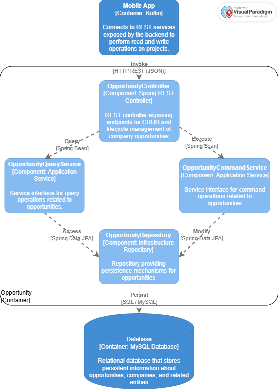

  Elaboración propia

#### 2.6.2.6. Bounded Context Software Architecture Code Level Diagrams

#### 2.6.2.6.1. Bounded Context Domain Layer Class Diagrams

  

    Bounded Context Class Diagram - Elaboración propia

#### 2.6.2.6.2. Bounded Context Database Design Diagrams

  

  Elaboración propia

### 2.6.3. Bounded Context: Project Collaboration

#### 2.6.3.1. Domain Layer

Contiene la lógica principal sobre cómo las empresas (gerentes) toman decisiones respecto a proyectos estudiantiles. Incluye el agregado CollaborationDecision, con atributos como projectId, companyId, decisionStatus (interesado, aceptado, rechazado) y feedback. También maneja entidades de soporte como Manager y StudentProject.

#### Aggregate: `CollaborationDecision`
**Descripción:** Representa la decisión de un gerente sobre un proyecto estudiantil y la respuesta del estudiante, incluyendo estado de interés, aceptación/rechazo y observaciones.

| Atributos          | Tipo de dato            | Visibilidad | Descripción                                           |
|-------------------|------------------------|------------|-----------------------------------------------------|
| decisionId         | Long                   | Private    | Identificador único de la decisión                 |
| projectId          | Long                   | Private    | Identificador del proyecto asociado                |
| companyId          | Long                   | Private    | Identificador de la empresa o gerente evaluador    |
| status             | CollaborationStatus    | Private    | Estado de la decisión del gerente (`Interested`, `NotInterested`) |
| studentResponse    | StudentResponseStatus  | Private    | Respuesta del estudiante (`Pending`, `Accepted`, `Rejected`) |
| evaluationNotes    | String                 | Private    | Observaciones o criterios de evaluación del gerente |
| creationDate       | Timestamp              | Private    | Fecha de creación de la decisión                   |
| lastUpdate         | Timestamp              | Private    | Fecha de última actualización                       |

### Métodos

| Método                     | Tipo de retorno        | Visibilidad | Descripción                                     |
|----------------------------|----------------------|------------|------------------------------------------------|
| getDecisionId()            | Long                 | Public     | Devuelve el ID de la decisión                  |
| getProjectId()             | Long                 | Public     | Devuelve el ID del proyecto asociado           |
| getCompanyId()             | Long                 | Public     | Devuelve el ID de la empresa evaluadora        |
| getStatus()                | CollaborationStatus  | Public     | Devuelve el estado de la decisión del gerente  |
| markInterested()           | void                 | Public     | Cambia el estado del gerente a `Interested`   |
| markNotInterested()        | void                 | Public     | Cambia el estado del gerente a `NotInterested` |
| addEvaluationNotes(notes)  | void                 | Public     | Agrega observaciones de evaluación            |
| getEvaluationNotes()       | String               | Public     | Devuelve las notas de evaluación              |
| submitStudentResponse(response) | void            | Public     | Permite al estudiante aceptar o rechazar la colaboración |
| getStudentResponse()       | StudentResponseStatus | Public    | Devuelve el estado de respuesta del estudiante |
| getCreationDate()          | Timestamp            | Public     | Devuelve la fecha de creación                 |
| getLastUpdate()            | Timestamp            | Public     | Devuelve la fecha de última actualización     |

#### Value Objects

| Value Object            | Descripción                                      |
|-------------------------|--------------------------------------------------|
| CollaborationStatus      | Representa el estado de la decisión del gerente: `Interested`, `NotInterested` |
| StudentResponseStatus    | Representa la respuesta del estudiante: `Pending`, `Accepted`, `Rejected` |
| EvaluationNotes          | Contiene observaciones o criterios de evaluación del gerente |

#### Interfaz: `CollaborationDecisionQueryService`

| Título       | CollaborationDecisionQueryService |
|-------------|-----------------------------------|
| Descripción | Contrato para operaciones de lectura relacionadas con decisiones de colaboración |

#### Métodos

| Método                          | Descripción                                                 |
|--------------------------------|-------------------------------------------------------------|
| handle(GetDecisionByIdQuery)    | Obtiene los detalles completos de una decisión por su ID   |
| handle(GetDecisionsByProjectQuery) | Obtiene todas las decisiones asociadas a un proyecto       |
| handle(GetDecisionsByCompanyQuery) | Obtiene todas las decisiones tomadas por una empresa       |

---

#### Interfaz: `CollaborationDecisionCommandService`

| Título       | CollaborationDecisionCommandService |
|-------------|-------------------------------------|
| Descripción | Contrato para operaciones de escritura relacionadas con decisiones de colaboración |

#### Métodos

| Método                                    | Descripción                                                 |
|-------------------------------------------|-------------------------------------------------------------|
| handle(CreateCollaborationDecisionCommand) | Crea una nueva decisión de colaboración (`Interested` / `NotInterested`) |
| handle(AddEvaluationNotesCommand)          | Agrega notas de evaluación a una decisión                   |
| handle(SubmitStudentResponseCommand)       | Permite al estudiante aceptar o rechazar la colaboración    |
| handle(DeleteCollaborationDecisionCommand) | Elimina una decisión del sistema                             |

#### 2.6.3.2. Interface Layer

Se refleja en la aplicación móvil, mediante los formularios que puede enviar el gerente para colaborar con un proyecto. Los gerentes envían propuestas de colaboración a proyectos específicos, y los estudiantes pueden revisarlas y responder (aceptar o rechazar).

#### Controlador: `CollaborationDecisionController`

**Título:** CollaborationDecisionController  
**Descripción:** Controlador REST que maneja la visualización de proyectos, registro de decisiones de gerentes y respuesta de estudiantes sobre colaboraciones.

#### Métodos

| Método                          | Ruta                                         | Descripción                                                 |
|--------------------------------|---------------------------------------------|-------------------------------------------------------------|
| getDecisionById                  | GET /api/v1/collaboration/{id}             | Obtiene los detalles de una decisión específica por ID     |
| getAllDecisionsByProject         | GET /api/v1/collaboration/project/{projectId} | Obtiene todas las decisiones asociadas a un proyecto       |
| getAllDecisionsByCompany         | GET /api/v1/collaboration/company/{companyId} | Obtiene todas las decisiones tomadas por una empresa       |
| createDecision                   | POST /api/v1/collaboration                 | Permite al gerente registrar su decisión (`Interested` / `NotInterested`) |
| addEvaluationNotes               | POST /api/v1/collaboration/{id}/notes      | Agrega observaciones o criterios de evaluación a la decisión |
| submitStudentResponse            | POST /api/v1/collaboration/{id}/response   | Permite al estudiante aceptar o rechazar la colaboración  |
| deleteDecision                   | DELETE /api/v1/collaboration/{id}          | Elimina una decisión de colaboración del sistema          |

#### Dependencias

| Dependencia                                           | Descripción                                                                 |
|------------------------------------------------------|-----------------------------------------------------------------------------|
| CollaborationDecisionQueryService                     | Servicio para consultas y recuperación de decisiones de colaboración       |
| CollaborationDecisionCommandService                   | Servicio para ejecutar comandos de creación, notas, respuesta y eliminación |
| CreateCollaborationDecisionCommandFromResourceAssembler | Convierte recursos REST en comandos para crear decisiones                   |
| AddEvaluationNotesCommandFromResourceAssembler       | Convierte recursos REST en comandos para añadir notas                      |
| SubmitStudentResponseCommandFromResourceAssembler    | Convierte recursos REST en comandos para que el estudiante acepte/rechace  |
| DeleteCollaborationDecisionCommandFromResourceAssembler | Convierte recursos REST en comandos para eliminar decisiones               |
| CollaborationDecisionResourceFromEntityAssembler     | Convierte entidades en recursos REST para la respuesta                     |

#### 2.6.3.3. Application Layer

Orquesta los casos de uso para enviar, aceptar o rechazar decisiones de colaboración. Expone servicios de comandos (CollaborationDecisionCommandService) para procesar acciones y servicios de consulta (CollaborationDecisionQueryService) para obtener el estado de las decisiones.

#### Clase: `CollaborationDecisionQueryServiceImpl`

| Título       | CollaborationDecisionQueryServiceImpl |
|-------------|---------------------------------------|
| Descripción | Implementación del contrato de consultas definido en el dominio para decisiones de colaboración |

#### Dependencias:

| Dependencia                          | Descripción                                  |
|-------------------------------------|---------------------------------------------|
| CollaborationDecisionQueryService    | Contrato definido en dominio                 |
| CollaborationDecisionRepository      | Repositorio para acceso a datos de decisiones |

---

#### Clase: `CollaborationDecisionCommandServiceImpl`

| Título       | CollaborationDecisionCommandServiceImpl |
|-------------|-----------------------------------------|
| Descripción | Implementación del contrato de comandos definido en el dominio para decisiones de colaboración |

#### Dependencias:

| Dependencia                           | Descripción                                  |
|--------------------------------------|---------------------------------------------|
| CollaborationDecisionCommandService   | Contrato definido en dominio                 |
| CollaborationDecisionRepository       | Repositorio para acceso a datos de decisiones |

#### 2.6.3.4. Infrastructure Layer

Implementa la persistencia de las decisiones de colaboración y la integración con servicios externos. Incluye repositorios como CollaborationDecisionRepository y adaptadores para acceder a datos de proyectos y empresas.

#### Clase: `CollaborationDecisionRepository`

| Título       | CollaborationDecisionRepository |
|-------------|---------------------------------|
| Descripción | Interfaz de persistencia para operaciones CRUD y consultas específicas de decisiones de colaboración |

#### Métodos

| Método                          | Descripción                                                 |
|--------------------------------|-------------------------------------------------------------|
| save(CollaborationDecisionEntity) | Persiste una nueva decisión o actualiza una existente      |
| deleteById(Long)                | Elimina una decisión por su ID                               |
| findById(Long)                   | Recupera una decisión específica por ID                     |
| findByProjectId(Long)            | Recupera todas las decisiones asociadas a un proyecto       |
| findByCompanyId(Long)            | Recupera todas las decisiones tomadas por una empresa       |

#### Dependencias

| Dependencia                     | Propósito                                          |
|--------------------------------|---------------------------------------------------|
| CollaborationDecisionEntity      | Entidad que representa la decisión en la base de datos |
| Project                          | Representa el proyecto asociado                   |
| Company                          | Representa la empresa o gerente evaluador        

#### 2.6.3.5. Bounded Context Software Architecture Component Level Diagrams

Este diagrama de componentes representa un sistema monolítico que gestiona decisiones de colaboración entre empresas y proyectos estudiantiles. Una aplicación Movil interactúa con el `CollaborationDecisionController`.

El controlador conecta con `CollaborationDecisionQueryService` para consultas y con `CollaborationDecisionCommandService` para registrar decisiones, añadir notas y gestionar respuestas de estudiantes.

Ambos servicios acceden al `CollaborationDecisionRepository`, encargado de la persistencia mediante JPA en una base de datos MySQL.

  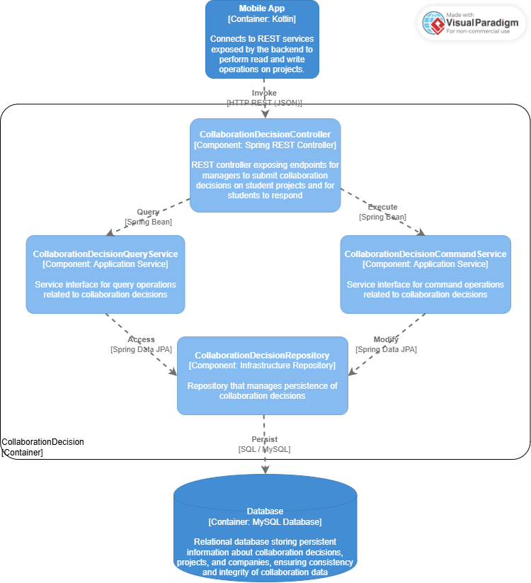

  Elaboración propia

#### 2.6.3.6. Bounded Context Software Architecture Code Level Diagrams

#### 2.6.3.6.1. Bounded Context Domain Layer Class Diagrams

  

    Bounded Context Class Diagram - Elaboración propia

#### 2.6.3.6.2. Bounded Context Database Design Diagrams

  

  Elaboración propia

### 2.6.4. Bounded Context: Student Applications

#### 2.6.4.1. Domain Layer

Define el agregado Application, que encapsula los datos y reglas de negocio de una postulación (estado, fechas, vínculos a estudiante, proyecto y oportunidad), asegurando consistencia a través de Value Objects como ApplicationStatus y métodos de negocio (submit, accept, reject).

#### Aggregate: `Application`
**Descripción:** Representa la postulación de un estudiante a una oportunidad, incluyendo su proyecto asociado y el estado de la postulación.

| Atributos         | Tipo de dato        | Visibilidad | Descripción                                           |
|------------------|-------------------|------------|-----------------------------------------------------|
| applicationId     | Long              | Private    | Identificador único de la postulación             |
| studentId         | Long              | Private    | Identificador del estudiante que postula          |
| opportunityId     | Long              | Private    | Identificador de la oportunidad a la que postula  |
| projectId         | Long              | Private    | Identificador del proyecto que se postula         |
| status            | ApplicationStatus | Private    | Estado de la postulación (`Pending`, `Accepted`, `Rejected`) |
| submissionDate    | Timestamp         | Private    | Fecha de creación de la postulación               |
| lastUpdate        | Timestamp         | Private    | Fecha de última actualización de la postulación   |

### Métodos

| Método                     | Tipo de retorno | Visibilidad | Descripción                                     |
|----------------------------|----------------|------------|------------------------------------------------|
| getApplicationId()         | Long           | Public     | Devuelve el ID de la postulación             |
| getStudentId()             | Long           | Public     | Devuelve el ID del estudiante                 |
| getOpportunityId()         | Long           | Public     | Devuelve el ID de la oportunidad             |
| getProjectId()             | Long           | Public     | Devuelve el ID del proyecto asociado         |
| getStatus()                | ApplicationStatus | Public  | Devuelve el estado actual de la postulación |
| submit()                   | void           | Public     | Cambia el estado de la postulación a `Pending` |
| accept()                   | void           | Public     | Cambia el estado de la postulación a `Accepted` |
| reject()                   | void           | Public     | Cambia el estado de la postulación a `Rejected` |
| getSubmissionDate()        | Timestamp      | Public     | Devuelve la fecha de creación de la postulación |
| getLastUpdate()            | Timestamp      | Public     | Devuelve la fecha de última actualización   |

### Value Objects

| Value Object           | Descripción                                      |
|------------------------|--------------------------------------------------|
| ApplicationStatus       | Representa el estado de la postulación: `Pending`, `Accepted`, `Rejected` |
| ApplicationCriteria     | Contiene los criterios de selección aplicados por la empresa |

#### Interfaz: `ApplicationQueryService`

| Título       | ApplicationQueryService |
|-------------|--------------------------|
| Descripción | Contrato para operaciones de lectura relacionadas con postulaciones de estudiantes |

##### Métodos

| Método                                | Descripción                                                       |
|--------------------------------------|-------------------------------------------------------------------|
| handle(GetApplicationByIdQuery)      | Obtiene los detalles completos de una postulación por su ID       |
| handle(GetAllStudentApplicationsQuery) | Obtiene todas las postulaciones asociadas a un estudiante        |
| handle(GetAllOpportunityApplicationsQuery) | Obtiene todas las postulaciones a una oportunidad              |
| handle(ValidateApplicationOwnershipQuery) | Verifica si un estudiante es propietario de la postulación     |

---

#### Interfaz: `ApplicationCommandService`

| Título       | ApplicationCommandService |
|-------------|-----------------------------|
| Descripción | Contrato para operaciones de escritura relacionadas con postulaciones de estudiantes |

##### Métodos

| Método                               | Descripción                                                   |
|-------------------------------------|---------------------------------------------------------------|
| handle(SubmitApplicationCommand)    | Crea una nueva postulación asociando estudiante, proyecto y oportunidad |
| handle(AcceptApplicationCommand)    | Cambia el estado de la postulación a `Accepted`               |
| handle(RejectApplicationCommand)    | Cambia el estado de la postulación a `Rejected`               |
| handle(DeleteApplicationCommand)    | Elimina una postulación del sistema                           |

#### 2.6.4.2. Interface Layer

Expone un controlador REST (ApplicationController) que traduce las operaciones del dominio en endpoints accesibles al cliente, manejando rutas para crear, aceptar, rechazar o listar postulaciones, y apoyándose en assemblers para transformar entidades y comandos entre el mundo REST y el dominio.

### Controlador: `ApplicationController`

**Título:** ApplicationController  
**Descripción:** Controlador REST que maneja las operaciones CRUD y gestión de postulaciones de estudiantes a oportunidades de empresa.

#### Métodos

| Método                 | Ruta                                       | Descripción                                               |
|------------------------|-------------------------------------------|-----------------------------------------------------------|
| getApplicationById      | GET /api/v1/applications/{id}             | Obtiene los detalles de una postulación específica por su ID |
| getAllStudentApplications | GET /api/v1/applications/student/{studentId} | Obtiene todas las postulaciones de un estudiante        |
| getAllOpportunityApplications | GET /api/v1/applications/opportunity/{opportunityId} | Obtiene todas las postulaciones a una oportunidad      |
| submitApplication       | POST /api/v1/applications                 | Crea una nueva postulación asociando estudiante, proyecto y oportunidad |
| acceptApplication       | POST /api/v1/applications/{id}/accept    | Cambia el estado de la postulación a `Accepted`         |
| rejectApplication       | POST /api/v1/applications/{id}/reject    | Cambia el estado de la postulación a `Rejected`         |
| deleteApplication       | DELETE /api/v1/applications/{id}         | Elimina una postulación del sistema                      |

#### Dependencias

| Dependencia                              | Descripción                                                                 |
|-----------------------------------------|-----------------------------------------------------------------------------|
| ApplicationQueryService                  | Servicio para consultas y recuperación de datos de postulaciones          |
| ApplicationCommandService                | Servicio para ejecutar comandos de creación, aceptación, rechazo y eliminación de postulaciones |
| SubmitApplicationCommandFromResourceAssembler | Convierte recursos REST en comandos de creación de postulaciones         |
| AcceptApplicationCommandFromResourceAssembler | Convierte recursos REST en comandos de aceptación de postulaciones      |
| RejectApplicationCommandFromResourceAssembler | Convierte recursos REST en comandos de rechazo de postulaciones         |
| DeleteApplicationCommandFromResourceAssembler | Convierte recursos REST en comandos de eliminación de postulaciones     |
| ApplicationResourceFromEntityAssembler  | Convierte entidades de postulación en recursos REST para la respuesta     |

#### 2.6.4.3. Application Layer

Implementa los casos de uso a través de ApplicationCommandServiceImpl y ApplicationQueryServiceImpl, orquestando las operaciones sobre el dominio y gestionando el flujo entre la lógica de negocio y las dependencias externas.

#### Clase: `ApplicationQueryServiceImpl`

| Título       | ApplicationQueryServiceImpl |
|-------------|-------------------------------|
| Descripción | Implementación del contrato de consultas definido en el dominio para postulaciones de estudiantes |

##### Dependencias

| Dependencia                      | Descripción                                    |
|----------------------------------|------------------------------------------------|
| ApplicationQueryService          | Contrato definido en dominio                   |
| ApplicationRepository            | Repositorio para acceso a datos de postulaciones |

---

#### Clase: `ApplicationCommandServiceImpl`

| Título       | ApplicationCommandServiceImpl |
|-------------|--------------------------------|
| Descripción | Implementación del contrato de comandos definido en el dominio para postulaciones de estudiantes |

##### Dependencias

| Dependencia                      | Descripción                                    |
|----------------------------------|------------------------------------------------|
| ApplicationCommandService        | Contrato definido en dominio                   |
| ApplicationRepository            | Repositorio para acceso a datos de postulaciones |

#### 2.6.4.4. Infrastructure Layer

Provee la persistencia mediante ApplicationRepository, con operaciones CRUD y consultas específicas por estudiante u oportunidad, conectando las entidades del dominio con la base de datos y gestionando la interacción con clases externas como Student, Project y Opportunity.

### Clase: `ApplicationRepository`

| Título       | ApplicationRepository |
|-------------|----------------------|
| Descripción | Interfaz de persistencia para operaciones CRUD y consultas específicas de postulaciones de estudiantes |

#### Métodos

| Método                 | Descripción                                           |
|------------------------|-------------------------------------------------------|
| save(ApplicationEntity) | Persiste una nueva postulación o actualiza una existente |
| deleteById(Long)        | Elimina una postulación por su ID                   |
| findById(Long)          | Obtiene una postulación por su ID                   |
| findAllByStudentId(Long) | Obtiene todas las postulaciones asociadas a un estudiante |
| findAllByOpportunityId(Long) | Obtiene todas las postulaciones a una oportunidad |

#### Dependencias

| Dependencia         | Propósito                                                   |
|--------------------|--------------------------------------------------------------|
| Student             | Clase que representa al estudiante en el sistema           |
| Opportunity         | Clase que representa la oportunidad en el sistema          |
| Project             | Clase que representa el proyecto asociado a la postulación |
| ApplicationEntity   | Clase que representa la entidad de postulación en la base de datos |

#### 2.6.4.5. Bounded Context Software Architecture Component Level Diagrams

Este diagrama de componentes representa un sistema monolítico que gestiona postulaciones de estudiantes a oportunidades de empresas. Una aplicación Movil interactúa con el `ApplicationController`.

El controlador conecta con `ApplicationQueryService` para consultas y con `ApplicationCommandService` para registrar, aceptar, rechazar o eliminar postulaciones.

Ambos servicios utilizan el `ApplicationRepository`, que gestiona la persistencia mediante JPA en una base de datos MySQL.

  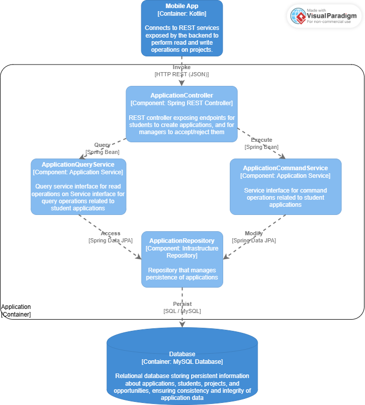

  Elaboración propia

#### 2.6.4.6. Bounded Context Software Architecture Code Level Diagrams

#### 2.6.4.6.1. Bounded Context Domain Layer Class Diagrams

  

    Bounded Context Class Diagram - Elaboración propia

#### 2.6.4.6.2. Bounded Context Database Design Diagrams

  

 

  Elaboración propia

## Conclusiones

**TB1**
- La aplicación InnoSpace responde a una necesidad real: la falta de conexión entre estudiantes con ideas innovadoras y empresas que buscan talento joven y proyectos disruptivos.

- A partir de las entrevistas a estudiantes y gerentes, se confirma que existe interés en una plataforma que ofrezca visibilidad, mentoría, certificaciones y oportunidades de colaboración, aunque persisten preocupaciones sobre la seguridad y la propiedad intelectual.

- El análisis competitivo evidencia que, aunque existen plataformas consolidadas (LinkedIn, AngelList, Behance), ninguna combina de forma exclusiva la dimensión académica–empresarial, lo cual representa un nicho poco explorado.

- El diseño de requerimientos (User Stories, Product Backlog, Journey Maps) y la arquitectura basada en Domain-Driven Design permiten una solución escalable y adaptable, centrada en los dos perfiles principales: estudiantes y gerentes de empresas.

- El proyecto no solo tiene potencial de impacto económico, sino también formativo y social, al fortalecer la empleabilidad, la innovación abierta y la colaboración universidad–empresa.

## Bibliografia

- UNESCO. (2021). La educación superior en América Latina y el Caribe: avances y retos. UNESCO IESALC. https://unesdoc.unesco.org/ark:/48223/pf0000392578.locale=en

- OECD. (2020). Making the Most of Technology for Learning and Training in Latin America. OECD Publishing. https://www.oecd.org/content/dam/oecd/en/publications/reports/2020/06/making-the-most-of-technology-for-learning-and-training-in-latin-america_4029c655/ce2b1a62-en.pdf

- Banco Interamericano de Desarrollo (BID). (2020). El futuro del trabajo en América Latina y el Caribe: ¿Cómo puede la tecnología facilitar la recuperación del empleo tras el COVID-19? BID. https://publications.iadb.org/es/el-futuro-del-trabajo-en-america-latina-y-el-caribe-como-puede-la-tecnologia-facilitar-la

- Organización Internacional del Trabajo (OIT). (2022). Perspectivas Sociales y del Empleo en el Mundo: Tendencias 2022. OIT. https://www.ilo.org/sites/default/files/wcmsp5/groups/public/%40dgreports/%40dcomm/%40publ/documents/publication/wcms_848464.pdf

## Anexos

