<h1 align="center">Informe de Trabajo Final</h1>

<p align="center">
  
</p>

**Universidad Peruana de Ciencias Aplicadas**

**Ingeniería de Software**

**Ciclo 2025-02**

**Código del curso:** 1ACC0238

**Nombre del curso:** Aplicaciones para Dispositvos Móviles

**NRC:** 1795

**Nombre del profesor:** Jorge Luis Mayta Guillermo

**Nombre del Startup:** UniPafi

**Nombre del Producto:** InnoSpace

### Relación de Integrantes

| **Código** | **Apellidos y Nombres**             |
| ---------- | ----------------------------------- |
| U202310988 | Andrea Elizabeth, Santur Tello     |
| U202313172 | Carlos Andres, Coca Lavado |
| U20211B293 | Diego Ivan, Cabrera Buitron, |
| U20231A500 | Erick Leonardo, Palomino Fiestas    |
| U20231D974 | Renzo Sebastian, Rivera Ratachi     |


**Noviembre 2025**

<br>

**Registro de Versiones del Informe**

<br>

<table align="center">
  <tr>
    <td><strong>Versión</strong></td>
    <td><strong>Fecha</strong></td>
    <td><strong>Autor(es)</strong></td>
    <td><strong>Descripción de cambios</strong></td>
  </tr>
  <tr>
    <td>1.00</td>
    <td>02/09/25</td>
    <td>
    Rivera
    </td>
    <td>Creación del documento en markdown.</td>
  </tr>
  <tr>
    <td>1.01</td>
    <td>05/09/25</td>
    <td>
    Rivera,<br>
    Palomino,<br>
    Coca,<br>
    Cabrera, Santur
    </td>
    <td>Creacion del Descripcion del Startup y perfil de los integrantes.</td>
  </tr>
  <tr>
    <td>1.02</td>
    <td>09/09/25</td>
    <td>
    Rivera,<br>
    Palomino,<br>
    Coca,<br>
    Cabrera, Santur
    </td>
    <td>Creación Antecedentes y problematica, ademas del Lean UX Proccess y la descripcion de los segmentos objetivos.</td>
  </tr>
  <tr>
    <td>1.03</td>
    <td>14/09/25</td>
    <td>
    Rivera,<br>
    Palomino,<br>
    Coca,<br>
    Cabrera, Santur
    </td>
    <td>Creacion del analis competitivo, estrategias y tacticas frenete a los competidores, ademas se realizaron las entrevistas, todo el apartado del Needfinding y del Ubiquitous Language.</td>
  </tr>
  <tr>
    <td>1.04</td>
    <td>18/09/25</td>
    <td>
    Rivera,<br>
    Palomino,<br>
    Coca,<br>
    Cabrera, Santur
    </td>
    <td>Creación del EventStorming, Context Mapping, Software Architecture y del Tactical-Level Domain-Driven Desing de los Bounded Context.</td>
  </tr>
  <tr>
    <td>2.00</td>
    <td>24/09/25</td>
    <td>
    Rivera
    </td>
    <td>Creacion de la plantilla a utilizar para completar el documento</td>
  </tr>
  <tr>
    <td>2.01</td>
    <td>29/09/25</td>
    <td>
    Rivera,<br>
    Palomino,<br>
    Coca
    </td>
    <td>Realizacion del Style Guidelines y Information Architecture, ademas de el planteamiento del diseño del Landing Page UI Desing</td>
  </tr>
  <tr>
    <td>2.02</td>
    <td>03/10/25</td>
    <td>
    Rivera,<br>
    Cabrera, Santur
    </td>
    <td>Realizacion de los Wireframes y Mockups de la aplicación mobile con su respectivo flujo. Ademas de la grabacion del prototipado</td>
  </tr>
  <tr>
    <td>2.03</td>
    <td>06/10/25</td>
    <td>
    Cabrera,<br>
    Santur
    </td>
    <td>Se realizo el apartado de Software Configuration Management y correcciones de versiones anteriores</td>
  </tr>
  <tr>
    <td>2.04</td>
    <td>09/10/25</td>
    <td>
    Rivera,<br>
    Palomino,<br>
    Coca
    </td>
    <td>Realización del Sprint 1 y las entrevistas de validacion con su evaluación segun heuristicas</td>
  </tr>
</table>

<br>

## Project Report Collaboration Insights

**Integrantes:**

+ Andrea Santur (andreli-star)

+ Erick Palomino(ErickLeo13)

+ Renzo Rivera(renzor11)

+ Carlos Coca(MrAndres08DV)

+ Diego Cabrera(omele7)

## TB1

<p align="center">
  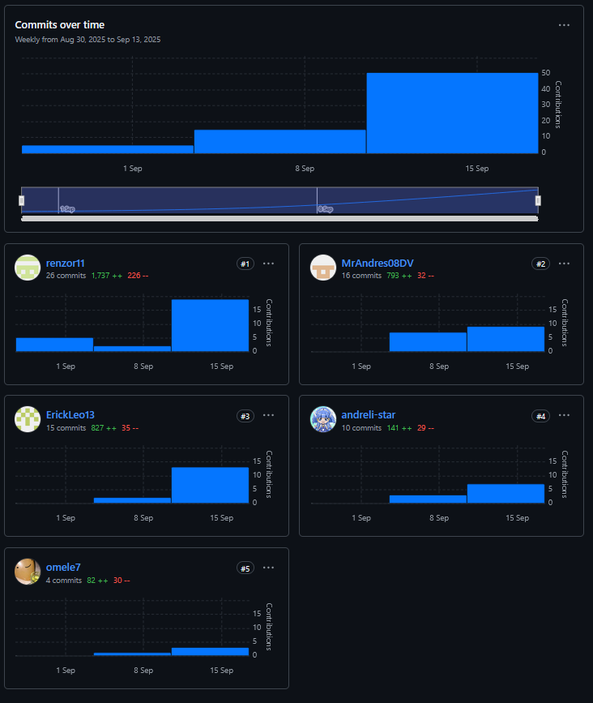
</p>


<p align="center">
  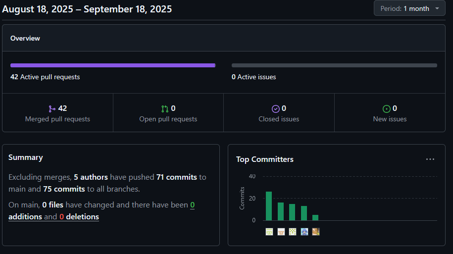
</p>

<p align="center">
  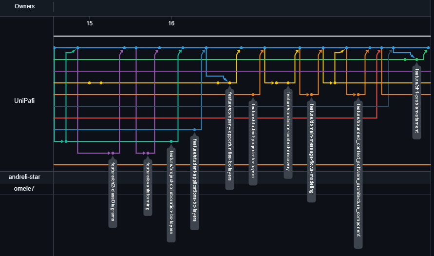
</p>


---

## Contenido

- [Student Outcome](#student-outcome)
- [Capítulo I: Introducción](#capítulo-i-introducción)

  - [1.1. Startup Profile](#11-startup-profile)
    - [1.1.1. Descripción de la Startup](#111-descripción-de-la-startup)
    - [1.1.2. Perfiles de integrantes del equipo](#112-perfiles-de-integrantes-del-equipo)
  - [1.2. Solution Profile](#12-solution-profile)
    - [1.2.1. Antecedentes y problemática](#121-antecedentes-y-problemática)
    - [1.2.2. Lean UX Process](#122-lean-ux-process)
      - [1.2.2.1. Lean UX Problem Statements](#1221-lean-ux-problem-statements)
      - [1.2.2.2. Lean UX Assumptions](#1222-lean-ux-assumptions)
      - [1.2.2.3. Lean UX Hypothesis Statements](#1223-lean-ux-hypothesis-statements)
      - [1.2.2.4. Lean UX Canvas](#1224-lean-ux-canvas)
  - [1.3. Segmentos objetivo](#13-segmentos-objetivo)

- [Capítulo II: Requirements Development and Software Solution Design](#capítulo-ii-requirements-development-and-software-solution-design)
  - [2.1. Competidores](#21-competidores)
    - [2.1.1. Análisis competitivo](#211-análisis-competitivo)
    - [2.1.2. Estrategias y tácticas frente a competidores](#212-estrategias-y-tácticas-frente-a-competidores)

  - [2.2. Entrevistas](#22-entrevistas)
    - [2.2.1. Diseño de entrevistas](#221-diseño-de-entrevistas)
    - [2.2.2. Registro de entrevistas](#222-registro-de-entrevistas)
    - [2.2.3. Análisis de entrevistas](#223-análisis-de-entrevistas)
  - [2.3. Needfinding](#23-needfinding)
    - [2.3.1. User Personas](#231-user-personas)
    - [2.3.2. User Task Matrix](#232-user-task-matrix)
    - [2.3.3. User Journey Mapping](#233-user-journey-mapping)
    - [2.3.4. Empathy Mapping](#234-empathy-mapping)
    - [2.3.5. Ubiquitous Language](#235-ubiquitous-language)
  - [2.4. Requirements Specification](#24-requirements-specification)
    - [2.4.1. User Stories](#241-user-stories)
    - [2.4.2. Impact Mapping](#242-impact-mapping)
    - [2.4.3. Product Backlog](#243-product-backlog)
  - [2.5. Strategic-Level Domain-Driven Design](#25-Strategic-level-domain-driven-design)
    - [2.5.1. EventStorming](#251-eventstorming)
      - [2.5.1.1. Candidate Context Discovery](#2511-Candidate-Context-Discovery)
      - [2.5.1.2. Domain Message Flows Modeling](#2512-domain-message-flows-modeling)
      - [2.5.1.3. Bounded Context Canvases](#2513-bounded-context-canvases)
    - [2.5.2. Context Mapping](#252-context-mapping)
    - [2.5.3. Software Architecture](#253-software-architecture)
      - [2.5.3.1. Software Architecture Context Level Diagrams](#2531-software-architecture-context-level-diagrams)
      - [2.5.3.2. Software Architecture Container Level Diagrams](#2532-software-architecture-container-level-diagrams)
      - [2.5.3.3. Software Architecture Deployment Diagrams](#2533-software-architecture-deployment-diagrams)
  - [2.6. Tactical-Level Domain-Driven Design](#26-tactical-level-domain-driven-design)

    - [2.6.1. Bounded Context: Student Projects](#261-bounded-context-student-projects)
      - [2.6.1.1. Domain Layer](#2611-domain-layer)
      - [2.6.1.2. Interface Layer](#2612-interface-layer)
      - [2.6.1.3. Application Layer](#2613-application-layer)
      - [2.6.1.4. Infrastructure Layer](#2614-infrastructure-layer)
      - [2.6.1.5. Bounded Context Software Architecture Component Level Diagrams](#2615-bounded-context-software-architecture-component-level-diagrams)
      - [2.6.1.6. Bounded Context Software Architecture Code Level Diagrams](#2616-bounded-context-software-architecture-code-level-diagrams)
        - [2.6.1.6.1. Bounded Context Domain Layer Class Diagrams](#26161-bounded-context-domain-layer-class-diagrams)
        - [2.6.1.6.2. Bounded Context Database Design Diagram](#26162-bounded-context-database-design-diagrams)

    - [2.6.2. Bounded Context: Company Opportunities](#262-bounded-context-company-opportunities)
      - [2.6.2.1. Domain Layer](#2621-domain-layer)
      - [2.6.2.2. Interface Layer](#2622-interface-layer)
      - [2.6.2.3. Application Layer](#2623-application-layer)
      - [2.6.2.4. Infrastructure Layer](#2624-infrastructure-layer)
      - [2.6.2.5. Bounded Context Software Architecture Component Level Diagrams](#2625-bounded-context-software-architecture-component-level-diagrams)
      - [2.6.2.6. Bounded Context Software Architecture Code Level Diagrams](#2626-bounded-context-software-architecture-code-level-diagrams)
        - [2.6.2.6.1. Bounded Context Domain Layer Class Diagrams](#26261-bounded-context-domain-layer-class-diagrams)
        - [2.6.2.6.2. Bounded Context Database Design Diagrams](#26262-bounded-context-database-design-diagrams)

    - [2.6.3. Bounded Context: Project Collaboration](#263-bounded-context-project-collaboration)
      - [2.6.3.1. Domain Layer](#2631-domain-layer)
      - [2.6.3.2. Interface Layer](#2632-interface-layer)
      - [2.6.3.3. Application Layer](#2633-application-layer)
      - [2.6.3.4. Infrastructure Layer](#2634-infrastructure-layer)
      - [2.6.3.5. Bounded Context Software Architecture Component Level Diagrams](#2635-bounded-context-software-architecture-component-level-diagrams)
      - [2.6.3.6. Bounded Context Software Architecture Code Level Diagrams](#2636-bounded-context-software-architecture-code-level-diagrams)
        - [2.6.3.6.1. Bounded Context Domain Layer Class Diagrams](#26361-bounded-context-domain-layer-class-diagrams)
        - [2.6.3.6.2. Bounded Context Database Design Diagrams](#26362-bounded-context-database-design-diagrams)

    - [2.6.4. Bounded Context: Student Applications](#264-bounded-context-student-applications)
      - [2.6.4.1. Domain Layer](#2641-domain-layer)
      - [2.6.4.2. Interface Layer](#2642-interface-layer)
      - [2.6.4.3. Application Layer](#2643-application-layer)
      - [2.6.4.4. Infrastructure Layer](#2644-infrastructure-layer)
      - [2.6.4.5. Bounded Context Software Architecture Component Level Diagrams](#2645-bounded-context-software-architecture-component-level-diagrams)
      - [2.6.4.6. Bounded Context Software Architecture Code Level Diagrams](#2646-bounded-context-software-architecture-code-level-diagrams)
        - [2.6.4.6.1. Bounded Context Domain Layer Class Diagrams](#26461-bounded-context-domain-layer-class-diagrams)
        - [2.6.4.6.2. Bounded Context Database Design Diagram](#26462-bounded-context-database-design-diagrams)

- [Capítulo III: Solution UI/UX Design](#capítulo-iii-solution-uiux-design)

  - [3.1. Product Design](#31-product-design)
    - [3.1.1. Style Guidelines](#311-style-guidelines)
      - [3.1.1.1. General Style Guidelines](#3111-general-style-guidelines)
    - [3.1.2. Information Architecture](#312-information-architecture)
      - [3.1.2.1. Organization Systems](#3121-organization-systems)
      - [3.1.2.2. Labelling Systems](#3122-labelling-systems)
      - [3.1.2.3. SEO Tags and Meta Tags](#3123-seo-tags-and-meta-tags)
      - [3.1.2.4. Searching Systems](#3124-searching-systems)
      - [3.1.2.5. Navigation Systems](#3125-navigation-systems)
    - [3.1.3. Landing Page UI Design](#313-landing-page-ui-design)
      - [3.1.3.1. Landing Page Wireframe](#3131-landing-page-wireframe)
      - [3.1.3.2. Landing Page Mock-up](#3132-landing-page-mock-up)
    - [3.1.4. Mobile Applications UX/UI Design](#314-mobile-applications-uxui-design)
      - [3.1.4.1. Mobile Applications Wireframes](#3141-mobile-applications-wireframes)
      - [3.1.4.2. Mobile Applications Wireflow Diagrams](#3142-mobile-applications-wireflow-diagrams)
      - [3.1.4.3. Mobile Applications Mock-ups](#3143-mobile-applications-mock-ups)
      - [3.1.4.4. Mobile Applications User Flow Diagrams](#3144-mobile-applications-user-flow-diagrams)
      - [3.1.4.5. Mobile Applications Prototyping](#3145-mobile-applications-prototyping)

- [Capítulo IV: Product Implementation & Validation](#capítulo-iv-product-implementation--validation)

  - [4.1. Software Configuration Management](#41-software-configuration-management)
    - [4.1.1. Software Development Environment Configuration](#411-software-development-environment-configuration)
    - [4.1.2. Source Code Management](#412-source-code-management)
    - [4.1.3. Source Code Style Guide & Conventions](#413-source-code-style-guide--conventions)
    - [4.1.4. Software Deployment Configuration](#414-software-deployment-configuration)

  - [4.2. Landing Page & Mobile Application Implementation](#42-landing-page--mobile-application-implementation)
    - [4.2.1. Sprint 1](#421-sprint-1)
      - [4.2.1.1. Sprint Planning 1](#4211-sprint-planning-1)
      - [4.2.1.2. Sprint Backlog 1](#4212-sprint-backlog-1)
      - [4.2.1.3. Development Evidence for Sprint Review](#4213-development-evidence-for-sprint-review)
      - [4.2.1.4. Testing Suite Evidence for Sprint Review](#4214-testing-suite-evidence-for-sprint-review)
      - [4.2.1.5. Execution Evidence for Sprint Review](#4215-execution-evidence-for-sprint-review)
      - [4.2.1.6. Services Documentation Evidence for Sprint Review](#4216-services-documentation-evidence-for-sprint-review)
      - [4.2.1.7. Software Deployment Evidence for Sprint Review](#4217-software-deployment-evidence-for-sprint-review)
      - [4.2.1.8. Team Collaboration Insights during Sprint](#4218-team-collaboration-insights-during-sprint)

  - [4.3. Validation Interviews](#43-validation-interviews)
    - [4.3.1. Diseño de Entrevistas](#431-diseño-de-entrevistas)
    - [4.3.2. Registro de Entrevistas](#432-registro-de-entrevistas)
    - [4.3.3. Evaluaciones según heurísticas](#433-evaluaciones-según-heurísticas)


- [Conclusiones](#conclusiones)
- [Bibliografía](#bibliografía)
- [Anexos](#anexos)

---
## Student Outcome

<table align="center">
  <tr>
    <td><strong>Criterio</strong></td>
    <td><strong>Acciones Realizadas</strong></td>
    <td><strong>Conclusiones</strong></td>
  </tr>

  <tr>
    <td>
      Actualiza conceptos y conocimientos necesarios para su desarrollo profesional y en especial para su proyecto en soluciones de software.
    </td>
    <td>
      <strong>Santur Tello, Andrea Elizabeth:</strong><br>
      TB1 – Participación en Eventstorming, entrevistas, arquitectura de software (Context, Container, Deployment), Lean UX Problem Statements y Assumptions, y creación del lenguaje ubicuo.<br><br>
      TP1 – Desarrollo de wireframes móviles, entrevistas de validación, guía de estilos y convenciones, configuración del despliegue y definición del Sprint Backlog 1.<br><br>
      <strong>Palomino Fiestas, Erick Leonardo:</strong><br>
      TB1 – Eventstorming, análisis de competidores, entrevistas, diagramas de Bounded Context y elaboración de User Stories.<br><br>
      TP1 – Desarrollo de la aplicación móvil en Kotlin, backend y landing page; diseño de wireframes, mockups y sistemas de navegación y búsqueda.<br><br>
      <strong> Rivera Ratachi, Renzo Sebastián:</strong><br>
      TB1 – Elaboración de Solution Profile, Startup Profile, User Journey y Empathy Mapping, Eventstorming y Bounded Context Canvases.<br><br>
      TP1 – Diseño de mockups y prototipos, definición de user flows, evidencia de despliegue del Sprint 1, desarrollo de endpoints y configuración del backend.<br><br>
      <strong>Coca Lavado, Carlos Andrés:</strong><br>
      TB1 – Entrevistas, definición de User Stories, Product Backlog y creación de User Personas.<br><br>
      TP1 – Entrevistas de validación, desarrollo en Kotlin, Labeling System, análisis de entrevistas y evaluación heurística.<br><br>
      <strong>Cabrera Buitrón, Diego Iván:</strong><br>
      TB1 – Participación en Eventstorming, análisis de antecedentes y diseño de diagramas de base de datos.<br><br>
      TP1 – Desarrollo de wireframes y wireflows móviles, configuración del entorno de desarrollo y gestión de configuración del software.<br><br>
    </td>
    <td>
      TB1 – El equipo aplicó con éxito nuevos conceptos de ingeniería de software, integrando herramientas como Eventstorming, Lean UX y diseño de arquitectura. Cada miembro reforzó su conocimiento técnico y aportó al desarrollo de soluciones bien estructuradas.<br><br>
      TP1 – Se evidenció una evolución técnica en las áreas de desarrollo móvil, backend y despliegue. Los integrantes aplicaron nuevos aprendizajes para mejorar la calidad del proyecto, consolidando sus competencias profesionales en entornos reales de desarrollo.
    </td>
  </tr>
  <tr>
    <td>
      Reconoce la necesidad del aprendizaje permanente para el desempeño profesional y el desarrollo de proyectos en soluciones de software.
    </td>
    <td>
      <strong>Santur Tello, Andrea Elizabeth:</strong><br>
      TB1 – Aplicación de nuevos métodos de análisis y diseño colaborativo mediante Lean UX y arquitectura de software.<br><br>
      TP1 – Adopción de prácticas de validación, configuración de despliegue y guía de estilos, reforzando su capacidad de aprendizaje continuo.<br><br>
      <strong>Palomino Fiestas, Erick Leonardo:</strong><br>
      TB1 – Aprendizaje en técnicas de análisis de competidores, entrevistas y diseño estructural del sistema.<br><br>
      TP1 – Fortalecimiento de habilidades en desarrollo full stack y mejora de la experiencia de usuario mediante prototipos funcionales.<br><br>
      <strong>Rivera Ratachi, Renzo Sebastián:</strong><br>
      TB1 – Adquisición de conocimientos en modelado de dominio, arquitectura modular y documentación técnica.<br><br>
      TP1 – Aprendizaje práctico en despliegue, endpoints y prototipado, demostrando autonomía en la aplicación de nuevas herramientas.<br><br>
      <strong>Coca Lavado, Carlos Andrés:</strong><br>
      TB1 – Implementación de metodologías centradas en el usuario y gestión del backlog.<br><br>
      TP1 – Profundización en validación, heurísticas y desarrollo móvil, con actitud constante de mejora.<br><br>
      <strong>Cabrera Buitrón, Diego Iván:</strong><br>
      TB1 – Consolidación de conocimientos en análisis de datos y modelado de base de datos.<br><br>
      TP1 – Aprendizaje en gestión de configuración y entornos de desarrollo colaborativos.<br><br>
    </td>
    <td>
      TB1 – El grupo evidenció una actitud proactiva hacia el aprendizaje, asimilando nuevas herramientas y metodologías con efectividad. Cada miembro demostró disposición por mejorar continuamente sus capacidades técnicas.<br><br>
      TP1 – Los integrantes fortalecieron su mentalidad de aprendizaje permanente, integrando nuevas prácticas en diseño, desarrollo y despliegue. El trabajo colaborativo y la actualización constante fueron claves para el progreso del proyecto y su crecimiento profesional.
    </td>
  </tr>
</table>


## Objetivos SMART

**Palomino Fiestas Erick Leonardo**

Objetivo 1: Obtener un puesto como desarrollador backend en una empresa de tecnología y, a la par, fortalecer mis competencias en desarrollo fullstack. Para lograrlo, me propongo alcanzar al menos dos certificaciones reconocidas en estas áreas y dedicar un mínimo de seis horas semanales a proyectos personales.

Objetivo 2: Desarrollar las competencias necesarias en ciberseguridad y liderazgo que me permitan ingresar en este sector de seguridad. Para ello, planeo obtener certificados especializados en ciberseguridad, invirtiendo horas en estudios y actividades vinculadas a comunidades tecnológicas. Este objetivo lo proyecto en un plazo de cuatro años tras la graduación, con el fin de sentar las bases de un crecimiento profesional.

**Coca Lavado Carlos Andrés**

Objetivo 1: Desarrollar y lanzar una interfaz de usuario intuitiva para la plataforma InnoSpace con el objetivo de mejorar la experiencia de los usuarios, asegurando que los usuarios registrados tengan una navegación intuitiva y fluida en la aplicación.

Objetivo 2: Adquirir conocimientos y experiencia en el desarrollo de aplicaciones móviles, con el fin de seguir mejorando respecto a la accesibilidad y experiencia de usuario, mientras continúo desarrollando mis habilidades técnicas y profesionales en el ámbito del desarrollo móvil.

**Rivera Ratachi Renzo Sebastian**

Objetivo 1: Especializarme en seguridad de aplicaciones móviles, aplicando técnicas de pentesting y auditoría para garantizar la protección de datos, logrando en 3 años obtener experiencia práctica en al menos 2 proyectos de pruebas de seguridad.

Objetivo 2: Desarrollar una carrera en ciberseguridad dentro del área de Blue Team y DFIR, alcanzando en 5 años certificaciones reconocidas internacionalmente que respalden mi perfil profesional.

**Santur Tello Andrea Elizabeth**

Objetivo 1: Especializarme en el desarrollo de aplicaciones móviles multiplataforma, logrando en 2 años dominar frameworks como Flutter o React Native para mejorar proyectos como InnoSpace.

Objetivo 2: Fortalecer mi experiencia en diseño y despliegue de apps móviles, participando en al menos 3 implementaciones reales en los próximos 3 años para consolidar mis habilidades profesionales.


**Cabrera Buitron Diego Ivan**

Objetivo 1: Implementar y validar los módulos de gestión de proyectos estudiantiles en la plataforma InnoSpace, de modo que al finalizar el ciclo académico al menos el 70% de los estudiantes registrados pueda crear, publicar y actualizar sus proyectos de forma exitosa, contribuyendo a la construcción de su portafolio profesional.

Objetivo 2: Fortalecer mis competencias técnicas en arquitectura de software basada en Domain-Driven Design (DDD) y el desarrollo de APIs RESTful con persistencia en MySQL, aplicando buenas prácticas de ingeniería durante el ciclo académico, para consolidar mi perfil como futuro ingeniero de software especializado en backend y diseño de soluciones escalables.


## Capítulo I: Introducción

### 1.1. Startup Profile

#### 1.1.1. Descripción de la Startup

UniPafi es una startup tecnológica que busca convertirse en un referente en la vinculación entre el talento joven y el ecosistema empresarial. Nacemos con la convicción de que la innovación no surge únicamente en los laboratorios corporativos, sino también en las aulas, los proyectos académicos y las ideas emergentes de estudiantes con visión de futuro. Desde Unipafi impulsamos un modelo de colaboración que une creatividad, impacto social y desarrollo profesional, construyendo un espacio en el que la innovación y el talento se encuentren para transformar realidades.

**Visión:**

En 4 años, consolidarnos como la startup líder en Latinoamérica en la creación de puentes entre universidades y empresas, reconocidos por fomentar el talento emergente, la innovación colaborativa y el crecimiento sostenible.

**Misión:**

Promover el desarrollo profesional de estudiantes universitarios y recién egresados a través de la creación de espacios donde puedan conectar con organizaciones, demostrar sus capacidades y generar soluciones de alto impacto que aporten al progreso económico y social.

#### 1.1.2. Perfiles de integrantes del equipo

<table border="1">
  <thead>
    <tr>
      <th>Fotos del Integrantes</th>
      <th>Nombres y Apellidos</th>
      <th>Código de estudiante</th>
      <th>Conocimiento técnicos y hablidades </th>
    </tr>
  </thead>
  <tbody>
    <tr>
      <td></td>
      <td>Palomino Fiestas, Erick Leonardo</td>
      <td>U20231A500</td>
      <td>Hola, Soy Erick Leonardo Palomino Fiestas, un estudiante entusiasta de sexto ciclo en Ingeniería de Software. Mi conjunto de habilidades técnicas incluye C++, HTML, CSS, fundamentos de JavaScript y experiencia con bases de datos SQL y MongoDB. Me considero una persona responsable, con sólidas habilidades de comunicación para trabajar en equipo y una perspectiva optimista. También tengo un nivel básico de inglés. </td>
    </tr>
      <tr>
      <td></td>
      <td>Renzo Sebastian Rivera Ratachi</td>
      <td>U20231D974</td>
      <td>Soy Renzo Sebastian Rivera Ratachi y soy estudiante de la carrera de Ingeniería de Software. Actualmente estoy cursando el 6to ciclo de mi carrera y tengo conocimientos intermedios de HTML, CSS, JavaScript y C++. Me considero una persona responsable y puntual. </td>
    </tr>
    <tr>
      <td></td>
      <td>Carlos Andres Coca Lavado</td>
      <td>U202313172</td>
      <td>Mi Nombre es Carlos Andrés Coca, tengo 19 años, actualmente me encuentro cursando el sexto ciclo de la carrera de Ingeniería de Software. Cuento con conocimientos en C++, Python y HTML. y desde muy joven me ha interesado la ciberseguridad y el desarrollo de Software. Teniendo en cuenta el gran impacto que presentan a día de hoy.  </td>
    </tr>
    <tr>
      <td></td>
      <td>Andrea Elizabeth Santur Tello </td>
      <td>U202310988</td>
      <td>Estoy cursando el sexto ciclo de mi carrera Ingeniería de Software, soy una persona responsable que le gusta resolver desafíos a la par con el trabajo responsable y en equipo tengo la capacidad de líder y me gusta aprender nuevas cosas dia a dia.</td>
    </tr>
    <tr>
      <td></td>
      <td>Diego Ivan Cabrera Buitron </td>
      <td>U20211B293</td>
      <td>Estoy cursando el sexto ciclo de mi carrera Ingeniería de Software, soy una persona responsable que le gusta resolver desafíos a la par con el trabajo responsable y en equipo tengo la capacidad de líder y me gusta aprender nuevas cosas dia a dia.</td>
    </tr>
  </tbody>
</table>


### 1.2. Solution Profile

#### 1.2.1. Antecedentes y problemática

Who (¿Quién?)

Los principales actores son los estudiantes universitarios y recién egresados, quienes constituyen una fuente de talento emergente con alto potencial de innovación. Según la UNESCO (2021), en América Latina la población joven representa más del 25% de la población total, un grupo estratégico para impulsar el desarrollo económico. A ello se suman las empresas, que requieren perfiles creativos e innovadores para mantenerse competitivas, pero carecen de canales efectivos para conectarse con este talento (OECD, 2020). Finalmente, la sociedad en general se ve afectada, pues el desaprovechamiento de estas capacidades limita el desarrollo económico y social de la región.

What (¿Qué?)

El problema central es la ausencia de un modelo articulado y sostenible que vincule el talento joven con el ecosistema empresarial. Si bien existen mecanismos como pasantías, ferias laborales o incubadoras, estos son parciales y no garantizan una conexión efectiva. De acuerdo con el Banco Interamericano de Desarrollo (BID, 2019), gran parte de las ideas innovadoras generadas en las universidades no logra convertirse en soluciones aplicables al mercado o a la sociedad, generando una pérdida de capital humano y creativo.

Where (¿Dónde?)

La problemática se da especialmente en Latinoamérica, una región con gran cantidad de jóvenes que enfrentan altas tasas de desempleo y subempleo. Además, los sistemas educativos suelen estar desalineados de las necesidades laborales, lo que genera una desconexión entre la formación académica y las competencias que demandan las empresas.

When (¿Cuándo?)

Este es un problema vigente en la actualidad y que se ha intensificado en los últimos años con la digitalización, la globalización y los cambios en los modelos de trabajo. Las demandas del mercado evolucionan más rápido que los sistemas educativos, lo que amplía la brecha entre lo que aprenden los estudiantes y lo que necesitan las organizaciones.

Why (¿Por qué?)

- Los planes de estudio universitarios no se actualizan con suficiente rapidez frente a las demandas del mercado.

- Los mecanismos tradicionales de empleabilidad, como ferias laborales, no permiten demostrar plenamente el potencial innovador de los jóvenes (BID, 2019).

- Las empresas carecen de canales efectivos para conectarse con talento emergente de forma dinámica y sostenible (OECD, 2020).

How (¿Cómo?)

- La conexión actual se limita a prácticas profesionales, incubadoras o programas aislados.

- Estas iniciativas no cuentan con alcance regional ni continuidad suficiente.

- Como consecuencia, gran parte del talento joven se desaprovecha y sus proyectos no logran trascender más allá de las aulas.

How Much (¿Cuánto?)

Actualmente, miles de estudiantes universitarios y recién egresados en Latinoamérica no cuentan con canales efectivos para vincularse con las empresas y demostrar su talento. En Latinoamérica, miles de estudiantes y egresados carecen de oportunidades para vincularse con empresas de manera efectiva, limitando sus perspectivas profesionales. La OIT (2022) estima que esta desconexión afecta directamente el desarrollo de competencias y reduce la productividad regional. Para cerrar esta brecha, UniPafi plantea el desarrollo de una aplicación móvil que facilite la vinculación entre talento universitario y empresas.

Desarrollo de la App Móvil

- Diseño UI/UX y desarrollo multiplataforma: S/ 3,000 – S/ 4,500

- Backend y API de conexión con empresas: S/ 1,200 – S/ 2,000

- Servidores, dominio y hosting (anual): S/ 500 – S/ 900

Marketing y Alianzas

- Campañas en redes y universidades: S/ 800 – S/ 1,200

Mantenimiento y Soporte

- Actualizaciones y mejoras (anual): S/ 1,200 – S/ 2,000

Total Estimado Inicial: S/ 6,700 – S/ 10,600 

#### 1.2.2. Lean UX Process

##### 1.2.2.1. Lean UX Problem Statements

El propóstivo de InnoSpace es ser el puente entre el mundo académico y el empresarial en el Perú.

En el cual, por un lado, los estudiantes y profesores universitarios, quienes podrán subir proyectos, investigaciones, tesis o ideas innovadoras. Además, podrán explorar retos reales publicados por empresas y organizaciones, con la posibilidad de trabajar y mostrar su talento en un entorno competitivo y profesional.

Por otro lado, las empresas, ingenieros, administradores, técnicos y médicos, quienes podrán publicar problemas o necesidades que enfrenta su sector. De esta manera podrán tener acceso a un ecosistema de propuestas frescas e innovadoras de estudiantes y docentes, con lo que podrán evaluar un financiamiento o contratar soluciones concretas.

Y ante esta problemática nos surge la siguiente pregunta: ¿Cómo podríamos hacer que las personas universitarias puedan tener un ámbito laboral y estable, sin importar en el sector en el que estén?

- Domain: Personas con una visión laboral en base a la Universidad en la que se encuentran.
- Customer Segments: Estudiantes y profesores de una Universidad, que quieren dar el salto del estudio al centro laboral.
- Pain Points: Falta de personal joven que quieran tener un futuro en el ámbito laboral, falta de atención en el mundo laboral y bajos recursos para contratar profesionales de buen desempeño individual.
- Gap: No existe una solución en el mercado que se dedique al conocimiento y a la conexión entre personas universitarias y el ámbito laboral. Así como también, las empresas requieren de personal joven para mantener una estabilidad económica aceptable.
- Vision/Strategy: Crear una plataforma accesible cuyos estudiantes y profesores de una Universidad, puedan darse a conocer mediante sus trabajos, tesis, asignaciones y que tengan oportunidad en el mundo laboral, obteniendo múltiples propuestas.
- Initial Segment: Estudiantes y profesores universitarios que buscan dar el paso entre la Universidad y el centro laboral, también, contar con empresas de peso, para la contratación de nuevo personal.

##### 1.2.2.2. Lean UX Assumptions

##### Business Assumptions<br/><br/>
1. **Creo en que nuestros usuarios,** ya sean estudiantes o profesores universitarios, puedan dar el gran paso desde la Universidad a un centro laboral.

2. **Estas necesidades se pueden satisfacer** una plataforma web que conecte a estudiantes y profesores lanzando sus materiales importantes a personas que quieran sobresalir.

3. **Nuestros clientes iniciales serán** estudiantes y profesores universitarios, de carreras al azar, que buscan un trabajo en cualquier empresa.

4. **El valor más importante que un cliente quiere de nuestros servicios es** poder conseguir trabajos y publicar sus logros y materiales anteriores para poder tener un historial llamativo.

5. **El cliente también va a obtener** flexibilidad de horarios, ingresos adicionales, desarrollo de habilidades blandas y validación en su perfil.

6. **Se va a obtener a la gran mayoría de clientes mediante** las redes sociales (Facebook, X, Instagram, TikTok), alianzas con empresas peruanas e internacionales y campañas digitales en varios foros universitarios.

7. **Se van a obtener ingresos mediante** comisiones por publicación de materiales u obtener una suscripción permium para empresas de mayor jerarquía.

8. **Nuestra competencia en el mercado serán** plataformas como Indeed, LinkedIn Jobs, Glassdoor, etc.

9. **Vamos a tener ventaja frente a nuestra competencia debido a** que estamos centrados en el mercado nacional e internacional, sin barreras como un título o años de experiencia.

10. **El mayor riesgo del servicio es** la baja participación de estudiantes y profesores o la desconfianza de las empresas en contratar a personal sin tener preparación seria.

11. **Lo resolveremos realizando** incentivos por primeras contrataciones, sistema de reputación de candidatos, alianzas con universidades y empresas y casos de éxito visible.

12. **Otro riesgo que debemos considerar es que** los estudiantes y los profesores no tengan el tiempo, ni la motivación para postularse para otros centros laborales durante su carrera.


##### User Assumptions<br/><br/>
1. <b>¿Quién es el usuario?</b>

Estudiantes y profesores universitarios, con habilidades en los centros laborales, que apuntan a un futuro mejor y además, de contar con un trabajo en una empresa mostrando sus trabajos, tesis y demás.

2. <b>¿Dónde encaja nuestro producto en su vida?</b>

Durante la última etapa universitaria. Permitiendo aplicar conocimientos en proyectos reales, ganar reputación y generar ingresos.

3. <b>¿Qué problemas resuelve nuestro producto?</b>

InnoBridge se centra en resolver problemas como: Validación de trabajos y tesis, obtener oportunidades laborales a nivel nacional e internacional, poca preocupación en los nuevos empleados a las empresas, falta de contratación de plantel por bajos recursos.

4. <b>¿Cuándo y cómo se usa nuestro producto?</b>

En el tiempo libre de los estudiantes y profesores, acceden a la aplicación, crean su perfil, suben sus trabajos, tesis y más, buscan oportunidades mediante esos archivos y se visualizan las empresas de quienes están interesados por contar con dicha persona.

5. <b>¿Qué características son importantes?</b>

- Interfaz sencilla y fácil de aprender.
- Filtro de búsqueda de habilidades.
- Sistema de reputación.
- Mensajes internos.
- Perfil con insignias.

6. <b>¿Cómo debería lucir y comportarse el producto?</b>

Debe ser moderno, amigable, accesible, con diseño responsivo, colores neutros y una experiencia clara e intuitiva que no distraiga ni complique al usuario.

##### Feature Assumptions<br/><br/>
- **Creemos que** la aplicación debe contar una interfaz de usuario clara, responsiva y fácil de navegar que permitirá a estudiantes y empleadores a utilizar la plataforma sin necesidad de capacitación previa ni conocimientos técnicos avanzados.

- **Creemos que** la plataforma debe proporcionar notificaciones automáticas y personalizables que mantendrán informados a los usuarios sobre contrataciones recibidas, nuevas oportunidades, mensajes o estados de contratación.

- **Creemos que** la aplicación debe contar con un sistema de reputación y validación de desempeño, que permitirá a los clientes calificar los trabajos, las tesis tanto de otros estudiantes y profesores, para así, construir un historial profesional verificable.

- **Creemos que** la aplicación debe ofrecer una sección de perfil personal con un historial digital, donde los estudiantes puedan mostrar trabajos y tesis previas, habilidades destacadas y contar con una base preparada dentro y fuera de la plataforma.

- Creemos que la aplicación debe permitir la publicación rápida y sencilla de proyectos por parte de las empresas o clientes, incluendo la posibilidad de establecer plazos, presupuestos y requerimientos específicos.
##### 1.2.2.3. Lean UX Hypothesis Statements

- **Hypothesis Statement 01:**

  *Creemos que* los estudiantes universitarios estarán dispuestos a adoptar la plataforma InnoSpace para compartir sus trabajos, tesis y proyectos, con el fin de obtener experiencia laboral y aumentar su visibilidad profesional.

  *Sabremos que hemos tenido éxito:*

  *Cuando* al menos un 70% de los estudiantes registrados completen su perfil y suban al menos un proyecto o tesis dentro del primer mes de uso.

- **Hypothesis Statement 02:**

  *Creemos que* InnoSpace facilitará la conexión entre pequeñas y medianas empresas con talento universitario al ofrecer un entorno accesible, flexible y confiable, sin las barreras de experiencia previa exigidas por otras plataformas.

  *Sabremos que hemos tenido éxito:*

  *Cuando* al menos un 60% de los proyectos publicados sean completados exitosamente y reciban una calificación positiva por parte de los estudiantes, validando así la calidad del talento.

- **Hypothesis Statement 03:**

  *Creemos que* la incorporación de un sistema de reputación, portafolio y mensajería interna permitirá a los empleadores seleccionar candidatos más efectivamente, sin necesidad de pasar por procesos de contratación tradicionales.

  *Sabremos que hemos tenido éxito:*

  *Cuando* el 75% de los empleadores indiquen que encontraron al candidato adecuado usando únicamente las funcionalidades de la plataforma (perfil, reputación, portafolio y mensajería).

- **Hypothesis Statement 04:**

  *Creemos que* ofrecer notificaciones automáticas personalizables a los usuarios sobre nuevas oportunidades, contratación o mensajes de empresas incrementará la tasa de engagement y retención de la plataforma.

  *Sabremos que hemos tenido éxito:*

  *Cuando* el 80% de los usuarios registrados respondan a al menos un mensaje o postulación dentro del primer mes de uso.

- **Hypothesis Statement 05:**

  *Creemos que* los incentivos iniciales, como el acceso a proyectos destacados y descuentos en funciones premium, motivarán a los estudiantes y empresas a adoptar la plataforma rápidamente.

  *Sabremos que hemos tenido éxito:*

  *Cuando* al menos el 50% de los estudiantes nuevos completen su perfil y postulen a proyectos dentro de los primeros 15 días después de registrarse, y al menos un 30% de las empresas paguen por suscripciones premium para acceder a perfiles destacados.


##### 1.2.2.4. Lean UX Canvas

<p align="center">
  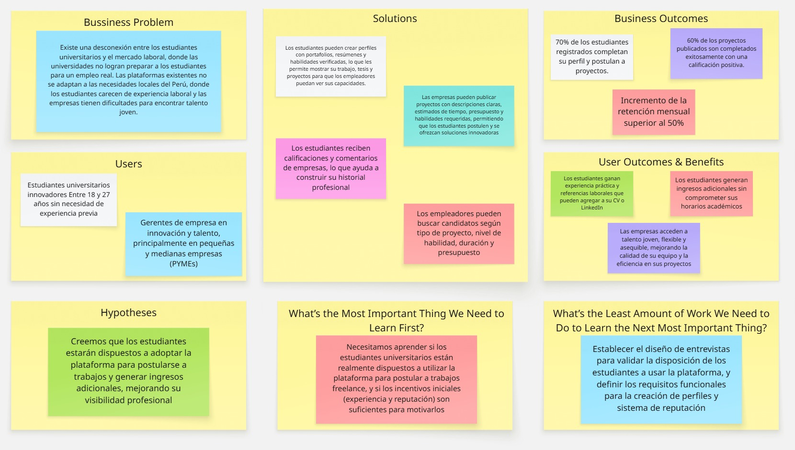
</p>

<p align="center">
  Lean UX Canvas - Elaboración propia
</p>

### 1.3. Segmentos Objetivo

### Estudiantes Universitarios Innovadores

**Descripción:**
Jóvenes estudiantes, entre 18 y 27 años, que se encuentran cursando estudios en carreras STEM (Ciencia, Tecnología, Ingeniería y Matemáticas). Son personas motivadas por la innovación, el desarrollo tecnológico y buscan visibilizar sus talentos para acceder a mejores oportunidades profesionales.

**Características demográficas y comportamiento:**

* Están inscritos en universidades de nivel superior, principalmente en áreas urbanas como Lima, Arequipa, Trujillo y otras ciudades universitarias.
* Tienen acceso a internet y plataformas digitales para aprender, investigar y conectar con otros jóvenes o empresas.
* Están interesados en proyectos colaborativos, hackatones y otros espacios que les permitan mostrar sus habilidades.
* Son activos en redes sociales y plataformas profesionales como LinkedIn, donde buscan oportunidades de trabajo o prácticas profesionales.

**Sustento estadístico:**

* Según la Superintendencia Nacional de Educación Superior Universitaria (SUNEDU), el 45% de los estudiantes universitarios en Perú están en carreras STEM. Esta es una base de jóvenes con interés en áreas de alta demanda como programación, ingeniería, y ciencias aplicadas.
* El Instituto Nacional de Estadística e Informática (INEI) menciona que el 80% de los jóvenes de 18 a 29 años en Perú usan internet, por lo que este grupo tiene un alto potencial de interactuar en plataformas digitales que los conecten con el mercado laboral.

---

### Gerentes de Empresas en Innovación y Talento

**Descripción:**
Gerentes o profesionales con experiencia en la gestión de equipos de innovación, recursos humanos o talento. Buscan detectar talento emergente, especialmente en áreas relacionadas con la tecnología, la digitalización y la innovación, para incorporarlos a sus organizaciones.

**Características demográficas y comportamiento:**

* Edad promedio entre 30 y 50 años, con estudios universitarios en administración, ingeniería o áreas afines.
* Trabajan en sectores relacionados con la innovación, startups, empresas tecnológicas o empresas tradicionales que buscan transformarse digitalmente.
* Interesados en soluciones ágiles y flexibles para acceder a talento emergente, a través de plataformas que conecten con jóvenes innovadores o freelancers.
* Valoran la capacidad de los nuevos talentos para adaptarse rápidamente a entornos cambiantes y su disposición para aportar ideas frescas.

**Sustento estadístico:**

* Según el Ministerio de la Producción de Perú (Produce), el 72% de las medianas y grandes empresas están implementando proyectos de transformación digital, lo que implica una creciente demanda de profesionales jóvenes con habilidades tecnológicas.
* El 55% de los gerentes en empresas tecnológicas en Perú buscan constantemente incorporar talento especializado a sus equipos, y prefieren contratar freelancers o nuevos egresados con un perfil innovador para cubrir necesidades puntuales.


## Capítulo II: Requirements Elicitation & Analysis

### 2.1. Competidores

#### 2.1.1. Análisis competitivo

<table border="1">
  <thead>
    <tr>
      <th colspan="5">Competitive Analysis Landscape</th>
    </tr>
  </thead>
  <tbody>
    <!-- OBJETIVO -->
    <tr>
      <td>¿Por qué llevar a cabo este análisis?</td>
      <td colspan="4">Analizar a la competencia permite entender el mercado en el que se introducirá nuestro producto, ofreciendo una visión clara de las funcionalidades que ofrecen y cómo satisfacen las necesidades de sus clientes.</td>
    </tr>
    <!-- CABECERA -->
    <tr>
      <td>(Nombre y logo de cada competidor)</td>
      <td></td>
      <td>InnoSpace<br>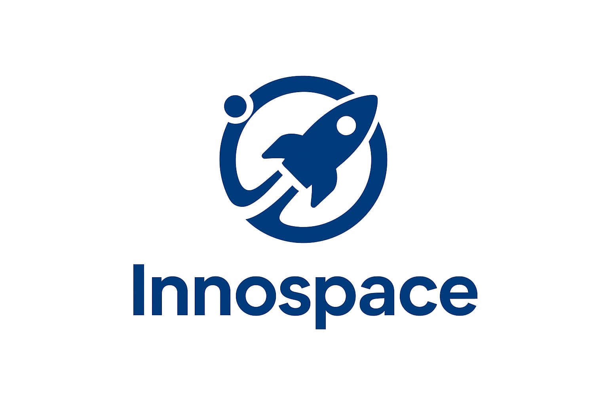</td>
      <td>LinkedIn <br></td>
      <td>AngelList (Wellfound) <br></td>
      <td>Behance <br></td>
    </tr>
    <!-- PERFIL -->
    <tr>
      <td rowspan="3">Perfil</td>
      <td>Overview</td>
      <td>Plataforma móvil donde estudiantes publican ideas innovadoras y startups para atraer inversión, participar en proyectos empresariales y conectar con empresas.</td>
      <td>Red social profesional global que conecta profesionales y empresas para networking, empleos y contenido.</td>
      <td>Plataforma que conecta startups con inversionistas y talento especializado, muy centrada en ecosistema emprendedor.</td>
      <td>Plataforma para creativos y diseñadores donde muestran proyectos y buscan oportunidades de colaboración.</td>
    </tr>
    <tr>
      <td>Ventaja competitiva <br>¿Qué valor ofrece a los clientes?</td>
      <td>Conecta estudiantes con empresas de forma bidireccional (ideas <-> proyectos), fomenta innovación y aprendizaje colaborativo.</td>
      <td>Gran base de usuarios, networking masivo y posicionamiento de marca fuerte.</td>
      <td>Acceso directo a startups, talento e inversores, muy nichado en el ecosistema.</td>
      <td>Visibilidad global para proyectos creativos y portafolios.</td>
    </tr>
    <tr>
      <td>Mercado objetivo</td>
      <td>Estudiantes universitarios, jóvenes emprendedores, empresas que buscan innovación y talento emergente.</td>
      <td>Profesionales de todos los sectores y empresas de cualquier tamaño.</td>
      <td>Startups, inversionistas y profesionales del sector tecnológico y emprendedor.</td>
      <td>Diseñadores, artistas, creativos y empresas del sector visual.</td>
    </tr>
    <!-- PERFIL DE MARKETING -->
    <tr>
      <td rowspan="2">Perfil de Marketing</td>
      <td>Estrategias de marketing</td>
      <td>Marketing digital en universidades, incubadoras y redes sociales. Enfoque en innovación y talento joven.</td>
      <td>Publicidad en la misma plataforma, marketing de contenido y presencia en medios profesionales.</td>
      <td>Eventos de startups, aceleradoras, networking en ecosistemas emprendedores.</td>
      <td>Colaboraciones con escuelas de diseño, concursos y portafolios online.</td>
    </tr>
    <tr>
      <td>Mercado objetivo</td>
      <td>Estudiantes, startups en etapa temprana, empresas innovadoras.</td>
      <td>Profesionales, empresas medianas y grandes.</td>
      <td>Startups tecnológicas, inversores, emprendedores.</td>
      <td>Creativos, diseñadores freelance, agencias.</td>
    </tr>
    <!-- PERFIL DE PRODUCTO -->
    <tr>
      <td rowspan="3">Perfil de Producto</td>
      <td>Productos & Servicios</td>
      <td>Publicación de ideas y startups, proyectos de empresas, exploración de estudiantes con habilidades alineadas.</td>
      <td>Ofertas de empleo, networking, cursos, grupos profesionales.</td>
      <td>Ofertas de empleo en startups, conexión con inversores y talento.</td>
      <td>Portafolios creativos, exposición de proyectos, búsqueda de empleo creativo.</td>
    </tr>
    <tr>
      <td>Precios & Costos</td>
      <td>Modelo freemium (básico gratis, premium para empresas o estudiantes destacados).</td>
      <td>Gratis con funciones premium de pago (LinkedIn Premium, LinkedIn Ads).</td>
      <td>Gratis con servicios premium para empleadores e inversores.</td>
      <td>Gratis con opciones premium para mayor visibilidad.</td>
    </tr>
    <tr>
      <td>Canales de distribución (Web y/o Móvil)</td>
      <td>App móvil (iOS/Android) y versión web.</td>
      <td>App móvil y web.</td>
      <td>App móvil y web.</td>
      <td>App móvil y web.</td>
    </tr>
    <!-- SWOT -->
    <tr>
      <td rowspan="4">Análisis SWOT</td>
      <td>Fortalezas</td>
      <td>Innovación en el enfoque educación-empresa, espacio exclusivo para estudiantes.</td>
      <td>Base de usuarios masiva, marca reconocida.</td>
      <td>Nicho claro en startups e inversión.</td>
      <td>Alta visibilidad para creativos y artistas.</td>
    </tr>
    <tr>
      <td>Debilidades</td>
      <td>Startup nueva, sin base de usuarios inicial fuerte.</td>
      <td>Demasiada competencia interna, saturación de usuarios.</td>
      <td>Menor popularidad que LinkedIn, limitado fuera del sector tech.</td>
      <td>No cubre sectores fuera del diseño/creatividad.</td>
    </tr>
    <tr>
      <td>Oportunidades</td>
      <td>Aliarse con universidades, incubadoras y empresas innovadoras.</td>
      <td>Expansión a nuevos servicios de educación y formación.</td>
      <td>Crecimiento del ecosistema emprendedor global.</td>
      <td>Mayor demanda de portafolios digitales y talento creativo.</td>
    </tr>
    <tr>
      <td>Amenazas</td>
      <td>Competidores grandes con más recursos, barreras de entrada altas.</td>
      <td>Pérdida de interés por parte de usuarios jóvenes.</td>
      <td>Dependencia del ecosistema startup e inversión.</td>
      <td>Alta competencia en redes creativas (Dribbble, ArtStation).</td>
    </tr>
  </tbody>
</table>


#### 2.1.2. Estrategias y tácticas frente a competidores

## Afrontando las fortalezas de nuestros competidores:

**Fortalezas de competidores:**
- LinkedIn: base de usuarios masiva y marca consolidada.  
- AngelList: nicho en startups e inversión.  
- Behance: visibilidad global para creativos.  
- InnoSpace: innovación en el vínculo educación–empresa.  

## Comprendemos que nuestras fortalezas son:
- Enfoque exclusivo en estudiantes y talento emergente.  
- Integración bidireccional: empresas publican proyectos, estudiantes aportan ideas.  
- Nicho menos saturado, con alto potencial de crecimiento en universidades.  

## Estrategias:
- Diferenciarnos mediante el **posicionamiento educativo–empresarial**, no solo profesional.  
- Crear comunidad cerrada y validada de estudiantes para garantizar **calidad y confianza**.  
- Alianzas estratégicas con universidades e incubadoras.  

## Tácticas:
- Implementar programas piloto con universidades y ferias de empleo.  
- Incentivar a empresas innovadoras a publicar proyectos reales.  
- Marketing digital en redes sociales universitarias y canales académicos.  

---

## Afrontando las debilidades de nuestros competidores:

**Debilidades de competidores:**
- LinkedIn: saturación, competencia interna.  
- AngelList: limitado fuera del ecosistema startup.  
- Behance: no cubre sectores fuera de lo creativo.  
- InnoSpace: aún sin masa crítica de usuarios.  

## Comprendemos que nuestras debilidades son:
- Startup nueva con poca base de usuarios.  
- Recursos limitados frente a grandes plataformas.  

## Estrategias:
- Crecer a través de **nichos específicos** antes de expandir.  
- Apoyarnos en **alianzas institucionales** para atraer usuarios sin grandes inversiones.  

## Tácticas:
- Campañas de captación en universidades.  
- Programas de referidos entre estudiantes y empresas.  
- Construir una primera comunidad sólida en un sector (ej. ingeniería, innovación tecnológica).  

---

## Afrontando las oportunidades de nuestros competidores:

**Oportunidades de competidores:**
- Expansión de la educación digital (LinkedIn).  
- Crecimiento del ecosistema emprendedor (AngelList).  
- Demanda de portafolios digitales (Behance).  
- Integración universidad–empresa (InnoSpace).  

## Comprendemos que nuestras oportunidades son:
- Conectar talento joven con innovación empresarial.  
- Posicionarnos como la **plataforma de early talent**.  
- Aprovechar el auge de incubadoras, hackathons y proyectos de innovación abierta.  

## Estrategias:
- Crear un espacio que combine **empleabilidad temprana + innovación colaborativa**.  
- Aliarnos con incubadoras y hubs de emprendimiento universitario.  

## Tácticas:
- Organizar retos de innovación con empresas patrocinadoras.  
- Promocionar historias de éxito de estudiantes para dar visibilidad a la plataforma.  
- Ofrecer planes gratuitos iniciales a startups emergentes para ganar tracción.  

---

## Afrontando las amenazas de nuestros competidores:

**Amenazas de competidores:**
- Recursos y posicionamiento de grandes plataformas (LinkedIn, Behance).  
- Alta competencia en redes profesionales y creativas.  
- Barreras de entrada y dependencia de ecosistemas externos.  

## Comprendemos que nuestras amenazas son:
- Riesgo de que grandes plataformas incorporen funcionalidades similares.  
- Dificultad de escalar sin financiamiento fuerte.  

## Estrategias:
- Enfocarnos en ser **más ágiles y especializados** que los grandes competidores.  
- Desarrollar una propuesta de valor difícil de replicar: **ecosistema académico–empresarial cerrado**.  

## Tácticas:
- Innovar en funcionalidades (ej. “match” entre ideas de estudiantes y retos empresariales).  
- Fidelizar a la comunidad con beneficios exclusivos (certificados, visibilidad, mentorías).  
- Monitorear tendencias para adaptar rápidamente la plataforma.  


### 2.2. Entrevistas

#### 2.2.1. Diseño de entrevistas

*Preguntas Estudiantes universitarios innovadores*

---

**Preguntas Directas:**

1. ¿Podrías proporcionarnos tu nombre completo, tu edad y qué carrera estás estudiando actualmente?

2. ¿Has tenido la oportunidad de desarrollar alguna idea o proyecto innovador durante tus estudios? ¿Cómo fue esa experiencia?

3. ¿Qué dificultades enfrentas actualmente para dar a conocer tus ideas o proyectos a empresas o posibles inversionistas?

4. ¿Has participado en concursos, hackathons o ferias de innovación? ¿Qué aprendiste de esas experiencias?

5. ¿Qué tan fácil o difícil ha sido para ti encontrar espacios donde mostrar tu talento y tus habilidades?

6. ¿Qué te motiva más: que te reconozcan por tus ideas, que te apoyen con mentoría o que te den financiamiento para llevarlas a cabo?

7. ¿Qué habilidades técnicas o personales tuyas consideras que serían más valiosas para una empresa que busque talento joven?

8. ¿Qué plataformas, redes sociales o medios digitales utilizas hoy para difundir tus proyectos o buscar oportunidades?

9. ¿Qué temores o dudas tendrías al publicar tus ideas en una aplicación que conecta estudiantes con empresas?

10. Si existiera una app donde pudieras subir tus ideas, explorar proyectos de empresas y conectar directamente con gerentes, ¿la usarías? ¿Por qué sí o por qué no?<br><br>

**Preguntas Complementarias:**

11. ¿Qué tan importante es para ti que una plataforma valide o certifique tu participación en proyectos reales?

12. ¿Qué te gustaría aprender o reforzar al colaborar con empresas en proyectos de innovación? <br><br>

*Preguntas Gerentes/profesionales de innovación y talento*

**Preguntas Directas:**

1. ¿Podrías darnos tu nombre completo, edad y cargo actual en la empresa?

2. Cuéntame un poco sobre tu empresa: ¿en qué sector operan y cómo gestionan actualmente los proyectos de innovación?

3. ¿Qué tan frecuente es que busquen nuevas ideas o startups jóvenes para resolver retos internos?

4. ¿Qué dificultades encuentras al identificar y contactar estudiantes con habilidades alineadas a tus proyectos?

5. ¿Han intentado colaborar con universidades o estudiantes en el pasado? ¿Qué resultados tuvieron?

6. ¿Qué características valoras más en un estudiante o joven innovador al momento de incluirlo en un proyecto?

7. ¿Qué riesgos o preocupaciones tendrías al usar una aplicación que conecta directamente con talento emergente?

8. ¿Qué tan dispuesto estarías a publicar proyectos o retos de tu empresa en una plataforma abierta a estudiantes?

9. ¿Qué funcionalidades considerarías indispensables en una app como InnoSpace para que realmente sea útil para tu empresa?

10. Si existiera una app local que te brinde acceso directo a ideas innovadoras y perfiles de estudiantes con portafolio visible, ¿la usarías? ¿Por qué sí o por qué no?<br><br>

**Preguntas Complementarias:**

11. ¿Qué tan importante sería para tu empresa contar con métricas de impacto o informes sobre la colaboración con estudiantes?

12. ¿Qué expectativas tendrías de la relación con los estudiantes a través de una plataforma como esta (ideas, prototipos, contratación futura, etc.)? <br><br>

#### 2.2.2. Registro de entrevistas


*Entrevistas a Estudiantes*
---
<br><br>

<table align="center">
  <tr>
    <th colspan="2" style="text-align:center">Entrevista 1</th>
  </tr>
  <tr>
    <td><strong>Entrevistado</strong></td>
    <td>Estefano Solis</td>
  </tr>
  <tr>
    <td><strong>Edad</strong></td>
    <td>20</td>
  </tr>
  <tr>
    <td><strong>Distrito</strong></td>
    <td>Pueblo Libre</td>
  </tr>
  <tr>
    <td><strong>Timing</strong></td>
    <td>0:05 - 6:59</td>
  </tr>
  <tr>
    <td><strong>URL</strong></td>
    <td>
      
  `https://upcedupe-my.sharepoint.com/:v:/g/personal/u202313172_upc_edu_pe/ETIrSGpEPvRLpIKO-WCKbugBi5G1VwGVTmBdKGfewB1PrA?nav=eyJwbGF5YmFja09wdGlvbnMiOnsic3RhcnRUaW1lSW5TZWNvbmRzIjo1LCJ0aW1lc3RhbXBlZExpbmtSZWZlcnJlckluZm8iOnsic2NlbmFyaW8iOiJDaGFwdGVyU2hhcmUiLCJhZGRpdGlvbmFsSW5mbyI6eyJpc1NoYXJlZENoYXB0ZXJBdXRvIjpmYWxzZX19fSwicmVmZXJyYWxJbmZvIjp7InJlZmVycmFsQXBwIjoiU3RyZWFtV2ViQXBwIiwicmVmZXJyYWxWaWV3IjoiU2hhcmVDaGFwdGVyTGluayIsInJlZmVycmFsQXBwUGxhdGZvcm0iOiJXZWIiLCJyZWZlcnJhbE1vZGUiOiJ2aWV3In19&e=2imy1h`

  </td>
  </tr>
  <tr>
    <td colspan="2" style="text-align:justify">
      Resumen: <br>
      Estefano Solis Campos, estudiante de 20 años de Ingeniería de Software en la UPC, comentó que ha desarrollado ideas innovadoras aunque con limitaciones de tiempo y recursos, y que la mayor dificultad para difundir proyectos es la falta de canales directos con empresas, lo que hace que muchos se queden en el ámbito académico; ha participado en hackatones y ferias donde aprendió a trabajar bajo presión, ser recursivo y colaborar en equipos multidisciplinarios, pero considera que fuera de la universidad es difícil encontrar espacios constantes para mostrar talento; valora más la mentoría que el financiamiento, pues la guía de expertos convierte una idea en un proyecto exitoso, y resalta sus habilidades en frontend y backend con React, además de su adaptabilidad, aprendizaje rápido y orientación a la resolución de problemas; utiliza LinkedIn y GitHub para difundir sus proyectos, aunque le preocupan la propiedad intelectual y la calidad de los contactos, pero afirma que usaría una plataforma que conecte estudiantes con empresas porque resolvería la falta de conexión con el mundo real, destacando también la importancia de que otorgue certificaciones en proyectos reales, y expresa su interés en aprender sobre toma de decisiones de negocio, gestión de proyectos, trabajo en equipos multidisciplinarios y medición del impacto de productos en el mercado
    </td>
  </tr>
  <tr>
    <td colspan="2"><br>
      <br>
    </td>
  </tr>
</table>

<table align="center">
  <tr>
    <th colspan="2" style="text-align:center">Entrevista 2</th>
  </tr>
  <tr>
    <td><strong>Entrevistado</strong></td>
    <td>Adrian Moreno</td>
  </tr>
  <tr>
    <td><strong>Edad</strong></td>
    <td>24</td>
  </tr>
  <tr>
    <td><strong>Distrito</strong></td>
    <td>Cercado de Lima</td>
  </tr>
  <tr>
    <td><strong>Timing</strong></td>
    <td>6:59 - 12:01</td>
  </tr>
  <tr>
    <td><strong>URL</strong></td>
    <td>
      
  `https://upcedupe-my.sharepoint.com/:v:/g/personal/u202313172_upc_edu_pe/ETIrSGpEPvRLpIKO-WCKbugBi5G1VwGVTmBdKGfewB1PrA?nav=eyJwbGF5YmFja09wdGlvbnMiOnsic3RhcnRUaW1lSW5TZWNvbmRzIjo0MTkuNjEyLCJ0aW1lc3RhbXBlZExpbmtSZWZlcnJlckluZm8iOnsic2NlbmFyaW8iOiJDaGFwdGVyU2hhcmUiLCJhZGRpdGlvbmFsSW5mbyI6eyJpc1NoYXJlZENoYXB0ZXJBdXRvIjpmYWxzZX19fSwicmVmZXJyYWxJbmZvIjp7InJlZmVycmFsQXBwIjoiU3RyZWFtV2ViQXBwIiwicmVmZXJyYWxWaWV3IjoiU2hhcmVDaGFwdGVyTGluayIsInJlZmVycmFsQXBwUGxhdGZvcm0iOiJXZWIiLCJyZWZlcnJhbE1vZGUiOiJ2aWV3In19&e=fTkCf5`

  </td>
  </tr>
  <tr>
    <td colspan="2" style="text-align:justify">
      Resumen: <br>
      Adrián Moreno Nole, estudiante de 24 años de Marketing y Administración, ha trabajado en proyectos con pymes locales, principalmente diseñando estrategias digitales para redes sociales. Reconoce que una de sus mayores dificultades es la falta de confianza que enfrentan los estudiantes al buscar inversionistas, ya que suelen preferir proyectos más grandes y visibles. Ha participado en concursos organizados por la universidad, donde aprendió a trabajar en equipo y bajo presión, aunque considera que los espacios para mostrar talento son limitados en un entorno competitivo. Valora más la mentoría que el financiamiento, pues considera que el acompañamiento de expertos aporta mayor aprendizaje. Entre sus principales habilidades destaca el análisis de mercado, estrategias digitales y manejo de herramientas como Google Analytics y Google Ads. Utiliza LinkedIn, Instagram, Twitter y foros especializados para difundir proyectos, aunque teme que al publicarlos alguien pueda apropiarse de sus ideas. Afirma que sí usaría una aplicación que conecte estudiantes con empresas, ya que acortaría la distancia entre ambos mundos y daría mayor visibilidad a los proyectos, resaltando la importancia de que estas plataformas otorguen certificaciones para fortalecer la credibilidad profesional. Finalmente, le gustaría reforzar su capacidad de gestión con presupuestos limitados, mejorar en negociación y perfeccionar sus habilidades de presentación.
    </td>
  </tr>
  <tr>
    <td colspan="2"><br>
      <br>
    </td>
  </tr>
</table>

<br><br>

<table align="center">
  <tr>
    <th colspan="2" style="text-align:center">Entrevista 3</th>
  </tr>
  <tr>
    <td><strong>Entrevistado</strong></td>
    <td>Marcelo Barrientos Quispe</td>
  </tr>
  <tr>
    <td><strong>Edad</strong></td>
    <td>20</td>
  </tr>
  <tr>
    <td><strong>Distrito</strong></td>
    <td>San Isidro</td>
  </tr>
  <tr>
    <td><strong>Timing</strong></td>
    <td>12:01 - 21:54</td>
  </tr>
  <tr>
    <td><strong>URL</strong></td>
    <td>
    
  `https://upcedupe-my.sharepoint.com/:v:/g/personal/u202313172_upc_edu_pe/ETIrSGpEPvRLpIKO-WCKbugBi5G1VwGVTmBdKGfewB1PrA?nav=eyJwbGF5YmFja09wdGlvbnMiOnsic3RhcnRUaW1lSW5TZWNvbmRzIjo3MjEuNDksInRpbWVzdGFtcGVkTGlua1JlZmVycmVySW5mbyI6eyJzY2VuYXJpbyI6IkNoYXB0ZXJTaGFyZSIsImFkZGl0aW9uYWxJbmZvIjp7ImlzU2hhcmVkQ2hhcHRlckF1dG8iOmZhbHNlfX19LCJyZWZlcnJhbEluZm8iOnsicmVmZXJyYWxBcHAiOiJTdHJlYW1XZWJBcHAiLCJyZWZlcnJhbFZpZXciOiJTaGFyZUNoYXB0ZXJMaW5rIiwicmVmZXJyYWxBcHBQbGF0Zm9ybSI6IldlYiIsInJlZmVycmFsTW9kZSI6InZpZXcifX0&e=jmLSzk`

  </td>
  </tr>
  <tr>
    <td colspan="2" style="text-align:justify">
      Resumen: <br>
      Marcelo Barrientos, un estudiante de Ingeniería de Software de 20 años, comentó sobre el desarrollo de proyectos innovadores durante sus estudios. Marcelo destaca la importancia de la motivación universitaria para crear soluciones a problemáticas actuales, el valor del trabajo en equipo y la presión positiva en hackathons, así como las dificultades para comunicar y difundir ideas fuera de esos espacios. Subraya la relevancia del reconocimiento y la mentoría como primeros pasos para atraer financiamiento, y enfatiza la necesidad de aprender constantemente y adaptarse tecnológicamente. Además, valora las plataformas digitales como GitHub y LinkedIn para mostrar su trabajo y considera esencial la certificación de participación en proyectos reales para fortalecer su perfil profesional. Finalmente, expresa interés en adquirir habilidades de marketing para mejorar el impacto social y comercial de sus desarrollos.
    </td>
  </tr>
  <tr>
    <td colspan="2"><br>
      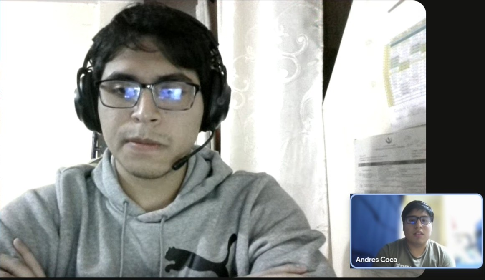<br>
    </td>
  </tr>
</table>

<br><br>

*Entrevistas a Gerentes*
---

<table align="center">
  <tr>
    <th colspan="2" style="text-align:center">Entrevista 1</th>
  </tr>
  <tr>
    <td><strong>Entrevistado</strong></td>
    <td>Manuel Alejandro Jara</td>
  </tr>
  <tr>
    <td><strong>Edad</strong></td>
    <td>31</td>
  </tr>
  <tr>
    <td><strong>Distrito</strong></td>
    <td>Miraflores</td>
  </tr>
  <tr>
    <td><strong>Timing</strong></td>
    <td>21:54 - 43:12</td>
  </tr>
  <tr>
    <td><strong>URL</strong></td>
    <td>

  `https://upcedupe-my.sharepoint.com/:v:/g/personal/u202313172_upc_edu_pe/ETIrSGpEPvRLpIKO-WCKbugBi5G1VwGVTmBdKGfewB1PrA?nav=eyJwbGF5YmFja09wdGlvbnMiOnsic3RhcnRUaW1lSW5TZWNvbmRzIjoxMzE0LjM3NywidGltZXN0YW1wZWRMaW5rUmVmZXJyZXJJbmZvIjp7InNjZW5hcmlvIjoiQ2hhcHRlclNoYXJlIiwiYWRkaXRpb25hbEluZm8iOnsiaXNTaGFyZWRDaGFwdGVyQXV0byI6ZmFsc2V9fX0sInJlZmVycmFsSW5mbyI6eyJyZWZlcnJhbEFwcCI6IlN0cmVhbVdlYkFwcCIsInJlZmVycmFsVmlldyI6IlNoYXJlQ2hhcHRlckxpbmsiLCJyZWZlcnJhbEFwcFBsYXRmb3JtIjoiV2ViIiwicmVmZXJyYWxNb2RlIjoidmlldyJ9fQ&e=S3eA6j`

  </td>
  </tr>
  <tr>
    <td colspan="2" style="text-align:justify">
      Resumen: <br>
      Manuel Alejandro Jara, coordinador de proyectos inmobiliarios de 31 años, ofrece una visión profunda sobre la gestión y la innovación en el sector inmobiliario en Lima. Manuel hace enfasis en la integración de tecnologías como la inteligencia artificial para optimizar procesos y la importancia de buscar jóvenes talentos innovadores que aporten soluciones frescas. También resalta la relevancia de habilidades analíticas y de resolución de problemas por encima del conocimiento teórico puro. Además, comenta sobre la colaboración con universidades a través de prácticas preprofesionales y la potencial utilidad de plataformas digitales para conectar empresas con estudiantes, facilitando así la innovación abierta y el desarrollo profesional. Finalmente, subraya la importancia de métricas claras para evaluar la contribución de los estudiantes y la necesidad de interacciones auténticas y colaborativas en estas plataformas.
    </td>
  </tr>
  <tr>
    <td colspan="2"><br>
      <br>
    </td>
  </tr>
</table>

<br><br>

<table align="center">
  <tr>
    <th colspan="2" style="text-align:center">Entrevista 2</th>
  </tr>
  <tr>
    <td><strong>Entrevistado</strong></td>
    <td>Manuel David Niño Torres Grandez.</td>
  </tr>
  <tr>
    <td><strong>Edad</strong></td>
    <td>39</td>
  </tr>
  <tr>
    <td><strong>Distrito</strong></td>
    <td>Los Olivos</td>
  </tr>
  <tr>
    <td><strong>Timing</strong></td>
    <td>43:12 - 1:01:57</td>
  </tr>
  <tr>
    <td><strong>URL</strong></td>
    <td>

  `https://upcedupe-my.sharepoint.com/:v:/g/personal/u202313172_upc_edu_pe/ETIrSGpEPvRLpIKO-WCKbugBi5G1VwGVTmBdKGfewB1PrA?nav=eyJwbGF5YmFja09wdGlvbnMiOnsic3RhcnRUaW1lSW5TZWNvbmRzIjoyNTkyLjMzMSwidGltZXN0YW1wZWRMaW5rUmVmZXJyZXJJbmZvIjp7InNjZW5hcmlvIjoiQ2hhcHRlclNoYXJlIiwiYWRkaXRpb25hbEluZm8iOnsiaXNTaGFyZWRDaGFwdGVyQXV0byI6ZmFsc2V9fX0sInJlZmVycmFsSW5mbyI6eyJyZWZlcnJhbEFwcCI6IlN0cmVhbVdlYkFwcCIsInJlZmVycmFsVmlldyI6IlNoYXJlQ2hhcHRlckxpbmsiLCJyZWZlcnJhbEFwcFBsYXRmb3JtIjoiV2ViIiwicmVmZXJyYWxNb2RlIjoidmlldyJ9fQ&e=5717fT` 

  </td>
  </tr>
  <tr>
    <td colspan="2" style="text-align:justify">
      Resumen:<br>
      Manuel David Niño Torres Grandez, de 39 años, fundador y administrador de su empresa dedicada a la manufactura, explicó que gestionan los proyectos de innovación a través de un comité interno y metodologías colaborativas, apoyándose en equipos multidisciplinarios. Además, indicó que suelen buscar nuevas ideas y startups jóvenes ocasionalmente, especialmente cuando requieren soluciones tecnológicas emergentes, aunque señaló como principal dificultad la falta de visibilidad y experiencia de los estudiantes, lo que dificulta identificar perfiles adecuados. No obstante, destacó que han colaborado en el pasado con universidades y colegios mediante proyectos de investigación aplicada, obteniendo resultados positivos en creatividad e innovación, aunque con algunos problemas de compromiso por parte de los estudiantes. Asimismo, valoró en los jóvenes la proactividad, la capacidad de aprendizaje rápido, el trabajo en equipo y la comunicación. Respecto a plataformas como InnoSpace, consideró indispensables funcionalidades como filtros avanzados para encontrar perfiles, portafolios visibles, acuerdos de confidencialidad y herramientas de comunicación directa, ya que una de sus principales preocupaciones es la seguridad de la información y la seriedad de los participantes. Finalmente, aseguró que sí utilizaría una aplicación de este tipo porque agilizaría la búsqueda de talento joven, permitiría validar resultados antes de invertir recursos mayores y facilitaría la creación de una cantera de futuros profesionales, lo que beneficiaría tanto a la empresa como a los estudiantes al establecer una relación de aprendizaje mutuo.
    </td>
  </tr>
   <tr>
    <td colspan="2"><br>
      <br>
    </td>
  </tr>
</table>

<br><br>

<table align="center">
  <tr>
    <th colspan="2" style="text-align:center">Entrevista 3</th>
  </tr>
  <tr>
    <td><strong>Entrevistado</strong></td>
    <td>Luis Sanchez Santur</td>
  </tr>
  <tr>
    <td><strong>Edad</strong></td>
    <td>68</td>
  </tr>
  <tr>
    <td><strong>Distrito</strong></td>
    <td>Los Olivos</td>
  </tr>
  <tr>
    <td><strong>Timing</strong></td>
    <td>1:01:57 - 1:13:14</td>
  </tr>
  <tr>
    <td><strong>URL</strong></td>
    <td>
      
  `https://upcedupe-my.sharepoint.com/:v:/g/personal/u202313172_upc_edu_pe/ETIrSGpEPvRLpIKO-WCKbugBi5G1VwGVTmBdKGfewB1PrA?nav=eyJwbGF5YmFja09wdGlvbnMiOnsic3RhcnRUaW1lSW5TZWNvbmRzIjozNzE3LjkxLCJ0aW1lc3RhbXBlZExpbmtSZWZlcnJlckluZm8iOnsic2NlbmFyaW8iOiJDaGFwdGVyU2hhcmUiLCJhZGRpdGlvbmFsSW5mbyI6eyJpc1NoYXJlZENoYXB0ZXJBdXRvIjpmYWxzZX19fSwicmVmZXJyYWxJbmZvIjp7InJlZmVycmFsQXBwIjoiU3RyZWFtV2ViQXBwIiwicmVmZXJyYWxWaWV3IjoiU2hhcmVDaGFwdGVyTGluayIsInJlZmVycmFsQXBwUGxhdGZvcm0iOiJXZWIiLCJyZWZlcnJhbE1vZGUiOiJ2aWV3In19&e=sW4NBN`

  </td>
  </tr>
  <tr>
    <td colspan="2" style="text-align:justify">
      Resumen:<br>
      Luis, empresario de 68 años y representante de la empresa Santurlo F.C.A., dedicada a edificaciones y obras viales, explicó que gestionan la innovación incorporando nuevas tecnologías como el software BIM y materiales modernos en sus proyectos. Asimismo, resaltó que para integrar estudiantes o jóvenes innovadores en su empresa considera fundamental la actitud positiva, la disposición para aprender y la capacidad de aportar ideas, ya que estos factores pesan incluso más que los conocimientos técnicos. Aunque han realizado convocatorias en universidades, aclaró que no han establecido alianzas formales, lo cual representa una oportunidad de mejora. Además, destacó que las nuevas generaciones, al estar familiarizadas con herramientas digitales, contribuyen a la automatización y agilización de procesos dentro de la empresa. En cuanto a plataformas como InnoSpace, señaló que serían útiles para conectar con talento emergente; sin embargo, manifestó cierta preocupación por la seguridad y la privacidad de la información. No obstante, consideró valioso que estas aplicaciones incluyan métricas de impacto y fomenten una colaboración tripartita entre universidad, estudiante y empresa. Finalmente, afirmó que sí estaría dispuesto a usar una herramienta de este tipo, puesto que contribuiría a visibilizar el talento, generar nuevas ideas y fortalecer la relación con futuros profesionales.
    </td>
  </tr>
   <tr>
    <td colspan="2"><br>
      <br>
    </td>
  </tr>
</table>

#### 2.2.3. Análisis de entrevistas

*Segmento Estudiantes*

<table>
  <tr>
    <td>Caracteristicas</td>
    <td>Estudiantes que lo mencionan</td>
    <td>Porcentaje</td>
  </tr>
  <tr>
    <td>Participación en hackatones/concursos</td>
    <td>2</td>
    <td>67%</td>
  </tr>
  <tr>
    <td>Uso de LinkedIn/GitHub para difundir proyectos</td>
    <td>2</td>
    <td>67%</td>
  </tr>
  <tr>
    <td>Carrera Ingeniería de Software</td>
    <td>2</td>
    <td>67%</td>
  </tr>
  <tr>
    <td>Perciben falta de canales de conexión con empresas</td>
    <td>3</td>
    <td>100%</td>
  </tr>
  <tr>
    <td>Valoración de certificaciones en proyectos reales</td>
    <td>3</td>
    <td>100%</td>
  </tr>
  <tr>
    <td>Valoran más la mentoría que el financiamiento</td>
    <td>3</td>
    <td>100%</td>
  </tr>
  <tr>
    <td>Temor a pérdida de propiedad intelectual</td>
    <td>2</td>
    <td>67%</td>
  </tr>
</table>

**Resumen del analisis de entrevistas de estudiantes:**

Los estudiantes tienen entre 20 y 24 años, con perfiles en Ingeniería de Software y Marketing. Comparten experiencia en concursos, hackatones y trabajos con pymes, pero sienten que fuera de la universidad los espacios son reducidos. Valoran mucho la mentoría y certificación en proyectos reales como puerta hacia la empleabilidad. Usan LinkedIn/GitHub/redes sociales, aunque existe preocupación por la seguridad y la propiedad intelectual. Buscan fortalecer habilidades de gestión, negociación y trabajo en equipos multidisciplinarios.

*Segmento Gerentes*

<table>
  <tr>
    <td>Caracteristicas</td>
    <td>Gerentes que lo mencionan</td>
    <td>Porcentaje</td>
  </tr>
  <tr>
    <td>Uso de tecnologías emergentes (IA, BIM, materiales modernos)</td>
    <td>3</td>
    <td>100%</td>
  </tr>
  <tr>
    <td>Colaboración previa con universidades</td>
    <td>2</td>
    <td>67%</td>
  </tr>
  <tr>
    <td>Interés en plataformas digitales para conectar con estudiantes</td>
    <td>3</td>
    <td>100%</td>
  </tr>
  <tr>
    <td>Ven falta de visibilidad/experiencia en estudiantes como barrera</td>
    <td>2</td>
    <td>67%</td>
  </tr>
  <tr>
    <td>Interés en innovación abierta y colaboración con jóvenes</td>
    <td>3</td>
    <td>100%</td>
  </tr>
</table>

**Resumen del analisis de entrevistas de gerentes:**

Los gerentes van desde 31 a 68 años y pertenecen a sectores diversos (inmobiliario, manufactura y construcción). Coinciden en la necesidad de innovación y en valorar la actitud, proactividad y capacidad de aprendizaje de los jóvenes más que la experiencia. Tienen interés en plataformas digitales como InnoSpace, pero expresan preocupación por la seguridad de datos y la seriedad de los participantes. Ven en los estudiantes una fuente de creatividad, aunque notan la falta de visibilidad y experiencia como una barrera.

**Puntos relevantes**

- Ambos valoran la mentoría y los espacios de conexión real entre estudiantes y empresas.
- Estudiantes priorizan el aprendizaje y la visibilidad de sus proyectos.
- Gerentes priorizan la proactividad y confiabilidad de los estudiantes.


### 2.3. Needfinding

En esta sección, se crearán las User Personas basándonos en la información obtenida de las entrevistas con nuestros usuarios potenciales. Consideraremos aspectos fundamentales como la edad, la ocupación, las preocupaciones y las metas de los entrevistados para entender mejor sus necesidades, comportamientos y expectativas. Además, se examinarán las características y preferencias de los usuarios a través del análisis de nuestros competidores, lo que nos ayudará a identificar áreas de oportunidad para mejorar.

#### 2.3.1. User Personas

- #### User Persona Estudiante Universitario

<p align="center">
  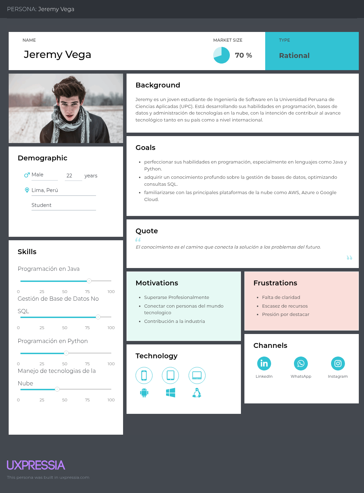
</p>

<p align="center">
  User Persona Estudiante Universitario - Elaboración propia
</p>


- #### User Persona Gerente de empresa

<p align="center">
  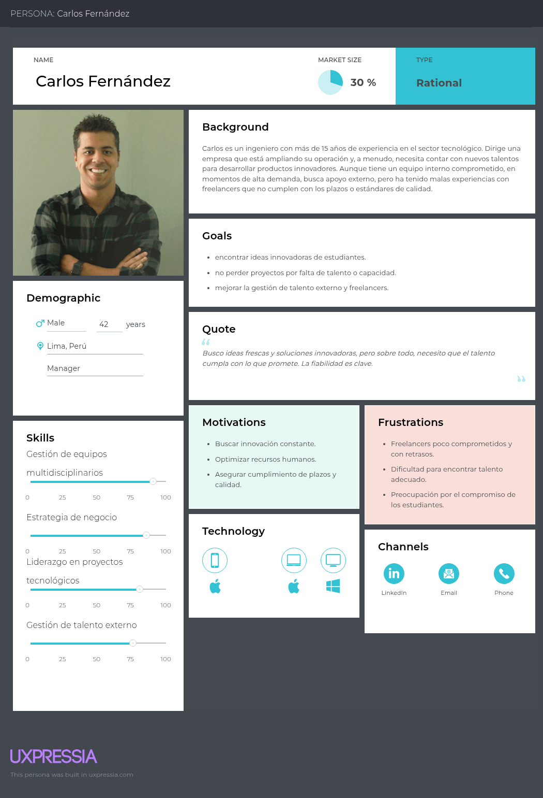
</p>

<p align="center">
  User Persona Gerente de empresa - Elaboración propia
</p>


#### 2.3.2. User Task Matrix

En este apartado se presenta la User Task Matrix, que refleja las tareas de los dos segmentos principales: estudiantes universitarios que buscan financiar sus proyectos innovadores y participar en proyectos de empresas, y gerentes que buscan contratar talento joven para el desarrollo de sus proyectos.


<table border="1">
  <thead>
    <tr>
      <th></th>
      <th colspan="2">Estudiante</th>
      <th colspan="2">Gerente</th>
    </tr>
  </thead>
  <tbody>
    <tr>
      <td>TASK</td>
      <td>FREQUENCY (Estudiante)</td>
      <td>IMPORTANCE (Estudiante)</td>
      <td>FREQUENCY (Gerente)</td>
      <td>IMPORTANCE (Gerente)</td>
    </tr>
    <tr>
      <td>Publicar ideas o startups innovadoras</td>
      <td>Sometimes</td>
      <td>High</td>
      <td>Never</td>
      <td>Low</td>
    </tr>
    <tr>
      <td>Buscar proyectos disponibles</td>
      <td>Often</td>
      <td>High</td>
      <td>Sometimes</td>
      <td>Low</td>
    </tr>
    <tr>
      <td>Postular a ofertas</td>
      <td>Sometimes</td>
      <td>High</td>
      <td>Never</td>
      <td>Low</td>
    </tr>
    <tr>
      <td>Editar o actualizar su perfil profesional</td>
      <td>Rarely</td>
      <td>High</td>
      <td>Sometimes</td>
      <td>Medium</td>
    </tr>
    <tr>
      <td>Consultar el estado de sus postulaciones</td>
      <td>Sometimes</td>
      <td>High</td>
      <td>Never</td>
      <td>Low</td>
    </tr>
    <tr>
      <td>Asistir a entrevistas</td>
      <td>Rarely</td>
      <td>High</td>
      <td>Sometimes</td>
      <td>High</td>
    </tr>
    <tr>
      <td>Asistir al daily scrum</td>
      <td>Always</td>
      <td>High</td>
      <td>Rarely</td>
      <td>Medium</td>
    </tr>
    <tr>
      <td>Registrar requerimientos de proyecto</td>
      <td>Never</td>
      <td>Low</td>
      <td>Sometimes</td>
      <td>Medium</td>
    </tr>
    <tr>
      <td>Publicar convocatorias de proyecto</td>
      <td>Never</td>
      <td>Low</td>
      <td>Sometimes</td>
      <td>Medium</td>
    </tr>
    <tr>
      <td>Chatear con miembros del equipo</td>
      <td>Sometimes</td>
      <td>Medium</td>
      <td>Sometimes</td>
      <td>Medium</td>
    </tr>
    <tr>
      <td>Ver postulaciones recibidas</td>
      <td>Never</td>
      <td>Low</td>
      <td>Sometimes</td>
      <td>Medium</td>
    </tr>
    <tr>
      <td>Validar postulantes</td>
      <td>Never</td>
      <td>Low</td>
      <td>Rarely</td>
      <td>High</td>
    </tr>
    <tr>
      <td>Aprobar entregables</td>
      <td>Never</td>
      <td>Low</td>
      <td>Often</td>
      <td>High</td>
    </tr>
    <tr>
      <td>Planificación del sprint</td>
      <td>Often</td>
      <td>High</td>
      <td>Often</td>
      <td>High</td>
    </tr>
  </tbody>
</table>


### 2.3.3. User Journey Mapping

Esta sección muestra un Journey Map por cada segmento objetivo, detallando el proceso en el que descubren e interactuan con la aplicación.

  - User Journey Map Jeremy Vega:

Este Journey map detalla la experiencia de Jeremy Vega, un universitario de 22 años que descubre la aplicación móvil InnoSpace y la utiliza para presentar sus ideas.

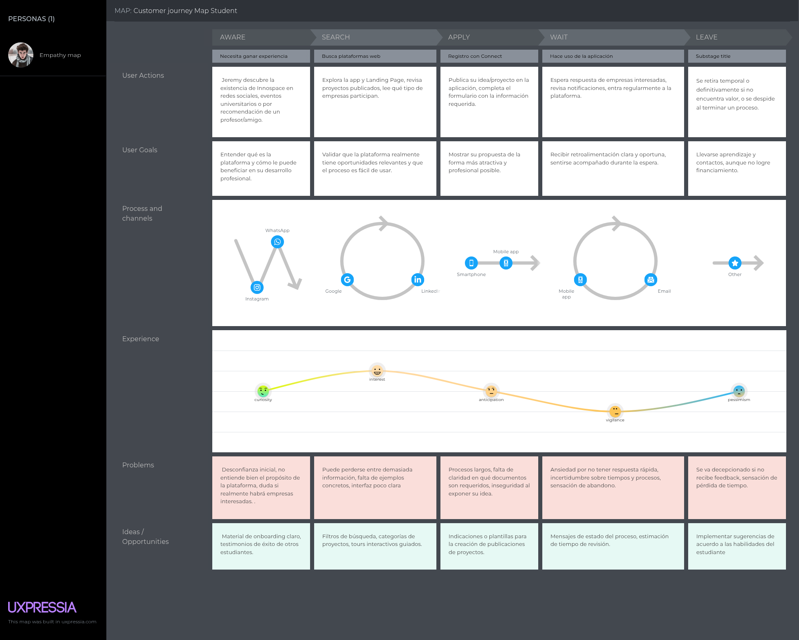

<p align="center">
  User Journey Map Jeremy Vega - Elaboración propia
</p>

 - User Journey Map Carlos Fernandez:

Este Journey map detalla la experiencia de Carlos Fernández, un ingeniero dirigente de una empresa del sector tecnológico. Carlos escucha sobre la aplicación y decida probarla, explora perfiles de estudiantes e ideas de proyectos innovadoras.

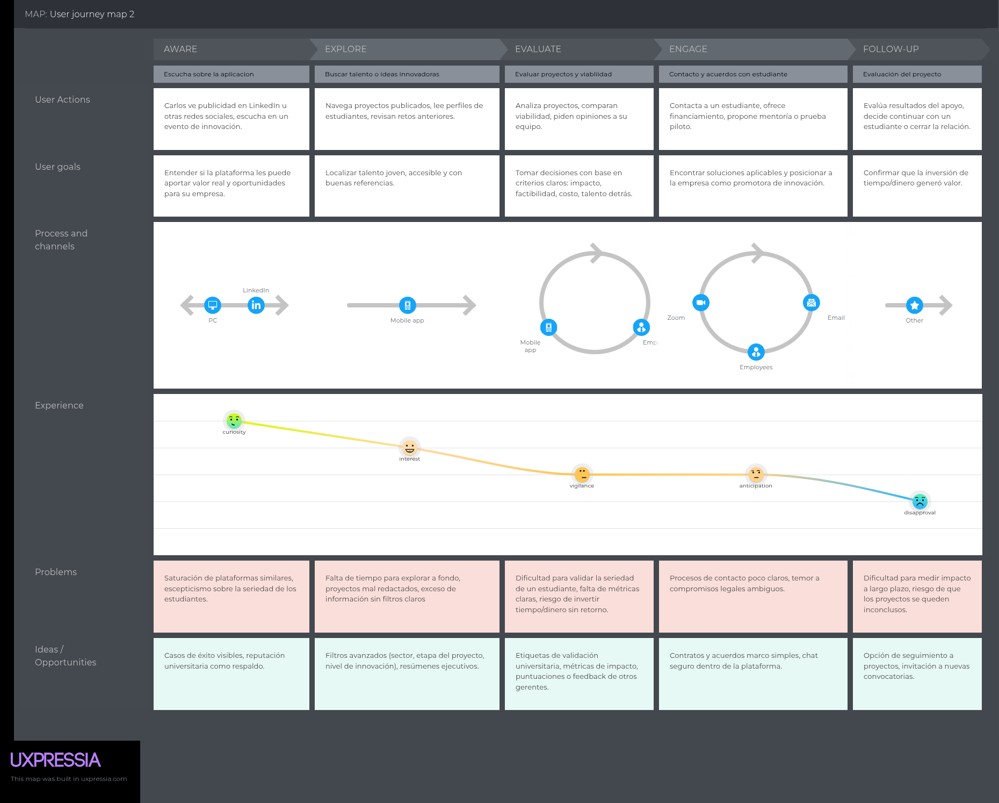

<p align="center">
  User Journey Map Carlos Fernandez - Elaboración propia
</p>

### 2.3.4. Empathy Mapping

Empathy Map Segmento 1:


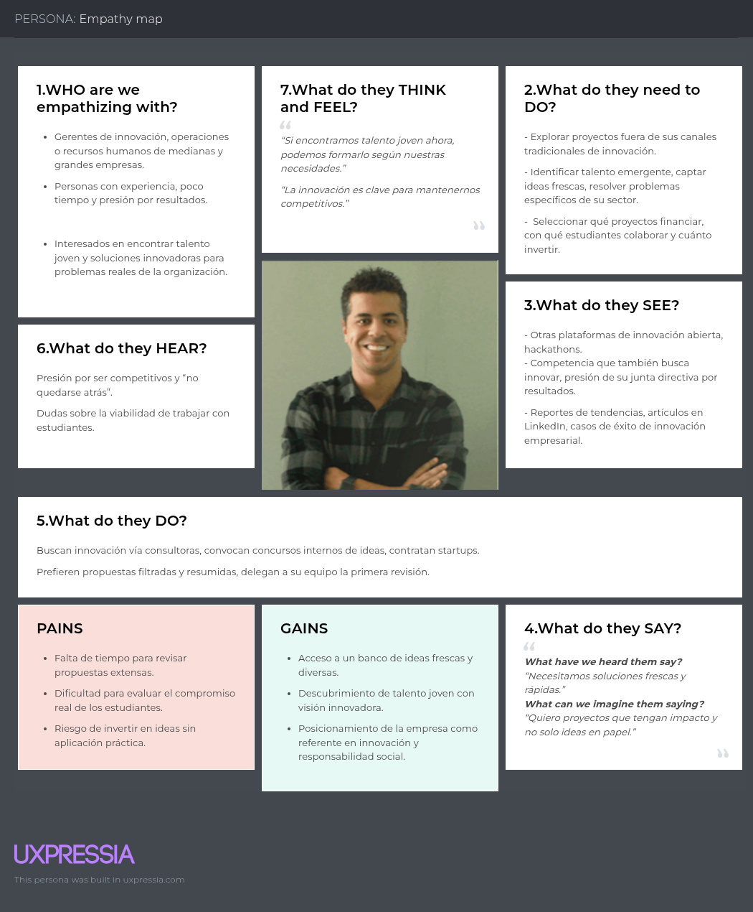

<p align="center">
  Empathy Map Segmento 1 - Elaboración propia
</p>

Empathy Map Segmento 2:

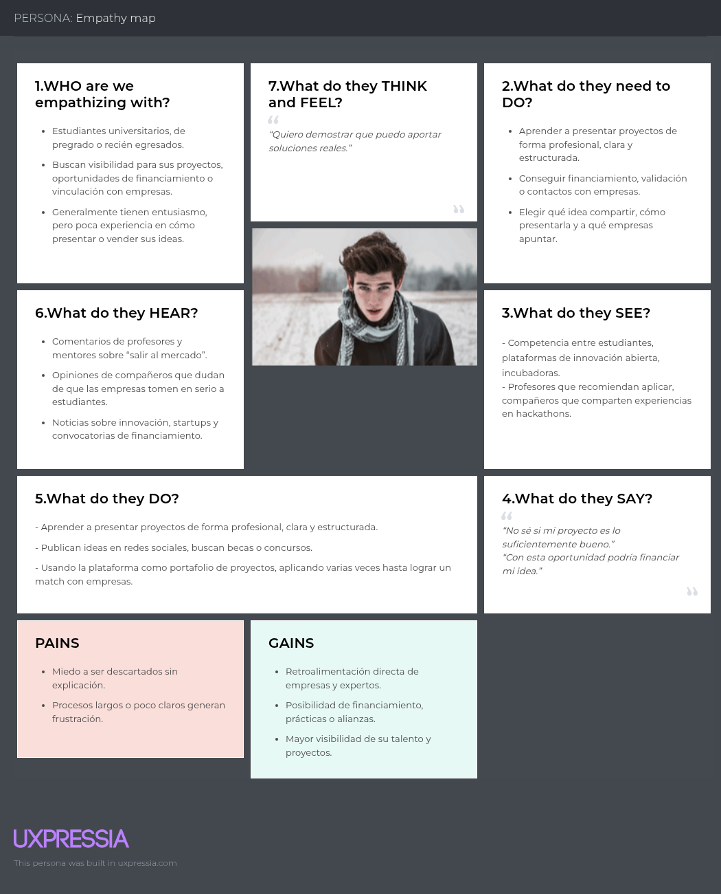

<p align="center">
  Empathy Map Segmento 2 - Elaboración propia
</p>

### 2.3.5. Ubiquitous Language

| Término (Inglés)         | Término (Español)          | Definición                                                                                                       |
| ------------------------ | -------------------------- | ---------------------------------------------------------------------------------------------------------------- |
| Student                  | Estudiante                 | Usuario que busca oportunidades para postular, compartir ideas y participar en proyectos innovadores.            |
| Manager                  | Gerente                    | Usuario que representa a la empresa, encargado de publicar proyectos y seleccionar talento joven para colaborar. |
| Project Creation          | Publicación de ideas       | Acción realizada por el estudiante para compartir propuestas o startups innovadoras en la plataforma.            |
| Opportunity Posting          | Publicación de proyecto    | Acción realizada por el gerente para dar a conocer convocatorias de proyectos disponibles.                       |
| Student Application              | Postulación                | Proceso por el cual un estudiante se inscribe a un proyecto disponible o a una convocatoria de empresa.          |
| Profile                  | Perfil profesional         | Información personal y académica que un estudiante o gerente edita para mostrar sus capacidades y experiencia.   |
| Application Status       | Estado de postulación      | Información sobre si la postulación de un estudiante está en revisión, aprobada o rechazada.                     |
| Requirement Registration | Registro de requisitos | Proceso en el que el gerente detalla las necesidades específicas del proyecto.                                   |


## 2.4. Requirements specification

### 2.4.1. User Stories

<table border ="1" >
  <tbody>
    <tr>
      <td>Epic / Story ID</td>
      <td>Título</td>
      <td>Descripción</td>
      <td>Criterios de Aceptación</td>
      <td>Relación con Epic</td>
    </tr>
    <tr>
    <td>EP01</td>
      <td>Registro y Onboarding de Usuarios</td>
      <td>
        <strong>Como</strong> nuevo usuario de la plataforma, <strong>quiero</strong> registrarme y completar un perfil profesional guiado, <strong>para</strong> poder acceder a oportunidades o gestionar talento según mi rol.
      </td>
      <td>No corresponde</td>
      <td>No corresponde</td>
    </tr>
    <tr>
      <td>EP02</td>
      <td>Gestión de Oportunidades y Proyectos</td>
      <td>
        <strong>Como</strong> gerente de una empresa, <strong>quiero</strong> publicar proyectos con requisitos personalizados, <strong>para</strong> atraer a estudiantes con el perfil adecuado y resolver tareas específicas de mi organización.
      </td>
      <td>No corresponde</td>
      <td>No corresponde</td>
    </tr>
    <tr>
      <td>EP03</td>
      <td>Exploración y Postulación a Proyectos</td>
      <td>
        <strong>Como</strong> estudiante universitario, <strong>quiero</strong> explorar y postularme a proyectos compatibles con mis habilidades e intereses, <strong>para</strong> ganar experiencia práctica y construir un portafolio sólido.</td>
      <td>No corresponde</td>
      <td>No corresponde</td>
    </tr>
    <tr>
      <td>EP04</td>
      <td>Evaluación y Retroalimentación</td>
      <td>
        <strong>Como</strong> gerente, <strong>quiero</strong> evaluar el desempeño de los estudiantes durante y al finalizar el proyecto, <strong>para</strong> asegurar la calidad del trabajo y fomentar una cultura de mejora continua.</td>
      <td>No corresponde</td>
      <td>No corresponde</td>
    </tr>
    <tr>
      <td>EP05</td>
      <td>Creación y Visualización de Portafolio</td>
      <td>
        <strong>Como</strong> estudiante, <strong>quiero</strong> subir proyectos y evidencias de mis habilidades en un portafolio digital, <strong>para</strong> mostrar mi experiencia a futuras oportunidades laborales.</td>
      <td>No corresponde</td>
      <td>No corresponde</td>
    </tr>
      <td>US01</td>
      <td>Registro de usuario</td>
      <td>
        <strong>Como</strong> usuario nuevo, <strong>quiero</strong> crear una cuenta, <strong>para</strong> poder acceder a las funciones de aplicación.
      </td>
      <td>
      <strong>Escenario 1: Estudiante crea una cuenta     </strong><br>
        <strong>Dado</strong> que el estudiante está en la pantalla de registro,
        <strong>Y</strong>   selecciona la opción “Registrarse como Estudiante”,
        <strong>cuando</strong> el estudiante ingresa un nombre de usuario, un correo electrónico y una contraseña válidos, 
        <strong>Y</strong> presiona el botón “Registrarse”,
        <strong>entonces</strong> la cuenta debe crearse correctamente.
        <br><br>
        <strong>Escenario 2: Gerente crea una cuenta     </strong><br>
        <strong>Dado</strong> que el gerente está en la pantalla de registro, <strong>Y</strong> selecciona la opción “Registrarse como Gerente”, 
        <strong>cuando</strong> el gerente ingresa un nombre de usuario, un correo electrónico y una contraseña válidos,
        <strong>Y</strong> presiona el botón “Registrarse”,
        <strong>entonces</strong> la cuenta debe crearse correctamente.
      </td>
      <td>EP01</td>
    </tr>
    <tr>
      <td>US02</td>
      <td>Inicio de sesión</td>
      <td>
        <strong>Como</strong> usuario registrado, <strong>quiero</strong> iniciar sesión, <strong>para</strong> acceder a mi cuenta y explorar los proyectos.
      </td>
      <td>
      <strong>Escenario 1: Estudiante crea una cuenta     </strong><br>
        <strong>Dado</strong> que el usuario está en la pantalla de inicio de sesión y tiene una cuenta válida,
        <strong>cuando</strong> ingresa su nombre de usuario y contraseña correctos, 
        <strong>Y</strong> presiona el botón “Iniciar sesión”,
        <strong>entonces</strong> debería acceder a su cuenta correctamente.
      </td>
      <td>EP01</td>
    </tr>
    <tr>
      <td>US03</td>
      <td>Cierre de Sesión</td>
      <td>
        <strong>Como</strong> usuario, <strong>quiero</strong> cerrar sesión de mi cuenta, <strong>para</strong> proteger mi información personal.</td>
      <td>
      <strong>Escenario 1: Usuario cierra sesión
      </strong><br>
        <strong>Dado</strong> que el usuario está autenticado y en su panel principal,
        <strong>cuando</strong> presiona el botón de “Cerrar sesión”, 
        <strong>entonces</strong> el usuario debe ser redirigido a la pantalla de inicio de sesión y la sesión debe cerrarse correctamente.
      </td>
      <td>EP01</td>
    </tr>
    <tr>
      <td>US04</td>
      <td>Recuperar contraseña</td>
      <td>
        <strong>Como</strong> usuario, <strong>quiero</strong> recuperar mi contraseña, <strong>para</strong> poder acceder a mi cuenta si la olvido.</td>
      <td>
      <strong>Escenario 1: Usuario envía solicitud de recuperación
      </strong><br>
        <strong>Dado</strong> que el usuario está en la pantalla de inicio de sesión,
        <strong>cuando</strong> haga clic en el enlace de “¿Olvidaste tu contraseña?”,
        <strong>Y</strong> proporciona su correo electrónico registrado, 
        <strong>entonces</strong> debe recibir un correo electrónico con un enlace para restablecer su contraseña.
      </td>
      <td>EP01</td>
    </tr>
    <tr>
      <td>US05</td>
      <td>Explorar proyectos de empresa</td>
      <td>
        <strong>Como</strong> estudiante, <strong>quiero</strong> explorar proyectos de empresas, <strong>para</strong> encontrar oportunidades de colaboración.</td>
      <td>
      <strong>Escenario 1: Estudiante explora proyectos de empresas
      </strong><br>
        <strong>Dado</strong> que el estudiante está en la plataforma y ha iniciado sesión,
        <strong>cuando</strong> selecciona la opción “Explorar proyectos de empresas”,
        <strong>entonces</strong> el estudiante debe ver una lista de proyectos de empresas disponibles para unirse o colaborar.
      </td>
      <td>EP03</td>
    </tr>
    <tr>
      <td>US06</td>
      <td>Gerente publica nuevo proyecto</td>
      <td>
        <strong>Como</strong> gerente, <strong>quiero
        </strong> completar un formulario con los detalles de un proyecto, <strong>para</strong> publicarlo y que los estudiantes puedan verlo y postularse.
        </td>
      <td>
      <strong>Escenario 1: Gerente crea un proyecto exitosamente
      </strong><br>
        <strong>Dado</strong> que el gerente ha iniciado sesión y está en la sección "Publicar Proyecto",
        <strong>cuando</strong> Cuando complete los campos (título, descripción, habilidades requeridas, categoría),
        <strong>Y</strong> haga clic en "Publicar",
        <strong>entonces</strong> el proyecto debe mostrarse.
      </td>
      <td>EP02</td>
    </tr>
    <tr>
      <td>US07</td>
      <td>Estudiante publica nuevo idea innovadora</td>
      <td>
        <strong>Como</strong> usuario, <strong>quiero</strong> publicar una descripción de mi idea o startup innovadora, <strong>para</strong> atraer la atención e inversión de empresas interesadas.
        </td>
      <td>
      <strong>Escenario 1: Estudiante pública una idea
      </strong><br>
        <strong>Dado</strong> que el estudiante ha iniciado sesión y navega a "Publicar mi Idea",
        <strong>cuando</strong> ingrese un título, descripción detallada y el sector de la idea,
        <strong>Y</strong> haga clic en "Publicar Idea",
        <strong>entonces</strong> la idea debe ser listada.
      </td>
      <td>EP04</td>
    </tr>
    <tr>
      <td>US08</td>
      <td>Editar Perfil de Usuario</td>
      <td>
        <strong>Como</strong> usuario registrado, <strong>quiero</strong> vditar la información de mi perfil en cualquier momento, <strong>para</strong> mantener mi perfil actualizado.</td>
      <td>
      <strong>Escenario 1: Edición exitosa exitosa
      </strong><br>
        <strong>Dado</strong> que el usuario está en la página de su perfil,
        <strong>cuando</strong> hace clic en el botón "Editar Perfil", modifica los diferentes campos de su perfil y presiona "Guardar",
        <strong>entonces</strong> se actualiza la información y se muestran los cambios en su perfil.
      </td>
      <td>EP01</td>
    </tr>
    <tr>
      <td>US09</td>
      <td>Explorar Ideas de estudiantes</td>
      <td>
        <strong>Como</strong> gerente, <strong>quiero</strong> explorar una lista de ideas innovadoras publicadas por estudiantes, <strong>para</strong> encontrar oportunidades potenciales en las que mi empresa pueda invertir.</td>
      <td>
        <strong>Escenario 1: Navegación por la lista de ideas</strong><br>
        <strong>Dado</strong> que el gerente ha iniciado sesión y está en el dashboard, <strong>cuando</strong> navega a la sección "Ideas Innovadoras",
        <strong>Y</strong> el gerente puede hacer clic en "Ver Detalles" para obtener más información, <strong>entonces</strong> el sistema muestra una lista de ideas, cada una con su título, descripción corta y el nombre del autor.
      </td>
      <td>EP05</td>
    </tr>
    <tr>
      <td>US10</td>
      <td>Búsqueda filtrada de convocatorias</td>
      <td>
        <strong>Como</strong> estudiante universitario, <strong>quiero</strong> buscar proyectos según filtros (habilidades, área académica, nivel de experiencia), <strong>para</strong> identificar oportunidades que se ajusten a mi perfil.</td>
      <td>
        <strong>Escenario 1: Búsqueda con resultados disponibles</strong><br>
        <strong>Dado</strong> que el estudiante ha iniciado sesión y se encuentra en la sección “Proyectos”, <strong>cuando</strong> aplica filtros por habilidades y área académica, <strong>entonces</strong> el sistema muestra una lista de proyectos compatibles, ordenados por relevancia, y el estudiante puede marcar algunos como favoritos.
        <br><br>
        <strong>Escenario 2: Búsqueda sin resultados     </strong><br>
        <strong>Dado</strong> que el estudiante ha iniciado sesión y aplica filtros demasiado específicos, <strong>Y</strong> selecciona la opción “Registrarse como Gerente”, 
        <strong>cuando</strong> se ejecuta la búsqueda,
        <strong>entonces</strong> el sistema no muestra proyectos disponibles y presenta el mensaje “No se encontraron proyectos” con la sugerencia de ampliar los filtros.
      </td>
      <td>EP03</td>
    </tr>
    <tr>
      <td>US11</td>
      <td>Visualización de detalles del proyecto</td>
      <td>
        <strong>Como</strong> estudiante universitario, <strong>quiero</strong> ver la descripción completa de un proyecto publicado, <strong>para</strong> decidir si postular o no.</td>
      <td>
        <strong>Escenario 1: Proyecto vigente con opción de postulación</strong><br>
        <strong>Dado</strong> qque el estudiante selecciona un proyecto activo desde la lista de proyectos, <strong>cuando</strong> abre la página de detalle, <strong>entonces</strong> el sistema muestra los requisitos, duración, beneficios, empresa y fecha límite, y el botón de “Postular” está habilitado.
        <br><br>
        <strong>Escenario 2: Proyecto caducado sin opción de postulación</strong><br>
        <strong>Dado</strong> que el estudiante selecciona un proyecto cuya fecha límite de postulación ya venció, 
        <strong>cuando</strong> abre la página de detalle,
        <strong>entonces</strong> el sistema muestra toda la información del proyecto pero el botón de “Postular” aparece deshabilitado junto al mensaje “Cerrado”.
      </td>
      <td>EP03</td>
    </tr>
    <tr>
      <td>US12</td>
      <td>Postulación en línea</td>
      <td>
        <strong>Como</strong> estudiante universitario, <strong>quiero</strong> postular a un proyecto cargando mi CV o perfil digital, <strong>para</strong> para mostrar mis habilidades y experiencia al reclutador.
      </td>
      <td>
        <strong>Escenario 1: Postulación exitosa con perfil completo cada bloque</strong><br>
        <strong>Dado</strong> que el estudiante tiene su perfil completo en la plataforma, <strong>cuando</strong> postula en “Postular” y adjunta su CV, <strong>entonces</strong> el sistema registra la postulación y muestra el mensaje “Postulación enviada con éxito”.
        <br><br>
        <strong>Escenario 2: Postulación rechazada por perfil incompleto</strong><br>
        <strong>Dado</strong> que el estudiante no completó la información mínima de su perfil, 
        <strong>cuando</strong> intenta postular a un proyecto,
        <strong>entonces</strong> el sistema muestra el mensaje “Completa tu perfil antes de postular” y no registra la solicitud.
      </td>
      <td>EP03</td>
    </tr>
    <tr>
      <td>US13</td>
      <td>Seguimiento de postulaciones</td>
      <td>
        <strong>Como</strong> estudiante universitario, <strong>quiero</strong>ver el estado de mis postulaciones (en revisión, aceptado, rechazado), <strong>para</strong> organizar mis próximos pasos.
      </td>
      <td>
        <strong>Escenario 1: Panel con postulaciones activas</strong><br>
        <strong>Dado</strong> que el estudiante ya postuló a varios proyectos, <strong>cuando</strong> ingresa al panel de postulaciones, <strong>entonces</strong> el sistema muestra cada proyecto con su estado actualizado (en revisión, aceptado o rechazado).
      </td>
      <td>EP03</td>
    </tr>
    <tr>
      <td>US14</td>
      <td>Construcción de portafolio</td>
      <td>
        <strong>Como</strong> estudiante universitario, <strong>quiero</strong> que los proyectos en los que participé exitosamente se registren en mi portafolio, <strong>para</strong> demostrar mi experiencia a futuras empresas.
      </td>
      <td>
        <strong>Escenario 1: Proyecto validado agregado al portafolio</strong><br>
        <strong>Dado</strong> que el estudiante ha finalizado un proyecto y la empresa lo marcó como “Completado”, <strong>cuando</strong> crevisa su portafolio, <strong>entonces</strong> el sistema muestra automáticamente el proyecto con el rol desempeñado, duración y competencias aplicadas.
        <br><br>
        <strong>Escenario 2: Proyecto pendiente de validación</strong><br>
        <strong>Dado</strong> que el estudiante finalizó un proyecto pero la empresa aún no confirma la finalización, 
        <strong>cuando</strong> revisa su portafolio,
        <strong>entonces</strong> el sistema no muestra el proyecto y aparece la nota “Pendiente de validación”.
      </td>
      <td>EP03</td>
    </tr>
    <tr>
      <td>US15</td>
      <td>Guardado de Convocatorias Favoritos</td>
      <td>
        <strong>Como</strong> estudiante, <strong>quiero</strong> guardar proyectos como favoritos, <strong>para</strong> revisarlos más tarde antes de postular.
      </td>
      <td>
        <strong>Escenario 1: Guardar proyecto como favorito</strong><br>
        <strong>Dado</strong> que un estudiante navega por proyectos, <strong>cuando</strong> haga clic en “Guardar en Favoritos”, <strong>entonces</strong> entonces el proyecto debe añadirse a su lista personal.
        <br><br>
        <strong>Escenario 2: Postular desde el listado de favoritos</strong><br>
        <strong>Dado</strong> que el estudiante revisa su lista de favoritos, <strong>cuando</strong> da click en la opción "favoritos", <strong>entonces</strong> debe ver todos los proyectos marcados con la opción de postular directamente desde ahí.
      </td>
      <td>EP03</td>
    </tr>
    <tr>
      <td>US16</td>
      <td>Filtrado de estudiantes</td>
      <td>
        <strong>Como</strong> gerente, <strong>quiero</strong>  filtrar estudiantes por habilidades y nivel académico, <strong>para</strong> para identificar candidatos adecuados más rápido.
      </td>
      <td>
        <strong>Escenario 1: Filtrado exitoso por habilidades</strong><br>
        <strong>Dado</strong> que el gerente aplica filtros, <strong>cuando</strong> selecciona habilidades específicas, <strong>entonces</strong> aparece la lista de estudiantes que cumplen.
        <br><br>
        <strong>Escenario 2: Manejo de filtros sin resultados</strong><br>
        <strong>Dado</strong> que el gerente aplica filtros, <strong>cuando</strong> cuando no hay coincidencias, <strong>entonces</strong> entonces el sistema muestra el mensaje “No se encontraron estudiantes con estos criterios”.
      </td>
      <td>EP03</td>
    </tr>
    <tr>
      <td>US17</td>
      <td>Registro inmediato desde la landing</td>
      <td>
        <strong>Como</strong> usuario nuevo, <strong>quiero</strong>  acceder rápidamente al formulario de registro, <strong>para</strong> comenzar a usar la plataforma sin perder tiempo.
      </td>
      <td>
        <strong>Escenario 1: Acceso directo desde el encabezado</strong><br>
        <strong>Dado</strong> qque soy un usuario que visita la landing por primera vez, <strong>cuando</strong> shago clic en el botón "Empieza" ubicado en el encabezado, <strong>entonces</strong> soy redirigido al formulario de registro correspondiente (estudiante o gerente).
      </td>
      <td>EP01</td>
    </tr>
    <tr>
      <td>US18</td>
      <td>Llamados a la acción claros en cada sección</td>
      <td>
        <strong>Como</strong> usuario, <strong>quiero</strong> encontrar botones de acción relevantes a lo largo de la landing, <strong>para</strong> tomar decisiones sin tener que regresar al inicio.
      </td>
      <td>
        <strong>Escenario 1: CTA visibles al finalizar cada bloque</strong><br>
        <strong>Dado</strong> que estoy navegando por secciones como “¿Cómo funciona?” o “Casos de éxito”, <strong>cuando</strong> llego al final de una sección, <strong>entonces</strong> encuentro un botón como “Regístrate ahora” o “Publica tu primer proyecto” de forma clara y destacada.
      <td>EP01</td>
    </tr>
    <tr>
      <td>TS01</td>
      <td>Configuración de autenticación y roles</td>
      <td>
        Como desarrollador, quiero implementar un sistema de autenticación que distinga entre los roles de estudiante y gerente, para garantizar un acceso seguro y una experiencia personalizada según el tipo de usuario.
      </td>
      <td>
        Escenario 1: Registro de nuevo estudiante.
        Dado que un usuario nuevo ingresa al formulario de registro, Cuando completa sus datos personales y selecciona el rol Estudiante, Entonces el sistema crea su cuenta, asigna el rol correspondiente y lo redirige al dashboard de estudiante. Escenario 2: Inicio de sesión de gerente Dado que un gerente registrado accede a la pantalla de inicio de sesión, Cuando introduce su correo y contraseña válidos, Entonces el sistema autentica al usuario y muestra el dashboard del rol gerente, ocultando las funciones del perfil estudiante.
      <td></td>
    </tr>
    <tr>
      <td>TS02</td>
      <td>Estructura de base de datos para gestión de proyectos y convocatorias</td>
      <td>
        Como desarrollador, quiero diseñar y configurar la base de datos que almacene usuarios, proyectos, convocatorias y solicitudes, para permitir la comunicación fluida entre estudiantes y gerentes.
      </td>
      <td>
        Escenario 1: Registro de convocatoria por gerente Dado que un gerente completa el formulario “Nueva convocatoria”, Cuando presiona el botón Publicar, Entonces el sistema guarda los datos en la colección “Convocatorias” y los asocia al ID del gerente creador. Escenario 2: Publicación de proyecto por estudiante Dado que un estudiante finaliza el registro de un nuevo proyecto, Cuando guarda los cambios, Entonces la información se almacena en la colección “Proyectos” y se vincula automáticamente con el portafolio del estudiante.
      <td></td>
    </tr>
    <tr>
      <td>TS03</td>
      <td>Bottom Navigation Bar</td>
      <td>
        Como desarrollador, quiero implementar una barra de navegación inferior que conecte las secciones principales del sistema (Explorar, Mis proyectos/convocatorias, Solicitudes y Perfil), para mantener coherencia visual y facilidad de uso.
      </td>
      <td>
        Escenario 1: Cambio de secciones por parte del estudiante Dado que el estudiante se encuentra en la pantalla “Explorar”, Cuando selecciona el ícono Portafolio en la barra inferior, Entonces el sistema muestra la vista “Mi Portafolio” sin pérdida de navegación. Escenario 2: Retorno al inicio del gerente Dado que el gerente está revisando sus convocatorias, Cuando toca el ícono Explorar de la barra inferior, Entonces la aplicación lo redirige correctamente a la vista de exploración de proyectos estudiantiles.
      <td></td>
    </tr>
    <tr>
      <td>TS04</td>
      <td>Registrarse</td>
      <td>
        Como desarrollador, quiero implementar el registro de nuevos usuarios (estudiantes o gerentes), para permitir su acceso inicial a la plataforma.
      </td>
      <td>
        Escenario 1: Registro exitoso Dado que un nuevo usuario completa correctamente el formulario de registro, Cuando presiona el botón Crear cuenta, Entonces el sistema crea su usuario, asigna el rol correspondiente y redirige al dashboard de bienvenida. Escenario 2: Registro con correo duplicado Dado que un usuario intenta registrarse con un correo ya existente, Cuando envía el formulario, Entonces el sistema muestra un mensaje de error indicando que el correo ya está en uso.
      <td></td>
    </tr>
    <tr>
      <td>TS05</td>
      <td>Iniciar Sesión</td>
      <td>
        Como desarrollador, quiero permitir que los usuarios inicien sesión con sus credenciales válidas, para acceder de forma segura según su rol.
      </td>
      <td>
        Escenario 1: Inicio de sesión exitoso Dado que el usuario tiene una cuenta registrada, Cuando introduce su correo y contraseña correctos, Entonces el sistema autentica su identidad y muestra el panel correspondiente a su rol. Escenario 2: Inicio de sesión fallido Dado que un usuario introduce credenciales incorrectas, Cuando intenta iniciar sesión, Entonces el sistema muestra un mensaje de error y no permite el acceso.
      <td></td>
    </tr>
    <tr>
      <td>TS06</td>
      <td>Actualizar Usuario</td>
      <td>
        Como desarrollador, quiero permitir la actualización de los datos de usuario (nombre, correo, contraseña) para mantener la información actualizada.
      </td>
      <td>
        Escenario 1: Actualización exitosa Dado que un usuario autenticado accede a su perfil, Cuando edita sus datos y guarda los cambios, Entonces el sistema actualiza la información en la base de datos. Escenario 2: Intento sin permisos Dado que un usuario intenta modificar los datos de otro usuario, Cuando realiza una solicitud de actualización, Entonces el sistema rechaza la acción y muestra un mensaje de acceso denegado.
      <td></td>
    </tr>
    <tr>
      <td>TS07</td>
      <td>Obtener todos los usuarios</td>
      <td>
        Como desarrollador, quiero listar todos los usuarios registrados, para fines de administración o validación interna.
      </td>
      <td>
        Escenario 1: Solicitud válida Dado que un administrador solicita la lista de usuarios, Cuando el sistema procesa la solicitud, Entonces devuelve un listado con todos los usuarios y sus roles. Escenario 2: Solicitud sin permisos Dado que un usuario sin rol de administrador intenta obtener todos los usuarios, Cuando ejecuta la solicitud, Entonces el sistema responde con un error de autorización.
      <td></td>
    </tr>
    <tr>
      <td>TS08</td>
      <td>Obtener usuario por Id</td>
      <td>
        Como desarrollador, quiero obtener la información de un usuario específico mediante su ID, para mostrar su perfil detallado.
      </td>
      <td>
        Escenario 1: ID válido Dado que se solicita un usuario existente por su ID, Cuando el sistema consulta la base de datos, Entonces devuelve los datos completos del usuario. Escenario 2: ID no encontrado Dado que se ingresa un ID inexistente, Cuando el sistema intenta recuperarlo, Entonces devuelve un mensaje indicando que el usuario no existe.
      <td></td>
    </tr>
    <tr>
      <td>TS09</td>
      <td>Crear perfil de estudiante</td>
      <td>
        Como desarrollador, quiero crear el perfil de un estudiante asociado a su usuario, para mostrar sus habilidades y estudios.
      </td>
      <td>
        Escenario 1: Creación exitosa Dado que un estudiante recién registrado accede a la opción “Crear perfil”, Cuando completa el formulario y guarda, Entonces el sistema genera su perfil y lo asocia a su usuario. Escenario 2: Perfil duplicado Dado que un estudiante intenta crear otro perfil, Cuando ya tiene uno asociado, Entonces el sistema bloquea la acción y muestra un mensaje indicando que el perfil ya existe.
      <td></td>
    </tr>
    <tr>
      <td>TS10</td>
      <td>Actualizar perfil de estudiante por Id</td>
      <td>
        Como desarrollador, quiero permitir que un estudiante actualice su perfil por ID, para mantener su información vigente.
      </td>
      <td>
        Escenario 1: Actualización correcta Dado que un estudiante accede a su perfil, Cuando modifica su descripción y habilidades, Entonces el sistema guarda los cambios exitosamente. Escenario 2: Actualización fallida Dado que el estudiante intenta actualizar un campo no permitido, Cuando envía los cambios, Entonces el sistema muestra un mensaje de error y no aplica la modificación.
      <td></td>
    </tr>
    <tr>
      <td>TS11</td>
      <td>Obtener perfil de estudiante por Id</td>
      <td>
        Como desarrollador, quiero obtener el perfil de un estudiante por su ID, para mostrarlo en la vista de detalle.
      </td>
      <td>
        Escenario 1: ID válido Dado que un gerente busca el perfil de un estudiante, Cuando se envía la solicitud con un ID existente, Entonces el sistema muestra los datos del perfil solicitado. Escenario 2: ID inexistente Dado que se consulta un ID no registrado, Cuando el sistema intenta obtener los datos, Entonces devuelve un mensaje indicando que no se encontró el perfil.
      <td></td>
    </tr>
    <tr>
      <td>TS12</td>
      <td>Obtener perfiles de estudiante</td>
      <td>
        Como desarrollador, quiero listar los perfiles de estudiantes para permitir su visualización por parte de los gerentes.
      </td>
      <td>
        Escenario 1: Listado general Dado que un gerente accede a la sección “Explorar estudiantes”, Cuando el sistema obtiene los perfiles, Entonces muestra una lista con nombre, carrera y habilidades. Escenario 2: Filtro aplicado Dado que el gerente busca perfiles por categoría, Cuando aplica un filtro (por carrera o habilidad), Entonces el sistema muestra solo los perfiles que coinciden.
      <td></td>
    </tr>
    <tr>
      <td>TS13</td>
      <td>Crear perfil de manager</td>
      <td>
        Como desarrollador, quiero permitir la creación de un perfil de gerente asociado a su usuario, para que pueda mostrar la información de su empresa y área de innovación.
      </td>
      <td>
        Escenario 1: Creación exitosa Dado que un gerente ha completado su registro de usuario, Cuando ingresa a la opción Crear perfil de empresa y llena todos los campos requeridos, Entonces el sistema crea el perfil y lo vincula correctamente al ID del usuario. Escenario 2: Perfil ya existente Dado que el gerente intenta crear un nuevo perfil teniendo uno activo, Cuando presiona Guardar, Entonces el sistema muestra un mensaje indicando que el perfil ya ha sido creado.
      <td></td>
    </tr>
    <tr>
      <td>TS14</td>
      <td>Actualizar perfil de manager por Id</td>
      <td>
        Como desarrollador, quiero permitir que los gerentes actualicen su perfil por ID, para mantener actualizada la información de la empresa.
      </td>
      <td>
        Escenario 1: Actualización válida Dado que un gerente autenticado accede a su perfil, Cuando modifica su cargo o descripción empresarial, Entonces el sistema guarda los cambios en la base de datos. Escenario 2: Actualización no autorizada Dado que un usuario intenta modificar el perfil de otro gerente, Cuando envía la solicitud, Entonces el sistema bloquea la acción y muestra un mensaje de acceso denegado.
      <td></td>
    </tr>
    <tr>
      <td>TS14</td>
      <td>Actualizar perfil de manager por Id</td>
      <td>
        Como desarrollador, quiero permitir que los gerentes actualicen su perfil por ID, para mantener actualizada la información de la empresa.
      </td>
      <td>
        Escenario 1: Actualización válida Dado que un gerente autenticado accede a su perfil, Cuando modifica su cargo o descripción empresarial, Entonces el sistema guarda los cambios en la base de datos. Escenario 2: Actualización no autorizada Dado que un usuario intenta modificar el perfil de otro gerente, Cuando envía la solicitud, Entonces el sistema bloquea la acción y muestra un mensaje de acceso denegado.
      <td></td>
    </tr>
    <tr>
      <td>TS15</td>
      <td>Obtener perfil de manager por Id</td>
      <td>
        Como desarrollador, quiero obtener el perfil de un gerente por su ID, para mostrarlo a los estudiantes interesados en sus convocatorias.
      </td>
      <td>
        Escenario 1: ID válido Dado que un estudiante consulta el perfil de un gerente específico, Cuando se envía el ID correspondiente, Entonces el sistema devuelve los datos completos del perfil empresarial. Escenario 2: ID inexistente Dado que se solicita un ID no registrado, Cuando el sistema intenta obtener los datos, Entonces muestra un mensaje informando que el perfil no existe.
      <td></td>
    </tr>
    <tr>
      <td>TS16</td>
      <td>Obtener perfiles de manager</td>
      <td>
        Como desarrollador, quiero obtener todos los perfiles de gerentes, para que los estudiantes puedan conocer a las empresas que publican convocatorias.
      </td>
      <td>
        Escenario 1: Listado general Dado que un estudiante accede a la sección Explorar empresas, Cuando el sistema carga los datos, Entonces muestra una lista de gerentes con su empresa y área de especialización. Escenario 2: Filtrado por rubro Dado que el estudiante busca empresas de un sector específico, Cuando aplica un filtro por rubro o categoría, Entonces el sistema muestra únicamente los perfiles que cumplen con ese criterio.
      <td></td>
    </tr>
    <tr>
      <td>TS17</td>
      <td>Crear convocatoria</td>
      <td>
        Como desarrollador, quiero permitir que los gerentes creen convocatorias, para que los estudiantes puedan postular a proyectos de innovación.
      </td>
      <td>
        Escenario 1: Creación exitosa Dado que un gerente autenticado completa el formulario de nueva convocatoria, Cuando presiona el botón Publicar, Entonces el sistema guarda la convocatoria y la asocia a su perfil. Escenario 2: Campos incompletos Dado que el gerente deja campos obligatorios sin llenar, Cuando intenta guardar la convocatoria, Entonces el sistema muestra un mensaje indicando los campos faltantes.
      <td></td>
    </tr>
    <tr>
      <td>TS18</td>
      <td>Actualizar convocatoria</td>
      <td>
        Como desarrollador, quiero permitir que el gerente edite una convocatoria activa, para actualizar información antes de su cierre.
      </td>
      <td>
        Escenario 1: Edición correcta Dado que el gerente desea modificar la descripción o requisitos, Cuando guarda los cambios, Entonces el sistema actualiza los datos y mantiene la convocatoria activa. Escenario 2: Edición no permitida Dado que la convocatoria ya está cerrada, Cuando el gerente intenta modificarla, Entonces el sistema rechaza la edición y muestra un aviso informativo.
      <td></td>
    </tr>
    <tr>
      <td>TS19</td>
      <td>Cambiar estado de convocatoria a publicado</td>
      <td>
        Como desarrollador, quiero permitir que el gerente publique una convocatoria, para que los estudiantes puedan visualizarla y postularse.
      </td>
      <td>
        Escenario 1: Publicación válida Dado que la convocatoria está en estado borrador, Cuando el gerente presiona Publicar, Entonces el sistema cambia el estado a Publicado y la muestra en el listado de exploración. Escenario 2: Publicación fallida Dado que la convocatoria tiene información incompleta, Cuando el gerente intenta publicarla, Entonces el sistema muestra un error indicando que no cumple con los requisitos mínimos.
      <td></td>
    </tr>
    <tr>
      <td>TS20</td>
      <td>Cambiar estado de convocatoria a cerrado</td>
      <td>
        Como desarrollador, quiero permitir que un gerente cierre una convocatoria, para finalizar su periodo de postulaciones.
      </td>
      <td>
        Escenario 1: Cierre exitoso Dado que la fecha límite de la convocatoria ha vencido, Cuando el gerente la marca como Cerrada, Entonces el sistema actualiza su estado y la retira de la vista pública. Escenario 2: Intento de cierre prematuro Dado que la convocatoria aún se encuentra activa, Cuando el gerente intenta cerrarla antes de la fecha, Entonces el sistema solicita confirmación antes de proceder.
      <td></td>
    </tr>
    <tr>
      <td>TS21</td>
      <td>Borrar convocatoria</td>
      <td>
        Como desarrollador, quiero permitir eliminar una convocatoria existente, para mantener la base de datos limpia y actualizada.
      </td>
      <td>
        Escenario 1: Eliminación válida Dado que el gerente desea eliminar una convocatoria inactiva, Cuando confirma la acción, Entonces el sistema elimina el registro y muestra un mensaje de éxito. Escenario 2: Eliminación no autorizada Dado que un usuario intenta borrar una convocatoria que no creó, Cuando envía la solicitud, Entonces el sistema rechaza la acción y notifica falta de permisos.
      <td></td>
    </tr>
    <tr>
      <td>TS22</td>
      <td>Obtener convocatoria por Id</td>
      <td>
        Como desarrollador, quiero obtener la información completa de una convocatoria específica mediante su ID, para mostrar su detalle.
      </td>
      <td>
        Escenario 1: ID válido Dado que un estudiante selecciona una convocatoria, Cuando el sistema consulta la base de datos, Entonces devuelve el detalle completo de la convocatoria seleccionada. Escenario 2: ID inválido Dado que el sistema recibe un ID que no existe, Cuando intenta recuperar la información, Entonces muestra un mensaje indicando que la convocatoria no fue encontrada.
      <td></td>
    </tr>
    <tr>
      <td>TS23</td>
      <td>Obtener todas las convocatorias</td>
      <td>
        Como desarrollador, quiero obtener todas las convocatorias activas, para que los estudiantes puedan explorarlas.
      </td>
      <td>
        Escenario 1: Listado general Dado que un estudiante ingresa a Explorar Convocatorias, Cuando el sistema solicita los registros activos, Entonces muestra una lista con las convocatorias publicadas. Escenario 2: Búsqueda filtrada Dado que el estudiante aplica un filtro por categoría o empresa, Cuando el sistema procesa la búsqueda, Entonces muestra solo las convocatorias que coinciden con el criterio.
      <td></td>
    </tr>
    <tr>
      <td>TS24</td>
      <td>Crear Proyecto</td>
      <td>
        Como desarrollador, quiero permitir que un estudiante cree un nuevo proyecto, para incluirlo en su portafolio y hacerlo visible a los gerentes.
      </td>
      <td>
        Escenario 1: Creación exitosa Dado que un estudiante autenticado completa el formulario de creación de proyecto, Cuando presiona el botón Guardar, Entonces el sistema crea el registro del proyecto y lo asocia al ID del estudiante. Escenario 2: Campos incompletos Dado que el estudiante deja vacíos campos obligatorios (como título o descripción), Cuando intenta guardar el proyecto, Entonces el sistema muestra un mensaje indicando que debe completar los campos requeridos.
      <td></td>
    </tr>
    <tr>
      <td>TS25</td>
      <td>Actualizar Proyecto</td>
      <td>
        Como desarrollador, quiero permitir que el estudiante actualice la información de su proyecto, para mantenerla vigente y corregir errores.
      </td>
      <td>
        Escenario 1: Actualización válida Dado que un estudiante accede a su proyecto, Cuando modifica el contenido y guarda los cambios, Entonces el sistema actualiza la información correctamente en la base de datos. Escenario 2: Actualización no permitida Dado que un usuario intenta editar un proyecto que no le pertenece, Cuando realiza la solicitud, Entonces el sistema rechaza la acción y muestra un mensaje de acceso denegado.
      <td></td>
    </tr>
    <tr>
      <td>TS26</td>
      <td>Cambiar estado de proyecto a publicado</td>
      <td>
        Como desarrollador, quiero permitir que los estudiantes cambien el estado de su proyecto a Publicado, para hacerlo visible a los gerentes interesados.
      </td>
      <td>
        Escenario 1: Publicación exitosa Dado que un estudiante ha completado todos los datos del proyecto, Cuando selecciona la opción Publicar, Entonces el sistema cambia el estado del proyecto a Publicado y lo muestra en la sección de exploración. Escenario 2: Publicación rechazada Dado que el proyecto está incompleto, Cuando el estudiante intenta publicarlo, Entonces el sistema muestra un mensaje de error indicando que faltan datos requeridos.
      <td></td>
    </tr>
    <tr>
      <td>TS27</td>
      <td>Cambiar estado de proyecto a cerrado</td>
      <td>
        Como desarrollador, quiero permitir que los estudiantes cambien el estado de sus proyectos a Cerrado, cuando ya no deseen recibir solicitudes o colaboraciones.
      </td>
      <td>
        Escenario 1: Cierre exitoso Dado que el proyecto está actualmente publicado, Cuando el estudiante selecciona la opción Cerrar proyecto, Entonces el sistema cambia el estado a Cerrado y lo retira de la lista pública. Escenario 2: Cierre inválido Dado que el proyecto ya está en estado Cerrado, Cuando el usuario intenta cerrarlo nuevamente, Entonces el sistema muestra un aviso indicando que ya no es posible la acción.
      <td></td>
    </tr>
    <tr>
      <td>TS28</td>
      <td>Creación de Solicitud de Colaboración</td>
      <td>
        Como desarrollador, quiero permitir que un gerente envíe una solicitud de colaboración a un proyecto de un estudiante, para iniciar un posible trabajo conjunto y mentoría.
      </td>
      <td>
        Escenario 1: Solicitud exitosa. 
        Dado que un gerente está viendo un proyecto de un estudiante que le interesa, Cuando presiona el botón "Solicitar Colaboración", Entonces el sistema registra la solicitud con estado "pendiente".
      <td></td>
    </tr>
    <tr>
      <td>TS29</td>
      <td>Rechazar solicitud de colaboración</td>
      <td>
        Como desarrollador, quiero permitir que un estudiante rechace una solicitud de colaboración de un gerente, para gestionar sus solicitudes entrantes.
      </td>
      <td>
        Escenario 1: Rechazo exitoso. 
        Dado que un estudiante tiene una solicitud de colaboración pendiente de un gerente, Cuando presiona el botón "Rechazar", Entonces el sistema actualiza el estado de la solicitud a "Rechazada".
      <td></td>
    </tr>
    <tr>
      <td>TS30</td>
      <td>Aceptar solicitud de colaboración</td>
      <td>
        Como desarrollador, quiero permitir que un estudiante acepte una solicitud de colaboración de un gerente, para confirmar el interés en trabajar juntos.
      </td>
      <td>
        Escenario 1: Aceptación exitosa. 
        Dado que un estudiante tiene una solicitud de colaboración pendiente, Cuando presiona el botón "Aceptar", Entonces el sistema actualiza el estado de la solicitud a "Aceptada".
      <td></td>
    </tr>
    <tr>
      <td>TS31</td>
      <td>Obtener solicitudes de colaboración por proyecto</td>
      <td>
        Como desarrollador, quiero mostrar al estudiante todas las solicitudes de colaboración que ha recibido para un proyecto específico, para facilitar su revisión y gestión.
      </td>
      <td>
        Escenario 1: Listado de solicitudes.
        Dado que un estudiante accede a la vista de detalle de su proyecto publicado, Cuando selecciona la pestaña "Solicitudes de Colaboración", Entonces el sistema muestra una lista de todas las solicitudes de gerentes (pendientes, aceptadas, rechazadas) para ese proyecto.
        Escenario 2: Proyecto sin solicitudes. Dado que un estudiante revisa un proyecto que no ha recibido solicitudes de colaboración, Cuando accede a la pestaña "Solicitudes de Colaboración", Entonces el sistema muestra un mensaje indicando que "Aún no hay solicitudes".
      <td></td>
    </tr>
    <tr>
      <td>TS32</td>
      <td>Enviar postulación a convocatoria</td>
      <td>
        Como desarrollador, quiero permitir que un estudiante postule a una convocatoria de una empresa, para expresar su interés en participar.
      </td>
      <td>
        Escenario 1: Postulación exitosa. 
        Dado que un estudiante está viendo una convocatoria de su interés, Cuando presiona el botón "Postular", Entonces el sistema crea la postulación con estado "pendiente".
      <td></td>
    </tr>
    <tr>
      <td>TS33</td>
      <td>Rechazar postulación de estudiante</td>
      <td>
        Como desarrollador, quiero permitir que un gerente rechace la postulación de un estudiante a una de sus convocatorias, para gestionar el proceso de selección.
      </td>
      <td>
        Escenario 1: Rechazo exitoso. 
        Dado que un gerente está revisando las postulaciones pendientes de una convocatoria, Cuando presiona "Rechazar" en la postulación de un estudiante, Entonces el sistema actualiza el estado de la postulación a "Rechazada".
      <td></td>
    </tr>
    <tr>
      <td>TS34</td>
      <td>Aceptar postulación de estudiante</td>
      <td>
        Como desarrollador, quiero permitir que un gerente acepte la postulación de un estudiante a una convocatoria, para avanzar en el proceso de selección.
      </td>
      <td>
        Escenario 1: Aceptación exitosa. 
        Dado que un gerente está revisando una postulación pendiente, Cuando presiona el botón "Aceptar", Entonces el sistema actualiza el estado de la postulación a "Aceptada".
      <td></td>
    </tr>
    <tr>
      <td>TS35</td>
      <td>Obtener detalle de postulación</td>
      <td>
        Como desarrollador, quiero obtener los detalles de una postulación específica, para mostrar el estado y la información relevante tanto al estudiante como al gerente.
      </td>
      <td>
        Escenario 1: Consulta de gerente. 
        Dado que un gerente selecciona una postulación de su lista, Cuando el sistema carga los datos, Entonces muestra el detalle de la postulación, incluyendo el perfil del estudiante y el estado actual.
      <td></td>
    </tr>
  </tbody>
</table>

<table>
  <tr>
    <th>Spike ID</th>
    <th>Spike Story</th>
  </tr>

  <tr>
    <td><b>SP01</b></td>
    <td>
      <b>Nombre:</b> Validar la Integración de Firebase Authentication y Firestore para el Módulo de Autenticación y Perfiles.<br><br>
      <b>Contexto:</b>  
      La aplicación móvil <i>InnoSpace</i> requiere autenticación segura y diferenciada por roles (Estudiante y Gerente), además de un almacenamiento eficiente para perfiles y proyectos.  
      El equipo evaluará <b>Firebase Authentication</b> y <b>Firestore</b> como posibles servicios gestionados que permitan manejar usuarios, roles y escalabilidad sin infraestructura propia.<br><br>
      <b>Objetivo:</b>  
      Investigar la integración de Firebase Authentication y Firestore en la app móvil InnoSpace para validar viabilidad técnica, rendimiento y control de roles.<br><br>
      <b>Criterios de Aceptación (Given–When–Then):</b><br>
      1. <b>Dado</b> que el equipo necesita entender la gestión de usuarios en Firebase,  
         <b>Cuando</b> el desarrollador revisa la documentación de autenticación y base de datos,  
         <b>Entonces</b> documenta el flujo recomendado para registro, login y permisos.<br><br>
      2. <b>Dado</b> que se requiere un flujo funcional,  
         <b>Cuando</b> se implementa un prototipo de registro e inicio de sesión,  
         <b>Entonces</b> el sistema autentica correctamente y crea usuarios en Firestore.<br><br>
      3. <b>Dado</b> que InnoSpace distingue entre Estudiantes y Gerentes,  
         <b>Cuando</b> el desarrollador configura roles y reglas de seguridad,  
         <b>Entonces</b> las operaciones respetan las restricciones por rol.<br><br>
      4. <b>Dado</b> que la app móvil requiere tiempos de respuesta bajos,  
         <b>Cuando</b> se ejecutan pruebas de autenticación,  
         <b>Entonces</b> se documentan métricas de rendimiento y estabilidad.<br><br>
      <b>Definition of Done (DoD):</b><br>
      • Se entrega un prototipo funcional de login/registro.<br>
      • Se documentan configuraciones y tiempos de respuesta.<br>
      • Se presenta un informe y se decide la adopción de Firebase.<br>
    </td>
  </tr>
  <tr>
    <td><b>SP02</b></td>
    <td>
      <b>Nombre:</b> Evaluar Alternativas de Almacenamiento para Portafolios Estudiantiles (Firebase Storage vs. Cloudinary).<br><br>
      <b>Contexto:</b>  
      Los portafolios de los estudiantes en <i>InnoSpace</i> incluyen imágenes, PDFs y enlaces externos.  
      El equipo de desarrollo necesita definir la mejor solución para almacenamiento seguro y ágil, considerando tiempo de carga, seguridad y costos.<br><br>
      <b>Objetivo:</b>  
      Investigar y comparar <b>Firebase Storage</b> y <b>Cloudinary</b> como soluciones para almacenar archivos multimedia, determinando la opción más eficiente y económica.<br><br>
      <b>Criterios de Aceptación (Given–When–Then):</b><br>
      1. <b>Dado</b> que el equipo necesita conocer costos y límites de ambos servicios,  
         <b>Cuando</b> el desarrollador revisa la documentación de precios y políticas,  
         <b>Entonces</b> se documentan ventajas, costos y límites mensuales.<br><br>
      2. <b>Dado</b> que los estudiantes subirán imágenes y PDFs,  
         <b>Cuando</b> el desarrollador crea un prototipo de carga y descarga en ambos servicios,  
         <b>Entonces</b> se comparan tiempos de carga, facilidad y rendimiento.<br><br>
      3. <b>Dado</b> que los archivos deben estar protegidos,  
         <b>Cuando</b> se evalúan las opciones de acceso privado y autenticado,  
         <b>Entonces</b> se determina qué servicio ofrece mejor control de seguridad.<br><br>
      <b>Definition of Done (DoD):</b><br>
      • Informe comparativo con métricas de tiempo, costo y seguridad.<br>
      • Prototipo de carga/descarga en la app móvil.<br>
      • Decisión técnica documentada sobre la plataforma seleccionada.<br>
    </td>
  </tr>
</table>


<br>

### 2.4.2. Impact Mapping

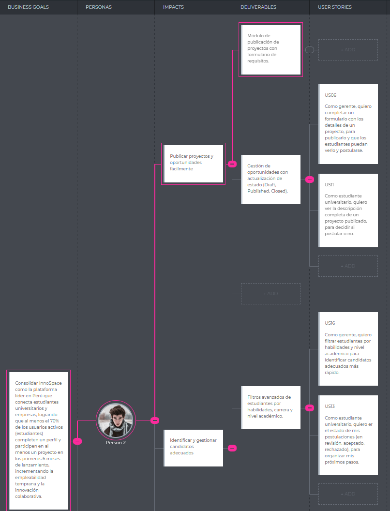
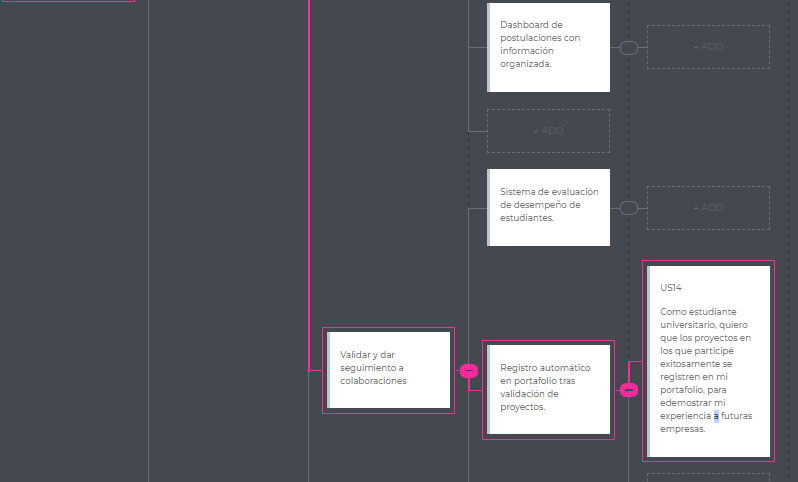

<p align="center">
  Impact Mapping 1 - Elaboración propia
</p>

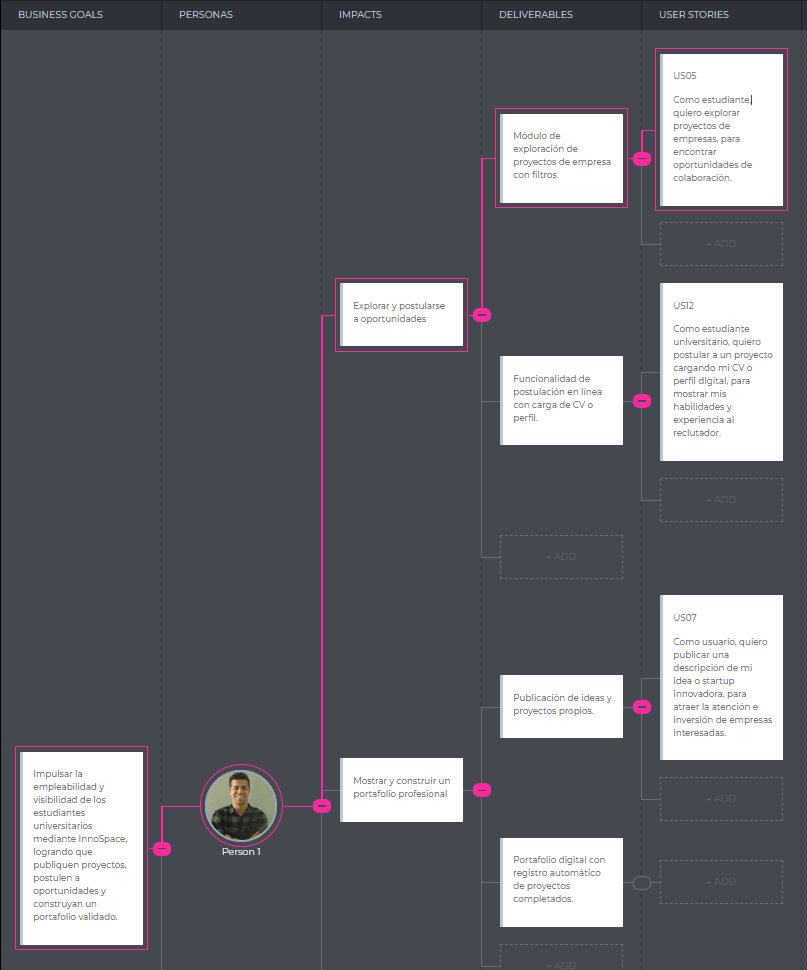
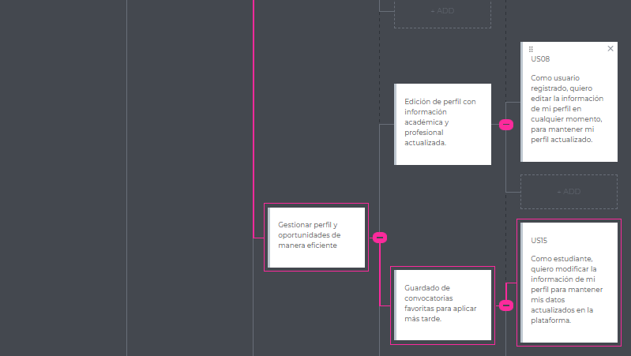

<p align="center">
  Impact Mapping 2 - Elaboración propia
</p>

### 2.4.3. Product Backlog

<table border="1">
  <thead>
    <tr>
      <th># Orden</th>
      <th>User Story Id</th>
      <th>Título</th>
      <th>Descripción</th>
      <th>Story Points (1 / 2 / 3 / 5 / 8)</th>
    </tr>
  </thead>
  <tbody>
    <tr>
      <td>1</td>
      <td>US18</td>
      <td>Llamados a la acción claros</td>
      <td>Como visitante de la landing page, quiero contar con un encabezado visible en todo momento, para moverme fácilmente entre las secciones sin hacer scroll manualmente.</td>
      <td>3</td>
    </tr>
    <tr>
      <td>2</td>
      <td>US17</td>
      <td>Registro inmediato desde la landing</td>
      <td>Como usuario nuevo, quiero acceder rápidamente al formulario de registro, para comenzar a usar la plataforma sin perder tiempo.</td>
      <td>3</td>
    </tr>
    <tr>
      <td>3</td>
      <td>US01</td>
      <td>Registro de usuario</td>
      <td>Como usuario nuevo, quiero crear una cuenta, para poder acceder a las funciones de la aplicación.</td>
      <td>3</td>
    </tr>
    <tr>
      <td>4</td>
      <td>US02</td>
      <td>Inicio de sesión</td>
      <td>Como usuario registrado, quiero iniciar sesión, para acceder a mi cuenta y explorar los proyectos.</td>
      <td>2</td>
    </tr>
    <tr>
      <td>5</td>
      <td>US04</td>
      <td>Recuperar contraseña</td>
      <td>Como usuario registrado, quiero recuperar mi contraseña, para poder acceder a mi cuenta si la olvido.</td>
      <td>e</td>
    </tr>
    <tr>
      <td>6</td>
      <td>US08</td>
      <td>Editar Perfil de Usuario</td>
      <td>Como usuario registrado, quiero editar la información de mi perfil en cualquier momento, para mantener mi perfil actualizado.</td>
      <td>3</td>
    </tr>
    <tr>
      <td>7</td>
      <td>US03</td>
      <td>Cierre de Sesión</td>
      <td>Como usuario, quiero cerrar sesión de mi cuenta, para proteger mi información personal.</td>
      <td>1</td>
    </tr>
    <tr>
      <td>8</td>
      <td>US06</td>
      <td>Gerente publica nuevo proyecto</td>
      <td>Como gerente, quiero completar un formulario con los detalles de un proyecto, para publicarlo y que los estudiantes puedan verlo y postularse.</td>
      <td>5</td>
    </tr>
    <tr>
      <td>9</td>
      <td>US10</td>
      <td>Búsqueda filtrada de convocatorias</td>
      <td>Como estudiante universitario, quiero buscar proyectos según filtros (habilidades, área académica, nivel de experiencia), para identificar oportunidades que se ajusten a mi perfil.</td>
      <td>5</td>
    </tr>
    <tr>
      <td>10</td>
      <td>US05</td>
      <td>Explorar proyectos de empresa</td>
      <td>Como estudiante, quiero explorar proyectos de empresas, para encontrar oportunidades de colaboración.</td>
      <td>3</td>
    </tr>
    <tr>
      <td>11</td>
      <td>US11</td>
      <td>Visualización de detalles del proyecto</td>
      <td>Como estudiante universitario, quiero ver la descripción completa de un proyecto publicado, para decidir si postular o no.</td>
      <td>3</td>
    </tr>
    <tr>
      <td>12</td>
      <td>US12</td>
      <td>Postulación en línea</td>
      <td>Como estudiante universitario, quiero postular a un proyecto cargando mi CV o perfil digital, para mostrar mis habilidades y experiencia al reclutador.</td>
      <td>5</td>
    </tr>
    <tr>
      <td>13</td>
      <td>US13</td>
      <td>Seguimiento de postulaciones</td>
      <td>Como estudiante universitario, quiero er el estado de mis postulaciones (en revisión, aceptado, rechazado), para organizar mis próximos pasos.</td>
      <td>3</td>
    </tr>
    <tr>
      <td>14</td>
      <td>US15</td>
      <td>Guardado de Convocatorias Favoritos</td>
      <td>Como estudiante, quiero modificar la información de mi perfil para mantener mis datos actualizados en la plataforma.</td>
      <td>3</td>
    </tr>
    <tr>
      <td>15</td>
      <td>US16</td>
      <td>Filtrado de estudiantes</td>
      <td>Como gerente, quiero filtrar estudiantes por habilidades y nivel académico para identificar candidatos adecuados más rápido.</td>
      <td>5</td>
    </tr>
    <tr>
      <td>16</td>
      <td>US07</td>
      <td>Estudiante publica nueva idea innovadora</td>
      <td>Como usuario, quiero publicar una descripción de mi idea o startup innovadora, para atraer la atención e inversión de empresas interesadas.</td>
      <td>4</td>
    </tr>
    <tr>
    <td>17</td>
      <td>US09</td>
      <td>Explorar Ideas de estudiantes</td>
      <td>Como gerente, quiero explorar una lista de ideas innovadoras publicadas por estudiantes, para encontrar oportunidades potenciales en las que mi empresa pueda invertir.</td>
      <td>3</td>
    </tr>
    <tr>
    <td>18</td>
      <td>US14</td>
      <td>Construcción de portafolio</td>
      <td>Como estudiante universitario, quiero que los proyectos en los que participé exitosamente se registren en mi portafolio, para edemostrar mi experiencia a futuras empresas.</td>
      <td>8</td>
    </tr>
    <tr>
    <td>19</td>
      <td>TS01</td>
      <td>Configuración de autenticación y roles</td>
      <td>Como desarrollador, quiero implementar un sistema de autenticación que distinga entre los roles de estudiante y gerente, para garantizar un acceso seguro y una experiencia personalizada según el tipo de usuario.</td>
      <td>5</td>
    </tr>
    <tr>
    <td>20</td>
      <td>TS02</td>
      <td>Estructura de base de datos para gestión de proyectos y convocatorias</td>
      <td>Como desarrollador, quiero diseñar y configurar la base de datos que almacene usuarios, proyectos, convocatorias y solicitudes, para permitir la comunicación fluida entre estudiantes y gerentes.</td>
      <td>5</td>
    </tr>
    <tr>
    <td>21</td>
      <td>TS03</td>
      <td>Bottom Navigation Bar</td>
      <td>Como desarrollador, quiero implementar una barra de navegación inferior que conecte las secciones principales del sistema (Explorar, Mis proyectos/convocatorias, Solicitudes y Perfil), para mantener coherencia visual y facilidad de uso.</td>
      <td>2</td>
    </tr>
    <tr>
    <td>22</td>
      <td>TS04</td>
      <td>Registrarse</td>
      <td>Como desarrollador, quiero implementar el registro de nuevos usuarios (estudiantes o gerentes), para permitir su acceso inicial a la plataforma.</td>
      <td>3</td>
    </tr>
    <tr>
    <td>23</td>
      <td>TS05</td>
      <td>Iniciar Sesión</td>
      <td>Como desarrollador, quiero permitir que los usuarios inicien sesión con sus credenciales válidas, para acceder de forma segura según su rol.</td>
      <td>2</td>
    </tr>
    <tr>
    <td>24</td>
      <td>TS06</td>
      <td>Actualizar Usuario</td>
      <td>Como desarrollador, quiero permitir la actualización de los datos de usuario (nombre, correo, contraseña) para mantener la información actualizada.</td>
      <td>3</td>
    </tr>
    <tr>
    <td>25</td>
      <td>TS07</td>
      <td>Obtener todos los usuarios</td>
      <td>Como desarrollador, quiero listar todos los usuarios registrados, para fines de administración o validación interna.</td>
      <td>2</td>
    </tr>
    <tr>
    <td>26</td>
      <td>TS08</td>
      <td>Obtener usuario por Id</td>
      <td>Como desarrollador, quiero obtener la información de un usuario específico mediante su ID, para mostrar su perfil detallado.</td>
      <td>1</td>
    </tr>
    <tr>
    <td>27</td>
      <td>TS09</td>
      <td>Crear perfil de estudiante</td>
      <td>Como desarrollador, quiero crear el perfil de un estudiante asociado a su usuario, para mostrar sus habilidades y estudios.</td>
      <td>3</td>
    </tr>
    <tr>
    <td>28</td>
      <td>TS10</td>
      <td>Actualizar perfil de estudiante por Id</td>
      <td>Como desarrollador, quiero permitir que un estudiante actualice su perfil por ID, para mantener su información vigente.</td>
      <td>2</td>
    </tr>
    <tr>
    <td>29</td>
      <td>TS11</td>
      <td>Obtener perfil de estudiante por Id</td>
      <td>Como desarrollador, quiero obtener el perfil de un estudiante por su ID, para mostrarlo en la vista de detalle.</td>
      <td>1</td>
    </tr>
    <tr>
    <td>30</td>
      <td>TS12</td>
      <td>Obtener perfiles de estudiante</td>
      <td>Como desarrollador, quiero listar los perfiles de estudiantes para permitir su visualización por parte de los gerentes.</td>
      <td>3</td>
    </tr>
    <tr>
    <td>31</td>
      <td>TS13</td>
      <td>Crear perfil de manager</td>
      <td>Como desarrollador, quiero permitir la creación de un perfil de gerente asociado a su usuario, para que pueda mostrar la información de su empresa y área de innovación.</td>
      <td>3</td>
    </tr>
    <tr>
    <td>32</td>
      <td>TS14</td>
      <td>Actualizar perfil de manager por Id</td>
      <td>Como desarrollador, quiero permitir que los gerentes actualicen su perfil por ID, para mantener actualizada la información de la empresa.</td>
      <td>2</td>
    </tr>
    <tr>
    <td>33</td>
      <td>TS15</td>
      <td>Obtener perfil de manager por Id</td>
      <td>Como desarrollador, quiero obtener el perfil de un gerente por su ID, para mostrarlo a los estudiantes interesados en sus convocatorias.</td>
      <td>1</td>
    </tr>
    <tr>
    <td>34</td>
      <td>TS16</td>
      <td>Obtener perfiles de manager</td>
      <td>Como desarrollador, quiero obtener todos los perfiles de gerentes, para que los estudiantes puedan conocer a las empresas que publican convocatorias.</td>
      <td>3</td>
    </tr>
    <tr>
    <td>35</td>
      <td>TS17</td>
      <td>Crear convocatoria</td>
      <td>Como desarrollador, quiero permitir que los gerentes creen convocatorias, para que los estudiantes puedan postular a proyectos de innovación.</td>
      <td>3</td>
    </tr>
    <tr>
    <td>36</td>
      <td>TS18</td>
      <td>Actualizar convocatoria</td>
      <td>Como desarrollador, quiero permitir que el gerente edite una convocatoria activa, para actualizar información antes de su cierre.</td>
      <td>2</td>
    </tr>
    <tr>
    <td>37</td>
      <td>TS19</td>
      <td>Cambiar estado de convocatoria a publicado</td>
      <td>Como desarrollador, quiero permitir que el gerente publique una convocatoria, para que los estudiantes puedan visualizarla y postularse.</td>
      <td>1</td>
    </tr>
    <tr>
    <td>38</td>
      <td>TS20</td>
      <td>Cambiar estado de convocatoria a cerrado</td>
      <td>Como desarrollador, quiero permitir que un gerente cierre una convocatoria, para finalizar su periodo de postulaciones.</td>
      <td>1</td>
    </tr>
    <tr>
    <td>39</td>
      <td>TS21</td>
      <td>Borrar convocatoria</td>
      <td>Como desarrollador, quiero permitir eliminar una convocatoria existente, para mantener la base de datos limpia y actualizada.</td>
      <td>1</td>
    </tr>
    <tr>
    <td>40</td>
      <td>TS22</td>
      <td>Obtener convocatoria por Id</td>
      <td>Como desarrollador, quiero obtener la información completa de una convocatoria específica mediante su ID, para mostrar su detalle.</td>
      <td>1</td>
    </tr>
    <tr>
    <td>41</td>
      <td>TS23</td>
      <td>Obtener todas las convocatorias</td>
      <td>Como desarrollador, quiero obtener todas las convocatorias activas, para que los estudiantes puedan explorarlas.</td>
      <td>3</td>
    </tr>
    <tr>
    <td>42</td>
      <td>TS24</td>
      <td>Crear Proyecto</td>
      <td>Como desarrollador, quiero permitir que un estudiante cree un nuevo proyecto, para incluirlo en su portafolio y hacerlo visible a los gerentes.</td>
      <td>3</td>
    </tr>
    <tr>
    <td>43</td>
      <td>TS25</td>
      <td>Actualizar Proyecto</td>
      <td>Como desarrollador, quiero permitir que el estudiante actualice la información de su proyecto, para mantenerla vigente y corregir errores.</td>
      <td>2</td>
    </tr>
    <tr>
    <td>44</td>
      <td>TS26</td>
      <td>Cambiar estado de proyecto a publicado</td>
      <td>Como desarrollador, quiero permitir que los estudiantes cambien el estado de su proyecto a Publicado, para hacerlo visible a los gerentes interesados.</td>
      <td>1</td>
    </tr>
    <tr>
    <td>45</td>
      <td>TS27</td>
      <td>Cambiar estado de proyecto a cerrado</td>
      <td>Como desarrollador, quiero permitir que los estudiantes cambien el estado de sus proyectos a Cerrado, cuando ya no deseen recibir solicitudes o colaboraciones.</td>
      <td>2</td>
    </tr>
    <tr>
    <td>46</td>
      <td>TS28</td>
      <td>Creación de Solicitud de Colaboración</td>
      <td>Como desarrollador, quiero permitir que un gerente envíe una solicitud de colaboración a un proyecto de un estudiante, para iniciar un posible trabajo conjunto y mentoría.</td>
      <td>3</td>
    </tr>
    <tr>
    <td>47</td>
      <td>TS29</td>
      <td>Rechazar solicitud de colaboración</td>
      <td>Como desarrollador, quiero permitir que un estudiante rechace una solicitud de colaboración de un gerente, para gestionar sus solicitudes entrantes.</td>
      <td>1</td>
    </tr>
    <tr>
    <td>48</td>
      <td>TS30</td>
      <td>Aceptar solicitud de colaboración</td>
      <td>Como desarrollador, quiero permitir que un estudiante acepte una solicitud de colaboración de un gerente, para confirmar el interés en trabajar juntos.</td>
      <td>1</td>
    </tr>
    <tr>
    <td>49</td>
      <td>TS31</td>
      <td>Obtener solicitudes de colaboración por proyecto</td>
      <td>Como desarrollador, quiero mostrar al estudiante todas las solicitudes de colaboración que ha recibido para un proyecto específico, para facilitar su revisión y gestión.</td>
      <td>1</td>
    </tr>
    <tr>
    <td>50</td>
      <td>TS32</td>
      <td>Enviar postulación a convocatoria</td>
      <td>Como desarrollador, quiero permitir que un estudiante postule a una convocatoria de una empresa, para expresar su interés en participar.</td>
      <td>3</td>
    </tr>
    <tr>
    <td>51</td>
      <td>TS33</td>
      <td>Rechazar postulación de estudiante</td>
      <td>Como desarrollador, quiero permitir que un gerente rechace la postulación de un estudiante a una de sus convocatorias, para gestionar el proceso de selección.</td>
      <td>1</td>
    </tr>
    <tr>
    <td>52</td>
      <td>TS34</td>
      <td>Aceptar postulación de estudiante</td>
      <td>Como desarrollador, quiero permitir que un gerente acepte la postulación de un estudiante a una convocatoria, para avanzar en el proceso de selección.</td>
      <td>1</td>
    </tr>
    <tr>
    <td>53</td>
      <td>TS35</td>
      <td>Obtener detalle de postulación</td>
      <td>Como desarrollador, quiero obtener los detalles de una postulación específica, para mostrar el estado y la información relevante tanto al estudiante como al gerente.</td>
      <td>2</td>
    </tr>
  </tbody>
</table>

<br><br>


<p align="center">
  
</p>

<p align="center">
  Product Backlog - Elaboración propia
</p>

<br>

Link del Trello: https://trello.com/invite/b/68cb965276edf7d589375471/ATTI3f30e253b26ba9715ccd503bb929f0c6A295F7FE/product-backlog-unipafi

---


## 2.5. Strategic-Level Domain-Driven Design

### 2.5.1. EventStorming

Como equipo realizamos una sesión de EventStorming con el objetivo de comprender el dominio del problema y plantear una primera aproximación al modelado general de Innospace. La actividad tuvo una duración de alrededor de 1-2 horas, donde identificamos los principales eventos, actores y reglas que definen las interacciones entre estudiantes y empresas.

Durante la sesión usamos una herramienta colaborativa para organizar y visualizar los elementos, lo que nos permitió discutir, consensuar y delimitar los primeros bounded contexts del sistema. El resultado es un mapa inicial del dominio que servirá como base para el análisis y diseño detallado en las siguientes etapas.

Paleta de Colores:

Paleta de colores usados para los post-its utilizados

- Naranja (Domain Event): Evento (pasado).

- Azul (Command): Acción (imperativo).

- Amarillo Claro (Role): Actor/Usuario.

- Morado (Business Rule): Regla/Condición.

- Verde (View): Pantalla/UI.

- Amarillo Oscuro (Aggregate): Entidad/Estado.

- Rosa (External System): Sistema Externo.

Primer Paso

<p align="center">
  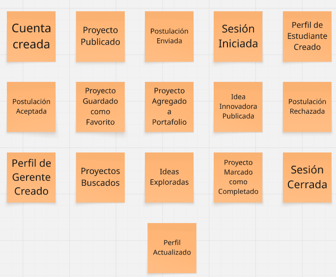
</p>
<p align="center">
    Event Storming 1- Elaboración propia
</p>

Segundo Paso:

<p align="center">
  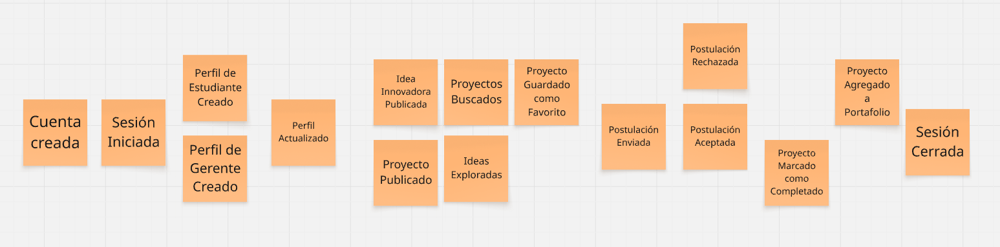
</p>
<p align="center">
    Event Storming 2- Elaboración propia
</p>

Tercer Paso:

<p align="center">
  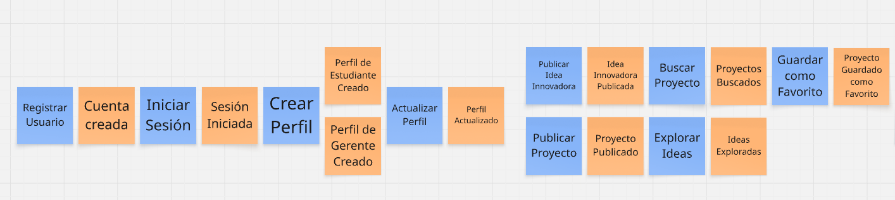
</p>
<p align="center">
    Event Storming 3.1- Elaboración propia
</p>

<p align="center">
  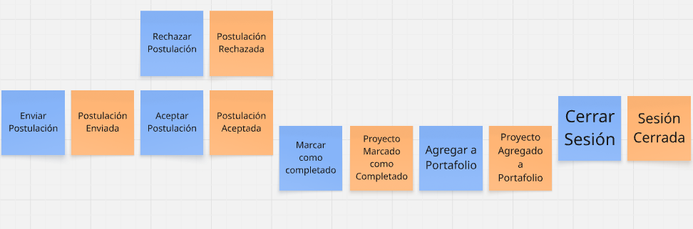
</p>
<p align="center">
    Event Storming 3.2- Elaboración propia
</p>

Cuarto Paso:

<p align="center">
  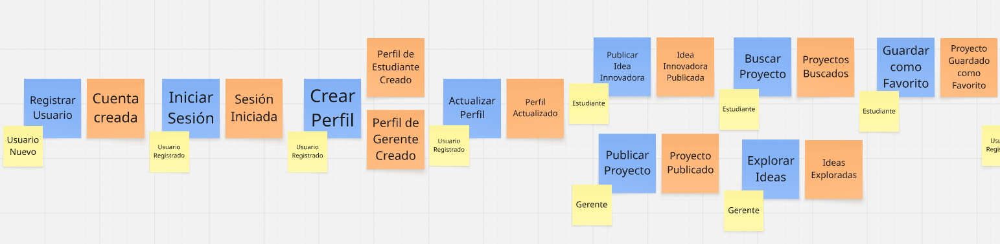
</p>
<p align="center">
    Event Storming 4.1- Elaboración propia
</p>

<p align="center">
  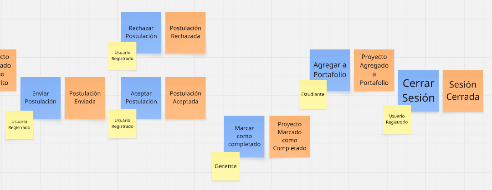
</p>
<p align="center">
    Event Storming 4.2- Elaboración propia
</p>

Quinto Paso:

<p align="center">
  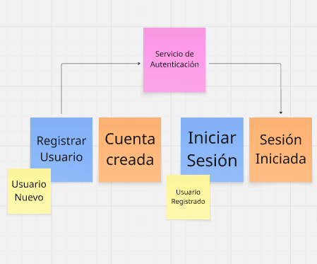
</p>
<p align="center">
    Event Storming 5- Elaboración propia
</p>

Sexto Paso:

<p align="center">
  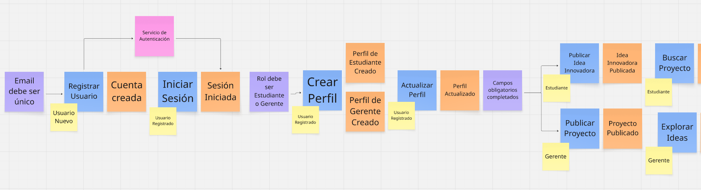
</p>
<p align="center">
    Event Storming 6.1- Elaboración propia
</p>

<p align="center">
  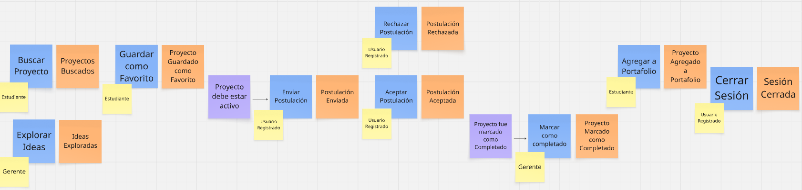
</p>
<p align="center">
    Event Storming 6.2- Elaboración propia
</p>

Septimo Paso:

<p align="center">
  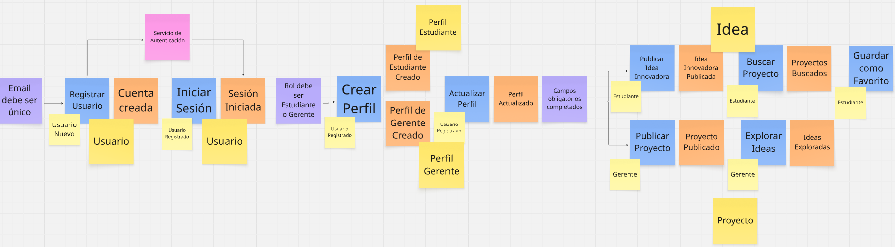
</p>
<p align="center">
    Event Storming 7.1- Elaboración propia
</p>

<p align="center">
  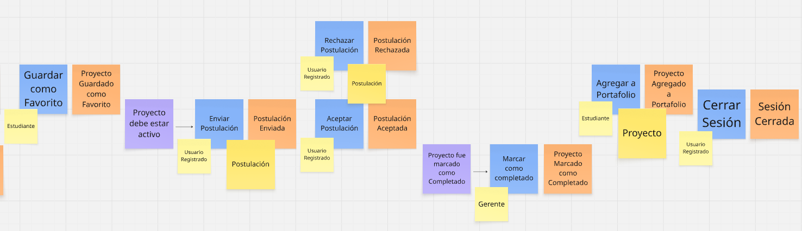
</p>
<p align="center">
    Event Storming 7.2- Elaboración propia
</p>

Octavo Paso:

<p align="center">
  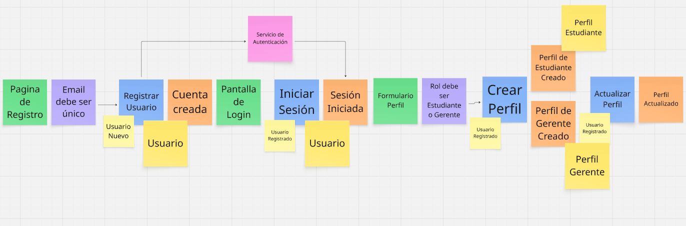
</p>
<p align="center">
    Event Storming 8.1- Elaboración propia
</p>

<p align="center">
  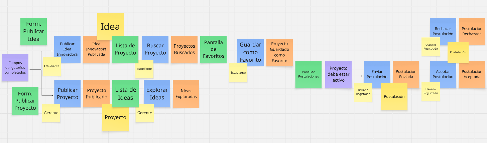
</p>
<p align="center">
    Event Storming 8.2- Elaboración propia
</p>

<p align="center">
  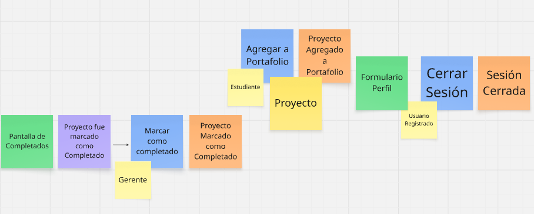
</p>
<p align="center">
    Event Storming 8.3- Elaboración propia
</p>

Noveno Paso:

<p align="center">
  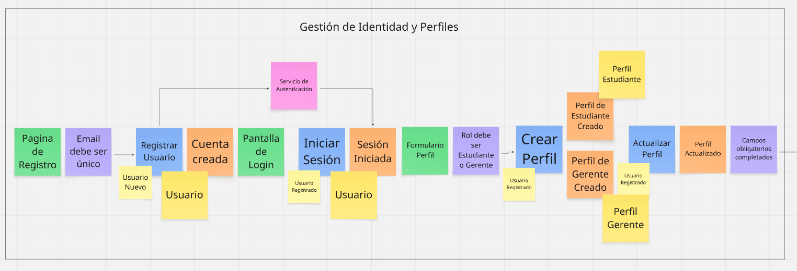
</p>
<p align="center">
    Event Storming 9.1- Elaboración propia
</p>

<p align="center">
  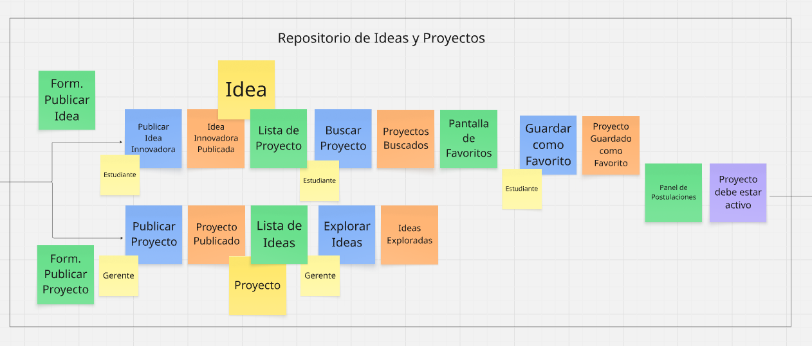
</p>
<p align="center">
    Event Storming 9.2- Elaboración propia
</p>

<p align="center">
  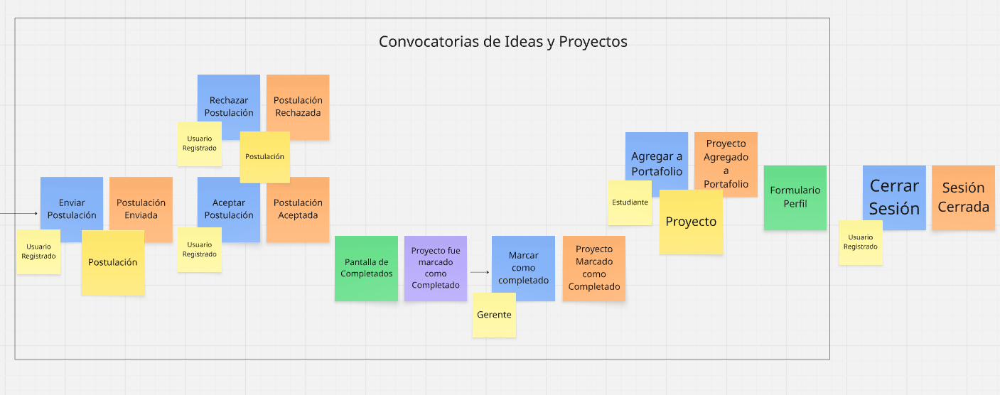
</p>
<p align="center">
    Event Storming 9.3- Elaboración propia
</p>


#### 2.5.1.1. Candidate Context Discovery


Tras concluir la sesión de Event Storming con la herramienta Miro, se llevó a cabo un análisis detallado de los eventos detectados con el fin de identificar los contextos candidatos más relevantes para el dominio. Este trabajo incluyó reconocer patrones y vínculos entre los eventos y creando flujos a partir de ellos. Como resultado, se organizaron conjuntos de eventos que correspondían a un mismo proceso dentro de la aplicación.


### Onboarding 
<p align="center">
  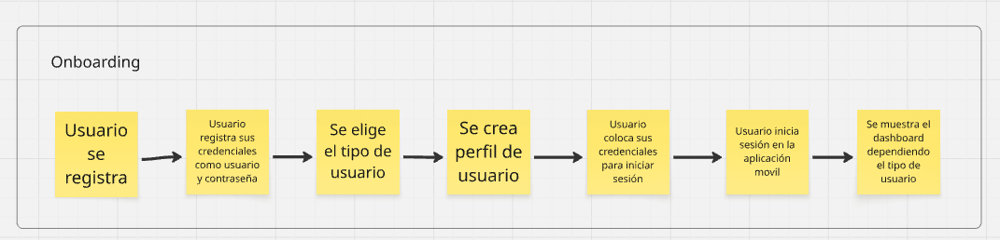
</p>

<p align="center">
     Elaboración propia
</p>


### Creación de convocatoria 
<p align="center">
  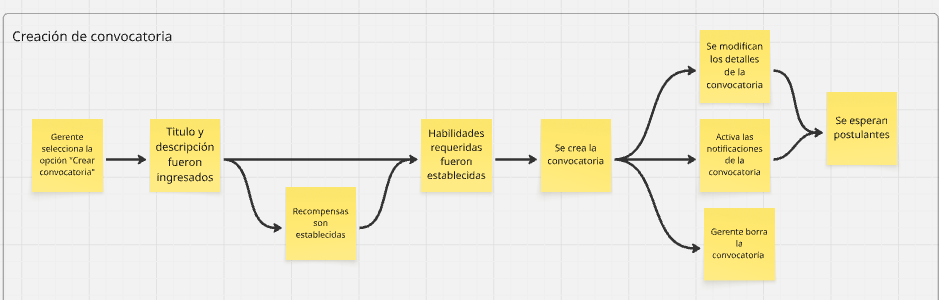
</p>

<p align="center">
     Elaboración propia
</p>


### Colaboración y financiamiento
<p align="center">
  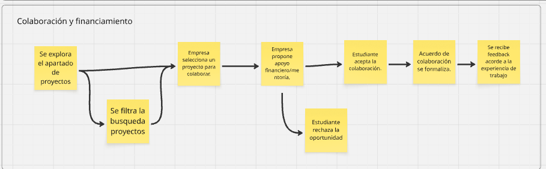
</p>

<p align="center">
     Elaboración propia
</p>


### Creación de proyectos estudiantiles
<p align="center">
  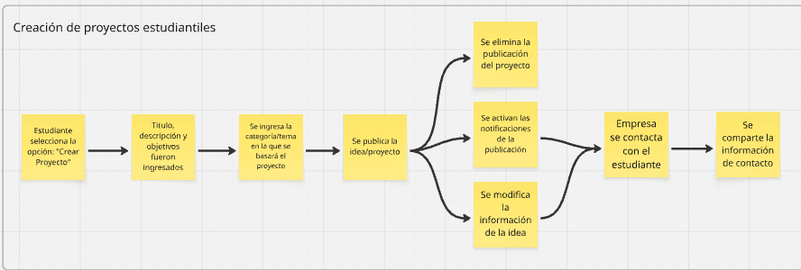
</p>

<p align="center">
     Elaboración propia
</p>


### Postulación a convocatorias de empresa
<p align="center">
  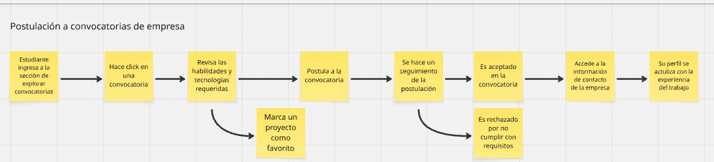
</p>

<p align="center">
     Elaboración propia
</p>


Después de mostrar los flujos de eventos que suceden dentro de la aplicación, los pivotal points (eventos que cambian el curso del sistema) son estos:

- La creación de un proyecto estudiantil

- La publicación de una oportunidad por parte de la empresa

- La postulación de un estudiante a una oportunidad

- La decisión de colaboración de una empresa sobre un proyecto

- La aceptación o rechazo de la colaboración por parte del estudiante

Al identificar estos pivotal points, se puede observar cómo los eventos se agrupan en contextos distintos, quedando definidos los siguientes bounded contexts:

- Student Projects: Gestión del ciclo de vida de proyectos estudiantiles.

- Company Opportunities: Creación y publicación de convocatorias de empresas.

- Student Applications: Administración de postulaciones de estudiantes a oportunidades.

- Project Collaboration: Decisiones de colaboración y respuestas de estudiantes.


<br>
<br>
<br>
<br>

Luego de realizar estos pasos, se utilizó la herramienta Miro para dividir estos Bounded Contexts, detallando los agregados, eventos y entidades:


### Student Projects:
<p align="center">
  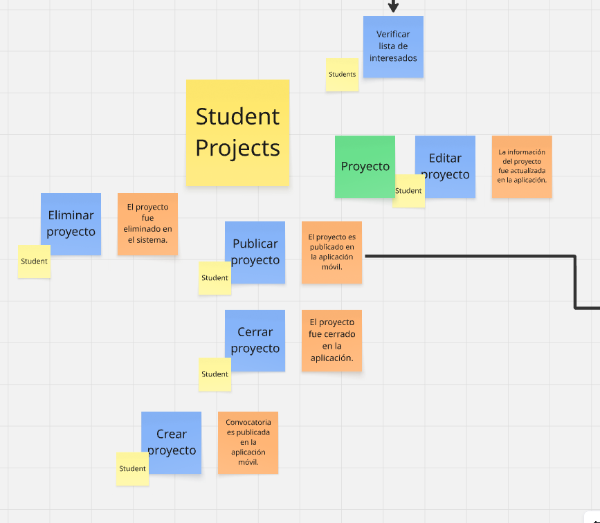
</p>

<p align="center">
     Elaboración propia
</p>

### Student Applications
<p align="center">
  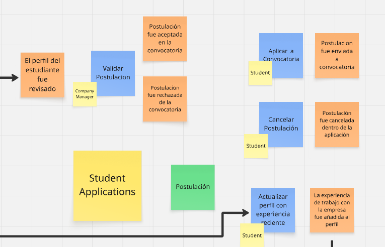
</p>

<p align="center">
     Elaboración propia
</p>

### Project Collaboration:
<p align="center">
  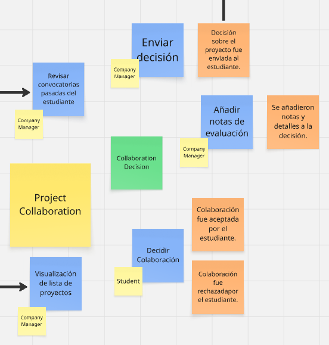
</p>

<p align="center">
     Elaboración propia
</p>

### Company Opportunities
<p align="center">
  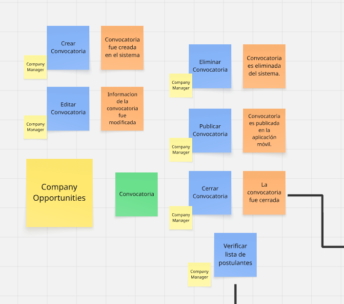
</p>

<p align="center">
     Elaboración propia
</p>


#### 2.5.1.2. Domain Message Flows Modeling

Con los Bounded Contexts definidos en la etapa anterior, el equipo procedió a realizar una sesión de modelado de flujo de mensajes (Domain Message Flow Modeling) para definir cómo estos contextos colaboran entre sí para resolver los distintos escenarios del negocio.

Esta técnica nos permitió visualizar de forma clara los flujos de comunicación entre contextos y entender mejor el comportamiento esperado del sistema desde la perspectiva de los usuarios: el Estudiante y el Gerente (Empresa).

Durante la sesión, se analizaron principalmente los dos casos de uso principales de la plataforma:

Caso 1: Postulación de un Estudiante a una Oportunidad de Empresa
Este flujo involucra a los Bounded Contexts Company Opportunities y Student Applications.

El Gerente (Empresa) publica una nueva convocatoria. Esta acción se envía como un comando (PublishOpportunity) al Bounded Context Company Opportunities.

Una vez procesado, Company Opportunities emite un evento (OpportunityPublished).

El Bounded Context Student Applications "escucha" este evento para saber que la oportunidad está activa.

El Estudiante explora las oportunidades y envía su postulación, asociando uno de sus proyectos. Esto se envía como un comando (SubmitApplication) al Bounded Context Student Applications.

Student Applications recibe la postulación, actualiza su estado a "Pendiente" y emite un evento (ApplicationSubmitted) para notificar al Gerente.

Finalmente, el Gerente revisa y acepta la postulación (comando AcceptApplication), lo que genera un evento final (ApplicationAccepted) para notificar al Estudiante.

Caso 2: Colaboración iniciada por un Gerente sobre un Proyecto Estudiantil
Este flujo involucra a los Bounded Contexts Student Projects y Project Collaboration.

El Estudiante publica su proyecto innovador. Esta acción se envía como un comando (PublishProject) al Bounded Context Student Projects.

Una vez procesado, Student Projects emite un evento (ProjectPublished).

El Bounded Context Project Collaboration "escucha" este evento para mostrar el proyecto a las empresas.

Un Gerente explora los proyectos y registra su interés en uno. Esto se envía como un comando (CreateCollaborationDecision) al Bounded Context Project Collaboration.

Project Collaboration recibe la decisión y emite un evento (CollaborationInterestShown) para notificar al Estudiante.

El Estudiante revisa el interés de la empresa y responde (ej. "Aceptar"), enviando un comando (SubmitStudentResponse) que actualiza el estado de la colaboración.

Esta visualización permitió entender no solo los puntos de integración entre los contextos, sino también los límites de responsabilidad de cada uno, asegurando una arquitectura desacoplada pero coherente. El resultado fue un conjunto de diagramas de Domain Message Flow que reflejan claramente cómo fluyen los mensajes (Comandos y Eventos) entre usuarios y contextos del sistema.

<p align="center">
  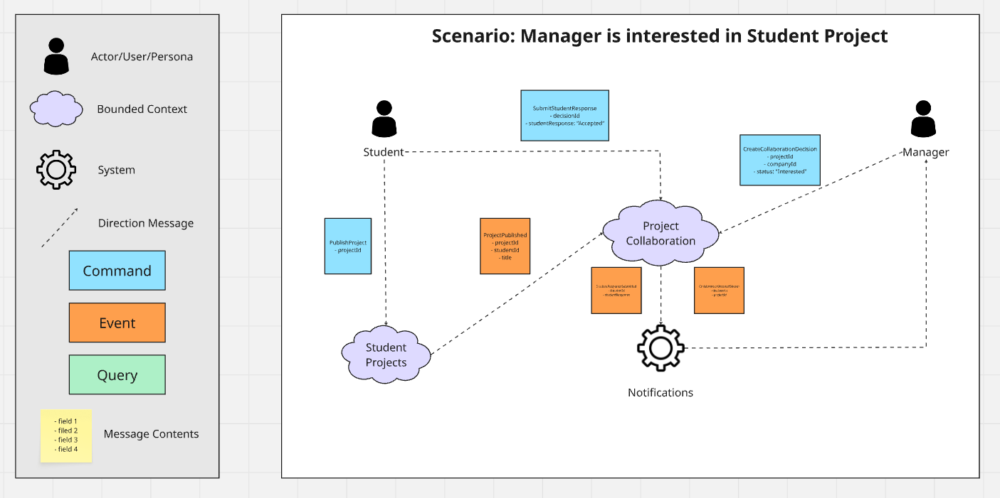
</p>

<p align="center">
     Elaboración propia
</p>

<p align="center">
  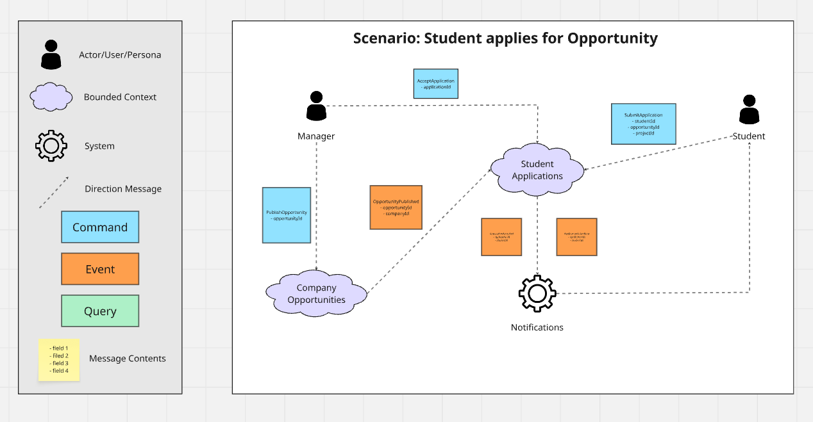
</p>

<p align="center">
     Elaboración propia
</p>


Enlace al Miro Board: https://miro.com/app/board/uXjVJKRuXIw=/?share_link_id=238987388336


#### 2.5.1.3. Bounded Context Canvases

En esta parte se lleva a cabo la descomposición estratégica del dominio a través de la construcción de Bounded Context Canvases, con el propósito de reconocer y delimitar áreas funcionales claras dentro del sistema. Esta actividad es clave en el enfoque de Domain-Driven Design (DDD), ya que ayuda a definir con precisión los límites semánticos y técnicos entre los distintos módulos, reduciendo la complejidad y permitiendo que cada componente pueda evolucionar de manera independiente.


### Student Projects
<p align="center">
  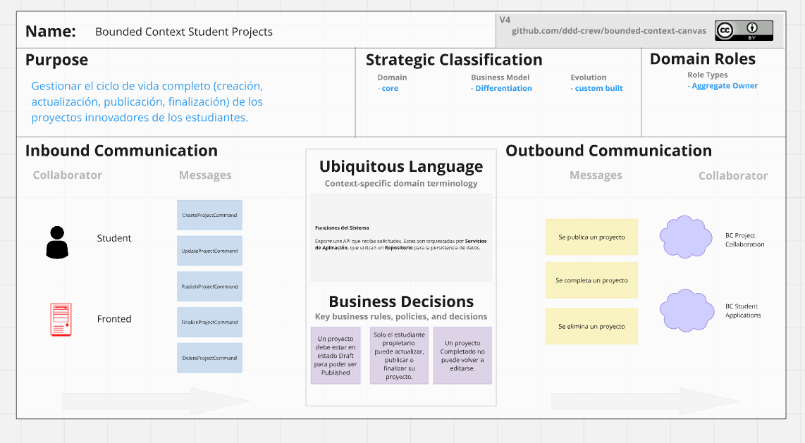
</p>

<p align="center">
     Elaboración propia
</p>

### Company Opportunities
<p align="center">
  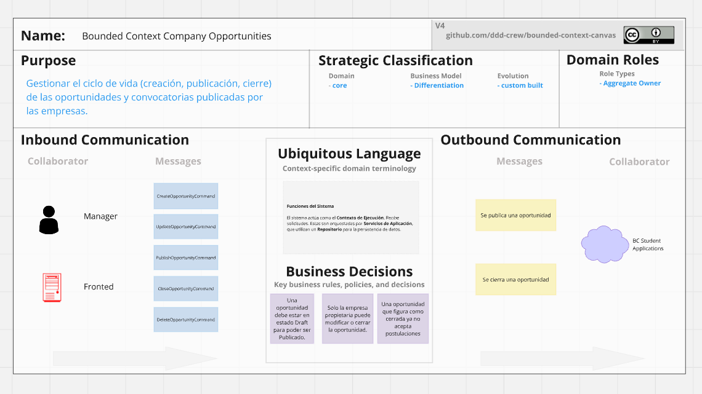
</p>

<p align="center">
     Elaboración propia
</p>

### Student Applications
<p align="center">
  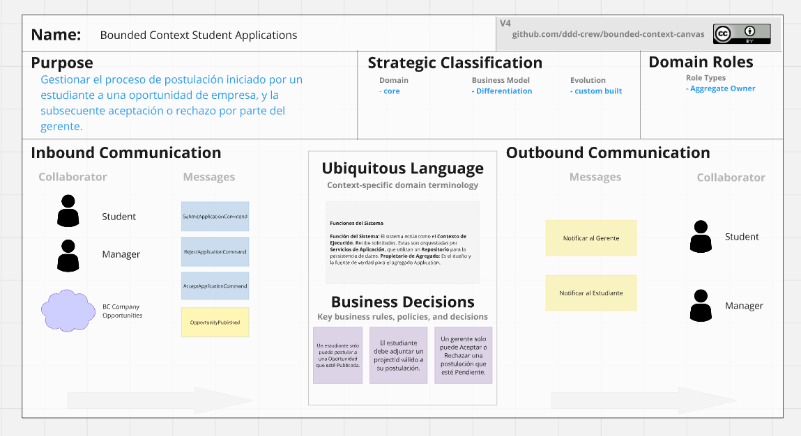
</p>

<p align="center">
     Elaboración propia
</p>

### Project Collaboration
<p align="center">
  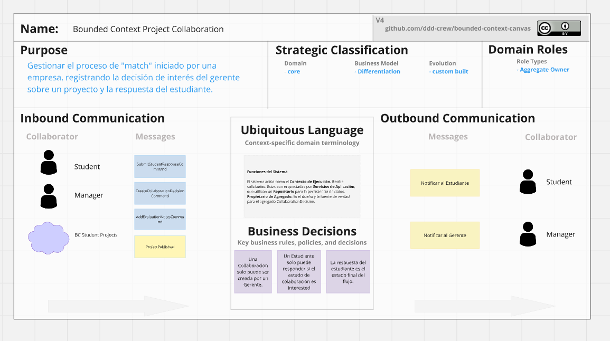
</p>

<p align="center">
     Elaboración propia
</p>


### 2.5.2. Context Mapping


Esta sección documenta el proceso de análisis y diseño estructural de la aplicación, centrándose en la identificación y relación de los bounded contexts. Utilizando la metodología de Context Mapping de Domain-Driven Design, se evaluaron diversas alternativas para definir los límites de cada contexto y los patrones de interacción entre ellos. 

El proceso involucró un análisis crítico de capacidades, considerando escenarios de descomposición, consolidación y reorganización de funcionalidades. A través de iteraciones y preguntas estratégicas, se establecieron las relaciones más apropiadas—Partnership, Customer-Supplier con Anti-corruption Layer y Shared Kernels—que garantizan autonomía, consistencia y escalabilidad del sistema. 

A continuación se muestran los escenarios planteados:


#### Escenario 1: ¿Partir "Student Projects" en contextos más pequeños?
- Análisis: Evaluamos dividirlo en "Project Creation" y "Project Management".

- Decisión: No. El ciclo de vida del proyecto es cohesivo. La división añadiría acoplamiento innecesario y overhead de comunicación.

#### Escenario 2: ¿Duplicar el perfil del estudiante en "Student Applications"?
- Análisis: Consideramos duplicar datos para romper la dependencia con "Student Projects".

- Decisión: No. Se optó por un Anti-corruption Layer (ACL). La duplicación genera inconsistencia. El ACL mantiene la autonomía con una sola fuente de verdad.

##### Escenario 3: ¿Consolidar "Project Collaboration" y "Company Opportunities" en "Company Engagement"?
- Análisis: Evaluamos unirlos por ser ambos iniciativas de la empresa.

- Decisión:  No. Sus capacidades centrales son distintas (convocatorias abiertas vs. contacto proactivo). Mantenerlos separados con una Partnership ofrece mayor cohesión.


<p align="center">
  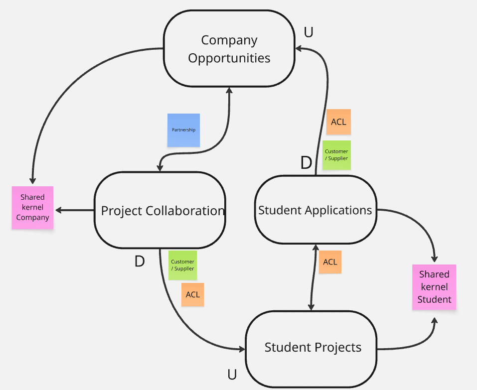
</p>

<p align="center">
     Elaboración propia
</p>


| Destino (Downstream)       | Origen (Upstream)           | Tipo de Relación         | Comentario                                                                                               |
| -------------------------- | --------------------------- | ------------------------ | -------------------------------------------------------------------------------------------------------- |
| Project Collaboration      | Student Projects            | Customer/Supplier + ACL  | Consume información de proyectos y estudiantes, traduciendo modelos mediante Anti-Corruption Layer       |
| Student Applications       | Student Projects            | ACL  | Utiliza datos de estudiantes y proyectos, protegiendo su modelo con ACL                                  |
| Student Applications       | Company Opportunities       | Customer/Supplier + ACL  | Consume convocatorias, adaptando el modelo upstream a sus necesidades con ACL                            |
| Project Collaboration      | Company Opportunities       | Partnership              | Coordinación activa para gestión unificada de interacciones empresa-estudiante                           |


### 2.5.3. Software Architecture

#### 2.5.3.1.Software Architecture Context Level Diagrams <br>
Este diagrama representa la visión de más alto nivel del sistema InnoSpace Platform, mostrando las interacciones externas que mantienen los actores con la plataforma.

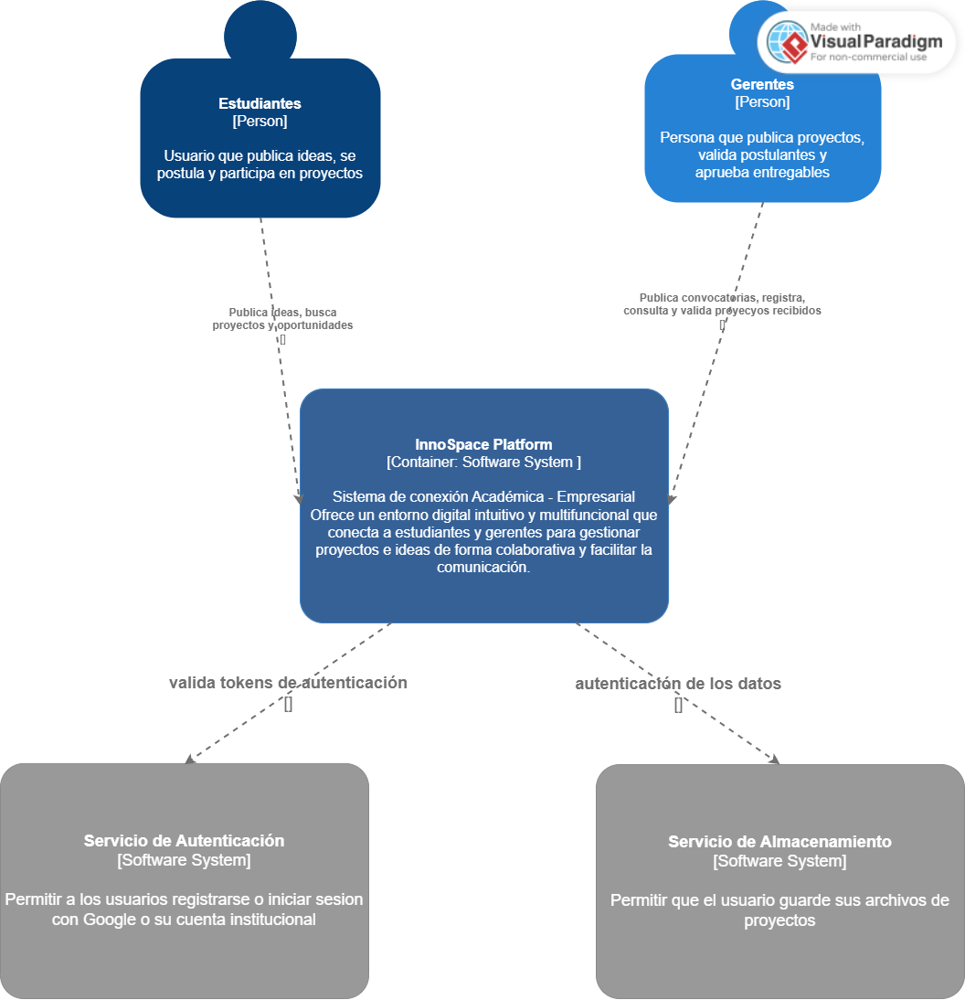

<p align="center">
  Elaboración propia
</p>

#### 2.5.3.2.Software Architecture Container Level Diagrams <br>
En este nivel la arquitectura se organiza en tres contenedores principales: la Mobile App, que ofrece el acceso de los usuarios; la API Application, que gestiona la lógica de negocio y comunica la app con el sistema; y la Database, donde se almacenan usuarios, proyectos y postulaciones.

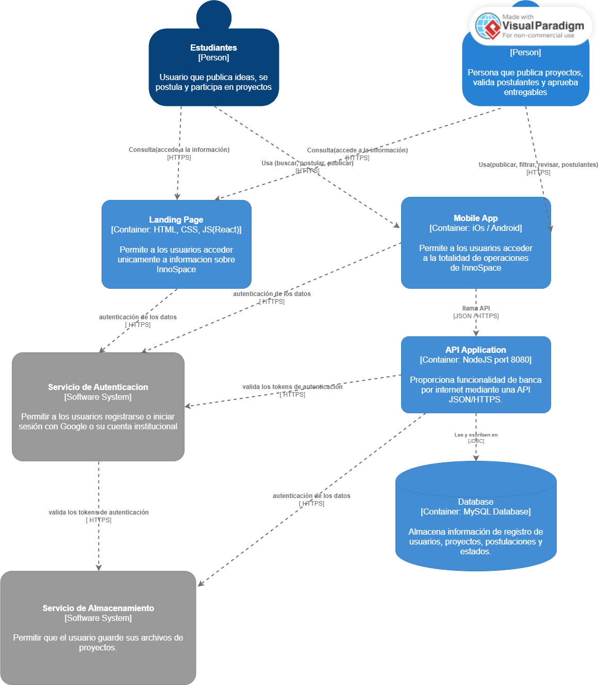

<p align="center">
  Elaboración propia
</p>

#### 2.5.3.3. Software Architecture Deployment Diagrams <br>
El diagrama de despliegue muestra que la Mobile App, la API Application se aloja en un servidor cloud para asegurar disponibilidad y escalabilidad, y la Database se despliega en un servidor independiente dentro de la misma nube, garantizando integridad y persistencia de los datos.

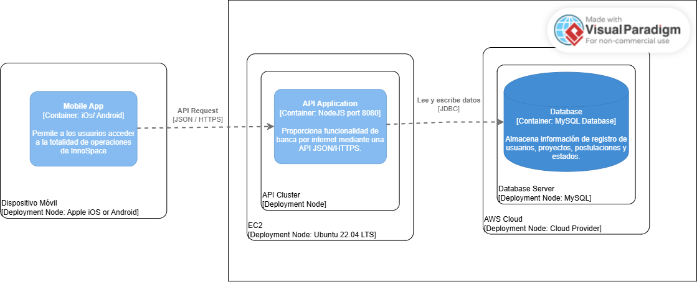

<p align="center">
  Elaboración propia
</p>

## 2.6. Tactical-Level Domain-Driven Design

### 2.6.1. Bounded Context: Student Projects

#### 2.6.1.1. Domain Layer


El agregado Project encapsula el ciclo de vida de un proyecto estudiantil, permitiendo crearlo, actualizarlo, publicarlo y marcarlo como completado, asegurando que el estado (Draft, Published, Completed) y los contenidos asociados se mantengan consistentes y válidos.


### Aggregate: `Project`
**Descripción:** Representa un proyecto o idea innovadora creada por un estudiante, con ciclo de vida completo desde borrador hasta finalizado, incluyendo contenido y estado.

| Atributos      | Tipo de dato     | Visibilidad | Descripción                                     |
|----------------|-----------------|------------|------------------------------------------------|
| projectId      | Long            | Private    | Identificador único del proyecto.             |
| studentId      | Long            | Private    | Identificador del estudiante propietario.    |
| title          | String          | Private    | Título del proyecto.                          |
| description    | String          | Private    | Descripción detallada del proyecto.          |
| status         | ProjectStatus   | Private    | Estado del proyecto (`Draft`, `Published`, `Completed`). |
| creationDate   | Timestamp       | Private    | Fecha de creación del proyecto.              |
| lastUpdate     | Timestamp       | Private    | Fecha de última actualización.               |

| Métodos                         | Tipo de retorno | Visibilidad | Descripción                                      |
|---------------------------------|----------------|------------|------------------------------------------------|
| getProjectId()                  | Long           | Public     | Devuelve el ID del proyecto.                   |
| getStudentId()                  | Long           | Public     | Devuelve el ID del estudiante propietario.    |
| getTitle()                      | String         | Public     | Devuelve el título del proyecto.              |
| getDescription()                | String         | Public     | Devuelve la descripción del proyecto.        |
| getStatus()                     | ProjectStatus  | Public     | Devuelve el estado actual del proyecto.       |
| publish()                       | void           | Public     | Cambia el estado del proyecto a `Published`. |
| update(title, description)      | void           | Public     | Actualiza los campos modificables del proyecto.|
| finalize()                      | void           | Public     | Cambia el estado del proyecto a `Completed`. |
| getCreationDate()               | Timestamp      | Public     | Devuelve la fecha de creación.                |
| getLastUpdate()                 | Timestamp      | Public     | Devuelve la fecha de última actualización.   |

### Value Objects

| Value Object   | Descripción                                                                 |
|----------------|-----------------------------------------------------------------------------|
| ProjectStatus  | Representa el estado del proyecto: `Draft`, `Published`, `Completed`.      |
| ProjectContent | Contiene archivos, imágenes, prototipos o documentación asociada al proyecto.|


#### Clase: `ProjectQueryService`

| Título       | ProjectQueryService |
|--------------|----------------------|
| Descripción  | Interfaz de servicio de consultas para operaciones de lectura relacionadas con proyectos de estudiantes |

##### Métodos

| Método                             | Descripción                                               |
|-----------------------------------|-----------------------------------------------------------|
| handle(GetProjectByIdQuery)        | Obtiene los detalles completos de un proyecto por su ID   |
| handle(GetAllStudentProjectsQuery) | Obtiene todos los proyectos asociados a un estudiante     |
| handle(ValidateProjectOwnershipQuery) | Verifica si un estudiante es propietario del proyecto |

---

#### Clase: `ProjectCommandService`

| Título       | ProjectCommandService |
|--------------|------------------------|
| Descripción  | Interfaz de servicio de comandos para operaciones de escritura relacionadas con proyectos de estudiantes |

##### Métodos

| Método                           | Descripción                                                        |
|---------------------------------|--------------------------------------------------------------------|
| handle(CreateProjectCommand)     | Crea un nuevo proyecto con la información proporcionada            |
| handle(UpdateProjectCommand)     | Actualiza la información básica del proyecto (título, descripción, contenido) |
| handle(PublishProjectCommand)    | Cambia el estado del proyecto a publicado                          |
| handle(FinalizeProjectCommand)   | Cambia el estado del proyecto a completado                         |
| handle(DeleteProjectCommand)     | Elimina un proyecto del sistema     


#### 2.6.1.2. Interface Layer

El ProjectController expone endpoints REST que permiten a los estudiantes gestionar sus proyectos, desde la creación hasta el cierre, utilizando assemblers para mapear recursos REST a comandos de dominio y conectando las solicitudes del cliente con los servicios de aplicación.

### Controlador: `ProjectController`

**Título:** ProjectController  
**Descripción:** Controlador REST que maneja las operaciones CRUD y gestión de proyectos de estudiantes.

#### Métodos

| Método           | Ruta                              | Descripción                                               |
|-----------------|----------------------------------|-----------------------------------------------------------|
| getProjectById   | GET /api/v1/projects/{id}        | Obtiene los detalles de un proyecto específico por su ID |
| getAllStudentProjects | GET /api/v1/projects/student/{studentId} | Obtiene todos los proyectos asociados a un estudiante |
| createProject    | POST /api/v1/projects            | Crea un nuevo proyecto a partir de los datos proporcionados |
| updateProject    | PUT /api/v1/projects/{id}        | Actualiza los detalles de un proyecto existente          |
| publishProject   | POST /api/v1/projects/{id}/publish | Cambia el estado del proyecto a publicado              |
| finalizeProject  | POST /api/v1/projects/{id}/finalize | Cambia el estado del proyecto a completado            |
| deleteProject    | DELETE /api/v1/projects/{id}     | Elimina un proyecto del sistema                          |

#### Dependencias

| Dependencia                         | Descripción                                                                 |
|------------------------------------|-----------------------------------------------------------------------------|
| ProjectQueryService                 | Servicio para consultas y recuperación de datos de proyectos               |
| ProjectCommandService               | Servicio para ejecutar comandos de creación, actualización, publicación y eliminación de proyectos |
| CreateProjectCommandFromResourceAssembler | Convierte recursos REST en comandos de creación de proyectos           |
| UpdateProjectCommandFromResourceAssembler | Convierte recursos REST en comandos de actualización de proyectos      |
| DeleteProjectCommandFromResourceAssembler | Convierte recursos REST en comandos de eliminación de proyectos         |
| ProjectResourceFromEntityAssembler  | Convierte entidades de proyecto en recursos REST para la respuesta        |


#### 2.6.1.3. Application Layer


Los servicios ProjectCommandServiceImpl y ProjectQueryServiceImpl implementan los casos de uso definidos en el dominio, coordinando la creación, actualización, publicación, finalización y consulta de proyectos, sin exponer detalles de persistencia ni de transporte.

#### Clase: `ProjectQueryServiceImpl`

| Título       | ProjectQueryServiceImpl |
|--------------|--------------------------|
| Descripción  | Implementación del servicio de consultas para operaciones de lectura relacionadas con proyectos de estudiantes |

##### Dependencias

| Dependencia            | Descripción                                   |
|-------------------------|-----------------------------------------------|
| ProjectRepository       | Repositorio para acceso a datos de proyectos  |
| ProjectQueryService     | Interfaz de consultas definida en el dominio  |

---

#### Clase: `ProjectCommandServiceImpl`

| Título       | ProjectCommandServiceImpl |
|--------------|----------------------------|
| Descripción  | Implementación del servicio de comandos para operaciones de escritura relacionadas con proyectos de estudiantes |

##### Dependencias

| Dependencia            | Descripción                                   |
|-------------------------|-----------------------------------------------|
| ProjectRepository       | Repositorio para acceso a datos de proyectos  |
| ProjectCommandService   | Interfaz de comandos definida en el dominio   |


#### 2.6.1.4 Infrastructure Layer


El ProjectRepository provee los mecanismos de persistencia para proyectos, con operaciones CRUD y consultas específicas (por ID o por estudiante), integrando las entidades de dominio con representaciones en la base de datos mediante ProjectEntity.

### Clase: `ProjectRepository`

| Título       | ProjectRepository |
|-------------|------------------|
| Descripción | Interfaz de persistencia para operaciones CRUD y consultas específicas de proyectos de estudiantes |

#### Métodos

| Método             | Descripción                                           |
|-------------------|-------------------------------------------------------|
| save(ProjectEntity) | Persiste un nuevo proyecto o actualiza uno existente |
| deleteById(Long)   | Elimina un proyecto por su ID                        |
| findById(Long)     | Obtiene un proyecto por su ID                        |
| findAllByStudentId(Long) | Obtiene todos los proyectos asociados a un estudiante |

#### Dependencias

| Dependencia    | Propósito                                                   |
|---------------|-------------------------------------------------------------|
| Student       | Clase que representa al estudiante en el sistema           |
| ProjectEntity | Clase que representa la entidad de proyecto en la base de datos |

#### 2.6.1.5. Bounded Context Software Architecture Component Level Diagrams

Este diagrama de componentes representa un sistema monolítico que gestiona proyectos estudiantiles dentro de la plataforma. Una aplicación Movil interactúa con el `ProjectController`.

El controlador delega la lógica en dos servicios principales: `ProjectQueryService`, para recuperar y validar proyectos, y `ProjectCommandService`, para crearlos, actualizarlos, publicarlos o finalizarlos.

Ambos servicios utilizan el `ProjectRepository`, que gestiona la persistencia mediante JPA en una base de datos MySQL.

<p align="center">
  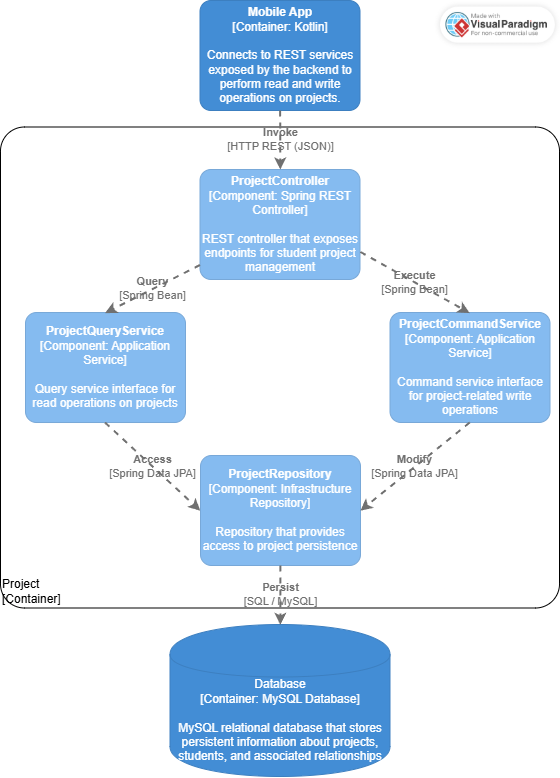
</p>

<p align="center">
  Elaboración propia
</p>

#### 2.6.1.6. Bounded Context Software Architecture Code Level Diagrams

#### 2.6.1.6.1. Bounded Context Domain Layer Class Diagrams

<p align="center">
  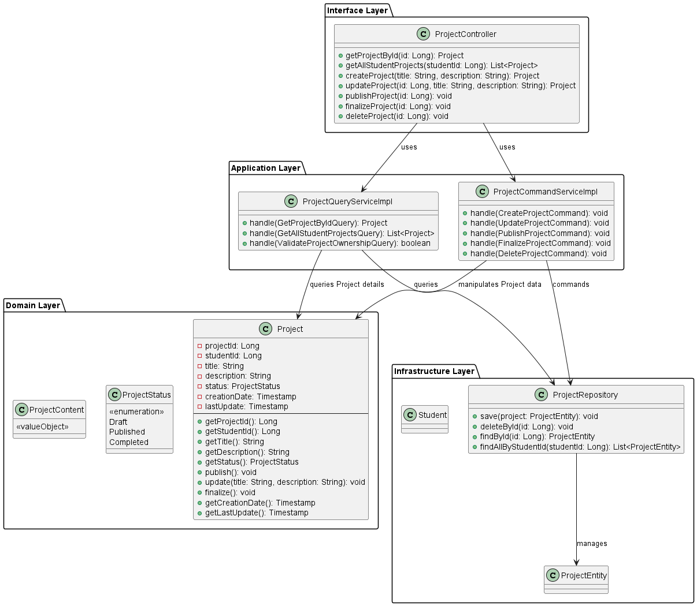
</p>

<p align="center">
    Bounded Context Class Diagram - Elaboración propia
</p>

#### 2.6.1.6.2. Bounded Context Database Design Diagrams

<p align="center">
  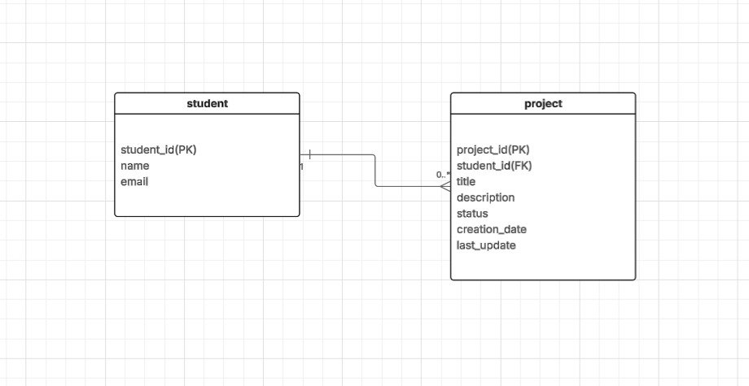
</p>

<p align="center">
  Elaboración propia
</p>

### 2.6.2. Bounded Context: Company Opportunities

#### 2.6.2.1. Domain Layer

El agregado Opportunity encapsula la lógica de negocio de una convocatoria publicada por una empresa, controlando su ciclo de vida (Draft, Published, Closed), validando criterios y actualizaciones, y garantizando consistencia mediante Value Objects como OpportunityStatus y OpportunityRequirements.


### Aggregate: `Opportunity`
**Descripción:** Representa una convocatoria u oportunidad publicada por una empresa, con detalles, criterios de selección y estado.

| Atributos      | Tipo de dato       | Visibilidad | Descripción                                           |
|----------------|------------------|------------|-----------------------------------------------------|
| opportunityId  | Long             | Private    | Identificador único de la oportunidad             |
| companyId      | Long             | Private    | Identificador de la empresa que publica la oportunidad |
| title          | String           | Private    | Título de la convocatoria                           |
| description    | String           | Private    | Descripción detallada de la oportunidad            |
| requirements   | List<String>     | Private    | Lista de habilidades o criterios requeridos        |
| status         | OpportunityStatus| Private    | Estado de la oportunidad (`Draft`, `Published`, `Closed`) |
| creationDate   | Timestamp        | Private    | Fecha de creación                                   |
| lastUpdate     | Timestamp        | Private    | Fecha de última actualización                        |

### Métodos

| Método                  | Tipo de retorno | Visibilidad | Descripción                                     |
|-------------------------|----------------|------------|------------------------------------------------|
| getOpportunityId()      | Long           | Public     | Devuelve el ID de la oportunidad             |
| getCompanyId()          | Long           | Public     | Devuelve el ID de la empresa                 |
| getTitle()              | String         | Public     | Devuelve el título de la oportunidad        |
| getDescription()        | String         | Public     | Devuelve la descripción de la oportunidad   |
| getRequirements()       | List<String>   | Public     | Devuelve los requisitos o habilidades       |
| getStatus()             | OpportunityStatus | Public  | Devuelve el estado actual                    |
| publish()               | void           | Public     | Cambia el estado de la oportunidad a `Published` |
| close()                 | void           | Public     | Cambia el estado de la oportunidad a `Closed` |
| update(title, description, requirements) | void | Public | Actualiza los datos básicos de la oportunidad |
| getCreationDate()       | Timestamp      | Public     | Devuelve la fecha de creación               |
| getLastUpdate()         | Timestamp      | Public     | Devuelve la fecha de última actualización   |

### Value Objects

| Value Object           | Descripción                                      |
|------------------------|--------------------------------------------------|
| OpportunityStatus       | Representa el estado de la oportunidad: `Draft`, `Published`, `Closed` |
| OpportunityRequirements | Contiene las habilidades y criterios que la empresa espera de los postulantes |


#### Clase: `OpportunityQueryService`

| Título       | OpportunityQueryService |
|--------------|--------------------------|
| Descripción  | Interfaz de servicio de consultas para operaciones de lectura relacionadas con oportunidades de empresa |

##### Métodos

| Método                                | Descripción                                               |
|--------------------------------------|-----------------------------------------------------------|
| handle(GetOpportunityByIdQuery)       | Obtiene los detalles completos de una oportunidad por su ID |
| handle(GetAllCompanyOpportunitiesQuery) | Obtiene todas las oportunidades asociadas a una empresa   |
| handle(ValidateOpportunityOwnershipQuery) | Verifica si una empresa es propietaria de la oportunidad |

---

#### Clase: `OpportunityCommandService`

| Título       | OpportunityCommandService |
|--------------|-----------------------------|
| Descripción  | Interfaz de servicio de comandos para operaciones de escritura relacionadas con oportunidades de empresa |

##### Métodos

| Método                          | Descripción                                                       |
|--------------------------------|-------------------------------------------------------------------|
| handle(CreateOpportunityCommand) | Crea una nueva oportunidad con la información proporcionada       |
| handle(UpdateOpportunityCommand) | Actualiza los detalles de la oportunidad (título, descripción, requisitos) |
| handle(PublishOpportunityCommand) | Cambia el estado de la oportunidad a publicada                    |
| handle(CloseOpportunityCommand)   | Cambia el estado de la oportunidad a cerrada                      |
| handle(DeleteOpportunityCommand)  | Elimina una oportunidad del sistema                               |


#### 2.6.2.2. Interface Layer


El OpportunityController expone endpoints REST que permiten a clientes externos crear, actualizar, publicar, cerrar y consultar convocatorias, utilizando assemblers para mapear recursos REST a comandos y entidades de dominio, y conectándose a los servicios de aplicación para ejecutar la lógica correspondiente.

### Controlador: `OpportunityController`

**Título:** OpportunityController  
**Descripción:** Controlador REST que maneja las operaciones CRUD y gestión de oportunidades/convocatorias de empresas.

#### Métodos

| Método               | Ruta                                  | Descripción                                               |
|---------------------|--------------------------------------|-----------------------------------------------------------|
| getOpportunityById   | GET /api/v1/opportunities/{id}       | Obtiene los detalles de una oportunidad específica por su ID |
| getAllCompanyOpportunities | GET /api/v1/opportunities/company/{companyId} | Obtiene todas las oportunidades asociadas a una empresa |
| createOpportunity    | POST /api/v1/opportunities           | Crea una nueva oportunidad a partir de los datos proporcionados |
| updateOpportunity    | PUT /api/v1/opportunities/{id}       | Actualiza los detalles de una oportunidad existente     |
| publishOpportunity   | POST /api/v1/opportunities/{id}/publish | Cambia el estado de la oportunidad a publicada        |
| closeOpportunity     | POST /api/v1/opportunities/{id}/close   | Cambia el estado de la oportunidad a cerrada          |
| deleteOpportunity    | DELETE /api/v1/opportunities/{id}    | Elimina una oportunidad del sistema                     |

#### Dependencias

| Dependencia                               | Descripción                                                                 |
|------------------------------------------|-----------------------------------------------------------------------------|
| OpportunityQueryService                   | Servicio para consultas y recuperación de datos de oportunidades           |
| OpportunityCommandService                 | Servicio para ejecutar comandos de creación, actualización, publicación, cierre y eliminación de oportunidades |
| CreateOpportunityCommandFromResourceAssembler | Convierte recursos REST en comandos de creación de oportunidades         |
| UpdateOpportunityCommandFromResourceAssembler | Convierte recursos REST en comandos de actualización de oportunidades    |
| DeleteOpportunityCommandFromResourceAssembler | Convierte recursos REST en comandos de eliminación de oportunidades       |
| OpportunityResourceFromEntityAssembler   | Convierte entidades de oportunidad en recursos REST para la respuesta     |

#### 2.6.2.3. Application Layer

Los servicios OpportunityCommandServiceImpl y OpportunityQueryServiceImpl implementan los casos de uso de creación, actualización, publicación, cierre y consulta de oportunidades, actuando como orquestadores entre el dominio y la infraestructura, sin exponer detalles técnicos.


#### Clase: `OpportunityQueryServiceImpl`

| Título       | OpportunityQueryServiceImpl |
|--------------|------------------------------|
| Descripción  | Implementación del servicio de consultas para operaciones de lectura relacionadas con oportunidades de empresa |

##### Dependencias

| Dependencia                | Descripción                                     |
|-----------------------------|-------------------------------------------------|
| OpportunityRepository       | Repositorio para acceso a datos de oportunidades |
| OpportunityQueryService     | Interfaz de consultas definida en el dominio     |

---

#### Clase: `OpportunityCommandServiceImpl`

| Título       | OpportunityCommandServiceImpl |
|--------------|--------------------------------|
| Descripción  | Implementación del servicio de comandos para operaciones de escritura relacionadas con oportunidades de empresa |

##### Dependencias

| Dependencia                | Descripción                                     |
|-----------------------------|-------------------------------------------------|
| OpportunityRepository       | Repositorio para acceso a datos de oportunidades |
| OpportunityCommandService   | Interfaz de comandos definida en el dominio      |


#### 2.6.2.4. Infrastructure Layer

La clase OpportunityRepository gestiona la persistencia y recuperación de oportunidades en la base de datos, con operaciones CRUD y consultas específicas por empresa, asegurando la integración del dominio con entidades como Company y OpportunityEntity.


#### Clase: `OpportunityRepository`

| Título       | OpportunityRepository |
|-------------|----------------------|
| Descripción | Interfaz de persistencia para operaciones CRUD y consultas específicas de oportunidades de empresa |

#### Métodos

| Método                | Descripción                                           |
|----------------------|-------------------------------------------------------|
| save(OpportunityEntity) | Persiste una nueva oportunidad o actualiza una existente |
| deleteById(Long)       | Elimina una oportunidad por su ID                   |
| findById(Long)         | Obtiene una oportunidad por su ID                   |
| findAllByCompanyId(Long) | Obtiene todas las oportunidades asociadas a una empresa |

#### Dependencias

| Dependencia        | Propósito                                                   |
|------------------|--------------------------------------------------------------|
| Company           | Clase que representa a la empresa en el sistema            |
| OpportunityEntity | Clase que representa la entidad de oportunidad en la base de datos |

#### 2.6.2.5. Bounded Context Software Architecture Component Level Diagrams

Este diagrama de componentes representa un sistema monolítico que gestiona oportunidades empresariales dentro de la plataforma. Una aplicación Movil interactúa con el `OpportunityController`..

El controlador delega la lógica en dos servicios principales: `OpportunityQueryService`, para consultas y validaciones, y `OpportunityCommandService`, para creación, actualización, publicación y cierre de oportunidades.

Ambos servicios utilizan el `OpportunityRepository`, que maneja la persistencia mediante JPA en una base de datos MySQL.

<p align="center">
  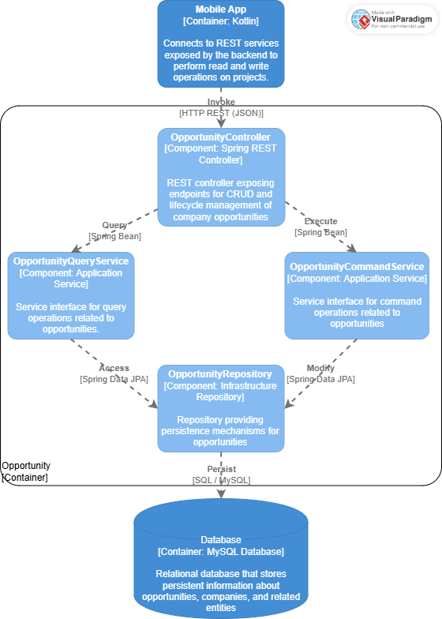
</p>

<p align="center">
  Elaboración propia
</p>

#### 2.6.2.6. Bounded Context Software Architecture Code Level Diagrams

#### 2.6.2.6.1. Bounded Context Domain Layer Class Diagrams

<p align="center">
  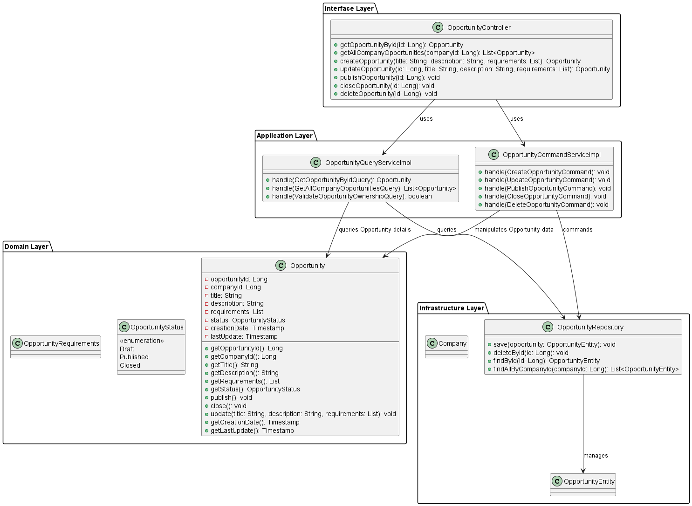
</p>

<p align="center">
    Bounded Context Class Diagram - Elaboración propia
</p>

#### 2.6.2.6.2. Bounded Context Database Design Diagrams

<p align="center">
  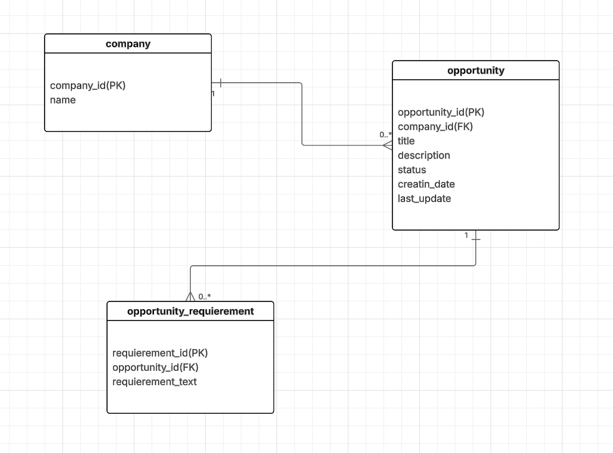
</p>

<p align="center">
  Elaboración propia
</p>

### 2.6.3. Bounded Context: Project Collaboration

#### 2.6.3.1. Domain Layer

Contiene la lógica principal sobre cómo las empresas (gerentes) toman decisiones respecto a proyectos estudiantiles. Incluye el agregado CollaborationDecision, con atributos como projectId, companyId, decisionStatus (interesado, aceptado, rechazado) y feedback. También maneja entidades de soporte como Manager y StudentProject.


#### Aggregate: `CollaborationDecision`
**Descripción:** Representa la decisión de un gerente sobre un proyecto estudiantil y la respuesta del estudiante, incluyendo estado de interés, aceptación/rechazo y observaciones.

| Atributos          | Tipo de dato            | Visibilidad | Descripción                                           |
|-------------------|------------------------|------------|-----------------------------------------------------|
| decisionId         | Long                   | Private    | Identificador único de la decisión                 |
| projectId          | Long                   | Private    | Identificador del proyecto asociado                |
| companyId          | Long                   | Private    | Identificador de la empresa o gerente evaluador    |
| status             | CollaborationStatus    | Private    | Estado de la decisión del gerente (`Interested`, `NotInterested`) |
| studentResponse    | StudentResponseStatus  | Private    | Respuesta del estudiante (`Pending`, `Accepted`, `Rejected`) |
| evaluationNotes    | String                 | Private    | Observaciones o criterios de evaluación del gerente |
| creationDate       | Timestamp              | Private    | Fecha de creación de la decisión                   |
| lastUpdate         | Timestamp              | Private    | Fecha de última actualización                       |

### Métodos

| Método                     | Tipo de retorno        | Visibilidad | Descripción                                     |
|----------------------------|----------------------|------------|------------------------------------------------|
| getDecisionId()            | Long                 | Public     | Devuelve el ID de la decisión                  |
| getProjectId()             | Long                 | Public     | Devuelve el ID del proyecto asociado           |
| getCompanyId()             | Long                 | Public     | Devuelve el ID de la empresa evaluadora        |
| getStatus()                | CollaborationStatus  | Public     | Devuelve el estado de la decisión del gerente  |
| markInterested()           | void                 | Public     | Cambia el estado del gerente a `Interested`   |
| markNotInterested()        | void                 | Public     | Cambia el estado del gerente a `NotInterested` |
| addEvaluationNotes(notes)  | void                 | Public     | Agrega observaciones de evaluación            |
| getEvaluationNotes()       | String               | Public     | Devuelve las notas de evaluación              |
| submitStudentResponse(response) | void            | Public     | Permite al estudiante aceptar o rechazar la colaboración |
| getStudentResponse()       | StudentResponseStatus | Public    | Devuelve el estado de respuesta del estudiante |
| getCreationDate()          | Timestamp            | Public     | Devuelve la fecha de creación                 |
| getLastUpdate()            | Timestamp            | Public     | Devuelve la fecha de última actualización     |

#### Value Objects

| Value Object            | Descripción                                      |
|-------------------------|--------------------------------------------------|
| CollaborationStatus      | Representa el estado de la decisión del gerente: `Interested`, `NotInterested` |
| StudentResponseStatus    | Representa la respuesta del estudiante: `Pending`, `Accepted`, `Rejected` |
| EvaluationNotes          | Contiene observaciones o criterios de evaluación del gerente |


#### Interfaz: `CollaborationDecisionQueryService`

| Título       | CollaborationDecisionQueryService |
|-------------|-----------------------------------|
| Descripción | Contrato para operaciones de lectura relacionadas con decisiones de colaboración |

#### Métodos

| Método                          | Descripción                                                 |
|--------------------------------|-------------------------------------------------------------|
| handle(GetDecisionByIdQuery)    | Obtiene los detalles completos de una decisión por su ID   |
| handle(GetDecisionsByProjectQuery) | Obtiene todas las decisiones asociadas a un proyecto       |
| handle(GetDecisionsByCompanyQuery) | Obtiene todas las decisiones tomadas por una empresa       |

---

#### Interfaz: `CollaborationDecisionCommandService`

| Título       | CollaborationDecisionCommandService |
|-------------|-------------------------------------|
| Descripción | Contrato para operaciones de escritura relacionadas con decisiones de colaboración |

#### Métodos

| Método                                    | Descripción                                                 |
|-------------------------------------------|-------------------------------------------------------------|
| handle(CreateCollaborationDecisionCommand) | Crea una nueva decisión de colaboración (`Interested` / `NotInterested`) |
| handle(AddEvaluationNotesCommand)          | Agrega notas de evaluación a una decisión                   |
| handle(SubmitStudentResponseCommand)       | Permite al estudiante aceptar o rechazar la colaboración    |
| handle(DeleteCollaborationDecisionCommand) | Elimina una decisión del sistema                             |


#### 2.6.3.2. Interface Layer

Se refleja en la aplicación móvil, mediante los formularios que puede enviar el gerente para colaborar con un proyecto. Los gerentes envían propuestas de colaboración a proyectos específicos, y los estudiantes pueden revisarlas y responder (aceptar o rechazar).


#### Controlador: `CollaborationDecisionController`

**Título:** CollaborationDecisionController  
**Descripción:** Controlador REST que maneja la visualización de proyectos, registro de decisiones de gerentes y respuesta de estudiantes sobre colaboraciones.

#### Métodos

| Método                          | Ruta                                         | Descripción                                                 |
|--------------------------------|---------------------------------------------|-------------------------------------------------------------|
| getDecisionById                  | GET /api/v1/collaboration/{id}             | Obtiene los detalles de una decisión específica por ID     |
| getAllDecisionsByProject         | GET /api/v1/collaboration/project/{projectId} | Obtiene todas las decisiones asociadas a un proyecto       |
| getAllDecisionsByCompany         | GET /api/v1/collaboration/company/{companyId} | Obtiene todas las decisiones tomadas por una empresa       |
| createDecision                   | POST /api/v1/collaboration                 | Permite al gerente registrar su decisión (`Interested` / `NotInterested`) |
| addEvaluationNotes               | POST /api/v1/collaboration/{id}/notes      | Agrega observaciones o criterios de evaluación a la decisión |
| submitStudentResponse            | POST /api/v1/collaboration/{id}/response   | Permite al estudiante aceptar o rechazar la colaboración  |
| deleteDecision                   | DELETE /api/v1/collaboration/{id}          | Elimina una decisión de colaboración del sistema          |

#### Dependencias

| Dependencia                                           | Descripción                                                                 |
|------------------------------------------------------|-----------------------------------------------------------------------------|
| CollaborationDecisionQueryService                     | Servicio para consultas y recuperación de decisiones de colaboración       |
| CollaborationDecisionCommandService                   | Servicio para ejecutar comandos de creación, notas, respuesta y eliminación |
| CreateCollaborationDecisionCommandFromResourceAssembler | Convierte recursos REST en comandos para crear decisiones                   |
| AddEvaluationNotesCommandFromResourceAssembler       | Convierte recursos REST en comandos para añadir notas                      |
| SubmitStudentResponseCommandFromResourceAssembler    | Convierte recursos REST en comandos para que el estudiante acepte/rechace  |
| DeleteCollaborationDecisionCommandFromResourceAssembler | Convierte recursos REST en comandos para eliminar decisiones               |
| CollaborationDecisionResourceFromEntityAssembler     | Convierte entidades en recursos REST para la respuesta                     |


#### 2.6.3.3. Application Layer

Orquesta los casos de uso para enviar, aceptar o rechazar decisiones de colaboración. Expone servicios de comandos (CollaborationDecisionCommandService) para procesar acciones y servicios de consulta (CollaborationDecisionQueryService) para obtener el estado de las decisiones.


#### Clase: `CollaborationDecisionQueryServiceImpl`

| Título       | CollaborationDecisionQueryServiceImpl |
|-------------|---------------------------------------|
| Descripción | Implementación del contrato de consultas definido en el dominio para decisiones de colaboración |

#### Dependencias:

| Dependencia                          | Descripción                                  |
|-------------------------------------|---------------------------------------------|
| CollaborationDecisionQueryService    | Contrato definido en dominio                 |
| CollaborationDecisionRepository      | Repositorio para acceso a datos de decisiones |

---

#### Clase: `CollaborationDecisionCommandServiceImpl`

| Título       | CollaborationDecisionCommandServiceImpl |
|-------------|-----------------------------------------|
| Descripción | Implementación del contrato de comandos definido en el dominio para decisiones de colaboración |

#### Dependencias:

| Dependencia                           | Descripción                                  |
|--------------------------------------|---------------------------------------------|
| CollaborationDecisionCommandService   | Contrato definido en dominio                 |
| CollaborationDecisionRepository       | Repositorio para acceso a datos de decisiones |


#### 2.6.3.4. Infrastructure Layer

Implementa la persistencia de las decisiones de colaboración y la integración con servicios externos. Incluye repositorios como CollaborationDecisionRepository y adaptadores para acceder a datos de proyectos y empresas.


#### Clase: `CollaborationDecisionRepository`

| Título       | CollaborationDecisionRepository |
|-------------|---------------------------------|
| Descripción | Interfaz de persistencia para operaciones CRUD y consultas específicas de decisiones de colaboración |

#### Métodos

| Método                          | Descripción                                                 |
|--------------------------------|-------------------------------------------------------------|
| save(CollaborationDecisionEntity) | Persiste una nueva decisión o actualiza una existente      |
| deleteById(Long)                | Elimina una decisión por su ID                               |
| findById(Long)                   | Recupera una decisión específica por ID                     |
| findByProjectId(Long)            | Recupera todas las decisiones asociadas a un proyecto       |
| findByCompanyId(Long)            | Recupera todas las decisiones tomadas por una empresa       |

#### Dependencias

| Dependencia                     | Propósito                                          |
|--------------------------------|---------------------------------------------------|
| CollaborationDecisionEntity      | Entidad que representa la decisión en la base de datos |
| Project                          | Representa el proyecto asociado                   |
| Company                          | Representa la empresa o gerente evaluador        

#### 2.6.3.5. Bounded Context Software Architecture Component Level Diagrams

Este diagrama de componentes representa un sistema monolítico que gestiona decisiones de colaboración entre empresas y proyectos estudiantiles. Una aplicación Movil interactúa con el `CollaborationDecisionController`.

El controlador conecta con `CollaborationDecisionQueryService` para consultas y con `CollaborationDecisionCommandService` para registrar decisiones, añadir notas y gestionar respuestas de estudiantes.

Ambos servicios acceden al `CollaborationDecisionRepository`, encargado de la persistencia mediante JPA en una base de datos MySQL.

<p align="center">
  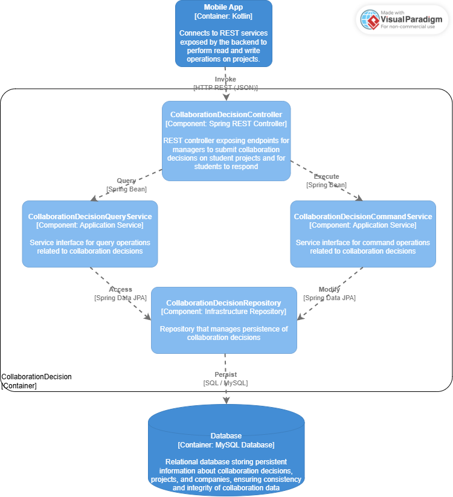
</p>

<p align="center">
  Elaboración propia
</p>

#### 2.6.3.6. Bounded Context Software Architecture Code Level Diagrams

#### 2.6.3.6.1. Bounded Context Domain Layer Class Diagrams

<p align="center">
  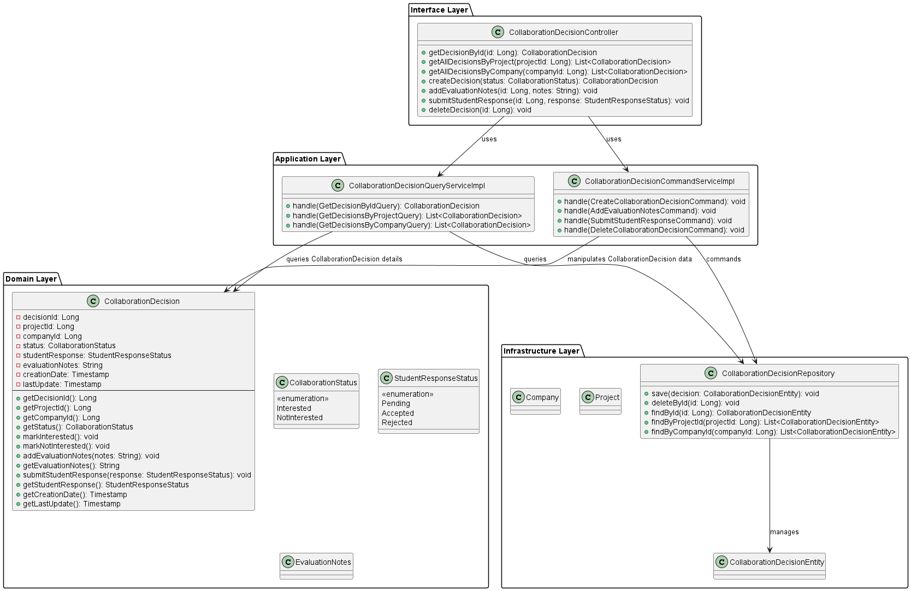
</p>

<p align="center">
    Bounded Context Class Diagram - Elaboración propia
</p>

#### 2.6.3.6.2. Bounded Context Database Design Diagrams

<p align="center">
  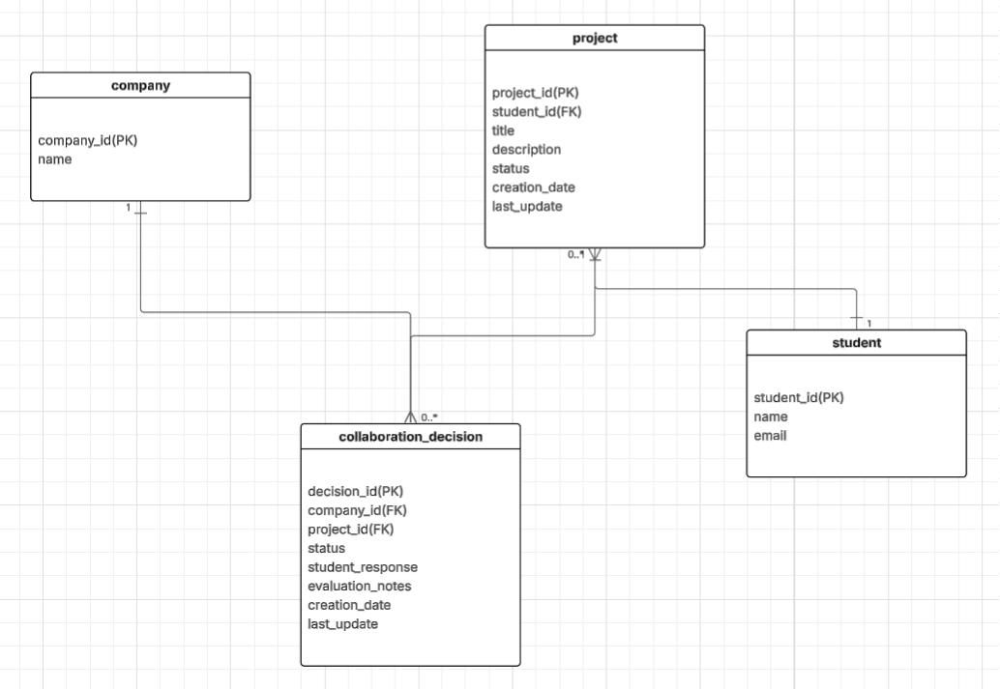
</p>

<p align="center">
  Elaboración propia
</p>

### 2.6.4. Bounded Context: Student Applications

#### 2.6.4.1. Domain Layer

Define el agregado Application, que encapsula los datos y reglas de negocio de una postulación (estado, fechas, vínculos a estudiante, proyecto y oportunidad), asegurando consistencia a través de Value Objects como ApplicationStatus y métodos de negocio (submit, accept, reject).


#### Aggregate: `Application`
**Descripción:** Representa la postulación de un estudiante a una oportunidad, incluyendo su proyecto asociado y el estado de la postulación.

| Atributos         | Tipo de dato        | Visibilidad | Descripción                                           |
|------------------|-------------------|------------|-----------------------------------------------------|
| applicationId     | Long              | Private    | Identificador único de la postulación             |
| studentId         | Long              | Private    | Identificador del estudiante que postula          |
| opportunityId     | Long              | Private    | Identificador de la oportunidad a la que postula  |
| projectId         | Long              | Private    | Identificador del proyecto que se postula         |
| status            | ApplicationStatus | Private    | Estado de la postulación (`Pending`, `Accepted`, `Rejected`) |
| submissionDate    | Timestamp         | Private    | Fecha de creación de la postulación               |
| lastUpdate        | Timestamp         | Private    | Fecha de última actualización de la postulación   |

### Métodos

| Método                     | Tipo de retorno | Visibilidad | Descripción                                     |
|----------------------------|----------------|------------|------------------------------------------------|
| getApplicationId()         | Long           | Public     | Devuelve el ID de la postulación             |
| getStudentId()             | Long           | Public     | Devuelve el ID del estudiante                 |
| getOpportunityId()         | Long           | Public     | Devuelve el ID de la oportunidad             |
| getProjectId()             | Long           | Public     | Devuelve el ID del proyecto asociado         |
| getStatus()                | ApplicationStatus | Public  | Devuelve el estado actual de la postulación |
| submit()                   | void           | Public     | Cambia el estado de la postulación a `Pending` |
| accept()                   | void           | Public     | Cambia el estado de la postulación a `Accepted` |
| reject()                   | void           | Public     | Cambia el estado de la postulación a `Rejected` |
| getSubmissionDate()        | Timestamp      | Public     | Devuelve la fecha de creación de la postulación |
| getLastUpdate()            | Timestamp      | Public     | Devuelve la fecha de última actualización   |

### Value Objects

| Value Object           | Descripción                                      |
|------------------------|--------------------------------------------------|
| ApplicationStatus       | Representa el estado de la postulación: `Pending`, `Accepted`, `Rejected` |
| ApplicationCriteria     | Contiene los criterios de selección aplicados por la empresa |


#### Interfaz: `ApplicationQueryService`

| Título       | ApplicationQueryService |
|-------------|--------------------------|
| Descripción | Contrato para operaciones de lectura relacionadas con postulaciones de estudiantes |

##### Métodos

| Método                                | Descripción                                                       |
|--------------------------------------|-------------------------------------------------------------------|
| handle(GetApplicationByIdQuery)      | Obtiene los detalles completos de una postulación por su ID       |
| handle(GetAllStudentApplicationsQuery) | Obtiene todas las postulaciones asociadas a un estudiante        |
| handle(GetAllOpportunityApplicationsQuery) | Obtiene todas las postulaciones a una oportunidad              |
| handle(ValidateApplicationOwnershipQuery) | Verifica si un estudiante es propietario de la postulación     |

---

#### Interfaz: `ApplicationCommandService`

| Título       | ApplicationCommandService |
|-------------|-----------------------------|
| Descripción | Contrato para operaciones de escritura relacionadas con postulaciones de estudiantes |

##### Métodos

| Método                               | Descripción                                                   |
|-------------------------------------|---------------------------------------------------------------|
| handle(SubmitApplicationCommand)    | Crea una nueva postulación asociando estudiante, proyecto y oportunidad |
| handle(AcceptApplicationCommand)    | Cambia el estado de la postulación a `Accepted`               |
| handle(RejectApplicationCommand)    | Cambia el estado de la postulación a `Rejected`               |
| handle(DeleteApplicationCommand)    | Elimina una postulación del sistema                           |


#### 2.6.4.2. Interface Layer


Expone un controlador REST (ApplicationController) que traduce las operaciones del dominio en endpoints accesibles al cliente, manejando rutas para crear, aceptar, rechazar o listar postulaciones, y apoyándose en assemblers para transformar entidades y comandos entre el mundo REST y el dominio.

### Controlador: `ApplicationController`

**Título:** ApplicationController  
**Descripción:** Controlador REST que maneja las operaciones CRUD y gestión de postulaciones de estudiantes a oportunidades de empresa.

#### Métodos

| Método                 | Ruta                                       | Descripción                                               |
|------------------------|-------------------------------------------|-----------------------------------------------------------|
| getApplicationById      | GET /api/v1/applications/{id}             | Obtiene los detalles de una postulación específica por su ID |
| getAllStudentApplications | GET /api/v1/applications/student/{studentId} | Obtiene todas las postulaciones de un estudiante        |
| getAllOpportunityApplications | GET /api/v1/applications/opportunity/{opportunityId} | Obtiene todas las postulaciones a una oportunidad      |
| submitApplication       | POST /api/v1/applications                 | Crea una nueva postulación asociando estudiante, proyecto y oportunidad |
| acceptApplication       | POST /api/v1/applications/{id}/accept    | Cambia el estado de la postulación a `Accepted`         |
| rejectApplication       | POST /api/v1/applications/{id}/reject    | Cambia el estado de la postulación a `Rejected`         |
| deleteApplication       | DELETE /api/v1/applications/{id}         | Elimina una postulación del sistema                      |

#### Dependencias

| Dependencia                              | Descripción                                                                 |
|-----------------------------------------|-----------------------------------------------------------------------------|
| ApplicationQueryService                  | Servicio para consultas y recuperación de datos de postulaciones          |
| ApplicationCommandService                | Servicio para ejecutar comandos de creación, aceptación, rechazo y eliminación de postulaciones |
| SubmitApplicationCommandFromResourceAssembler | Convierte recursos REST en comandos de creación de postulaciones         |
| AcceptApplicationCommandFromResourceAssembler | Convierte recursos REST en comandos de aceptación de postulaciones      |
| RejectApplicationCommandFromResourceAssembler | Convierte recursos REST en comandos de rechazo de postulaciones         |
| DeleteApplicationCommandFromResourceAssembler | Convierte recursos REST en comandos de eliminación de postulaciones     |
| ApplicationResourceFromEntityAssembler  | Convierte entidades de postulación en recursos REST para la respuesta     |

#### 2.6.4.3. Application Layer

Implementa los casos de uso a través de ApplicationCommandServiceImpl y ApplicationQueryServiceImpl, orquestando las operaciones sobre el dominio y gestionando el flujo entre la lógica de negocio y las dependencias externas.

#### Clase: `ApplicationQueryServiceImpl`

| Título       | ApplicationQueryServiceImpl |
|-------------|-------------------------------|
| Descripción | Implementación del contrato de consultas definido en el dominio para postulaciones de estudiantes |

##### Dependencias

| Dependencia                      | Descripción                                    |
|----------------------------------|------------------------------------------------|
| ApplicationQueryService          | Contrato definido en dominio                   |
| ApplicationRepository            | Repositorio para acceso a datos de postulaciones |

---

#### Clase: `ApplicationCommandServiceImpl`

| Título       | ApplicationCommandServiceImpl |
|-------------|--------------------------------|
| Descripción | Implementación del contrato de comandos definido en el dominio para postulaciones de estudiantes |

##### Dependencias

| Dependencia                      | Descripción                                    |
|----------------------------------|------------------------------------------------|
| ApplicationCommandService        | Contrato definido en dominio                   |
| ApplicationRepository            | Repositorio para acceso a datos de postulaciones |


#### 2.6.4.4. Infrastructure Layer

Provee la persistencia mediante ApplicationRepository, con operaciones CRUD y consultas específicas por estudiante u oportunidad, conectando las entidades del dominio con la base de datos y gestionando la interacción con clases externas como Student, Project y Opportunity.


### Clase: `ApplicationRepository`

| Título       | ApplicationRepository |
|-------------|----------------------|
| Descripción | Interfaz de persistencia para operaciones CRUD y consultas específicas de postulaciones de estudiantes |

#### Métodos

| Método                 | Descripción                                           |
|------------------------|-------------------------------------------------------|
| save(ApplicationEntity) | Persiste una nueva postulación o actualiza una existente |
| deleteById(Long)        | Elimina una postulación por su ID                   |
| findById(Long)          | Obtiene una postulación por su ID                   |
| findAllByStudentId(Long) | Obtiene todas las postulaciones asociadas a un estudiante |
| findAllByOpportunityId(Long) | Obtiene todas las postulaciones a una oportunidad |

#### Dependencias

| Dependencia         | Propósito                                                   |
|--------------------|--------------------------------------------------------------|
| Student             | Clase que representa al estudiante en el sistema           |
| Opportunity         | Clase que representa la oportunidad en el sistema          |
| Project             | Clase que representa el proyecto asociado a la postulación |
| ApplicationEntity   | Clase que representa la entidad de postulación en la base de datos |

#### 2.6.4.5. Bounded Context Software Architecture Component Level Diagrams

Este diagrama de componentes representa un sistema monolítico que gestiona postulaciones de estudiantes a oportunidades de empresas. Una aplicación Movil interactúa con el `ApplicationController`.

El controlador conecta con `ApplicationQueryService` para consultas y con `ApplicationCommandService` para registrar, aceptar, rechazar o eliminar postulaciones.

Ambos servicios utilizan el `ApplicationRepository`, que gestiona la persistencia mediante JPA en una base de datos MySQL.

<p align="center">
  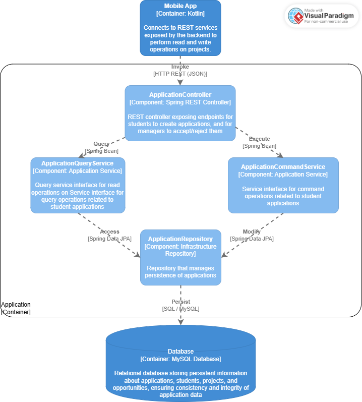
</p>

<p align="center">
  Elaboración propia
</p>

#### 2.6.4.6. Bounded Context Software Architecture Code Level Diagrams

#### 2.6.4.6.1. Bounded Context Domain Layer Class Diagrams

<p align="center">
  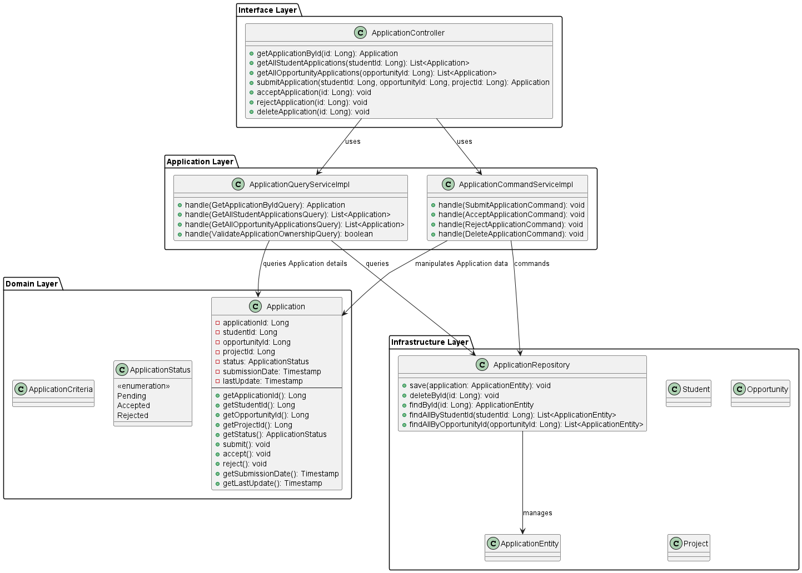
</p>

<p align="center">
    Bounded Context Class Diagram - Elaboración propia
</p>

#### 2.6.4.6.2. Bounded Context Database Design Diagrams


<p align="center">
  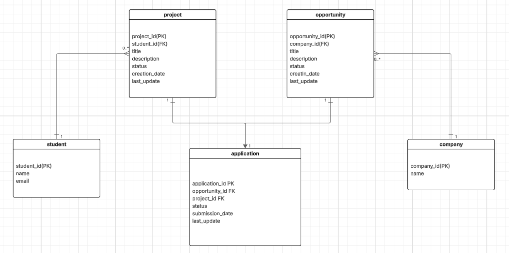
</p>
<br>

<p align="center">
  Elaboración propia
</p>

---

## Capítulo III: Solution UI/UX Design

### 3.1. Product design

#### 3.1.1. Style Guidelines

- _Branding:_    
    - La identidad visual de Innospace es moderna, innovadora y con un toque futurista, reflejando su enfoque en la tecnología y el espacio. El logo, con la figura de un cohete, transmite dinamismo y la idea de exploración y crecimiento. El color morado aporta sofisticación, mientras que los tonos de azul y blanco refuerzan la confiabilidad y accesibilidad.
    - Uso del logotipo: El logotipo de Innospace debe emplearse preferentemente sobre fondos claros, como blanco, gris claro o tonos pastel neutros, lo que permitirá que los colores del logo resalten. Si se utiliza sobre fondos oscuros, se recomienda emplear la versión en blanco del logo para mantener su visibilidad y claridad.
    - No se permite:
        - Rotar el logotipo.
        - Aplicar sombras, contornos o degradados, ya que esto puede restar claridad a la imagen del logo.
        - Modificar la tipografía original del nombre "Innospace", para mantener la consistencia de la identidad de marca.

<br>

<p align="center">
  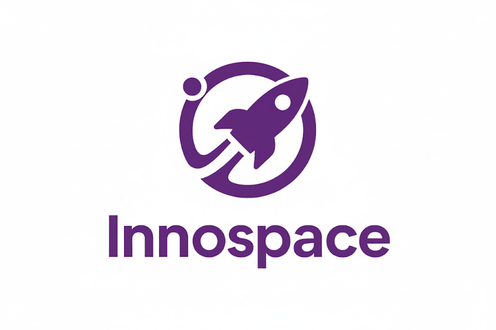
</p>

<p align="center">
  Logo Innospace - Elaboración propia
</p>

<br>


- _Typography:_
    - La tipografía utilizada en el logotipo es una fuente sans-serif geométrica, moderna y legible. Para mantener coherencia, se adoptará un sistema tipográfico similar en toda la aplicación.

    - Fuente primaria: Nunito Sans
        - Uso: Títulos, botones, navegación.
        - Estilos permitidos: Regular, SemiBold, Bold.

    - Fuente secundaria: Inter
        - Uso: Cuerpos de texto largos, formularios.

    - Tamaños recomendados:
        - Título principal (H1): 32px / 700
        - Subtítulo (H2): 24px / 600
        - Texto normal: 16px / 400
        - Nota o ayuda: 12px / 400
    
        | Nombre de fuente | Tipografia |
        |:----------------:|:----------:|
        | Nunito Sans | 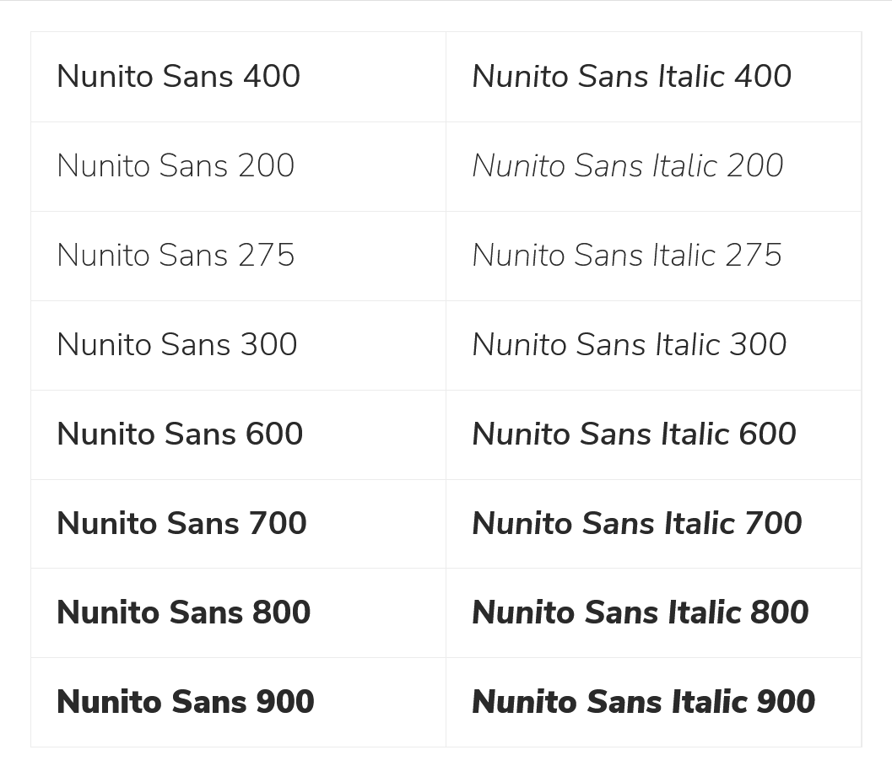 |
        | Inter |  |        
              
- _Colors:_
    - La paleta de colores de Innospace se basa en una combinación de tonos vibrantes y suaves, que ayudan a transmitir innovación, confianza y profesionalismo. El morado es el color protagonista, con el azul y blanco complementando la identidad visual. Además, se incluye un acento en amarillo cálido para las llamadas a la acción<br><br>
    
    | Color | Hex | Uso Principal | 
    |:-----:|:---:|:-------------:|
    |Morado| #6A1B9A | Logotipo, títulos destacados, secciones clave|
    |Azul| #1E3A8A | Texto principal, botones, enlaces, secciones de confianza|
    |Blanco| #FFFFFF | Fondo base, formularios, claridad visual|
    |Gris Claro| #B0BEC5 | Bordes, textos secundarios, fondos suaves|
    |Azul Claro| #3F82D4| Botones secundarios, enlaces, etiquetas |
    |Amarillo Cálido| #FFD400|Llamadas a la acción, alertas, iconos destacados|
<br>

<p align="center">
    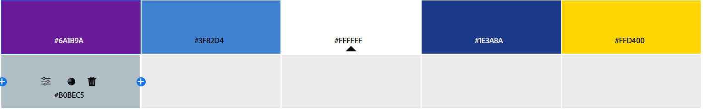
</p>

<p align="center">
    System Colors InnoSpace - Elaboración propia
</p>

<br>

- _Spacing:_
    - La coherencia en el espaciado es clave para una interfaz limpia y clara.
        - Espaciado entre secciones principales: 32px
        - Margen interno de botones y campos: 12px vertical / 20px horizontal
        - Separación entre elementos repetitivos (cards, ítems): 16px
        - Padding general de contenedores: 24px

- _Tono de comunicación y lenguaje:_
    - El tono de InnoSpace es cercano, entusiasta y profesional.
    
    | Estilo de redacción | Tono predominante |
    |---------------------|-------------------|
    | 1. Amigable y claro <br> 2. Sin tecnicismos innecesarios <br> 3. Verbos en voz activa <br> 4. Enfocado en beneficios (“Descubre experiencias únicas”, “Reserva en segundos”)| 1. Formal-casual: Respetuoso, pero no rígido. <br> 2. Entusiasta: Inspirador, motivador, acogedor. <br> 3. Directo: Frases cortas y llamadas a la acción claras. |

### 3.1.2. Information Architecture

La arquitectura de información de InnoSpace define cómo se organizará, etiquetará, navegará y buscará el contenido dentro de la aplicación móvil y su Landing Page. El objetivo es permitir que los usuarios interactúen de manera fluida con la plataforma, accedan fácilmente a los recursos clave y logren sus objetivos con el mínimo esfuerzo cognitivo.

#### 3.1.2.1. Organization Systems 

<br><br>

InnoSpace utilizará una combinación de organización jerárquica, secuencial y matricial, aplicada estratégicamente tanto en la Landing Page como en las secciones funcionales de la aplicación móvil. Se aplicarán también diferentes esquemas de categorización.

+ Jerarquía visual:

La jerarquía visual en InnoSpace se aplicará en vistas clave de la aplicación móvil. En la Landing Page, el contenido se organizará en secciones jerárquicas que priorizan el título, los beneficios clave y llamados a la acción como "Explora tu próximo proyecto" o "Únete a InnoSpace ahora". En el dashboard del usuario, las oportunidades recomendadas, las notificaciones y los próximos pasos estarán destacados visualmente con tarjetas y gráficos resaltados. En el dashboard del gerente, se destacarán las vistas de los proyectos activos, las notificaciones de validación y los próximos pasos a seguir, optimizando la gestión desde el primer acceso.<br><br>

+ Organización secuencial:

La organización secuencial en InnoSpace se aplicará en los procesos clave que requieran un acompañamiento paso a paso. En el onboarding del usuario, el flujo estará compuesto por etapas guiadas que incluyen el registro, la carga del perfil, publicación del portafolio y la vinculación con proyectos. Para los gerentes, la publicación de proyectos se estructurará como un formulario inteligente que guiará al usuario desde los datos generales hasta los filtros específicos para encontrar el candidato ideal.<br><br>

+ Organización matricial:

La organización matricial en InnoSpace facilitará la exploración libre de contenidos mediante el uso de cuadrículas y tarjetas visuales. En la vista de proyectos, las oportunidades se organizarán en una grilla que podrá filtrarse dinámicamente por criterios relevantes. Para los gerentes, la vista de postulantes mostrará tarjetas con información clave como nombre, carrera, portafolio, puntuación y habilidades, permitiendo comparaciones rápidas entre los candidatos.<br><br>

+ Esquemas de categorización:

  + **Por audiencia:** El contenido se adaptará a si el usuario es un estudiante o un gerente, con rutas diferenciadas y menús personalizados.

  + **Alfabético:** Para búsquedas de proyectos, habilidades y empresas.

  + **Cronológico:** En el historial de entregas, postulaciones y validaciones.<br><br>

#### 3.1.2.2. Labeling Systems  

<br><br>

El sistema de etiquetado está diseñado para ser intuitivo, minimalista y consistente en la interfaz de la Landing Page. Se emplearán términos cortos y precisos que permitan a los usuarios tener una mejor experiencia con la plataforma

+ Landing Page:

  + Inicio (logo)

  + ¿Cómo funciona?

  + Proyectos exitosos

  + Nosotros

  + Iniciar Sesión

<br>

<p align="center">
  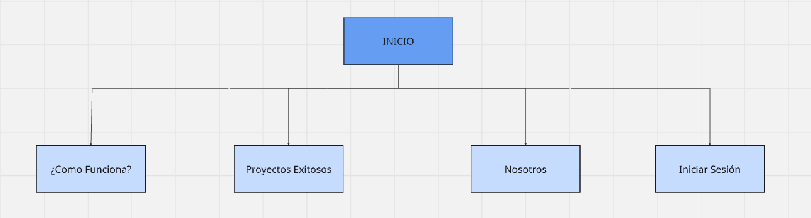
</p>

<p align="center">
    Labeling System - Elaboración propia
</p>

#### 3.1.2.3. SEO Tags and Meta Tags  

<br><br>

Las meta etiquetas permitirán estructurar adecuadamente la información que los buscadores necesitan para indexar y posicionar el contenido del sitio. Serán definidas de forma diferenciada para la Landing Page y la Aplicación Móvil.

+ Landing Page:

  + Título<br><br>

  ```html
  <title>InnoSpace</title>
  ```

  + Codificación de caracteres<br><br>

  ```html
  <meta charset="utf-8">
  ```

  + Meta Description<br><br>

  ```html
  <meta name="description" content="El puente directo entre el talento universitario y los desafios de la industria"/>
  ```

  + Keywords<br><br>

  ```html
  <meta name="keywords" content="innovación, proyectos innovadores, postular"/>
  ```

  + Autor y Derechos de Autor<br><br>

  ```html
  <meta name="author" content="InnoSpace Team"/>
  <meta name="copyright" content="© 2025 InnoSpace. Todos los derechos reservados." />
  ```

<br>

#### 3.1.2.4. Searching Systems  

<br><br>

Dado que InnoSpace concentrará gran volumen de información (proyectos publicados por empresas, ideas innovadoras de estudiantes, perfiles académicos y portafolios), la app contará con un buscador centralizado y filtros contextuales, optimizados para pantallas móviles

Opciones de búsqueda:

- Buscar proyectos de empresas.

- Buscar ideas innovadoras de estudiantes.

- Buscar estudiantes por habilidades y nivel académico.

- Buscar convocatorias disponibles con filtros avanzados.

- Buscar proyectos guardados en favoritos.

Filtros disponibles:

Para estudiantes:

- Modalidad: Presencial / Remoto / Híbrido.

- Habilidades requeridas (Ej: programación, marketing, diseño).

- Nivel académico: Pregrado, Posgrado, Técnico.

- Área académica: Ingeniería, Negocios, Salud, etc.

- Duración del proyecto: Corto plazo, Mediano, Largo plazo.

Para gerentes:

- Área académica: Ingeniería, Negocios, Salud, etc.

- Estado del proyecto: En busca de Inversion y Contratación

Visualización de resultados:

Lista interactiva con tarjetas que muestran:

- Título del proyecto o idea.

- Descripción corta.

- Habilidades requeridas.

- Universidad/empresa asociada.

- Estado (vigente o cerrado).

- Botones de acción: Ver más, Guardar en favoritos, Postular/Contactar.

- En caso de no encontrar resultados, se mostrará un mensaje: “No se encontraron coincidencias.”.

#### 3.1.2.5. Navigation Systems  

<br><br>

La navegación en InnoSpace está diseñada para ser clara, intuitiva y responsiva, guiando a los usuarios a través del landing page y la aplicación mobile, de forma que logren cumplir sus objetivos sin fricción.

Landing Page:

El sitio web implementa un diseño de una sola página con scroll (one-page scroll), donde el usuario navega desplazándose verticalmente por las secciones de Inicio, ¿Cómo funciona?, Proyectos exitosos y Nosotros. Esta experiencia está complementada por un encabezado fijo que permanece visible en todo momento y ofrece accesos directos a cada sección junto con el botón de Iniciar sesión. Para impulsar la interacción, al final de cada bloque se integran llamadas a la acción (CTAs) relevantes como "Regístrate ahora" (para estudiantes y gerentes) y "Publica tu primer proyecto". Este acceso directo desde la página de inicio hacia los formularios de registro está específicamente diseñado para garantizar un flujo de registro ágil y una experiencia de usuario optimizada.

Mobile App:

La aplicación integra un sistema de navegación dual que combina flujos guiados para procesos críticos con exploración libre para descubrimiento. Para acciones esenciales como registro y perfil, publicación de proyectos, propuesta de ideas innovadoras y postulaciones, se implementa una navegación secuencial que divide cada proceso en pantallas consecutivas con retroalimentación visual. Paralelamente, un menú inferior fijo ofrece acceso inmediato a diferentes secciones clave: Proyectos, Ideas Innovadoras, Portafolio, Postulaciones y Perfil. El sistema se complementa con indicadores de estado claros que incluyen etiquetas de postulación, botones de postulación contextuales, íconos de favoritos resaltados y diferenciación visual entre elementos validados y pendientes en el portafolio, creando un ecosistema de navegación intuitivo y transparente.

### 3.1.3. Landing Page UI Desing

#### 3.1.3.1 Landing Page Wireframe

<p align="center">
  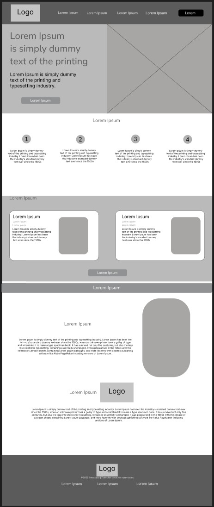
</p>

#### 3.1.3.2 Landing Page Mock-up

<p align="center">
  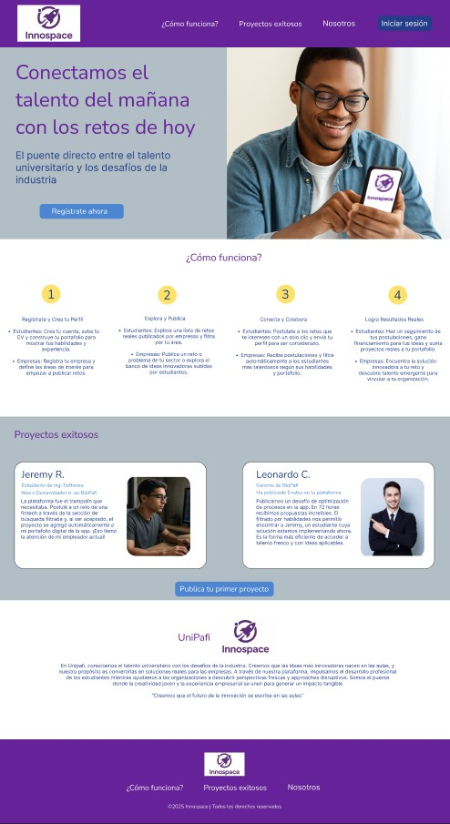
</p>

### 3.1.4 Mobile Applications UX/UI Design

#### 3.1.4.1 Mobile Applications Wireframes

Los wireframes de InnoSpace fueron diseñados bajo un enfoque de diseño centrado en el usuario, priorizando la claridad, accesibilidad y coherencia visual entre los perfiles de estudiante y gerente. Cada vista presenta una navegación intuitiva mediante una barra inferior fija y el uso consistente de tarjetas, íconos y botones de acción, facilitando tareas como explorar proyectos, crear convocatorias y gestionar solicitudes. 

[https://www.figma.com/design/2HTewxO6N3TGfTdiep11O3/InnoSpace?node-id=1-3](https://www.figma.com/design/2HTewxO6N3TGfTdiep11O3/InnoSpace?node-id=1-3)

- Iniciar sesión / Registrarse:

<p align="center">
  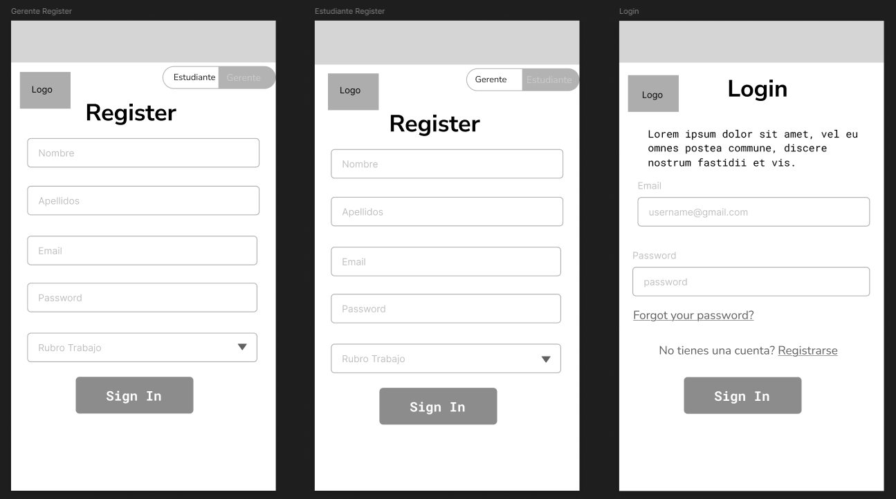
</p>

- Dashboard

<p align="center">
  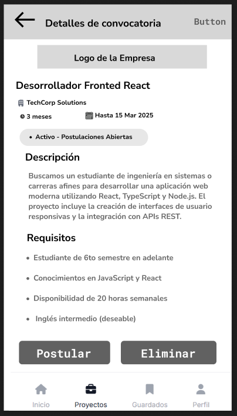
</p>

- Proyectos

<p align="center">
  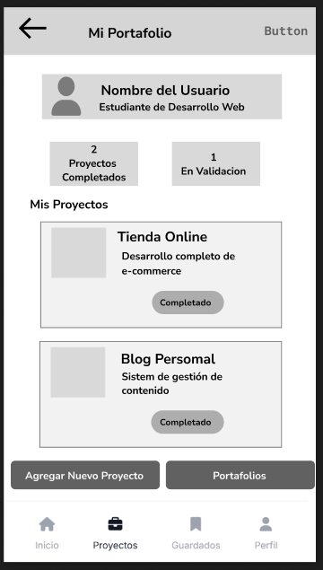
</p>

- Evaluaciones

<p align="center">
  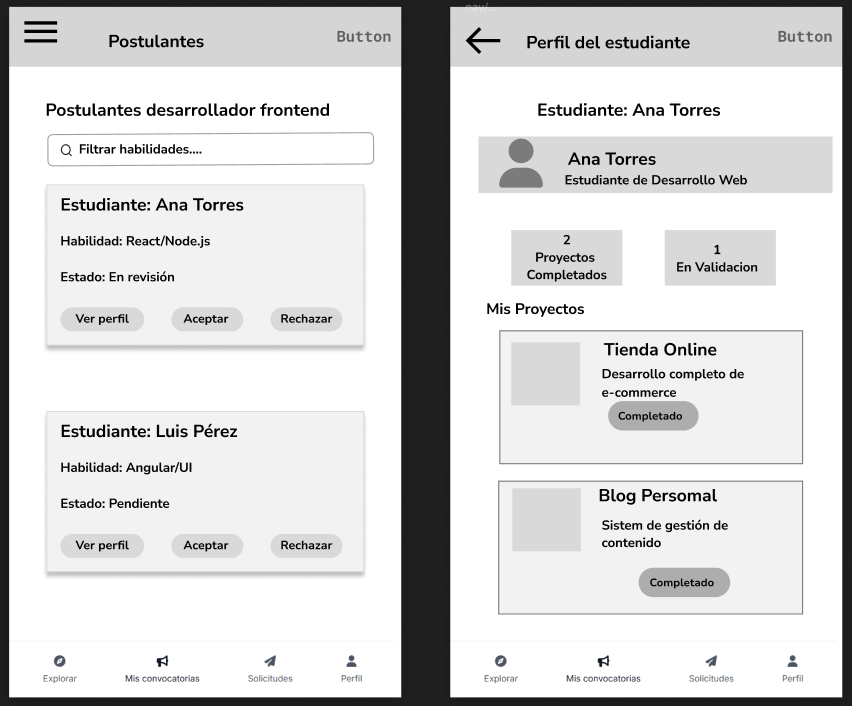
</p>

#### 3.1.4.2 Mobile Applications Wireflows Diagrams

**Wireflow 1: Login / Registrarse**

- **User Goal:**  
  Como nuevo usuario, quiero ingresar o crear una cuenta, para acceder a la plataforma según mi rol.

- **User Persona:**  
  Estudiante y Gerente de empresa  

- **Flujo:**  
  - El usuario accede a la pantalla inicial y selecciona **“Acceder”**.  
  - Elige su rol mediante un botón conmutador (**Estudiante / Gerente**).  
  - Si ya posee cuenta, introduce su **correo y contraseña** para iniciar sesión.  
  - Si es nuevo, selecciona **“Crear cuenta”** y completa el formulario con nombre, correo, contraseña y datos adicionales (carrera o empresa).  
  - Al finalizar, el sistema lo redirige automáticamente a su **dashboard** correspondiente.

<p align="center">
  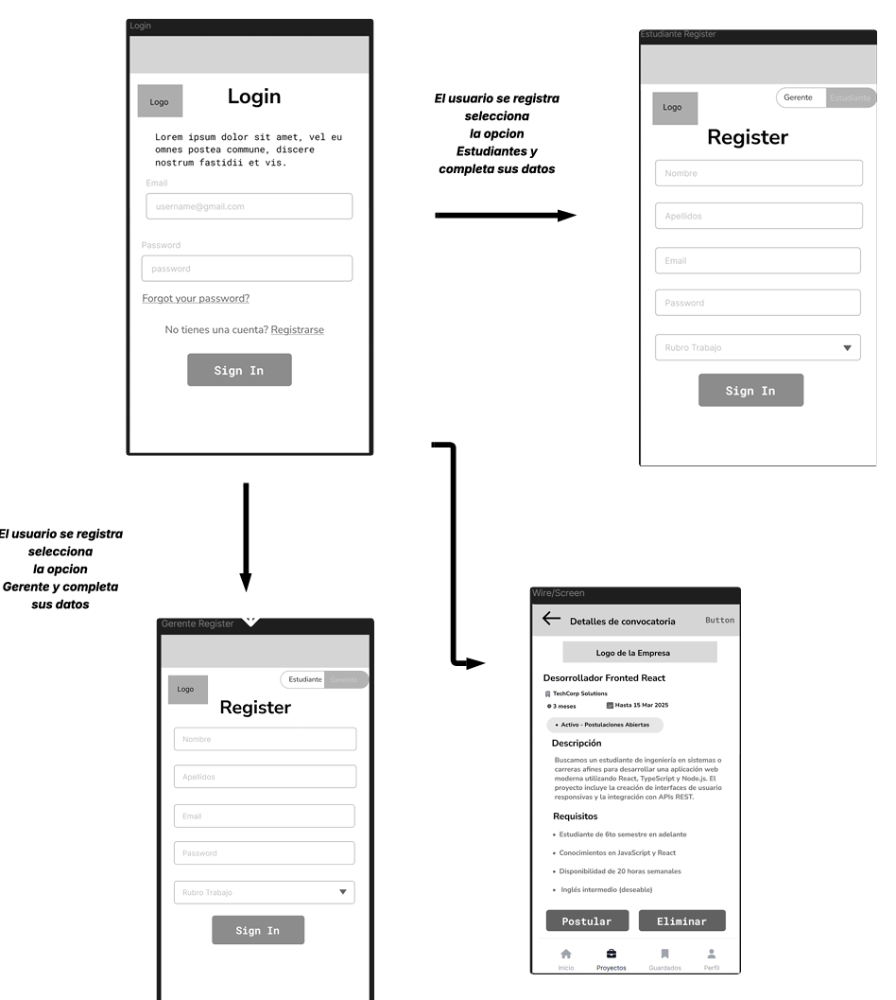
</p>

**Wireflow 2: Publicar convocatoria (Gerente)**

- **User Goal:**  
  Como gerente, quiero crear una nueva convocatoria para atraer estudiantes interesados en participar en proyectos de innovación.

- **User Persona:**  
  Gerente de empresa  

- **Flujo:**  
  - Desde el dashboard, el gerente selecciona la sección **“Mis Convocatorias”**.  
  - Presiona el botón **“+ Crear convocatoria”**.  
  - Completa el formulario con **título, descripción, habilidades requeridas, categoría** y **fecha límite**.  
  - Elige entre **“Guardar como borrador”** o **“Publicar”**.  
  - La convocatoria aparece listada en la vista principal con estado **“Activa”**.  
  - Puede **editarla** o **cerrarla** posteriormente.

<p align="center">
  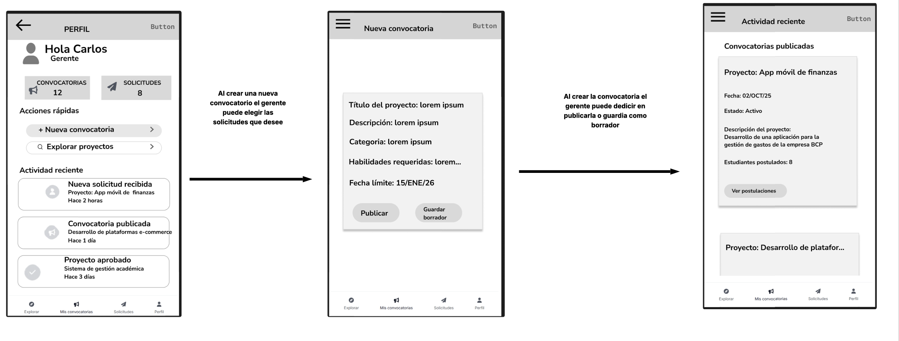
</p>

**Wireflow 3: Explorar proyectos (Gerente)**

- **User Goal:**  
  Como gerente, quiero explorar proyectos creados por estudiantes para identificar ideas innovadoras y posibles colaboradores.  

- **User Persona:**  
  Gerente de empresa  

- **Flujo:**  
  - Desde la barra inferior, selecciona la opción **“Explorar”**.  
  - Visualiza una lista de proyectos de estudiantes con barra de **búsqueda y filtros**.  
  - Al seleccionar un proyecto, accede a su **detalle completo** con descripción, autores y categoría.  
  - Puede presionar **“Enviar solicitud”** para contactar al estudiante.  
  - El sistema registra la solicitud en la sección **“Solicitudes”**.

<p align="center">
  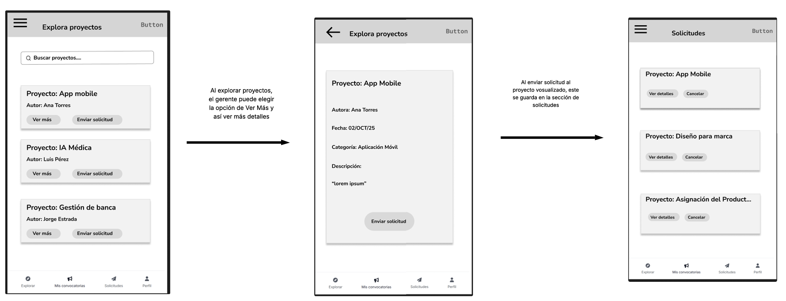
</p>

**Wireflow 4: Solicitudes enviadas (Gerente)**

- **User Goal:**  
  Como gerente, quiero revisar el estado de las solicitudes que he enviado a los estudiantes.  

- **User Persona:**  
  Gerente de empresa  

- **Flujo:**  
  - Accede a la pestaña **“Solicitudes”** desde la barra inferior.  
  - Revisa la lista de solicitudes enviadas, con estado **Pendiente**, **Aceptada** o **Rechazada**.  
  - Al seleccionar una solicitud, se muestra el **detalle del proyecto y mensaje enviado**.  
  - Puede **enviar un nuevo mensaje**, **cancelar la solicitud** o **ver el portafolio del estudiante**.  
  - El estado se actualiza según la respuesta del estudiante.

<p align="center">
  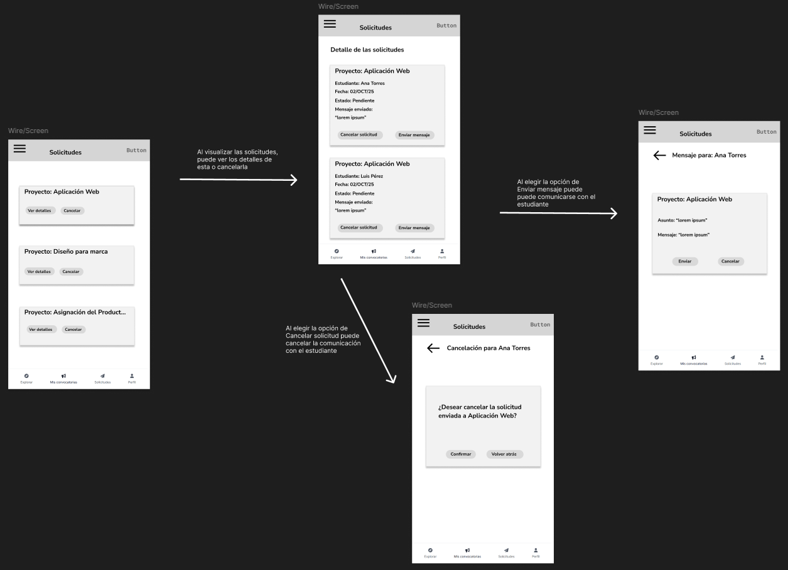
</p>

#### 3.1.4.3. Mobile Applications Mock-ups


Los mockups de InnoSpace se desarrollaron con un enfoque centrado en el usuario, priorizando la claridad, accesibilidad y coherencia visual entre los perfiles de estudiante y gerente. Las vistas mantienen una navegación intuitiva con barra inferior fija y uso consistente de tarjetas, íconos y botones, facilitando la interacción y gestión dentro de la plataforma.

[https://www.figma.com/design/2HTewxO6N3TGfTdiep11O3/InnoSpace?node-id=1-3](https://www.figma.com/design/2HTewxO6N3TGfTdiep11O3/InnoSpace?node-id=1-3)

- Iniciar sesión / Registrarse:

<p align="center">
  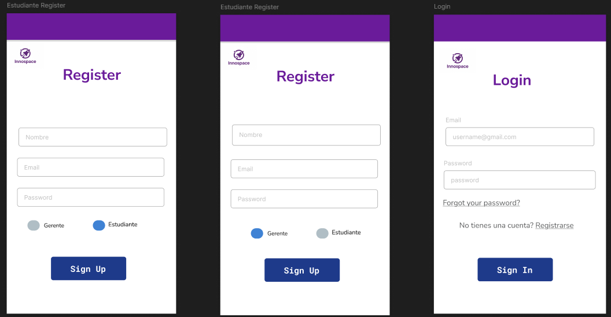
</p>

- Dashboards

<p align="center">
  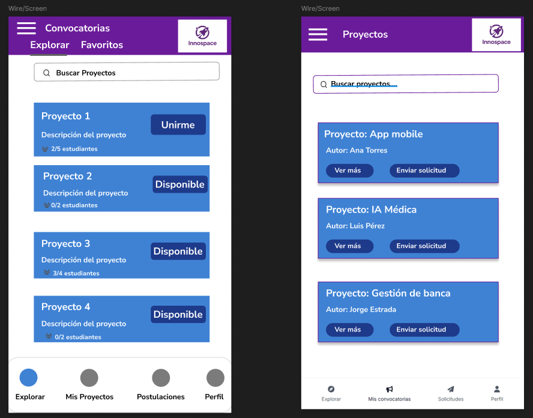
</p>


- Perfil y Proyectos

<p align="center">
  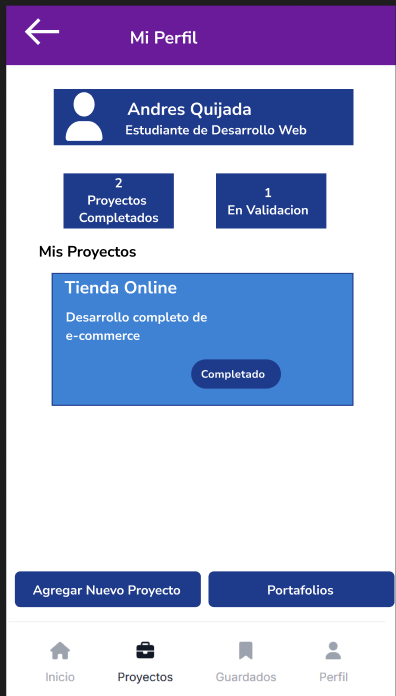
</p>

- Evaluaciones

<p align="center">
  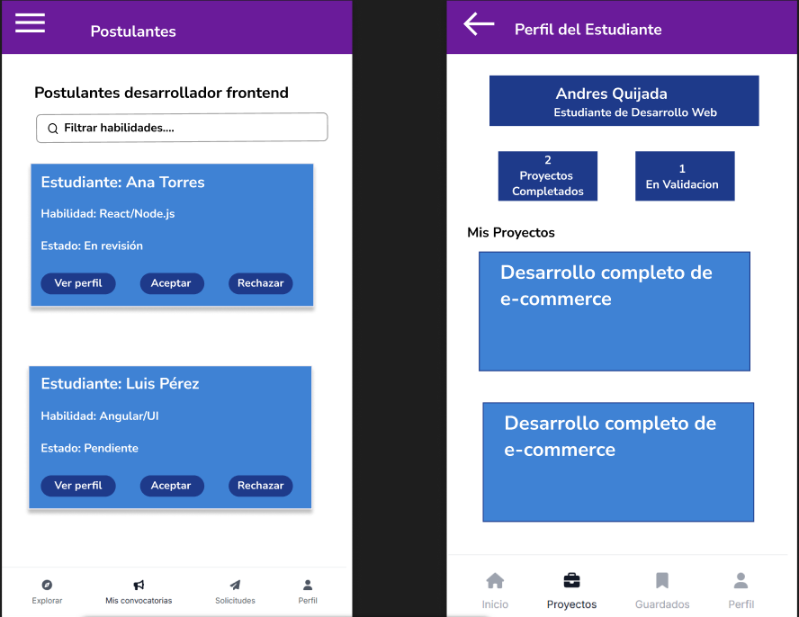
</p>


#### 3.1.4.4. Mobile Applications User Flow Diagrams

**User Flow 1: Login / Registrarse**

- **User Goal:**  
  Como nuevo usuario, quiero ingresar o crear una cuenta, para acceder a la plataforma según mi rol.

- **User Persona:**  
  Estudiante y Gerente de empresa  

- **Flujo:**  
  - El usuario accede a la pantalla inicial y selecciona **“Acceder”**.  
  - Elige su rol mediante un botón conmutador (**Estudiante / Gerente**).  
  - Si ya posee cuenta, introduce su **correo y contraseña** para iniciar sesión.  
  - Si es nuevo, selecciona **“Crear cuenta”** y completa el formulario con nombre, correo, contraseña y datos adicionales (carrera o empresa).  
  - Al finalizar, el sistema lo redirige automáticamente a su **dashboard** correspondiente.

<p align="center">
  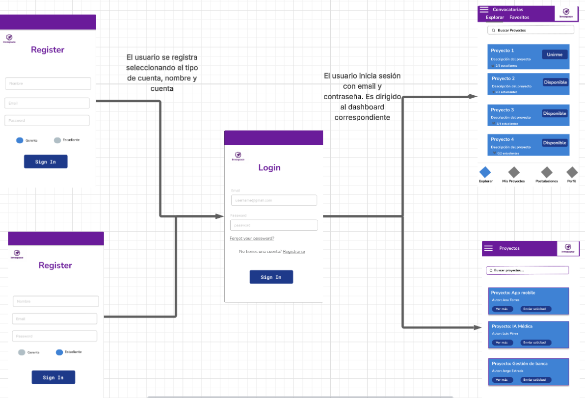
</p>

**User Flow 2: Publicar convocatoria (Gerente)**

- **User Goal:**  
  Como gerente, quiero crear una nueva convocatoria para atraer estudiantes interesados en participar en proyectos de innovación.

- **User Persona:**  
  Gerente de empresa  

- **Flujo:**  
  - Desde el dashboard, el gerente selecciona la sección **“Mis Convocatorias”**.  
  - Presiona el botón **“+ Crear convocatoria”**.  
  - Completa el formulario con **título, descripción, habilidades requeridas, categoría** y **fecha límite**.  
  - Elige entre **“Guardar como borrador”** o **“Publicar”**.  
  - La convocatoria aparece listada en la vista principal con estado **“Activa”**.  
  - Puede **editarla** o **cerrarla** posteriormente.

<p align="center">
  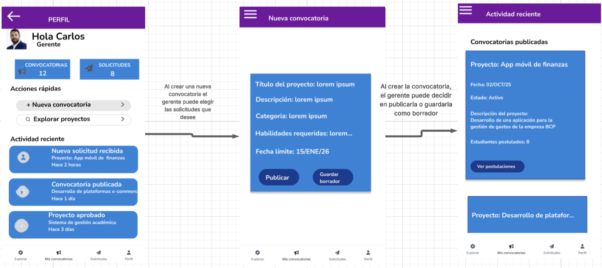
</p>

**User Flow 3: Explorar proyectos (Gerente)**

- **User Goal:**  
  Como gerente, quiero explorar proyectos creados por estudiantes para identificar ideas innovadoras y posibles colaboradores.  

- **User Persona:**  
  Gerente de empresa  

- **Flujo:**  
  - Desde la barra inferior, selecciona la opción **“Explorar”**.  
  - Visualiza una lista de proyectos de estudiantes con barra de **búsqueda y filtros**.  
  - Al seleccionar un proyecto, accede a su **detalle completo** con descripción, autores y categoría.  
  - Puede presionar **“Enviar solicitud”** para contactar al estudiante.  
  - El sistema registra la solicitud en la sección **“Solicitudes”**.

<p align="center">
  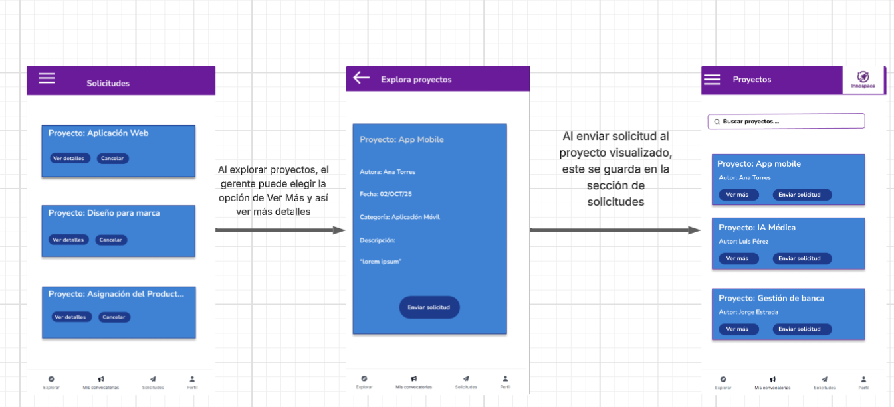
</p>

**User Flow 4: Solicitudes enviadas (Gerente)**

- **User Goal:**  
  Como gerente, quiero revisar el estado de las solicitudes que he enviado a los estudiantes.  

- **User Persona:**  
  Gerente de empresa  

- **Flujo:**  
  - Accede a la pestaña **“Solicitudes”** desde la barra inferior.  
  - Revisa la lista de solicitudes enviadas, con estado **Pendiente**, **Aceptada** o **Rechazada**.  
  - Al seleccionar una solicitud, se muestra el **detalle del proyecto y mensaje enviado**.  
  - Puede **enviar un nuevo mensaje**, **cancelar la solicitud** o **ver el portafolio del estudiante**.  
  - El estado se actualiza según la respuesta del estudiante.

<p align="center">
  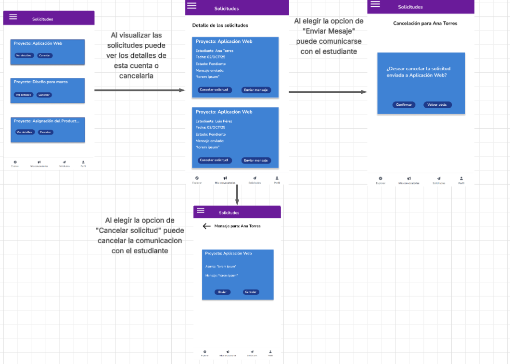
</p>


#### 3.1.4.5. Mobile Applications Prototyping

Se realizo un video del prototipo de nuestro Applications Mobile para quese pueda visualizar el flujo de nuestra aplicación para los usuarios que son estudiantes

<p align="center">
  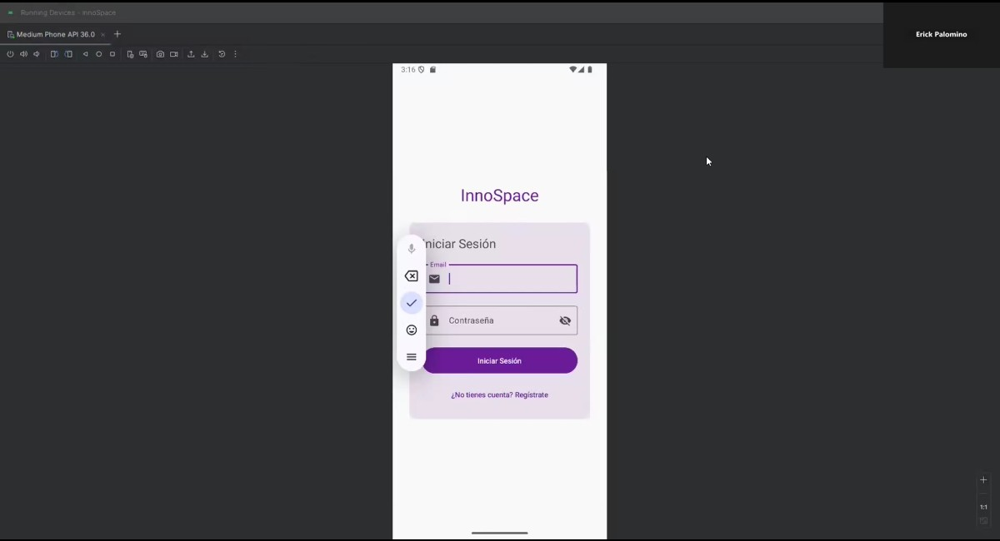
</p>

Link del Video: https://upcedupe-my.sharepoint.com/:v:/g/personal/u20231a500_upc_edu_pe/EfY-3bWKxx9DhxT1rwk5iCgBIA8mULaSjl5grD_KoIsf1g?nav=eyJyZWZlcnJhbEluZm8iOnsicmVmZXJyYWxBcHAiOiJTdHJlYW1XZWJBcHAiLCJyZWZlcnJhbFZpZXciOiJTaGFyZURpYWxvZy1MaW5rIiwicmVmZXJyYWxBcHBQbGF0Zm9ybSI6IldlYiIsInJlZmVycmFsTW9kZSI6InZpZXcifX0%3D&e=MAILrq 


## Capitulo IV: Product Implementation & Validation

### 4. Product Implementation & Validation

#### 4.1 Software Configuration Management

En este ítem se detallan las reglas, lineamientos y procesos establecidos durante el desarrollo de InnoSpace, la aplicación móvil de la startup UniPafi. El propósito de estas directrices es asegurar la integridad, trazabilidad y consistencia del software a lo largo de todo su ciclo de vida; desde la fase inicial de desarrollo, pasando por la integración y las pruebas, hasta el despliegue y mantenimiento en producción.

#### 4.1.1 Software Development Environment Configuration

Empleamos Android y Jetpack Compose para la creación de la mobile application, y Spring Boot para la creación de la API REST. Para el desarrollo de la landing page utilizamos HTML, CSS y JavaScript.

| Herramienta     | Descripción                                                                   | Enlace                                 |
| --------------- | ------------------------------------------------------------------------------ | -------------------------------------- |
| Android         | Lenguaje de programación utilizado para la creación de la mobile application | https://developer.android.com/         |
| Jetpack Compose | Framework utilizado para la creación de la mobile application                 | https://developer.android.com/compose  |
| Spring Boot     | Framework utilizado para la creación de la API REST                           | https://spring.io/projects/spring-boot |
| Tailwind CSS    | Framework utilizado para la creación de la landing page                       | https://tailwindcss.com/               |

**Software Deployment**

Se empleó los siguientes software para desplegar los servicios del proyecto. Base de datos: Railway, API y Landing Page: Render, Mobile Application: Android Studio.

| Herramienta    | Descripción                                                     | Enlace                               |
| -------------- | ---------------------------------------------------------------- | ------------------------------------ |
| MySQL      | Base de datos utilizada para el proyecto                         | https://www.mysql.com/                 |
| Azure Cloud Services         | API y Landing Page utilizada para el proyecto                    | https://azure.microsoft.com/                  |
| Android Studio | Herramienta utilizada para la creación de la mobile application | https://developer.android.com/studio |

**Software Documentation**

Para la documentación del software utilizamos Markdown, y para el trabajo colaborativo Github.

| Herramienta | Descripción                                                      | Enlace                          |
| ----------- | ----------------------------------------------------------------- | ------------------------------- |
| Markdown    | Lenguaje de marcado utilizado para la documentación del proyecto | https://www.markdownguide.org/  |
| Github      | Para gestionar la documentación del proyecto                     | https://github.com/UniPafi/project-report-InnoSpace |

#### 4.1.2 Source Code Management

Para la gestión del código fuente, utilizamos los siguientes repositorios:


| Producto           | Repositorio       | Enlace                                     |
| ------------------ | ----------------- | ------------------------------------------ |
| Mobile Application | kotlin-app-innospace | https://github.com/UniPafi/kotlin_app_InnoSpace |
| Backend            | backend-innospace    | https://github.com/UniPafi/backend-InnoSpace    |
| Landing Page       | landingpage-innospace| https://github.com/UniPafi/landing-page-InnoSpace    |

**Flujo de trabajo GitFlow**

Usaremos el flujo de trabajo planteado por Vincent Driessen en "A successful Git branching model" con los siguientes parámetros:

- Una rama de producción.
- Una rama de pruebas.
- Una rama en la que se solucionen los bugs rapidamente y vuelvan a producción.
- Ramas de features a implementar.
- Cada cambio en producción debe establecerse como una nueva versión.
- Para este proyecto en concreto consideramos que los cambios en la rama de producción y de pruebas deben tener autorización de un compa­ñero de equipo.

Teniendo en cuenta la información anterior nos inclinamos por este tipo de organización en los branches:

- **Main branch:** Esta rama esta destinada a la producción de la aplicación, cada cambio deberá tener autorización de un compañero de equipo para evitar cambios sin verificar.
- **Hotfix branch:** En esta rama se incluirán todas las versiones que poseen errores identificados y que con cada arreglo de este se despliegue otra vez a Main Branch además de implementarla en lo que será Develop Branch.
- **Develop branch:** Esta rama está destinada a las constantes implementaciones en caliente de los features,
- **Features branch:** Cada feature poseerá su respectiva rama, una vez que se encuentre correctamente implementada será fusionada con Develop branch.


### 4.1.3 Source Code Style Guide & Conventions

Con el objetivo de mantener un código claro, coherente y fácil de mantener, el proyecto InnoSpace adopta las convenciones de estilo propuestas por Google para HTML/CSS, JavaScript y Kotlin.
La aplicación de estas directrices garantiza la uniformidad del código en toda la plataforma, facilita el trabajo colaborativo entre los desarrolladores y mejora la comprensión del sistema.
Además, estas prácticas contribuyen a reducir errores durante las etapas de desarrollo, prueba y mantenimiento, asegurando la calidad y escalabilidad del software de InnoSpace.

#### Convenciones para HTML/CSS (Google HTML/CSS Style Guide)

Durante el desarrollo de la **Landing Page de UniPafi (InnoSpace)**, se aplicaron las buenas prácticas recomendadas por la **guía de estilo de Google para HTML y CSS**, con el fin de mantener un código limpio, semántico y accesible:

* Declarar siempre el tipo de documento (`<!DOCTYPE html>`) al inicio del archivo.
* Utilizar minúsculas en los nombres de las etiquetas HTML (`<p>`, `<h1>`, `<section>`, etc.).
* Asegurar el cierre correcto de todos los elementos HTML (por ejemplo, `<p></p>`).
* Colocar entre comillas los valores de los atributos (por ejemplo, `<div class="container">`).
* Incluir los atributos **alt**, **width** y **height** en las imágenes para optimizar la accesibilidad y el rendimiento.
* Mantener las líneas de código cortas y ordenadas para facilitar la lectura y el mantenimiento.
* No omitir el elemento `<title>` dentro del `<head>`, garantizando la correcta identificación de la página.

#### Convenciones para JavaScript (Google JavaScript Style Guide)
Para el desarrollo de las funcionalidades interactivas de la Landing Page, se siguieron las convenciones de la Google JavaScript Style Guide:

* Utilizar camelCase para nombres de variables y funciones (calculateSum(), userDataList).
* Usar comillas simples para definir cadenas de texto ('mensaje').
* Finalizar todas las sentencias con punto y coma ;.
* Evitar var, priorizando let o const según el caso.
* Usar nombres descriptivos y evitar abreviaturas innecesarias.
* Incluir comentarios claros para funciones y bloques complejos.
  
Estas prácticas favorecen la uniformidad, previenen errores de interpretación y facilitan la colaboración entre desarrolladores.

#### Convenciones para Kotlin (Google Kotlin Style Guide)
En el desarrollo de la aplicación móvil Android, se aplicaron las guías oficiales de Google Kotlin Style Guide, promoviendo un código expresivo, seguro y fácil de mantener:

* Usar camelCase para variables, funciones y métodos (getUserData(), userName).
* Declarar constantes con val y variables mutables con var solo cuando sea necesario.
* Omitir el punto y coma al final de las sentencias.
* Aplicar sangría de 4 espacios y bloques bien estructurados.
* Utilizar funciones de extensión, lambdas y expresiones funcionales donde sea apropiado.
* Nombrar las clases y funciones con claridad y precisión.
* Dividir clases largas en archivos separados para mejorar la legibilidad.

Estas convenciones permitieron mantener un código Android idiomático, alineado con las prácticas modernas del ecosistema Kotlin.

### 4.1.4 Software Deployment Configuration

Para el despliegue de la Landing Page del presente proyecto, perteneciente a la plataforma UniPafi (InnoSpace), se empleó una arquitectura distribuida basada en contenedores y servicios independientes, garantizando la escalabilidad, disponibilidad y mantenimiento modular del sistema. De tal manera, el proceso de despliegue se llevó a cabo siguiendo los pasos principales recomendados por la guía de GitHub Pages:

* Se creó un repositorio en GitHub con todos los archivos fuente del sitio (HTML, CSS, JavaScript, imágenes y recursos).

* Se aseguró que el archivo principal se denomine index.html y que los recursos estén organizados en carpetas como /css, /js e /img.

* En la configuración del repositorio, se accedió a Settings → Pages, seleccionando la rama main y la carpeta raíz (root) como fuente de publicación.

* GitHub generó automáticamente la URL pública donde la Landing Page quedó disponible.

* Finalmente, se verificó la correcta carga de estilos, scripts e imágenes desde distintos dispositivos, garantizando una experiencia responsiva y fluida.

[Enlace a la Landing Page desplegada](https://unipafi.github.io/landing-page-InnoSpace/)

Este enlace dirige a la versión en vivo de la Lading Page, la cual es accesible globalmente desde cualquier dispositivo. Esto te permite validar su funcionalidad y evaluar la apariencia visual.

#### Proceso del Despliegue 

<div style="text-align: center;">
  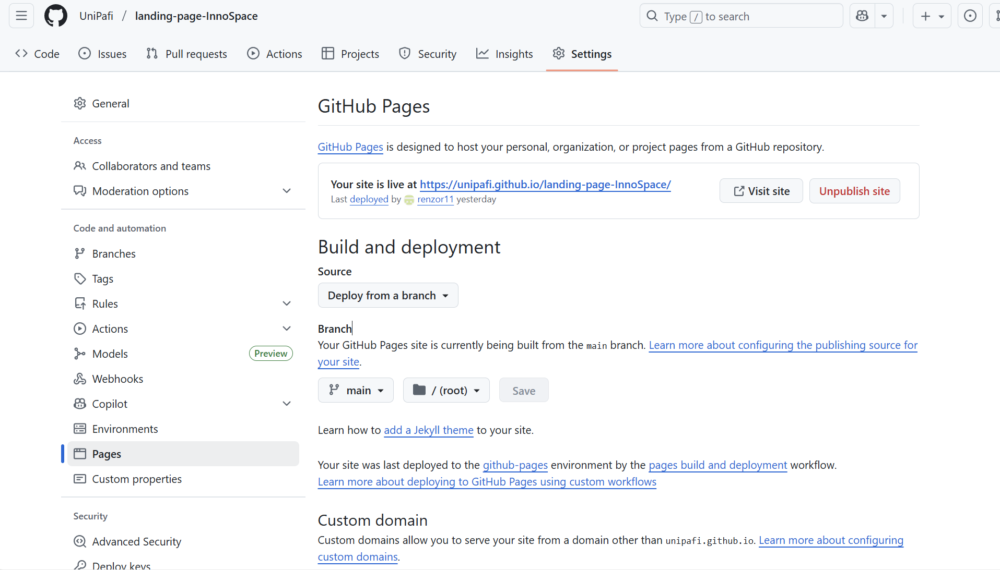
</div>

#### Resultado del Despliegue

<div style="text-align: center;">
  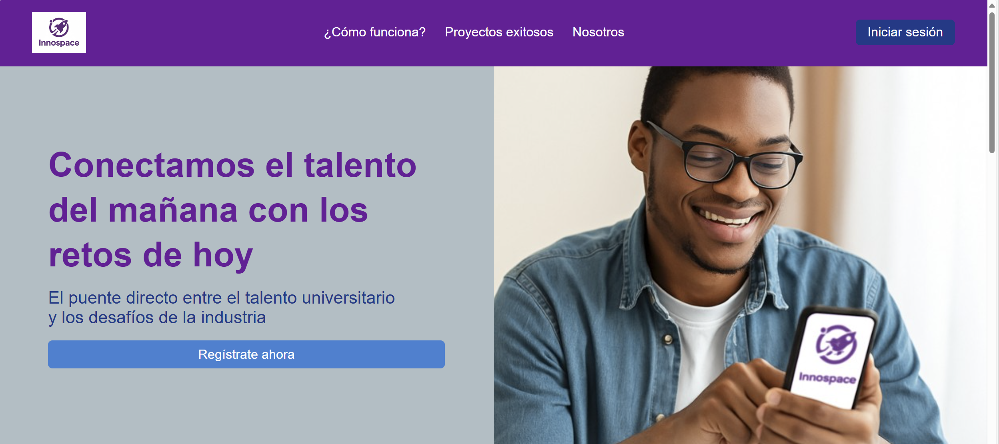
</div>

El despliegue nos proveyó de una página funcional desde el inicio del proyecto, haciendo más sencillo que usuarios, stakeholders y evaluadores pudieran revisarla y aprobarla oportunamente

## 4.2. Landing Page & Mobile Application Implementation

Esta sección detalla todas las etapas para poner en marcha la Landing Page, Web Services y Aplicaciones Móviles. Esto incluye el proceso exhaustivo de implementación, testing, documentación y liberación (deployment). El objetivo es asegurar que todos los componentes, desde la fase de planificación, sean entregados cumpliendo correctamente con las especificaciones. A partir del Product Backlog, se organizan los avances en secciones internas por cada Sprint, donde se registran las evidencias de desarrollo, ejecución y trabajo colaborativo del equipo.

### 4.2.1. Sprint 1

Durante el Sprint 1 del proyecto, el equipo se enfocó en el diseño y desarrollo de la Landing Page. Además, se avanzó en el desarrollo de los componentes en Kotlin y en la implementación del backend, junto con la definición de requisitos mediante historias de usuario funcionales y técnicas, así como la elaboración de artefactos esenciales del sistema. El objetivo principal fue construir una base sólida que facilitara la comunicación entre los miembros del equipo y permitiera visualizar los requerimientos iniciales del proyecto, asegurando coherencia entre la planificación y la implementación inicial.

#### 4.2.1.1. Sprint Planning 1
En esta sección se detallan los aspectos principales del Sprint Planning Meeting, una reunión clave para definir los objetivos, tareas y prioridades del Sprint 1. Este encuentro permitió al equipo alinear esfuerzos, distribuir responsabilidades y establecer el alcance del trabajo a realizar durante el sprint. A continuación, se presenta un cuadro resumen del Sprint Planning Meeting, donde se registran los puntos más relevantes discutidos y las decisiones acordadas por el equipo.

<table border="1" cellpadding="6" style="border-collapse: collapse; width: 100%;">
  <tbody>
    <tr>
      <td><b>Sprint #</b></td>
      <td><b>Sprint 1</b></td>
    </tr>
    <tr>
      <td colspan="2"><b>Sprint Planning Background</b></td>
    </tr>
    <tr>
      <td><b>Date</b></td>
      <td>2025-09-30</td>
    </tr>
    <tr>
      <td><b>Time</b></td>
      <td>05:50 PM</td>
    </tr>
    <tr>
      <td><b>Location</b></td>
      <td>Reunión virtual realizada mediante Discord.</td>
    </tr>
    <tr>
      <td><b>Prepared By</b></td>
      <td>Santur Tello, Andrea Elizabeth</td>
    </tr>
    <tr>
      <td><b>Attendees (to planning meeting)</b></td>
      <td>
        Cabrera Buitron, Diego Ivan <br>
        Coca Lavado, Carlos Andres <br>
        Palomino Fiestas, Erick Leonardo <br>
        Rivera Ratachi, Renzo Sebastian
      </td>
    </tr>
    <tr>
      <td><b>Sprint n – 1 Review Summary</b></td>
      <td>Al ser el primer sprint, no se realizo.</td>
    </tr>
    <tr>
      <td><b>Sprint n – 1 Retrospective Summary</b></td>
      <td>Al ser el primer sprint, no se realizo..</td>
    </tr>
    <tr>
      <td colspan="2"><b>Sprint Goal & User Stories</b></td>
    </tr>
    <tr>
      <td><b>Sprint 1 Goal</b></td>
      <td>Our focus is on building an informative and responsive Landing Page for the UniPafi platform, supported by initial backend and Kotlin component development.
We believe it delivers a clear understanding of the platform’s purpose and value to students and company managers, increasing their interest and trust in the application.
This will be confirmed when users can access the published Landing Page, navigate its sections smoothly, and comprehend the benefits and features of UniPafi across different devices.</td>
    </tr>
    <tr>
      <td><b>Sprint 1 Velocity</b></td>
      <td>60 Story Points</td>
    </tr>
    <tr>
      <td><b>Sum of Story Points</b></td>
      <td>5 + 5 + 2 + 3 + 2 + 3 + 2 + 1 + 3 + 2 + 1 + 3 + 3 + 2 + 1 + 3 + 3 + 2 + 1 + 1 + 1 + 1 + 3 + 3 + 2 + 1 + 1 = 60 Story Points</td>
    </tr>
  </tbody>
</table>

#### 4.2.1.2. Sprint Backlog 1

En esta sección se presenta el Sprint Backlog correspondiente al Sprint 1 del proyecto UniPafi (InnoSpace). El objetivo principal de este sprint fue diseñar y desarrollar la Landing Page de la plataforma.Cada tarea está asociada a una User Story específica, lo que permite al equipo realizar un seguimiento del progreso y asegurarse de que se cumplan los objetivos del sprint. 

<br>
<p align="center">
  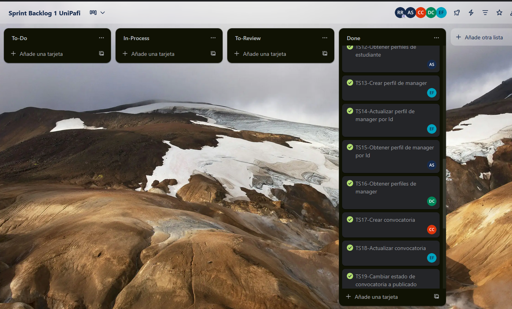
</p>
<p align="center">
     Sprint Backlog 1 - Elaboración propia
</p>


Link al Trello: https://trello.com/invite/b/68e840ec8e4c22f7bff0705b/ATTI8861ab62d0a5c5a2ec8cd4630bcadfa4FB379D9A/sprint-backlog-1-unipafi 


<h3>Sprint Backlog – Sprint 1</h3>
<table border="1" cellspacing="0" cellpadding="5">
<thead>
<tr>
<th colspan="8">Sprint 1</th>
</tr>
<tr>
<th colspan="2">User Story</th>
<th colspan="2">Work-Item / Task</th>
<th rowspan="2">Description</th>
<th rowspan="2">Estimation (Hours)</th>
<th rowspan="2">Assigned To</th>
<th rowspan="2">Status (To-do / In-Process / To-Review / Done)</th>
</tr>
<tr>
<th>Id</th>
<th>Title</th>
<th>Id</th>
<th>Title</th>
</tr>
</thead>
<tbody>
<tr>
<td>TS01</td>
<td>Configuración de autenticación y roles</td>
<td>WI001</td>
<td>Implementar sistema de autenticación</td>
<td>Desarrollar un sistema que distinga entre roles de estudiante y gerente para garantizar acceso seguro y personalizado.</td>
<td>6</td>
<td>Renzo Rivera</td>
<td>Done</td>
</tr>
<tr>
<td>TS02</td>
<td>Estructura de base de datos para gestión</td>
<td>WI002</td>
<td>Diseñar y configurar base de datos</td>
<td>Establecer la estructura de la base de datos para almacenar usuarios, proyectos, convocatorias y solicitudes.</td>
<td>8</td>
<td>Renzo Rivera</td>
<td>Done</td>
</tr>
<tr>
<td>TS03</td>
<td>Bottom Navigation Bar</td>
<td>WI003</td>
<td>Implementar barra de navegación inferior</td>
<td>Crear una barra de navegación inferior que conecte las secciones principales del sistema para mejorar la usabilidad.</td>
<td>4</td>
<td>Erick Palomino</td>
<td>Done</td>
</tr>
<tr>
<td>TS04</td>
<td>Registrarse</td>
<td>WI004</td>
<td>Implementar registro de nuevos usuarios</td>
<td>Desarrollar la funcionalidad de registro para permitir el acceso inicial de estudiantes y gerentes a la plataforma.</td>
<td>5</td>
<td>Carlos Coca</td>
<td>Done</td>
</tr>
<tr>
<td>TS05</td>
<td>Iniciar Sesión</td>
<td>WI005</td>
<td>Desarrollar funcionalidad de inicio de sesión</td>
<td>Permitir que los usuarios inicien sesión con sus credenciales para acceder de forma segura según su rol.</td>
<td>4</td>
<td>Andrea Santur</td>
<td>Done</td>
</tr>
<tr>
<td>TS06</td>
<td>Actualizar Usuario</td>
<td>WI006</td>
<td>Permitir actualización de datos de usuario</td>
<td>Implementar la funcionalidad para que los usuarios puedan mantener su información personal actualizada.</td>
<td>3</td>
<td>Carlos Coca</td>
<td>Done</td>
</tr>
<tr>
<td>TS07</td>
<td>Obtener todos los usuarios</td>
<td>WI007</td>
<td>Crear endpoint para listar usuarios</td>
<td>Desarrollar un endpoint para listar todos los usuarios registrados con fines administrativos.</td>
<td>2</td>
<td>Erick Palomino</td>
<td>Done</td>
</tr>
<tr>
<td>TS08</td>
<td>Obtener usuario por Id</td>
<td>WI008</td>
<td>Desarrollar obtención de usuario por ID</td>
<td>Implementar la funcionalidad para obtener la información de un usuario específico a través de su ID.</td>
<td>2</td>
<td>Renzo Rivera</td>
<td>Done</td>
</tr>
<tr>
<td>TS09</td>
<td>Crear perfil de estudiante</td>
<td>WI009</td>
<td>Implementar creación de perfil de estudiante</td>
<td>Desarrollar la funcionalidad para que un estudiante pueda crear un perfil que muestre sus habilidades y estudios.</td>
<td>5</td>
<td>Andres Coca</td>
<td>Done</td>
</tr>
<tr>
<td>TS10</td>
<td>Actualizar perfil de estudiante por Id</td>
<td>WI010</td>
<td>Permitir actualización de perfil de estudiante</td>
<td>Implementar la capacidad para que un estudiante pueda actualizar la información de su perfil.</td>
<td>3</td>
<td>Renzo Rivera</td>
<td>Done</td>
</tr>
<tr>
<td>TS11</td>
<td>Obtener perfil de estudiante por Id</td>
<td>WI011</td>
<td>Desarrollar obtención de perfil por ID</td>
<td>Crear la funcionalidad para obtener el perfil de un estudiante específico para mostrarlo en detalle.</td>
<td>2</td>
<td>Diego Cabrera</td>
<td>Done</td>
</tr>
<tr>
<td>TS12</td>
<td>Obtener perfiles de estudiante</td>
<td>WI012</td>
<td>Listar perfiles de estudiantes</td>
<td>Implementar la funcionalidad para listar los perfiles de los estudiantes para la visualización de los gerentes.</td>
<td>3</td>
<td>Erick Palomino</td>
<td>Done</td>
</tr>
<tr>
<td>TS13</td>
<td>Crear perfil de manager</td>
<td>WI013</td>
<td>Implementar creación de perfil de gerente</td>
<td>Desarrollar la funcionalidad para que un gerente pueda crear un perfil con la información de su empresa.</td>
<td>5</td>
<td>Andrea Santur</td>
<td>Done</td>
</tr>
<tr>
<td>TS14</td>
<td>Actualizar perfil de manager por Id</td>
<td>WI014</td>
<td>Permitir actualización de perfil de gerente</td>
<td>Implementar la capacidad para que un gerente actualice la información de su perfil empresarial.</td>
<td>3</td>
<td>Carlos Coca</td>
<td>Done</td>
</tr>
<tr>
<td>TS15</td>
<td>Obtener perfil de manager por Id</td>
<td>WI015</td>
<td>Desarrollar obtención de perfil de gerente</td>
<td>Crear la funcionalidad para obtener el perfil de un gerente específico para mostrar a los estudiantes.</td>
<td>2</td>
<td>Renzo Rivera</td>
<td>Done</td>
</tr>
<tr>
<td>TS16</td>
<td>Obtener perfiles de manager</td>
<td>WI016</td>
<td>Listar perfiles de gerentes</td>
<td>Implementar la funcionalidad para listar todos los perfiles de gerentes para que los estudiantes los conozcan.</td>
<td>3</td>
<td>Erick Palomino</td>
<td>Done</td>
</tr>
<tr>
<td>TS17</td>
<td>Crear convocatoria</td>
<td>WI017</td>
<td>Implementar creación de convocatorias</td>
<td>Permitir a los gerentes crear convocatorias para que los estudiantes puedan postular a proyectos.</td>
<td>6</td>
<td>Erick Palomino</td>
<td>Done</td>
</tr>
<tr>
<td>TS18</td>
<td>Actualizar convocatoria</td>
<td>WI018</td>
<td>Permitir edición de convocatorias activas</td>
<td>Implementar la funcionalidad para que un gerente pueda editar una convocatoria activa.</td>
<td>4</td>
<td>Andres Coca</td>
<td>Done</td>
</tr>
<tr>
<td>TS19</td>
<td>Cambiar estado de convocatoria a publicado</td>
<td>WI019</td>
<td>Implementar publicación de convocatorias</td>
<td>Permitir que el gerente publique una convocatoria para hacerla visible a los estudiantes.</td>
<td>2</td>
<td>Renzo Rivera</td>
<td>Done</td>
</tr>
<tr>
<td>TS20</td>
<td>Cambiar estado de convocatoria a cerrado</td>
<td>WI020</td>
<td>Implementar cierre de convocatorias</td>
<td>Permitir que un gerente cierre una convocatoria para finalizar el periodo de postulaciones.</td>
<td>2</td>
<td>Diego Cabrera</td>
<td>Done</td>
</tr>
<tr>
<td>TS21</td>
<td>Borrar convocatoria</td>
<td>WI021</td>
<td>Permitir eliminación de convocatorias</td>
<td>Implementar la funcionalidad para eliminar una convocatoria existente.</td>
<td>2</td>
<td>Andrea Santur</td>
<td>Done</td>
</tr>
<tr>
<td>TS22</td>
<td>Obtener convocatoria por Id</td>
<td>WI022</td>
<td>Desarrollar obtención de convocatoria por ID</td>
<td>Obtener la información completa de una convocatoria específica mediante su ID.</td>
<td>2</td>
<td>Renzo Rivera</td>
<td>Done</td>
</tr>
<tr>
<td>TS23</td>
<td>Obtener todas las convocatorias</td>
<td>WI023</td>
<td>Listar todas las convocatorias activas</td>
<td>Obtener y mostrar todas las convocatorias activas para que los estudiantes puedan explorarlas.</td>
<td>3</td>
<td>Erick Palomino</td>
<td>Done</td>
</tr>
<tr>
<td>TS24</td>
<td>Crear Proyecto</td>
<td>WI024</td>
<td>Implementar creación de proyectos</td>
<td>Permitir que un estudiante cree un nuevo proyecto para su portafolio.</td>
<td>5</td>
<td>Carlos Coca</td>
<td>Done</td>
</tr>
<tr>
<td>TS25</td>
<td>Actualizar Proyecto</td>
<td>WI025</td>
<td>Permitir actualización de proyectos</td>
<td>Implementar la funcionalidad para que un estudiante actualice la información de su proyecto.</td>
<td>3</td>
<td>Carlos Coca</td>
<td>Done</td>
</tr>
<tr>
<td>TS26</td>
<td>Cambiar estado de proyecto a publicado</td>
<td>WI026</td>
<td>Implementar publicación de proyectos</td>
<td>Permitir que los estudiantes cambien el estado de su proyecto a "Publicado".</td>
<td>2</td>
<td>Diego Cabrera</td>
<td>Done</td>
</tr>
<tr>
<td>TS27</td>
<td>Cambiar estado de proyecto a cerrado</td>
<td>WI027</td>
<td>Implementar cierre de proyectos</td>
<td>Permitir que los estudiantes cambien el estado de sus proyectos a "Cerrado".</td>
<td>2</td>
<td>Andrea Santur</td>
<td>Done</td>
</tr>
</tbody>
</table>

#### 4.2.1.3. Development Evidence for Sprint Review


<table align="center">
  <tr>
    <td><strong>Repository</strong></td>
    <td><strong>Branch</strong></td>
    <td><strong>Commit Id</strong></td>
    <td><strong>Commit Message</strong></td>
    <td><strong>Commit Message Body</strong></td>
    <td><strong>Commited on (Date)</strong></td>
  </tr>
  <tr>
    <td>https://github.com/UniPafi/kotlin_app_InnoSpace</td>
    <td>main</td>
    <td>3e7507e</td>
    <td>Initial commit</td>
    <td>initial commit: android project setup</td>
    <td>06/10/25</td>
  </tr>
<tr>
    <td>https://github.com/UniPafi/kotlin_app_InnoSpace</td>
    <td>feature/navigation</td>
    <td>925143d</td>
    <td>feat: Distribution added</td>
    <td>Added the correctly Distribution</td>
    <td>07/10/25</td>
  </tr>
  <tr>
    <td>https://github.com/UniPafi/kotlin_app_InnoSpace</td>
    <td>feature/navigation</td>
    <td>6e4c96f</td>
    <td>feat: add navigations</td>
    <td>Added the navigation in the app mobile</td>
    <td>09/10/25</td>
  </tr>
<tr>
    <td>https://github.com/UniPafi/kotlin_app_InnoSpace</td>
    <td>feature/navigation</td>
    <td>718443d</td>
    <td>feat: add fix</td>
    <td>added fix</td>
    <td>09/10/25</td>
  </tr>
<tr>
    <td>https://github.com/UniPafi/kotlin_app_InnoSpace</td>
    <td>develop</td>
    <td>604cc56</td>
    <td>feat: add top login bar</td>
    <td>Refactored the Login screen to add a colored top bar and improved layout using Box and Column</td>
    <td>09/10/25</td>
  </tr>
  <tr>
    <td>https://github.com/UniPafi/kotlin_app_InnoSpace</td>
    <td>develop</td>
    <td>7265e10</td>
    <td>feat: update register component</td>
    <td>update to a new interface of Register</td>
    <td>09/10/25</td>
  </tr>
  <tr>
    <td>https://github.com/UniPafi/landing-page-InnoSpace</td>
    <td>develop</td>
    <td>a2b1546</td>
    <td>Create README.md</td>
    <td>-</td>
    <td>06/10/25</td>
  </tr>
    <tr>
    <td>https://github.com/UniPafi/landing-page-InnoSpace</td>
    <td>develop</td>
    <td>c6dbd58</td>
    <td>feat: add landing page</td>
    <td>Added landing page</td>
    <td>06/10/25</td>
  </tr>
</tr>
    <tr>
    <td>https://github.com/UniPafi/backend-InnoSpace</td>
    <td>feat/profiles-bounded-context</td>
    <td>49f2fd1</td>
    <td>feat: add manager and student profile domain and REST API</td>
    <td>Introduces domain models, commands, queries, services, repositories, and REST controllers for manager and student profiles. Enables creation, retrieval, and listing of profiles, with JPA auditing support and updated datasource configuration.</td>
    <td>02/10/25</td>
  </tr>
 <tr>
    <td>https://github.com/UniPafi/backend-InnoSpace</td>
    <td>feature/company-opportunities-bounded-context</td>
    <td>314ef27</td>
    <td>feat: add REST API for managing company opportunities</td>
    <td>Introduces OpportunityController and related resource and assembler classes to provide REST endpoints for creating, updating, publishing, closing, deleting, and retrieving company opportunities. This establishes the API layer for opportunity management in the application.</td>
    <td>07/10/25</td>
  </tr>
  <tr>
    <td>https://github.com/UniPafi/backend-InnoSpace</td>
    <td>feature/student-projects-bounded-context</td>
    <td>70e83e1</td>
    <td>feat: add REST API for student project management</td>
    <td>Introduces ProjectController and related resource and assembler classes to provide REST endpoints for creating, updating, retrieving, publishing, finalizing, and deleting student projects.</td>
    <td>07/10/25</td>
  </tr>
<tr>
    <td>https://github.com/UniPafi/backend-InnoSpace</td>
    <td>feature/iam-bounded-context</td>
    <td>56b2668</td>
    <td>feat: add user authentication and query REST API endpoints</td>
    <td>Introduces AuthenticationController and UsersController for user sign-in, sign-up, retrieval, and update operations. Adds query objects, resource records, and assemblers for REST API. Updates security configuration to support new endpoints and refines Bearer token filter logic.</td>
    <td>06/10/25</td>
  </tr>
<table>

#### 4.2.1.4. Testing Suite Evidence for Sprint Review

No se implementaron pruebas unitarias debido a que, en su estado actual, la aplicación en Kotlin solo cuenta con navegación y una funcionalidad básica de crear proyectos en el Dashboard del Estudiante.

#### 4.2.1.5. Execution Evidence for Sprint Review


En el Sprint 2 se alcanzo un desarrollo completo en la implementación del despliegue del landing page. Además tambien se logro avanzar el desarrollo del backend y las pantallas principales de la aplicación móvil.


+ TS01 Configuración de autenticación y roles

<br>
<p align="center">
  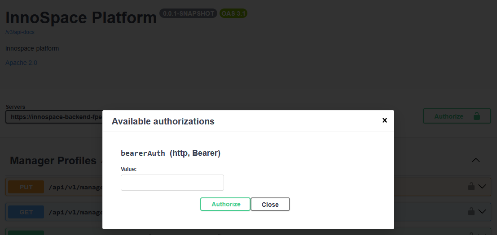
</p>

<br>


+ TS02 Estructura de base de datos para gestión de proyectos y convocatorias


<br>
<p align="center">
  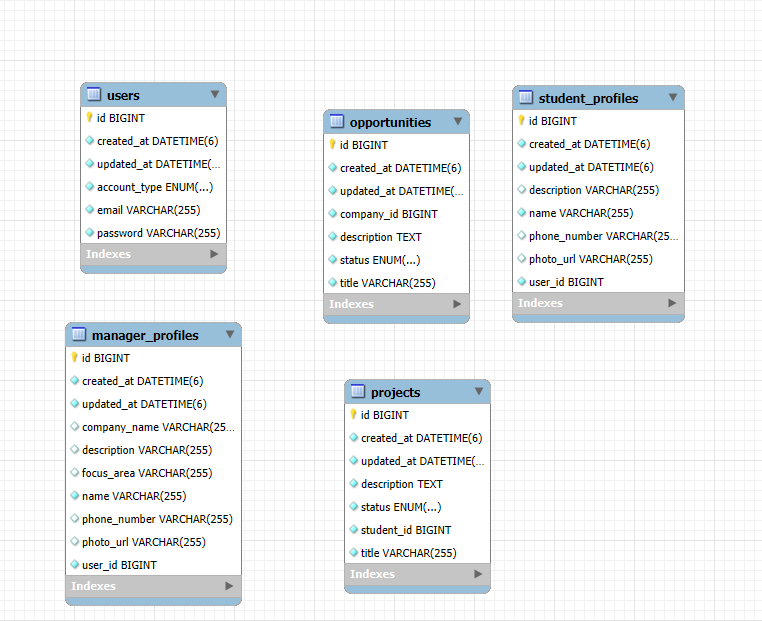
</p>

<br>


+ TS03 Bottom Navigation Bar

<br>
<p align="center">
  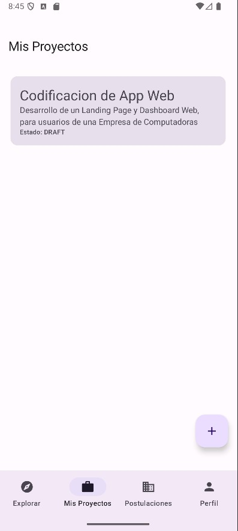
</p>

<br>

+ TS04 Registrarse 
+ TS05 Iniciar Sesion

<br>
<p align="center">
  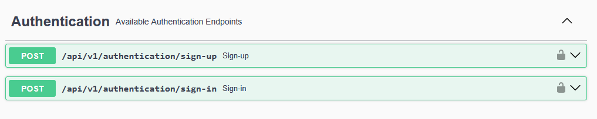
</p>

<br>

+ TS06 Actualizar Usuario
+ TS07 Obtener todos los usuarios
+ TS08 Obtener usuario por Id

<br>
<p align="center">
  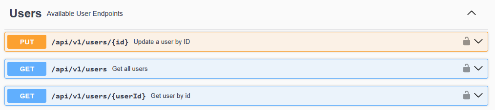
</p>
<br>

+ TS09 Crear perfil de estudiante
+ TS10 Actualizar perfil de estudiante por Id
+ TS11 Obtener perfil de estudiante por Id
+ TS12 Obtener perfiles de estudiante
<br>
<p align="center">
  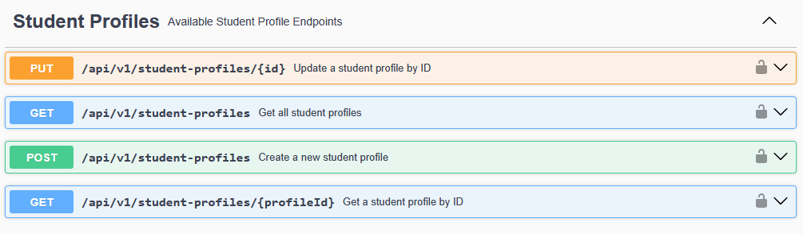
</p>
<br>

+ TS13 Crear perfil de manager
+ TS14 Actualizar perfil de manager por Id
+ TS15 Obtener perfil de manager por Id
+ TS16 Obtener perfiles de manager
<br>
<p align="center">
  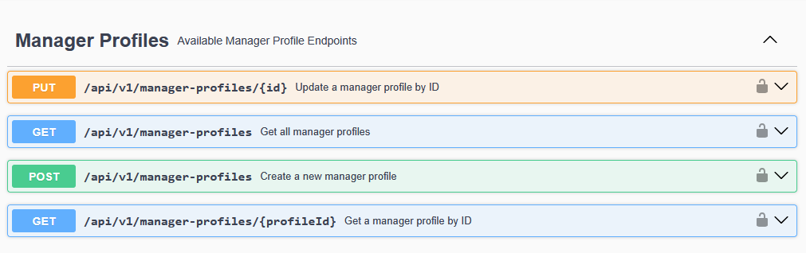
</p>
<br>

+ TS17 Crear Convocatoria
+ TS18 Actualizar Convocatoria
+ TS19 Cambiar estado de convocatoria a publicado
+ TS20 Cambiar estado de convocatoria a cerrado
+ TS21 Borrar convocatoria
+ TS22 Obtener convocatoria por Id
+ TS23 Obtener todas las convocatorias
<br>
<p align="center">
  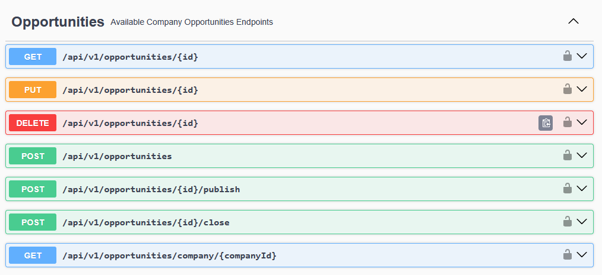
</p>
<br>

+ TS24 Crear Proyecto
+ TS25 Actualizar Proyecto
+ TS26 Cambiar estado de Proyecto publicado
+ TS27 Cambiar estado de Proyecto cerrado
+ TS28 Borrar Proyecto
+ TS29 Obtener Proyectopor Id
+ TS30 Obtener todas los Proyectos
<br>
<p align="center">
  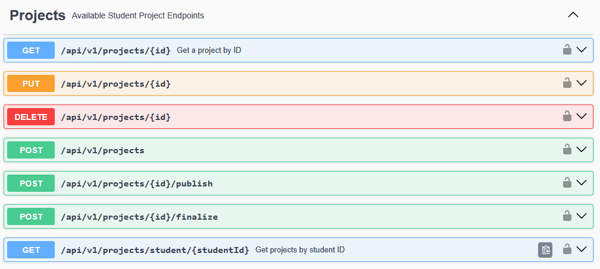
</p>
<br>


#### 4.2.1.6. Services Documentation Evidence for Sprint Review

<h3>Endpoints implementados</h3>

<table>
  <thead>
    <tr>
      <th>Endpoint URL (local)</th>
      <th>Recurso</th>
      <th>Verbo HTTP</th>
      <th>Acción / Sintaxis</th>
      <th>Parámetros</th>
      <th>Ejemplo de Response</th>
    </tr>
  </thead>
  <tbody>
    <tr><td>/api/v1/manager-profiles</td><td>Manager Profiles</td><td>GET</td><td>Obtener todos los perfiles de managers</td><td>Ninguno</td><td>[ { "id": 1, "name": "John Doe" }, ... ]</td></tr>
    <tr><td>/api/v1/manager-profiles</td><td>Manager Profiles</td><td>POST</td><td>Crear un nuevo perfil de manager</td><td>Body: fullName, position, etc.</td><td>{ "id": 1, "name": "John Doe" }</td></tr>
    <tr><td>/api/v1/manager-profiles/{id}</td><td>Manager Profiles</td><td>PUT</td><td>Actualizar un perfil de manager por ID</td><td>id + Body: fields a actualizar</td><td>{ "id": 1, "name": "Jane Doe" }</td></tr>
    <tr><td>/api/v1/manager-profiles/{profileId}</td><td>Manager Profiles</td><td>GET</td><td>Obtener perfil de manager por ID</td><td>profileId</td><td>{ "id": 1, "name": "John Doe" }</td></tr>
    <tr><td>/api/v1/opportunities/{id}</td><td>Opportunities</td><td>GET</td><td>Obtener oportunidad por ID</td><td>id</td><td>{ "id": 1, "title": "Internship Opportunity" }</td></tr>
    <tr><td>/api/v1/opportunities/{id}</td><td>Opportunities</td><td>PUT</td><td>Actualizar oportunidad</td><td>id + Body: fields a actualizar</td><td>{ "id": 1, "title": "Updated Opportunity" }</td></tr>
    <tr><td>/api/v1/opportunities/{id}</td><td>Opportunities</td><td>DELETE</td><td>Eliminar oportunidad</td><td>id</td><td>{ "message": "Opportunity deleted" }</td></tr>
    <tr><td>/api/v1/opportunities</td><td>Opportunities</td><td>POST</td><td>Crear una nueva oportunidad</td><td>Body: title, description, etc.</td><td>{ "id": 1, "title": "New Opportunity" }</td></tr>
    <tr><td>/api/v1/opportunities/{id}/publish</td><td>Opportunities</td><td>POST</td><td>Publicar una oportunidad</td><td>id</td><td>{ "id": 1, "status": "Published" }</td></tr>
    <tr><td>/api/v1/opportunities/{id}/close</td><td>Opportunities</td><td>POST</td><td>Cerrar una oportunidad</td><td>id</td><td>{ "id": 1, "status": "Closed" }</td></tr>
    <tr><td>/api/v1/opportunities/company/{companyId}</td><td>Opportunities</td><td>GET</td><td>Obtener oportunidades de una compañía</td><td>companyId</td><td>[ { "id": 1, "title": "Opportunity A" }, ... ]</td></tr>
    <tr><td>/api/v1/projects/{id}</td><td>Projects</td><td>GET</td><td>Obtener proyecto por ID</td><td>id</td><td>{ "id": 1, "name": "AI Research Project" }</td></tr>
    <tr><td>/api/v1/projects/{id}</td><td>Projects</td><td>PUT</td><td>Actualizar proyecto</td><td>id + Body: fields a actualizar</td><td>{ "id": 1, "name": "Updated Project" }</td></tr>
    <tr><td>/api/v1/projects/{id}</td><td>Projects</td><td>DELETE</td><td>Eliminar proyecto</td><td>id</td><td>{ "message": "Project deleted" }</td></tr>
    <tr><td>/api/v1/projects</td><td>Projects</td><td>POST</td><td>Crear un nuevo proyecto</td><td>Body: name, description, etc.</td><td>{ "id": 1, "name": "New Project" }</td></tr>
    <tr><td>/api/v1/projects/{id}/publish</td><td>Projects</td><td>POST</td><td>Publicar proyecto</td><td>id</td><td>{ "id": 1, "status": "Published" }</td></tr>
    <tr><td>/api/v1/projects/{id}/finalize</td><td>Projects</td><td>POST</td><td>Finalizar proyecto</td><td>id</td><td>{ "id": 1, "status": "Finalized" }</td></tr>
    <tr><td>/api/v1/projects/student/{studentId}</td><td>Projects</td><td>GET</td><td>Obtener proyectos por ID de estudiante</td><td>studentId</td><td>[ { "id": 1, "name": "Capstone Project" }, ... ]</td></tr>
    <tr><td>/api/v1/student-profiles</td><td>Student Profiles</td><td>GET</td><td>Obtener todos los perfiles de estudiantes</td><td>Ninguno</td><td>[ { "id": 1, "fullName": "Alice Doe" }, ... ]</td></tr>
    <tr><td>/api/v1/student-profiles</td><td>Student Profiles</td><td>POST</td><td>Crear un nuevo perfil de estudiante</td><td>Body: fullName, major, etc.</td><td>{ "id": 1, "fullName": "Alice Doe" }</td></tr>
    <tr><td>/api/v1/student-profiles/{id}</td><td>Student Profiles</td><td>PUT</td><td>Actualizar perfil de estudiante</td><td>id + Body: fields a actualizar</td><td>{ "id": 1, "fullName": "Alice Updated" }</td></tr>
    <tr><td>/api/v1/student-profiles/{profileId}</td><td>Student Profiles</td><td>GET</td><td>Obtener perfil de estudiante por ID</td><td>profileId</td><td>{ "id": 1, "fullName": "Alice Doe" }</td></tr>
    <tr><td>/api/v1/authentication/sign-up</td><td>Authentication</td><td>POST</td><td>Registro de usuario</td><td>Body: email, password, role, etc.</td><td>{ "id": 1, "email": "user@example.com" }</td></tr>
    <tr><td>/api/v1/authentication/sign-in</td><td>Authentication</td><td>POST</td><td>Inicio de sesión</td><td>Body: email, password</td><td>{ "token": "jwt-token", "userId": 1 }</td></tr>
    <tr><td>/api/v1/users</td><td>Users</td><td>GET</td><td>Obtener todos los usuarios</td><td>Ninguno</td><td>[ { "id": 1, "email": "user@example.com" }, ... ]</td></tr>
    <tr><td>/api/v1/users/{id}</td><td>Users</td><td>PUT</td><td>Actualizar usuario por ID</td><td>id + Body: fields a actualizar</td><td>{ "id": 1, "email": "updated@example.com" }</td></tr>
    <tr><td>/api/v1/users/{userId}</td><td>Users</td><td>GET</td><td>Obtener usuario por ID</td><td>userId</td><td>{ "id": 1, "email": "user@example.com" }</td></tr>
  </tbody>
</table>

#### 4.2.1.7. Software Deployment Evidence for Sprint Review

Durante este Sprint se realizó el deployment de la landing page y del 70% del backend de Innospace en Azure. El backend fue desplegado mediante Azure App Service, conectado a su base de datos MySQL en Azure, asegurando disponibilidad, escalabilidad y persistencia de datos. 

### Landing Page:

#### Configuracion de Github Pages
<br>
<p align="center">
  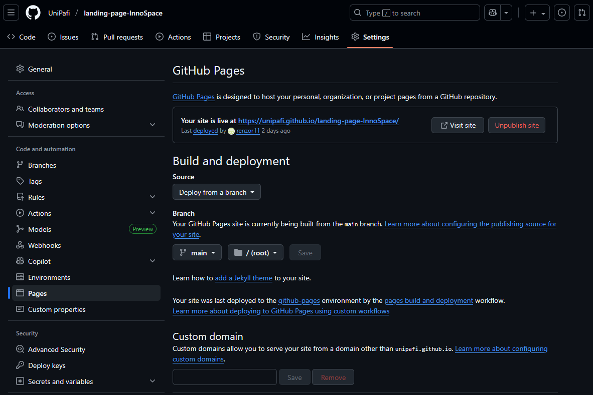
</p>

<br>


#### Visualizacion de Landing Page desplegada con Github Pages
<br>
<p align="center">
  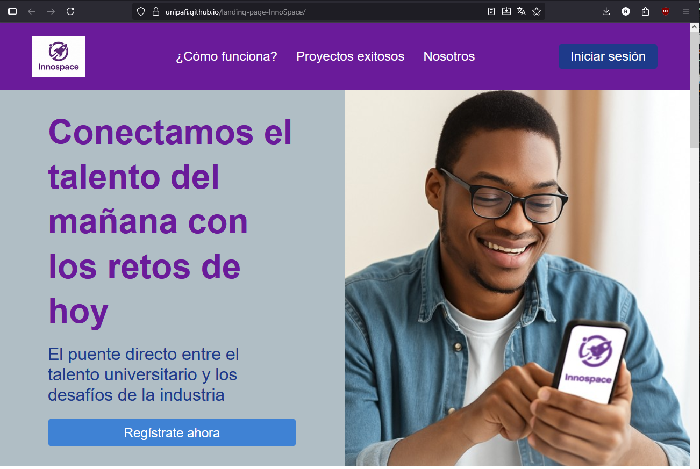
</p>

<br>

### Base de datos:

#### Creación de base de datos con Azure Database for MySql Flexible Servers

<br>
<p align="center">
  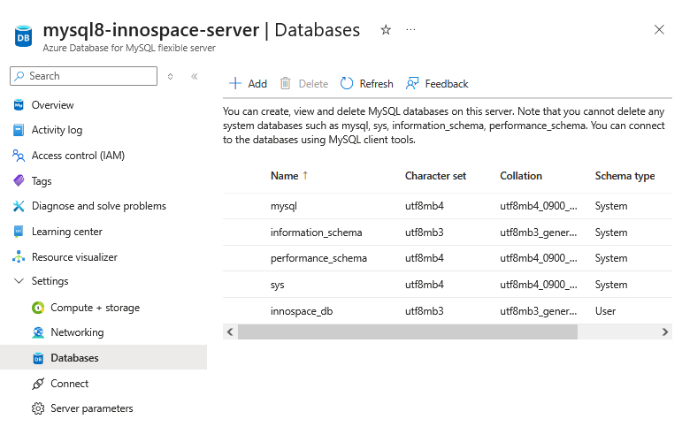
</p>

<br>

### Backend:

#### Imagen del proyecto subida a Docker
<br>
<p align="center">
  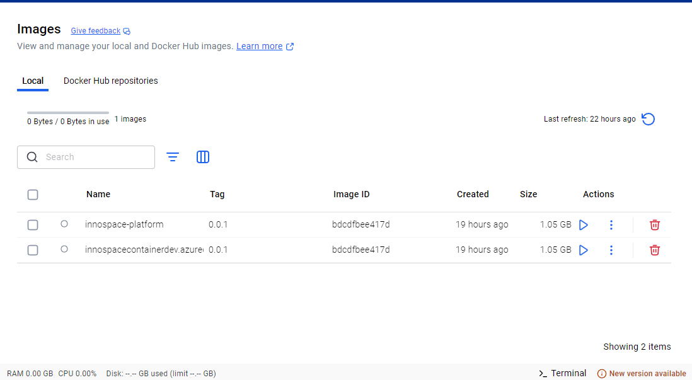
</p>

<br>

#### Imagen Docker subida a Container Registry en Azure
<br>
<p align="center">
  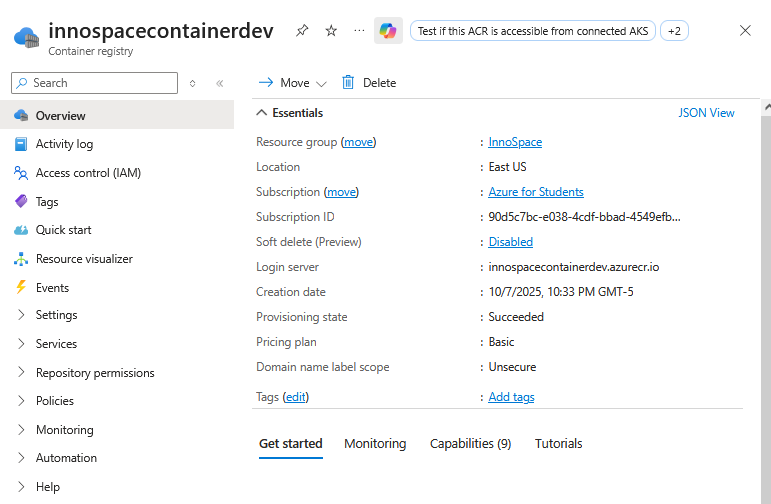
</p>

<br>


#### Creacion de Web App utilizando el Container Registry
<br>
<p align="center">
  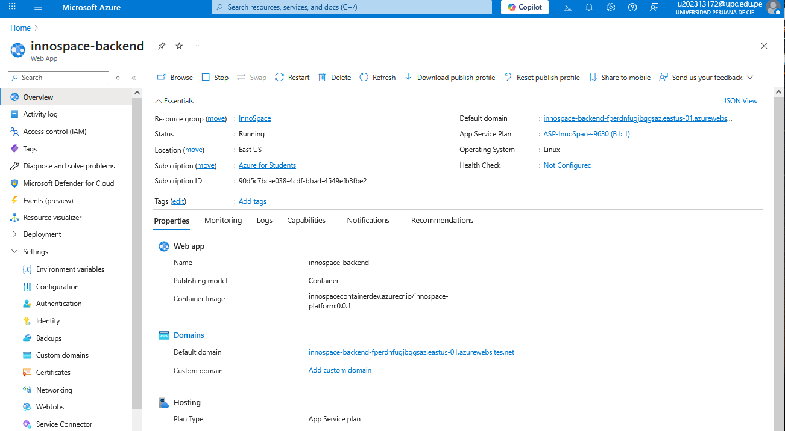
</p>

<br>

#### Vista del Backend desplegado a traves de Swagger UI
<br>
<p align="center">
  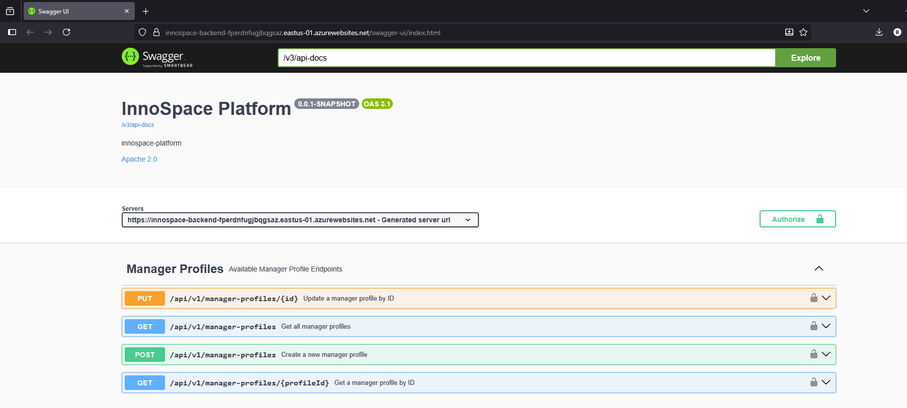
</p>

<br>


#### 4.2.1.8. Team Collaboration Insights during Sprint


<p align="center">
  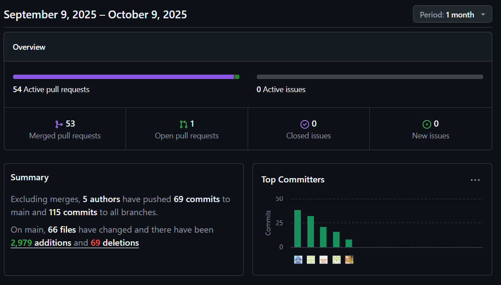
</p>

<p align="center">
  Insight 1 Sprint 1 - Elaboración propia
</p>

<br>

<p align="center">
  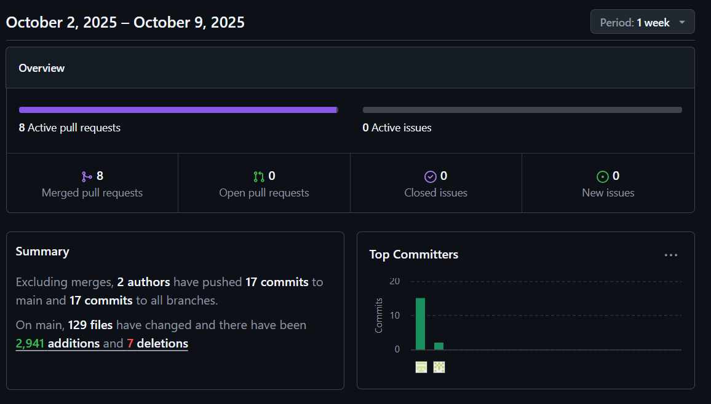
</p>

<p align="center">
  Insight 2 Sprint 1 - Elaboración propia
</p>

<br>

<p align="center">
  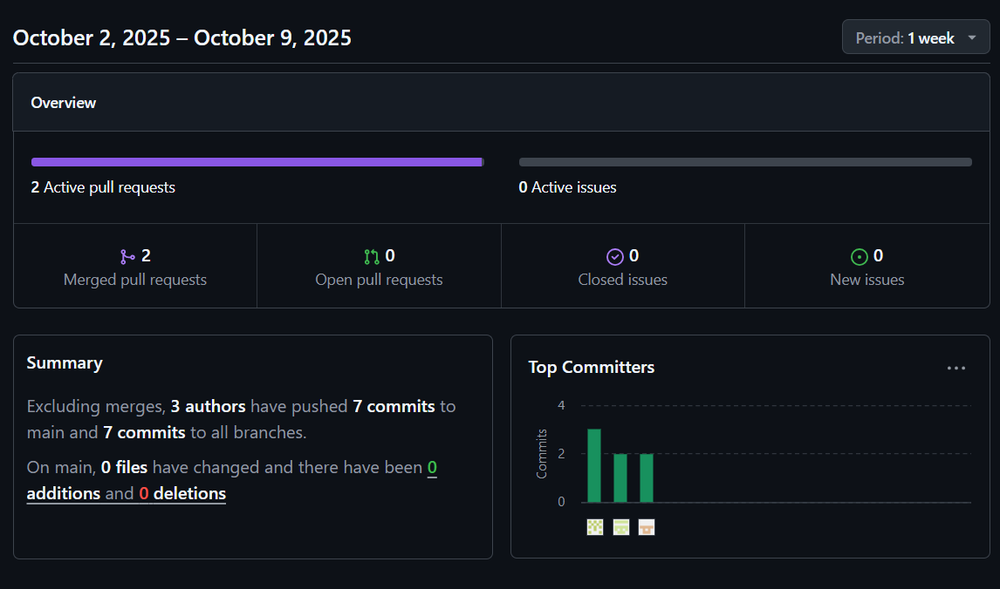
</p>

<p align="center">
  Insight 3 Sprint 1 - Elaboración propia
</p>

<br>

### 4.2.2. Sprint 2

Durante el Sprint 2 del proyecto, el equipo se enfocó en la implementación final de la aplicación móvil y la consolidación de todos los servicios del backend. Además, se trabajó en la resolución de incidencias y mejoras que quedaron pendientes del sprint anterior. El objetivo principal fue integrar todos los componentes desarrollados para alcanzar una versión completa y funcional de la plataforma, asegurando la correcta comunicación entre la aplicación y el sistema.

#### 4.2.2.1. Sprint Planning 2

En esta sección se detallan los aspectos principales del Sprint Planning Meeting, una reunión clave para definir los objetivos, tareas y prioridades del Sprint 2. Dando continuidad al trabajo previo, este encuentro permitió al equipo alinear esfuerzos, distribuir responsabilidades y establecer el alcance del trabajo a realizar durante esta nueva iteración. A continuación, se presenta un cuadro resumen del Sprint Planning Meeting, donde se registran los puntos más relevantes discutidos y las decisiones acordadas por el equipo.

<table border="1" cellpadding="6" style="border-collapse: collapse; width: 100%;">
  <tbody>
    <tr>
      <td><b>Sprint #</b></td>
      <td><b>Sprint 2</b></td>
    </tr>
    <tr>
      <td colspan="2"><b>Sprint Planning Background</b></td>
    </tr>
    <tr>
      <td><b>Date</b></td>
      <td>2025-10-28</td>
    </tr>
    <tr>
      <td><b>Time</b></td>
      <td>08:00 PM</td>
    </tr>
    <tr>
      <td><b>Location</b></td>
      <td>Reunión virtual realizada mediante Discord.</td>
    </tr>
    <tr>
      <td><b>Prepared By</b></td>
      <td>Rivera Ratachi, Renzo Sebastian</td>
    </tr>
    <tr>
      <td><b>Attendees (to planning meeting)</b></td>
      <td>
        Cabrera Buitron, Diego Ivan <br>
        Coca Lavado, Carlos Andres <br>
        Palomino Fiestas, Erick Leonardo <br>
        Santur Tello, Andrea Elizabeth
      </td>
    </tr>
    <tr>
      <td><b>Sprint 1 Review Summary</b></td>
      <td>Al finalizar el Sprint 1, el equipo completó exitosamente el 100% del backlog planificado (60 Story Points). Los productos de software clave alcanzados incluyen el despliegue funcional de la Landing Page en GitHub Pages y el despliegue del núcleo del backend en Azure, con todos los servicios principales (perfiles, proyectos, oportunidades y autenticación) operativos y documentados en Swagger. Los miembros del equipo se mostraron satisfechos con la alta velocidad y la finalización de todas las tareas. El Product Owner validó los entregables, dando feedback positivo sobre la sólida infraestructura y el avance visual en la app.</td>
    </tr>
    <tr>
      <td><b>Sprint 1 Retrospective Summary</b></td>
      <td>El equipo identificó como aciertos principales la alta colaboración entre los desarrolladores de backend y móvil (reflejado en los Insights) y la efectividad en la división de tareas, lo que permitió completar el 100% del backlog. El despliegue temprano de la infraestructura en Azure se consideró un gran éxito técnico.</td>
    </tr>
    <tr>
      <td colspan="2"><b>Sprint Goal & User Stories</b></td>
    </tr>
    <tr>
      <td><b>Sprint 2 Goal</b></td>
      <td>Our focus is on implementing the complete interaction cycle between managers and students, enabling managers to request collaboration on projects and students to apply for opportunities.
      We believe it delivers tangible connection tools for both user roles. For managers, it provides a direct channel to proactively recruit talent. For students, it provides a clear path to apply for opportunities and respond to collaboration offers.
      This will be confirmed when a manager can view a project, send a collaboration request, and the student can successfully accept or reject that request; AND when a student can view an opportunity, send an application, and the manager can successfully accept or reject that application.</td>
    </tr>
    <tr>
      <td><b>Sprint 2 Velocity</b></td>
      <td>13 Story Points</td>
    </tr>
    <tr>
      <td><b>Sum of Story Points</b></td>
      <td>3 + 1 + 1 + 1 + 3 + 1 + 1 + 2 = 13 Story Points</td>
    </tr>
  </tbody>
</table>

#### 4.2.2.2. Sprint Backlog 2

En esta sección se presenta el Sprint Backlog correspondiente al Sprint 2 del proyecto UniPafi (InnoSpace). El objetivo principal de este sprint fue implementar las funcionalidades centrales de interacción de la plataforma, incluyendo la gestión de solicitudes de colaboración y las postulaciones a convocatorias. Cada tarea está asociada a una User Story específica, lo que permite al equipo realizar un seguimiento del progreso y asegurarse de que se cumplan los objetivos del sprint. 

<br>
<p align="center">
  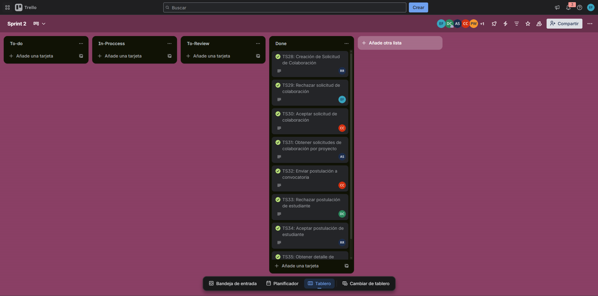
</p>
<p align="center">
     Sprint Backlog 2 - Elaboración propia
</p>


Link al Trello: https://trello.com/invite/b/66ddda7fe193854f9470acad/ATTI964a3bde2d8cc2dd9b1a1b6f2fa9033b197AB661/sprint-2

<br>

<h3>Sprint Backlog – Sprint 2</h3>
<table border="1" cellspacing="0" cellpadding="5">
<thead>
<tr>
<th colspan="8">Sprint 2</th>
</tr>
<tr>
<th colspan="2">User Story</th>
<th colspan="2">Work-Item / Task</th>
<th rowspan="2">Description</th>
<th rowspan="2">Estimation (Hours)</th>
<th rowspan="2">Assigned To</th>
<th rowspan="2">Status (To-do / In-Process / To-Review / Done)</th>
</tr>
<tr>
<th>Id</th>
<th>Title</th>
<th>Id</th>
<th>Title</th>
</tr>
</thead>
<tbody>
<tr>
<td>TS28</td>
<td>Creación de Solicitud de Colaboración</td>
<td>WI001</td>
<td>Implementar envío de solicitud de colaboración</td>
<td>Desarrollar la funcionalidad para que un gerente pueda enviar una solicitud (con estado "pendiente") al proyecto de un estudiante.</td>
<td>5</td>
<td>Renzo Rivera</td>
<td>Done</td>
</tr>
<tr>
<td>TS29</td>
<td>Rechazar solicitud de colaboración</td>
<td>WI002</td>
<td>Implementar rechazo de colaboración</td>
<td>Crear la lógica para que un estudiante pueda cambiar el estado de una solicitud de colaboración recibida a "Rechazada".</td>
<td>2</td>
<td>Erick Palomino</td>
<td>Done</td>
</tr>
<tr>
<td>TS30</td>
<td>Aceptar solicitud de colaboración</td>
<td>WI003</td>
<td>Implementar aceptación de colaboración</td>
<td>Desarrollar la lógica para que un estudiante pueda actualizar el estado de una solicitud de colaboración recibida a "Aceptada".</td>
<td>2</td>
<td>Carlos Coca</td>
<td>Done</td>
</tr>
<tr>
<td>TS31</td>
<td>Obtener solicitudes de colaboración por proyecto</td>
<td>WI004</td>
<td>Listar solicitudes por proyecto</td>
<td>Crear la funcionalidad para mostrar al estudiante un listado de todas las solicitudes de colaboración asociadas a su proyecto.</td>
<td>3</td>
<td>Andrea Santur</td>
<td>Done</td>
</tr>
<tr>
<td>TS32</td>
<td>Enviar postulación a convocatoria</td>
<td>WI005</td>
<td>Implementar envío de postulación</td>
<td>Desarrollar la funcionalidad para que un estudiante pueda postular a una convocatoria, creando un registro en estado "pendiente".</td>
<td>5</td>
<td>Andres Coca</td>
<td>Done</td>
</tr>
<tr>
<td>TS33</td>
<td>Rechazar postulación de estudiante</td>
<td>WI006</td>
<td>Implementar rechazo de postulación</td>
<td>Crear la lógica para que un gerente pueda cambiar el estado de una postulación de estudiante (que recibió en su convocatoria) a "Rechazada".</td>
<td>2</td>
<td>Diego Cabrera</td>
<td>Done</td>
</tr>
<tr>
<td>TS34</td>
<td>Aceptar postulación de estudiante</td>
<td>WI007</td>
<td>Implementar aceptación de postulación</td>
<td>Desarrollar la lógica para que un gerente pueda actualizar el estado de una postulación de estudiante (que recibió en su convocatoria) a "Aceptada".</td>
<td>3</td>
<td>Renzo Rivera</td>
<td>Done</td>
</tr>
<tr>
<td>TS35</td>
<td>Obtener detalle de postulación</td>
<td>WI008</td>
<td>Desarrollar obtención de detalle de postulación</td>
<td>Implementar la funcionalidad para obtener y mostrar la información detallada de una postulación específica.</td>
<td>2</td>
<td>Erick Palomino</td>
<td>Done</td>
</tr>
</tbody>
</table>

#### 4.2.2.5. Execution Evidence for Sprint Review

En el Sprint 2 se han desarrollado las funcionalidades completas de la aplicación móvil InnoSpace, facilitando la navegación y las secciones del flujo de usuario. Esto ha permitido validar la experiencia a los estudiantes y a los gerentes durante el inicio del uso de la aplicación, mediado por servicios API detallados en la documentación de Swagger. El desarrollo se ha enfocado en las siguientes secciones importantes:

Iniciar sesión: Desde esta vista, los usuarios tienen la posibilidad de acceder al sistema proporcionando las credenciales de usuario que previamente habían registrado mediante el correo electrónico y la contraseña, lo que les permite autenticar su identidad y poder acceder a las funcionalidades que les corresponden de manera personalizada según les corresponda. La interfase fue diseñada siguiendo un estilo limpio y coherente con el propósito de seguir la guía UI/UX, así como anteponiendo las premisas de facilidad de uso y aprecio por la seguridad.

<p align="center">
  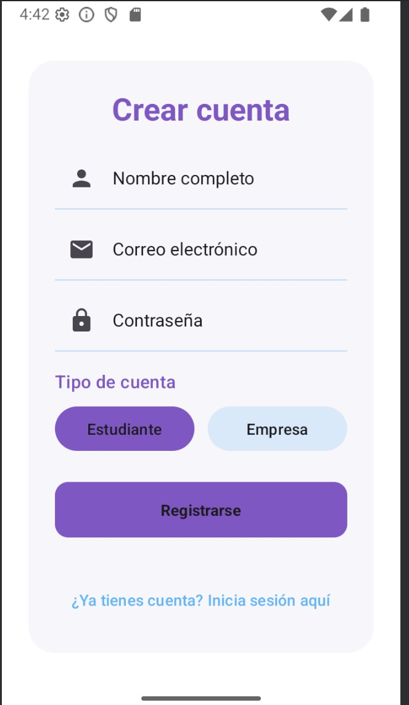
  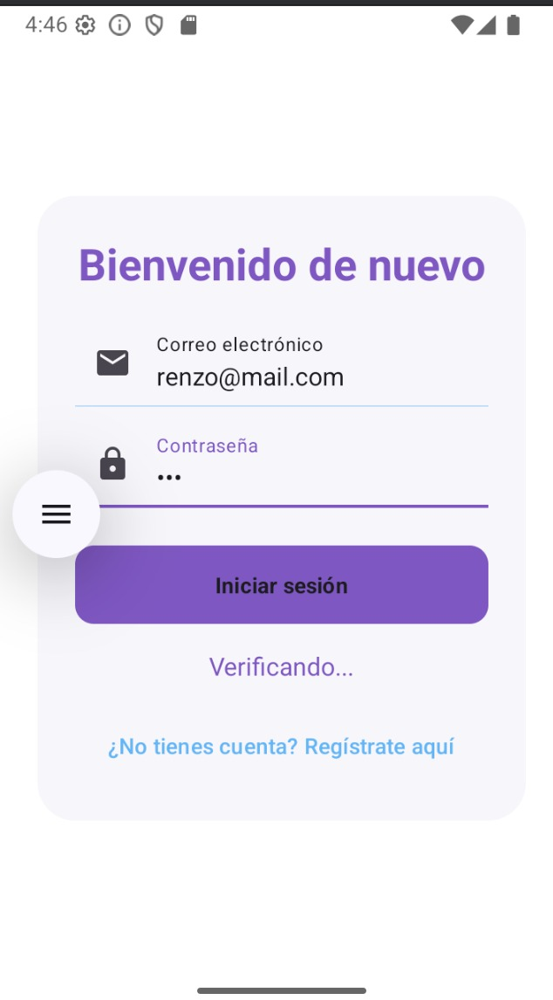
</p>

Exploración: Esta opción posibilita a los usuarios realizar la búsqueda entre las diferentes oportunidades publicadas por parte de las empresas o los gerentes. Se llevó a cabo un listado dinámico que consume los endpoints del backend, en el cual se presenta la información correspondiente a cada convocatoria: título, empresa, fecha y estado.

<p align="center">
  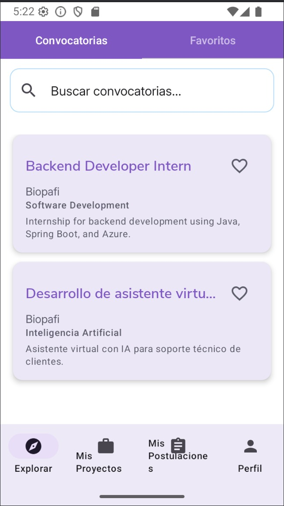
  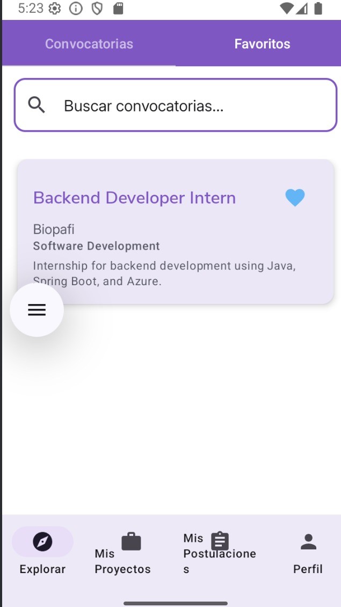
  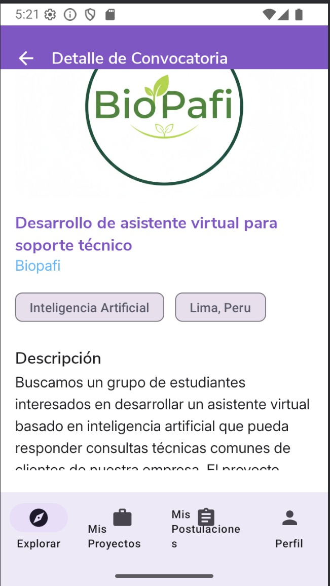
</p>

Mis Proyectos: La sección Mis Proyectos permite a los usuarios ver y gestionar sus proyectos (aquellos creados por ellos o en los que están colaborando). Se implementó la funcionalidad de listar, crear y editar proyectos así como visualizar su estado de avance.

<p align="center">
  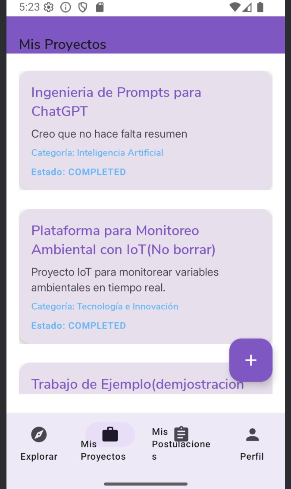
  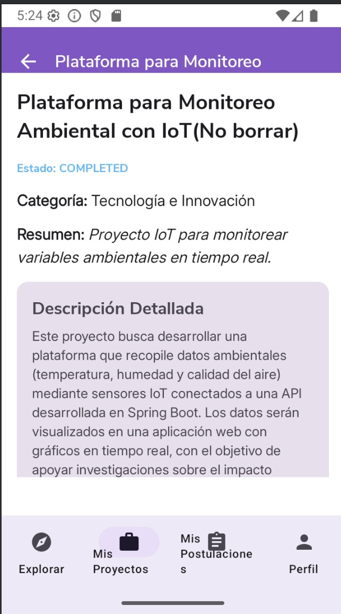
  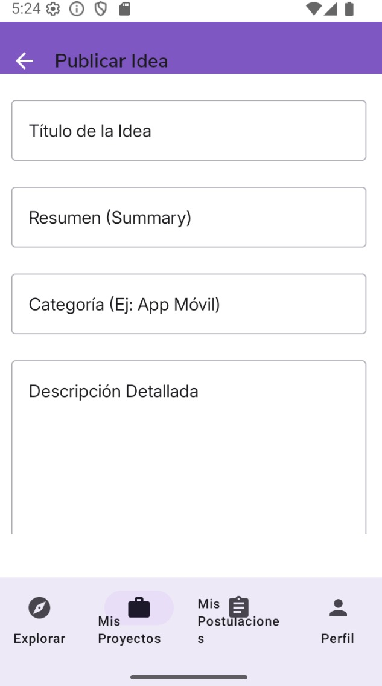
</p>

Mis Postulaciones: Se elaboró un módulo para que los estudiantes puedan realizar la revisión de sus candidaturas a proyectos y convocatorias activas. La vista presenta información del estado de cada candidatura: tal como pendiente, aceptada o rechazada. Así mismo, permite al usuario acceder a la información del detalle del proyecto y poder interactuar con las personas responsables de este.

<p align="center">
  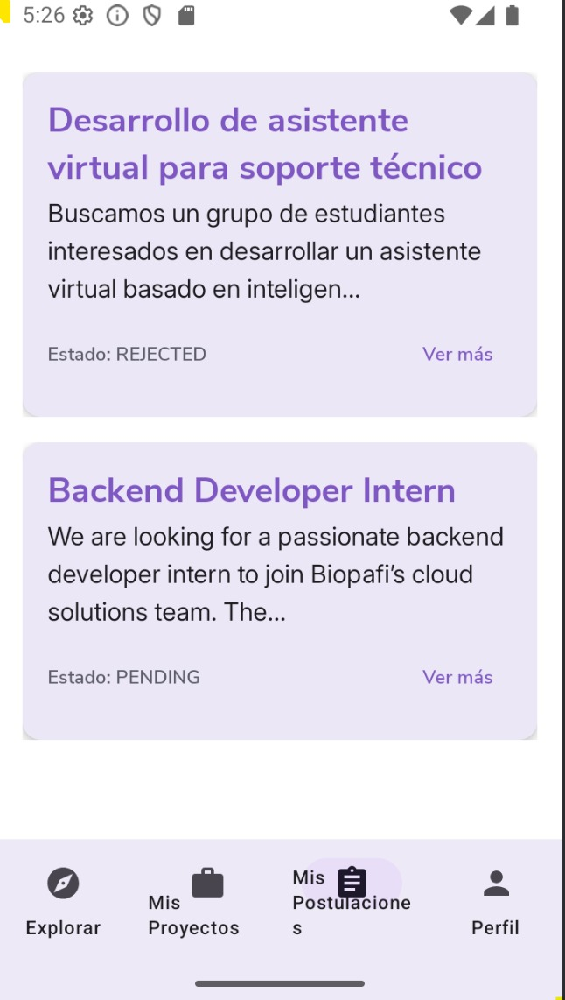
  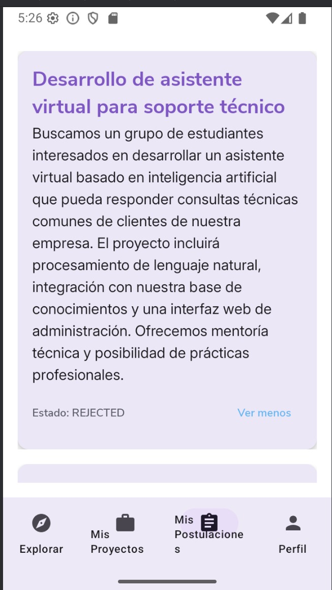
</p>

Mi Perfil: Desde esta vista, los usuarios pueden consultar y modificar los datos que están relacionados con su cuenta y su perfil, es decir, su nombre, correo, descripción, habilidades y foto de perfil. El diseño de esta vista tiene una estética sencilla pero responsiva, siguiendo la guía de estilos estipulada en el proceso de diseño UI/UX. Al mismo tiempo se creó la conexión con el backend para poder actualizar los datos de manera instantánea.

<p align="center">
  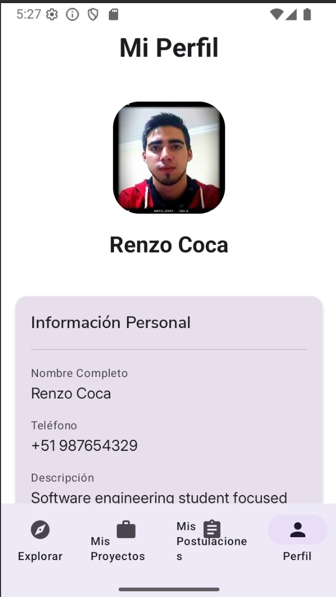
  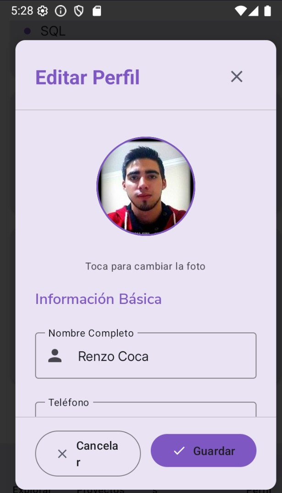
  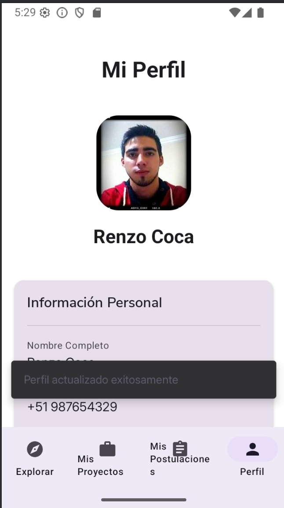
</p>

#### 4.2.2.6. Services Documentation Evidence for Sprint Review
Durante este Sprint, se logró un avance significativo en la **documentación y despliegue de múltiples Endpoints** pertenecientes a los diferentes *bounded contexts* implementados por el equipo.  

Para este propósito, se empleó **OpenAPI**, una herramienta fundamental que permitió describir de manera estructurada, clara y estandarizada los servicios web desarrollados, asegurando así una mejor comprensión y mantenimiento del sistema.

Asimismo, se presenta a continuación la relación detallada de los **Endpoints**, junto con las acciones soportadas y la documentación correspondiente, la cual refleja el trabajo colaborativo y la alineación con las buenas prácticas de desarrollo.

La documentación abarca los **verbos HTTP utilizados**, la sintaxis de las llamadas, los parámetros requeridos, ejemplos de respuesta y evidencias gráficas que muestran la interacción con los servicios web utilizando datos de prueba reales.

Finalmente, se incluye también la **URL del repositorio de los Web Services** y los *commit IDs* asociados al trabajo de documentación efectuado durante este Sprint, garantizando la **trazabilidad y transparencia** del proceso de desarrollo.

---

### Base URL

| Descripción | URL |
|--------------|-----|
| **API base** | [https://innospacebackend-gebta4gkasgkhaap.chilecentral-01.azurewebsites.net/api/v1](https://innospacebackend-gebta4gkasgkhaap.chilecentral-01.azurewebsites.net/api/v1) |
| **Swagger UI** | [https://innospacebackend-gebta4gkasgkhaap.chilecentral-01.azurewebsites.net/swagger-ui/index.html#/Student%20Profiles/createStudentProfile](https://innospacebackend-gebta4gkasgkhaap.chilecentral-01.azurewebsites.net/swagger-ui/index.html#/Student%20Profiles/createStudentProfile) |
| **Repo Backend** | [https://github.com/UniPafi/backend-InnoSpace.git](https://github.com/UniPafi/backend-InnoSpace.git) |

---

### Seguridad

- **Autenticación:** JWT Bearer  
- **Header:** `Authorization: Bearer <TOKEN>`  
- **Validaciones:** `@Valid` en DTOs  
- **Manejo de errores:** códigos `400`, `401`, `403`, `404`, `422`

---

### Resumen por Bounded Context

#### 1. IAM / Usuarios / Roles

| Método | Endpoint | Descripción |
|---------|-----------|-------------|
| POST | `/api/v1/authentication/sign-up` | Registro de usuario |
| POST | `/api/v1/authentication/sign-in` | Inicio de sesión |
| GET | `/api/v1/users` | Listar usuarios |
| GET | `/api/v1/users/{id}` | Obtener usuario por ID |
| PUT | `/api/v1/users/{id}` | Actualizar usuario |
| PUT | `/api/v1/users/{id}/update-proofing` | Actualizar verificación |
| GET | `/api/v1/roles` | Listar roles |

**Ejemplo Sign-in (curl):**
```bash
curl -X POST "https://innospacebackend-gebta4gkasgkhaap.chilecentral-01.azurewebsites.net/api/v1/authentication/sign-in" \
  -H "Content-Type: application/json" \
  -d '{"email":"user@example.com","password":"secret"}'
# Ejemplo de respuesta:
# { "token": "eyJhbGci...", "userId": 12 }

#### 2. Student Profiles / Manager Profiles

| Método | Endpoint                        | Descripción                    |
| ------ | ------------------------------- | ------------------------------ |
| GET    | `/api/v1/student-profiles`      | Listar perfiles de estudiantes |
| POST   | `/api/v1/student-profiles`      | Crear perfil de estudiante     |
| GET    | `/api/v1/student-profiles/{id}` | Obtener perfil por ID          |
| PUT    | `/api/v1/student-profiles/{id}` | Actualizar perfil              |
| GET    | `/api/v1/manager-profiles`      | Listar perfiles de gerentes    |
| POST   | `/api/v1/manager-profiles`      | Crear perfil de gerente        |
| GET    | `/api/v1/manager-profiles/{id}` | Obtener perfil por ID          |
| PUT    | `/api/v1/manager-profiles/{id}` | Actualizar perfil              |

#### 3. Company Opportunities

| Método | Endpoint                                    | Descripción                |
| ------ | ------------------------------------------- | -------------------------- |
| POST   | `/api/v1/opportunities`                     | Crear oportunidad          |
| GET    | `/api/v1/opportunities`                     | Listar oportunidades       |
| GET    | `/api/v1/opportunities/{id}`                | Obtener oportunidad por ID |
| PUT    | `/api/v1/opportunities/{id}`                | Actualizar oportunidad     |
| POST   | `/api/v1/opportunities/{id}/publish`        | Publicar                   |
| POST   | `/api/v1/opportunities/{id}/close`          | Cerrar                     |
| GET    | `/api/v1/opportunities/company/{companyId}` | Oportunidades por empresa  |

### 4. Student Projects

| Método | Endpoint                               | Descripción                |
| ------ | -------------------------------------- | -------------------------- |
| POST   | `/api/v1/projects`                     | Crear proyecto estudiantil |
| GET    | `/api/v1/projects`                     | Listar proyectos           |
| GET    | `/api/v1/projects/{id}`                | Obtener proyecto por ID    |
| PUT    | `/api/v1/projects/{id}`                | Actualizar proyecto        |
| POST   | `/api/v1/projects/{id}/publish`        | Publicar proyecto          |
| POST   | `/api/v1/projects/{id}/finalize`       | Finalizar proyecto         |
| GET    | `/api/v1/projects/student/{studentId}` | Proyectos por estudiante   |

### 5. Student Applications (Postulaciones)

| Método | Endpoint                                           | Descripción                    |
| ------ | -------------------------------------------------- | ------------------------------ |
| POST   | `/api/v1/applications`                             | Enviar postulación             |
| GET    | `/api/v1/applications/{id}`                        | Obtener detalle de postulación |
| GET    | `/api/v1/applications/student/{studentId}`         | Postulaciones por estudiante   |
| GET    | `/api/v1/applications/opportunity/{opportunityId}` | Postulaciones por oportunidad  |
| POST   | `/api/v1/applications/{id}/accept`                 | Aceptar postulación            |
| POST   | `/api/v1/applications/{id}/reject`                 | Rechazar postulación           |

**Ejemplo**

curl -X POST "https://innospacebackend-.../api/v1/applications" \
  -H "Authorization: Bearer <TOKEN>" \
  -H "Content-Type: application/json" \
  -d '{"studentId":201,"opportunityId":301,"projectId":123}'
# Ejemplo de respuesta:
# { "applicationId": 456, "status": "PENDING", "submissionDate": "2025-10-28T18:00:00Z" }

### 6. Project Collaboration (Decisiones de colaboración)

| Método | Endpoint                                    | Descripción                    |
| ------ | ------------------------------------------- | ------------------------------ |
| POST   | `/api/v1/collaboration`                     | Crear solicitud/decisión       |
| GET    | `/api/v1/collaboration/project/{projectId}` | Listar decisiones por proyecto |
| GET    | `/api/v1/collaboration/{id}`                | Obtener decisión por ID        |
| POST   | `/api/v1/collaboration/{id}/response`       | Responder colaboración         |
| DELETE | `/api/v1/collaboration/{id}`                | Eliminar decisión              |

**Ejemplo**
curl -X POST "https://innospacebackend-.../api/v1/collaboration" \
  -H "Authorization: Bearer <TOKEN>" \
  -H "Content-Type: application/json" \
  -d '{"projectId":123,"companyId":45,"message":"Interesados en colaborar"}'
# Ejemplo de respuesta:
# { "id": 987, "projectId": 123, "companyId": 45, "status": "PENDING" }

#### Evidencias y Trazabilidad

Repositorio: https://github.com/UniPafi/backend-InnoSpace.git

Commits relevantes:

feat/profiles-bounded-context — 49f2fd1

feature/company-opportunities-bounded-context — 314ef27

feature/student-projects-bounded-context — 70e83e1

feature/iam-bounded-context — 56b2668

Swagger UI desplegado: disponible en Azure (ver enlaces anteriores).

Capturas de evidencia: images/chapter4-sprint1/swaggerdeploy.png

#### Arquitectura y Patrones Aplicados

Separación CQRS (Command / Query Services) por bounded context

Uso de DTO / Resource pattern para la transferencia entre REST ↔ dominio

Repositorios JPA para persistencia (MySQL en Azure)

Seguridad basada en JWT con filtro Bearer

#### Buenas Prácticas y Recomendaciones

Incluir ejemplos de errores comunes (401, 403, 404, 422) en la documentación OpenAPI.

Exportar y versionar la colección Postman (docs/postman_collection.json).

Añadir ejemplos de tokens válidos de pruebas y snippets de autenticación (curl + Authorization) para QA.

#### Conclusión

La documentación de servicios del Sprint cubre los endpoints principales de los bounded contexts implementados.
Está disponible en OpenAPI/Swagger (ver enlace) y respaldada con commits en el repositorio.

#### 4.2.2.7. Software Deployment Evidence for Sprint Review

Durante este Sprint, el equipo enfocó sus esfuerzos en las actividades de despliegue de los productos digitales del proyecto InnoSpace, incluyendo la Landing Page y el Backend alojados en servicios en la nube. Estas tareas fueron esenciales para garantizar la disponibilidad, escalabilidad y seguridad de las aplicaciones en entornos reales.

A continuación, se detalla el proceso seguido, las configuraciones realizadas y las evidencias obtenidas durante el despliegue.

<b>1. Creación de cuentas y configuración de recursos</b>

Se seleccionó Microsoft Azure como proveedor de nube, debido a su integración con herramientas de despliegue continuo y administración de bases de datos.

Se configuraron los servicios necesarios para el despliegue, incluyendo Azure App Service para el backend y una base de datos MySQL Flexible Server, asegurando la persistencia de los datos.

Se definieron los entornos de desarrollo y producción, permitiendo mantener un flujo ordenado entre las versiones en prueba y las liberadas.

<b>2. Configuración de proyectos para integración</b>

Se creó y configuró el repositorio GitHub para la Landing Page y el Backend, habilitando flujos de Integración Continua (CI) y Despliegue Continuo (CD) mediante GitHub Actions.

Se implementaron scripts de automatización para la ejecución de pruebas, compilación y despliegue, optimizando los tiempos y reduciendo errores manuales.

<b>3. Despliegue de la Landing Page</b>

Se realizó el deployment de la Landing Page utilizando GitHub Pages, asegurando su disponibilidad pública y una correcta visualización en navegadores modernos.

Se verificó el correcto funcionamiento del sitio, incluyendo enlaces, recursos multimedia y adaptabilidad responsiva.

Enlace del Repositorio: https://aventis-scholr.github.io/landing-page/

Capturas de pantalla: Ver Anexo N.

<b>4. Despliegue del Backend</b>

El Backend se desplegó en Azure App Service, garantizando una arquitectura escalable y segura.

Se estableció la conexión con la base de datos MySQL en Azure, asegurando la persistencia de información y la correcta comunicación con los endpoints documentados.

Se realizaron pruebas de acceso y rendimiento a través de peticiones HTTP con herramientas como Postman y OpenAPI.

Capturas de pantalla: Ver Anexo O.
## 4.3. Validation Interviews

### 4.3.1. Diseño de Entrevistas

Segmentos encontrados:

- Estudiantes universitarios innovadores (Talento joven)

- Gerentes/Profesionales de Innovación y Talento (Ecosistema empresarial)

Antes de realizar las entrevistas respectivas, consideramos sumamente necesario realizar un análisis previo que nos permita entender mejor a nuestros públicos objetivo. Por ende, se diseñaron preguntas específicas para cada segmento, con el fin de orientar nuestras entrevistas de manera más eficiente y alineada a sus realidades.

Para esta fase inicial de validación, queremos conocer la experiencia de nuestros usuarios al navegar por nuestra Landing Page que comunica el valor de Innospace. Con este contexto, proponemos estas preguntas cualitativas orientadas a validar la claridad de nuestro mensaje, el atractivo de nuestra propuesta de valor y la efectividad de la página para generar el interés y la acción deseados.

Las siguientes preguntas están organizadas según los dos segmentos clave de la startup Unipafi y asi nos permitirán recoger percepciones reales sobre la comunicación y la propuesta inicial.

**Preguntas para Estudiantes Universitarios Innovadores (fase de testeo de la Landing Page)**

Primera impresión y mensaje central

1. Al abrir la página por primera vez, ¿cuál es tu impresión general en estos primeros momentos de interacción?

2. Después de leer el encabezado principal, ¿puedes explicarme con tus propias palabras qué crees que hace una aplicación como InnoSpace?

3. ¿El mensaje te resulta atractivo? ¿Por qué sí o por qué no?

Claridad de la propuesta de valor

4. ¿Qué beneficios específicos para un estudiante como tú logras identificar en la página?

5. ¿La información te hace sentir que InnoSpace entiende tus necesidades y aspiraciones?

6. ¿Hay algo que esperabas encontrar o que te gustaría saber, pero que no está mencionado en la página?

Navegación y llamado a la acción (Call to Action)

7. ¿El propósito de la página te parece claro?

Confianza y credibilidad

8. ¿Qué elementos de la página te generan confianza en Unipafi?

9. Por el contrario, ¿hay algo en la página que te genere dudas o desconfianza?

Interés y disposición futura

10. Basándote solo en lo que ves en esta página, ¿estarías interesado en registrarte en una plataforma como Unipafi cuando esté disponible? ¿Por qué?

11. ¿Compartirías esta página con algún compañero o amigo que esté buscando oportunidades? ¿Qué le dirías?


**Preguntas para Gerentes/Profesionales de Innovación y Talento (fase de testeo de la Landing Page)**

Primera impresión y mensaje central

1. Al aterrizar en la página, ¿la presentación le parece profesional y acorde a lo que esperaría una empresa?

2. Tras una lectura rápida, ¿puede resumir cuál cree que es la propuesta de valor de InnoSpace para una organización como la suya?

Claridad del modelo de colaboración

3. Desde su perspectiva, ¿qué beneficios concretos para una empresa identifica en la página?

4. ¿Falta algún argumento o información crítica que necesitaría para considerar a InnoSpace como un socio potencial?

Navegación y llamado a la acción para empresas

5. ¿El lenguaje y el diseño están orientados correctamente a un tomador de decisiones empresarial?

6. Si quisiera entender el impacto de InnoSpace, ¿encontró fácilmente casos de éxito, o testimonios relevantes?

Confianza y viabilidad

7. ¿La Landing Page transmite la seriedad y solidez necesarias para que una empresa considere una colaboración?

8. ¿Qué le daría mayor seguridad sobre el potencial del talento que InnoSpace puede ofrecer?

Interés y adopción potencial

9. ¿Qué barreras internas o externas cree que podría encontrar al proponer una herramienta como esta dentro de su organización?

### 4.3.2. Registro de Entrevistas

*Entrevistas a Estudiantes*
---
<table align="center">
  <tr>
    <th colspan="2" style="text-align:center">Entrevista 1</th>
  </tr>
  <tr>
    <td><strong>Entrevistado</strong></td>
    <td>Estafano Solis</td>
  </tr>
  <tr>
    <td><strong>Edad</strong></td>
    <td>19</td>
  </tr>
  <tr>
    <td><strong>Distrito</strong></td>
    <td>Pueblo Libre</td>
  </tr>
  <tr>
    <td><strong>Timing</strong></td>
    <td>00:08 - 8:17</td>
  </tr>
  <tr>
    <td><strong>URL</strong></td>
    <td>

  `https://upcedupe-my.sharepoint.com/:v:/g/personal/u202313172_upc_edu_pe/EZVEpcfMJzxJrRd3kD6-o94BBHWvBdKvE1ETwTlTQBf4hA?nav=eyJwbGF5YmFja09wdGlvbnMiOnsic3RhcnRUaW1lSW5TZWNvbmRzIjo4LCJ0aW1lc3RhbXBlZExpbmtSZWZlcnJlckluZm8iOnsic2NlbmFyaW8iOiJDaGFwdGVyU2hhcmUiLCJhZGRpdGlvbmFsSW5mbyI6eyJpc1NoYXJlZENoYXB0ZXJBdXRvIjpmYWxzZX19fSwicmVmZXJyYWxJbmZvIjp7InJlZmVycmFsQXBwIjoiU3RyZWFtV2ViQXBwIiwicmVmZXJyYWxWaWV3IjoiU2hhcmVDaGFwdGVyTGluayIsInJlZmVycmFsQXBwUGxhdGZvcm0iOiJXZWIiLCJyZWZlcnJhbE1vZGUiOiJ2aWV3In19&e=jW9ozx`

    
  </td>
  </tr>
  <tr>
    <td colspan="2" style="text-align:justify">
    Resumen: <br>
      Estefano Solis considera que lo que han visto de la Landing Page es claro y está bien estructurado. Resalta la forma en que se comunica la propuesta del startup, de manera comprensible. La sección de postulaciones le parece fácil de entender y le transmite confianza al mostrar con claridad el estado de cada proceso. . Además, opina que el diseño visual de la aplicación es moderno, intuitivo y limpio.
    </td>
  </tr>
  <tr>
    <td colspan="2"><br>
      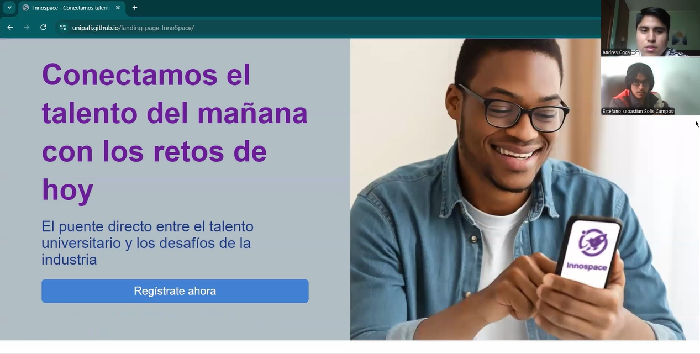<br>
    </td>
  </tr>
</table>

<br><br>

*Entrevistas a Gerentes*
---

<table align="center">
  <tr>
    <th colspan="2" style="text-align:center">Entrevista 1</th>
  </tr>
  <tr>
    <td><strong>Entrevistado</strong></td>
    <td>Manuel David Niño Torres Grandez</td>
  </tr>
  <tr>
    <td><strong>Edad</strong></td>
    <td>39</td>
  </tr>
  <tr>
    <td><strong>Distrito</strong></td>
    <td>Los Olivos</td>
  </tr>
  <tr>
    <td><strong>Timing</strong></td>
    <td>8:17 - 27:06</td>
  </tr>
  <tr>
    <td><strong>URL</strong></td>
    <td>

  `https://upcedupe-my.sharepoint.com/:v:/g/personal/u202313172_upc_edu_pe/EZVEpcfMJzxJrRd3kD6-o94BBHWvBdKvE1ETwTlTQBf4hA?nav=eyJwbGF5YmFja09wdGlvbnMiOnsic3RhcnRUaW1lSW5TZWNvbmRzIjo0OTcsInRpbWVzdGFtcGVkTGlua1JlZmVycmVySW5mbyI6eyJzY2VuYXJpbyI6IkNoYXB0ZXJTaGFyZSIsImFkZGl0aW9uYWxJbmZvIjp7ImlzU2hhcmVkQ2hhcHRlckF1dG8iOmZhbHNlfX19LCJyZWZlcnJhbEluZm8iOnsicmVmZXJyYWxBcHAiOiJTdHJlYW1XZWJBcHAiLCJyZWZlcnJhbFZpZXciOiJTaGFyZUNoYXB0ZXJMaW5rIiwicmVmZXJyYWxBcHBQbGF0Zm9ybSI6IldlYiIsInJlZmVycmFsTW9kZSI6InZpZXcifX0&e=9a9BTg` 


  </td>
  </tr>
  <tr>
    <td colspan="2" style="text-align:justify">
      Resumen: <br>
       Manuel David participó en la prueba de la Landing Page de InnoSpace y comentó que la navegación fue fluida y sin dificultades. Destacó  especialmente la claridad y simplicidad de la interfaz, la cual percibió como profesional y confiable. Por último, propuso enriquecer el diseño visual con más detalles de estilo y complementar ciertas secciones con campos adicionales para mejorar la presentación de la información.
    </td>
  </tr>
  <tr>
    <td colspan="2"><br>
      <br>
    </td>
  </tr>
</table>

### 4.3.3. Evaluaciones según heurísticas

Esta sección contiene el proceso de evaluación de las sesiones de validación basado en heurísticas, considerando heurísticas de usabilidad, arquitectura de información y diseño de experiencia de usuario.

# TABLA RESUMEN

| #  | Problema                                                                                         | Escala de severidad | Heurística/Principio violado                                  |
|----|--------------------------------------------------------------------------------------------------|---------------------|---------------------------------------------------------------|
| 1  | 	Falta de información específica sobre protección de propiedad intelectual                                                    | 3                   | Confianza y seguridad                  |
| 2  | No se muestran las empresas participantes en la plataforma                           | 2                   | Transparencia y credibilidad                  |
| 3  | 	Ausencia de detalles sobre el sistema de mentoría                                           | 2                   | Valor percibido / Completitud de información     |
| 4  | No hay opciones para que empresas revisen currículums de candidatos                                            | 2                   | Flexibilidad y eficiencia de uso    |
| 5  | Falta de mecanismos para que empresas se promocionen ante usuarios                        | 2                   | 	Funcionalidad bidireccional                    |
| 6  | 	No se presenta suficiente evidencia de casos de éxito concretos                                                  | 2                   | Pruebas sociales y validación     |
| 7  | Ausencia de switch de internacionalización     | 1                   |	Accesibilidad y alcance global      |
| 8   | No se abordan explícitamente las barreras de desconfianza hacia talento inexperto                       | 2                   | 	Gestión de objeciones |

# DESCRIPCIÓN DE PROBLEMAS

## PROBLEMA #1: Falta de información específica sobre protección de propiedad intelectual
**Severidad:** 3

**Heurística violada:** Confianza y seguridad

**Problema:**

Los entrevistados expresaron preocupación sobre la protección de la propiedad intelectual y confidencialidad de los proyectos. Esta duda puede ser una barrera significativa para la adopción de la plataforma.

**Recomendación:**

Incluir una sección específica que detalle las políticas de protección de propiedad intelectual, confidencialidad y derechos de autor, con lenguaje claro y accesible.

## PROBLEMA #2: No se muestran las empresas participantes en la plataforma
**Severidad:** 2

**Heurística violada:** Transparencia y credibilidad

**Problema:**

La landing page no muestra qué empresas están participando activamente en la plataforma, lo que limita la capacidad de los usuarios para evaluar oportunidades concretas.

**Recomendación:**

Incorporar un listado o logos de empresas colaboradoras, ideally con filtros por industria o tipo de proyecto.

## PROBLEMA #3: Ausencia de detalles sobre el sistema de mentoría
**Severidad:** 2

**Heurística violada:** Valor percibido / Completitud de información

**Problema:**

Aunque se menciona la mentoría como parte del valor de la plataforma, no se especifica cómo funciona, quiénes son los mentores ni qué nivel de acompañamiento se ofrece.

**Recomendación:**

Desarrollar una sección dedicada al programa de mentoría, incluyendo perfiles de mentores, metodología y beneficios específicos.

## PROBLEMA #4: No hay opciones para que empresas revisen currículums de candidatos
**Severidad:** 2

**Heurística violada:** Flexibilidad y eficiencia de uso

**Problema:**

Desde la perspectiva empresarial, falta la funcionalidad para revisar perfiles y currículums de candidatos potenciales de manera proactiva.

**Recomendación:**

Implementar un sistema de búsqueda y filtrado de candidatos para empresas, con acceso a portafolios y perfiles profesionales.

## PROBLEMA #5: Falta de mecanismos para que empresas se promocionen ante usuarios
**Severidad:** 2

**Heurística violada:** Funcionalidad bidireccional

**Problema:**

Las empresas no tienen forma de promocionar sus vacantes o proyectos de manera destacada hacia los talentos universitarios.

**Recomendación:**

Crear un sistema de "empresas destacadas" o paquetes de promoción que permitan a las compañías aumentar su visibilidad en la plataforma.

## PROBLEMA #6: No se presenta suficiente evidencia de casos de éxito concretos
**Severidad:** 2

**Heurística violada:** Pruebas sociales y validación

**Problema:**

Aunque se mencionan casos de éxito, los entrevistados sugieren incluir más testimonios específicos y resultados medibles que demuestren el impacto real de la plataforma.

**Recomendación:**

Incorporar estudios de caso detallados con métricas concretas (proyectos completados, contrataciones, etc.) y testimonios verificables.

## PROBLEMA #7: Ausencia de switch de internacionalización
**Severidad:** 1

**Heurística violada:** Accesibilidad y alcance global

**Problema:**

La plataforma no cuenta con opciones de cambio de idioma, limitando su potencial expansión internacional y acceso a talento o empresas globales.

**Recomendación:**

Implementar un selector de idiomas (español/inglés como mínimo) y adaptar el contenido para audiencias internacionales.

## PROBLEMA #8: No se abordan explícitamente las barreras de desconfianza hacia talento inexperto
**Severidad:** 2

**Heurística violada:** Gestión de objeciones

**Problema:**

Se identificó como barrera la desconfianza de empresas hacia talento sin experiencia, pero la landing page no aborda proactivamente esta objeción.

**Recomendación:**

Incluir una sección que destaque la calidad del talento universitario, procesos de selección rigurosos, y beneficios de contratar talento joven e innovador.

Nota: A pesar de estos puntos de mejora, es importante destacar que los entrevistados valoraron positivamente el diseño moderno, la claridad del mensaje y la propuesta de valor general de la plataforma, mostrando interés en utilizarla y recomendarla.

## Conclusiones

**TB1**
- La aplicación InnoSpace responde a una necesidad real: la falta de conexión entre estudiantes con ideas innovadoras y empresas que buscan talento joven y proyectos disruptivos.

- A partir de las entrevistas a estudiantes y gerentes, se confirma que existe interés en una plataforma que ofrezca visibilidad, mentoría, certificaciones y oportunidades de colaboración, aunque persisten preocupaciones sobre la seguridad y la propiedad intelectual.

- El análisis competitivo evidencia que, aunque existen plataformas consolidadas (LinkedIn, AngelList, Behance), ninguna combina de forma exclusiva la dimensión académica–empresarial, lo cual representa un nicho poco explorado.

- El diseño de requerimientos (User Stories, Product Backlog, Journey Maps) y la arquitectura basada en Domain-Driven Design permiten una solución escalable y adaptable, centrada en los dos perfiles principales: estudiantes y gerentes de empresas.

- El proyecto no solo tiene potencial de impacto económico, sino también formativo y social, al fortalecer la empleabilidad, la innovación abierta y la colaboración universidad–empresa.


**TP1**

- El desarrollo de InnoSpace en Kotlin presentó el desafío inicial de diseñar una arquitectura modular escalable que permitiera la integración fluida entre los módulos de autenticación, estudiantes y empresas, requiriendo una cuidadosa planificación de dependencias y comunicación entre componentes.

- La sincronización con el backend requirio estrategias sofisticadas de manejo de caché y resolución de conflictos, evidenciando la importancia de diseñar una capa de datos robusta desde el inicio.

- La integración continua y despliegue se complicó por la naturaleza modular del proyecto, requiriendo configuración avanzada de Gradle y estrategias de versionado que mantuvieran la consistencia entre todos los módulos.

## Bibliografia

- UNESCO. (2021). La educación superior en América Latina y el Caribe: avances y retos. UNESCO IESALC. https://unesdoc.unesco.org/ark:/48223/pf0000392578.locale=en

- OECD. (2020). Making the Most of Technology for Learning and Training in Latin America. OECD Publishing. https://www.oecd.org/content/dam/oecd/en/publications/reports/2020/06/making-the-most-of-technology-for-learning-and-training-in-latin-america_4029c655/ce2b1a62-en.pdf

- Banco Interamericano de Desarrollo (BID). (2020). El futuro del trabajo en América Latina y el Caribe: ¿Cómo puede la tecnología facilitar la recuperación del empleo tras el COVID-19? BID. https://publications.iadb.org/es/el-futuro-del-trabajo-en-america-latina-y-el-caribe-como-puede-la-tecnologia-facilitar-la

- Organización Internacional del Trabajo (OIT). (2022). Perspectivas Sociales y del Empleo en el Mundo: Tendencias 2022. OIT. https://www.ilo.org/sites/default/files/wcmsp5/groups/public/%40dgreports/%40dcomm/%40publ/documents/publication/wcms_848464.pdf

## Anexos


**Link del repositorio en Github:**


https://github.com/UniPafi/project-report-InnoSpace


