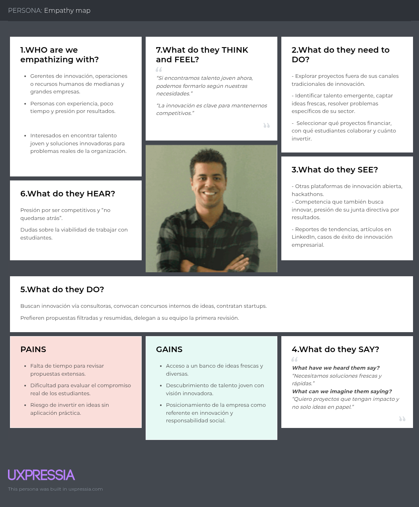

<h1 align="center">Informe de Trabajo Final</h1>

  

**Universidad Peruana de Ciencias Aplicadas**

**Ingeniería de Software**

**6to Ciclo**

**Código del curso:** 1ACC0238

**Nombre del curso:** Aplicaciones para Dispositvos Móviles

**NRC:** 1795

**Nombre del profesor:** Jorge Luis Mayta Guillermo

**Nombre del Startup:** UniPafi

**Nombre del Producto:** InnoSpace

### Relación de Integrantes

| **Código** | **Apellidos y Nombres**             |
| ---------- | ----------------------------------- |
| U20211B293 | Cabrera Buitron, Diego Ivan |
| U202313172 | Coca Lavado, Carlos Andres |
| U20231A500 | Palomino Fiestas, Erick Leonardo    |
| U20231D974 | Rivera Ratachi, Renzo Sebastian     |
| U202310988 | Santur Tello, Andrea Elizabeth     |

**Agosto 2025**

---

---

## Contenido

- [Student Outcome](#student-outcome)
- [Capítulo I: Introducción](#capítulo-i-introducción)

  - [1.1. Startup Profile](#11-startup-profile)
    - [1.1.1. Descripción de la Startup](#111-descripción-de-la-startup)
    - [1.1.2. Perfiles de integrantes del equipo](#112-perfiles-de-integrantes-del-equipo)
  - [1.2. Solution Profile](#12-solution-profile)
    - [1.2.1. Antecedentes y problemática](#121-antecedentes-y-problemática)
    - [1.2.2. Lean UX Process](#122-lean-ux-process)
      - [1.2.2.1. Lean UX Problem Statements](#1221-lean-ux-problem-statements)
      - [1.2.2.2. Lean UX Assumptions](#1222-lean-ux-assumptions)
      - [1.2.2.3. Lean UX Hypothesis Statements](#1223-lean-ux-hypothesis-statements)
      - [1.2.2.4. Lean UX Canvas](#1224-lean-ux-canvas)
  - [1.3. Segmentos objetivo](#13-segmentos-objetivo)

- [Capítulo II: Requirements Development and Software Solution Design](#capítulo-ii-requirements-development-and-software-solution-design)
  - [2.1. Competidores](#21-competidores)
    - [2.1.1. Análisis competitivo](#211-análisis-competitivo)
    - [2.1.2. Estrategias y tácticas frente a competidores](#212-estrategias-y-tácticas-frente-a-competidores)

  - [2.2. Entrevistas](#22-entrevistas)
    - [2.2.1. Diseño de entrevistas](#221-diseño-de-entrevistas)
    - [2.2.2. Registro de entrevistas](#222-registro-de-entrevistas)
    - [2.2.3. Análisis de entrevistas](#223-análisis-de-entrevistas)
  - [2.3. Needfinding](#23-needfinding)
    - [2.3.1. User Personas](#231-user-personas)
    - [2.3.2. User Task Matrix](#232-user-task-matrix)
    - [2.3.3. User Journey Mapping](#233-user-journey-mapping)
    - [2.3.4. Empathy Mapping](#234-empathy-mapping)
    - [2.3.5. Ubiquitous Language](#235-ubiquitous-language)
  - [2.4. Requirements Specification](#24-requirements-specification)
    - [2.4.1. User Stories](#241-user-stories)
    - [2.4.2. Impact Mapping](#242-impact-mapping)
    - [2.4.3. Product Backlog](#243-product-backlog)
  - [2.5. Strategic-Level Domain-Driven Design](#25-Strategic-level-domain-driven-design)
    - [2.5.1. EventStorming](#251-eventstorming)
      - [2.5.1.1. Candidate Context Discovery](#2511-lean-ux-canvas)
      - [2.5.1.2. Domain Message Flows Modeling](#2512-domain-message-flows-modeling)
      - [2.5.1.3. Bounded Context Canvases](#2513-bounded-context-canvases)
    - [2.5.2. Context Mapping](#252-context-mapping)
    - [2.5.3. Software Architecture](#253-software-architecture)
      - [2.5.3.1. Software Architecture Context Level Diagrams](#2531-software-architecture-context-level-diagrams)
      - [2.5.3.2. Software Architecture Container Level Diagrams](#2532-software-architecture-container-level-diagrams)
      - [2.5.3.3. Software Architecture Deployment Diagrams](#2533-software-architecture-deployment-diagrams)
  - [2.6. Tactical-Level Domain-Driven Design](#26-tactical-level-domain-driven-design)
    - [2.6.X. Bounded Context: <Bounded Context Name>](#26x-bounded-context-bounded-context-name)
      - [2.6.X.1. Domain Layer](#26x1-domain-layer)
      - [2.6.X.2. Interface Layer](#26x2-interface-layer)
      - [2.6.X.3. Application Layer](#26x3-application-layer)
      - [2.6.X.4. Infrastructure Layer](#26x4-infrastructure-layer)
      - [2.6.X.5. Bounded Context Software Architecture Component Level Diagrams](#26x5-bounded-context-software-architecture-component-level-diagrams)
      - [2.6.X.6. Bounded Context Software Architecture Code Level Diagrams](#26x6-bounded-context-software-architecture-code-level-diagrams)
        - [2.6.X.6.1. Bounded Context Domain Layer Class Diagrams](#26x61-bounded-context-domain-layer-class-diagrams)
        - [2.6.X.6.2. Bounded Context Database Design Diagram](#26x62-bounded-context-database-design-diagram)

- [Bibliografía](#bibliografía)
- [Anexos](#anexos)

---

## Capítulo I: Introducción

### 1.1. Startup Profile

#### 1.1.1. Descripción de la Startup

Unipafi es una startup tecnológica que busca convertirse en un referente en la vinculación entre el talento joven y el ecosistema empresarial. Nacemos con la convicción de que la innovación no surge únicamente en los laboratorios corporativos, sino también en las aulas, los proyectos académicos y las ideas emergentes de estudiantes con visión de futuro. Desde Unipafi impulsamos un modelo de colaboración que une creatividad, impacto social y desarrollo profesional, construyendo un espacio en el que la innovación y el talento se encuentren para transformar realidades.

**Visión:**

En 4 años, consolidarnos como la startup líder en Latinoamérica en la creación de puentes entre universidades y empresas, reconocidos por fomentar el talento emergente, la innovación colaborativa y el crecimiento sostenible.

**Misión:**

Promover el desarrollo profesional de estudiantes universitarios y recién egresados a través de la creación de espacios donde puedan conectar con organizaciones, demostrar sus capacidades y generar soluciones de alto impacto que aporten al progreso económico y social.

#### 1.1.2. Perfiles de integrantes del equipo

<table border="1">
  <thead>
    <tr>
      <th>Fotos del Integrantes</th>
      <th>Nombres y Apellidos</th>
      <th>Código de estudiante</th>
      <th>Conocimiento técnicos y hablidades </th>
    </tr>
  </thead>
  <tbody>
    <tr>
      <td></td>
      <td>Palomino Fiestas, Erick Leonardo</td>
      <td>U20231A500</td>
      <td>Hola, Soy Erick Leonardo Palomino Fiestas, un estudiante entusiasta de quinto ciclo en Ingeniería de Software. Mi conjunto de habilidades técnicas incluye C++, HTML, CSS, fundamentos de JavaScript y experiencia con bases de datos SQL y MongoDB. Me considero una persona responsable, con sólidas habilidades de comunicación para trabajar en equipo y una perspectiva optimista. También tengo un nivel básico de inglés. </td>
    </tr>
      <tr>
      <td></td>
      <td>Renzo Sebastian Rivera Ratachi</td>
      <td>U20231D974</td>
      <td>Soy Renzo Sebastian Rivera Ratachi y soy estudiante de la carrera de Ingeniería de Software. Actualmente estoy cursando el 6to ciclo de mi carrera y tengo conocimientos intermedios de HTML, CSS, JavaScript y C++. Me considero una persona responsable y puntual. </td>
    </tr>
    <tr>
      <td></td>
      <td>Carlos Andres Coca Lavado</td>
      <td>U202313172</td>
      <td>Mi Nombre es Carlos Andrés Coca, tengo 19 años, actualmente me encuentro cursando el sexto ciclo de la carrera de Ingeniería de Software. Cuento con conocimientos en C++, Python y HTML. y desde muy joven me ha interesado la ciberseguridad y el desarrollo de Software. Teniendo en cuenta el gran impacto que presentan a día de hoy.  </td>
    </tr>
    <tr>
      <td></td>
      <td>Andrea Elizabeth Santur Tello </td>
      <td>U202310988</td>
      <td>Estoy cursando el sexto ciclo de mi carrera Ingeniería de Software, soy una persona responsable que le gusta resolver desafíos a la par con el trabajo responsable y en equipo tengo la capacidad de líder y me gusta aprender nuevas cosas dia a dia.</td>
    </tr>
    <tr>
      <td></td>
      <td>Diego Ivan Cabrera Buitron </td>
      <td>U20211B293</td>
      <td>Estoy cursando el sexto ciclo de mi carrera Ingeniería de Software, soy una persona responsable que le gusta resolver desafíos a la par con el trabajo responsable y en equipo tengo la capacidad de líder y me gusta aprender nuevas cosas dia a dia.</td>
    </tr>
  </tbody>
</table>

### 1.2. Solution Profile

#### 1.2.1. Antecedentes y problemática
#### 1.2.2. Lean UX Process

##### 1.2.2.1. Lean UX Problem Statements

##### 1.2.2.2. Lean UX Assumptions

##### Business Assumptions  

##### User Assumptions  
##### Feature Assumptions  
##### 1.2.2.3. Lean UX Hypothesis Statements

- **Hypothesis Statement 01:**

  *Creemos que* los estudiantes universitarios estarán dispuestos a adoptar la plataforma InnoBridge para compartir sus trabajos, tesis y proyectos, con el fin de obtener experiencia laboral y aumentar su visibilidad profesional.

  *Sabremos que hemos tenido éxito:*

  *Cuando* al menos un 70% de los estudiantes registrados completen su perfil y suban al menos un proyecto o tesis dentro del primer mes de uso.

- **Hypothesis Statement 02:**

  *Creemos que* InnoBridge facilitará la conexión entre pequeñas y medianas empresas con talento universitario al ofrecer un entorno accesible, flexible y confiable, sin las barreras de experiencia previa exigidas por otras plataformas.

  *Sabremos que hemos tenido éxito:*

  *Cuando* al menos un 60% de los proyectos publicados sean completados exitosamente y reciban una calificación positiva por parte de los estudiantes, validando así la calidad del talento.

- **Hypothesis Statement 03:**

  *Creemos que* la incorporación de un sistema de reputación, portafolio y mensajería interna permitirá a los empleadores seleccionar candidatos más efectivamente, sin necesidad de pasar por procesos de contratación tradicionales.

  *Sabremos que hemos tenido éxito:*

  *Cuando* el 75% de los empleadores indiquen que encontraron al candidato adecuado usando únicamente las funcionalidades de la plataforma (perfil, reputación, portafolio y mensajería).

- **Hypothesis Statement 04:**

  *Creemos que* ofrecer notificaciones automáticas personalizables a los usuarios sobre nuevas oportunidades, contratación o mensajes de empresas incrementará la tasa de engagement y retención de la plataforma.

  *Sabremos que hemos tenido éxito:*

  *Cuando* el 80% de los usuarios registrados respondan a al menos un mensaje o postulación dentro del primer mes de uso.

- **Hypothesis Statement 05:**

  *Creemos que* los incentivos iniciales, como el acceso a proyectos destacados y descuentos en funciones premium, motivarán a los estudiantes y empresas a adoptar la plataforma rápidamente.

  *Sabremos que hemos tenido éxito:*

  *Cuando* al menos el 50% de los estudiantes nuevos completen su perfil y postulen a proyectos dentro de los primeros 15 días después de registrarse, y al menos un 30% de las empresas paguen por suscripciones premium para acceder a perfiles destacados.

##### 1.2.2.4. Lean UX Canvas

  

  Lean UX Canvas - Elaboración propia

### 1.3. Segmentos Objetivo

## Capítulo II: Requirements Elicitation & Analysis

### 2.1. Competidores

#### 2.1.1. Análisis competitivo

<table border="1">
  <thead>
    <tr>
      <th colspan="5">Competitive Analysis Landscape</th>
    </tr>
  </thead>
  <tbody>
    <!-- OBJETIVO -->
    <tr>
      <td>¿Por qué llevar a cabo este análisis?</td>
      <td colspan="4">Analizar a la competencia permite entender el mercado en el que se introducirá nuestro producto, ofreciendo una visión clara de las funcionalidades que ofrecen y cómo satisfacen las necesidades de sus clientes.</td>
    </tr>
    <!-- CABECERA -->
    <tr>
      <td>(Nombre y logo de cada competidor)</td>
      <td></td>
      <td>InnoSpace </td>
      <td>LinkedIn  </td>
      <td>AngelList (Wellfound)  </td>
      <td>Behance  </td>
    </tr>
    <!-- PERFIL -->
    <tr>
      <td rowspan="3">Perfil</td>
      <td>Overview</td>
      <td>Plataforma móvil donde estudiantes publican ideas innovadoras y startups para atraer inversión, participar en proyectos empresariales y conectar con empresas.</td>
      <td>Red social profesional global que conecta profesionales y empresas para networking, empleos y contenido.</td>
      <td>Plataforma que conecta startups con inversionistas y talento especializado, muy centrada en ecosistema emprendedor.</td>
      <td>Plataforma para creativos y diseñadores donde muestran proyectos y buscan oportunidades de colaboración.</td>
    </tr>
    <tr>
      <td>Ventaja competitiva  ¿Qué valor ofrece a los clientes?</td>
      <td>Conecta estudiantes con empresas de forma bidireccional (ideas <-> proyectos), fomenta innovación y aprendizaje colaborativo.</td>
      <td>Gran base de usuarios, networking masivo y posicionamiento de marca fuerte.</td>
      <td>Acceso directo a startups, talento e inversores, muy nichado en el ecosistema.</td>
      <td>Visibilidad global para proyectos creativos y portafolios.</td>
    </tr>
    <tr>
      <td>Mercado objetivo</td>
      <td>Estudiantes universitarios, jóvenes emprendedores, empresas que buscan innovación y talento emergente.</td>
      <td>Profesionales de todos los sectores y empresas de cualquier tamaño.</td>
      <td>Startups, inversionistas y profesionales del sector tecnológico y emprendedor.</td>
      <td>Diseñadores, artistas, creativos y empresas del sector visual.</td>
    </tr>
    <!-- PERFIL DE MARKETING -->
    <tr>
      <td rowspan="2">Perfil de Marketing</td>
      <td>Estrategias de marketing</td>
      <td>Marketing digital en universidades, incubadoras y redes sociales. Enfoque en innovación y talento joven.</td>
      <td>Publicidad en la misma plataforma, marketing de contenido y presencia en medios profesionales.</td>
      <td>Eventos de startups, aceleradoras, networking en ecosistemas emprendedores.</td>
      <td>Colaboraciones con escuelas de diseño, concursos y portafolios online.</td>
    </tr>
    <tr>
      <td>Mercado objetivo</td>
      <td>Estudiantes, startups en etapa temprana, empresas innovadoras.</td>
      <td>Profesionales, empresas medianas y grandes.</td>
      <td>Startups tecnológicas, inversores, emprendedores.</td>
      <td>Creativos, diseñadores freelance, agencias.</td>
    </tr>
    <!-- PERFIL DE PRODUCTO -->
    <tr>
      <td rowspan="3">Perfil de Producto</td>
      <td>Productos & Servicios</td>
      <td>Publicación de ideas y startups, proyectos de empresas, exploración de estudiantes con habilidades alineadas.</td>
      <td>Ofertas de empleo, networking, cursos, grupos profesionales.</td>
      <td>Ofertas de empleo en startups, conexión con inversores y talento.</td>
      <td>Portafolios creativos, exposición de proyectos, búsqueda de empleo creativo.</td>
    </tr>
    <tr>
      <td>Precios & Costos</td>
      <td>Modelo freemium (básico gratis, premium para empresas o estudiantes destacados).</td>
      <td>Gratis con funciones premium de pago (LinkedIn Premium, LinkedIn Ads).</td>
      <td>Gratis con servicios premium para empleadores e inversores.</td>
      <td>Gratis con opciones premium para mayor visibilidad.</td>
    </tr>
    <tr>
      <td>Canales de distribución (Web y/o Móvil)</td>
      <td>App móvil (iOS/Android) y versión web.</td>
      <td>App móvil y web.</td>
      <td>App móvil y web.</td>
      <td>App móvil y web.</td>
    </tr>
    <!-- SWOT -->
    <tr>
      <td rowspan="4">Análisis SWOT</td>
      <td>Fortalezas</td>
      <td>Innovación en el enfoque educación-empresa, espacio exclusivo para estudiantes.</td>
      <td>Base de usuarios masiva, marca reconocida.</td>
      <td>Nicho claro en startups e inversión.</td>
      <td>Alta visibilidad para creativos y artistas.</td>
    </tr>
    <tr>
      <td>Debilidades</td>
      <td>Startup nueva, sin base de usuarios inicial fuerte.</td>
      <td>Demasiada competencia interna, saturación de usuarios.</td>
      <td>Menor popularidad que LinkedIn, limitado fuera del sector tech.</td>
      <td>No cubre sectores fuera del diseño/creatividad.</td>
    </tr>
    <tr>
      <td>Oportunidades</td>
      <td>Aliarse con universidades, incubadoras y empresas innovadoras.</td>
      <td>Expansión a nuevos servicios de educación y formación.</td>
      <td>Crecimiento del ecosistema emprendedor global.</td>
      <td>Mayor demanda de portafolios digitales y talento creativo.</td>
    </tr>
    <tr>
      <td>Amenazas</td>
      <td>Competidores grandes con más recursos, barreras de entrada altas.</td>
      <td>Pérdida de interés por parte de usuarios jóvenes.</td>
      <td>Dependencia del ecosistema startup e inversión.</td>
      <td>Alta competencia en redes creativas (Dribbble, ArtStation).</td>
    </tr>
  </tbody>
</table>

#### 2.1.2. Estrategias y tácticas frente a competidores

## Afrontando las fortalezas de nuestros competidores:

**Fortalezas de competidores:**
- LinkedIn: base de usuarios masiva y marca consolidada.  
- AngelList: nicho en startups e inversión.  
- Behance: visibilidad global para creativos.  
- InnoSpace: innovación en el vínculo educación–empresa.  

## Comprendemos que nuestras fortalezas son:
- Enfoque exclusivo en estudiantes y talento emergente.  
- Integración bidireccional: empresas publican proyectos, estudiantes aportan ideas.  
- Nicho menos saturado, con alto potencial de crecimiento en universidades.  

## Estrategias:
- Diferenciarnos mediante el **posicionamiento educativo–empresarial**, no solo profesional.  
- Crear comunidad cerrada y validada de estudiantes para garantizar **calidad y confianza**.  
- Alianzas estratégicas con universidades e incubadoras.  

## Tácticas:
- Implementar programas piloto con universidades y ferias de empleo.  
- Incentivar a empresas innovadoras a publicar proyectos reales.  
- Marketing digital en redes sociales universitarias y canales académicos.  

---

## Afrontando las debilidades de nuestros competidores:

**Debilidades de competidores:**
- LinkedIn: saturación, competencia interna.  
- AngelList: limitado fuera del ecosistema startup.  
- Behance: no cubre sectores fuera de lo creativo.  
- InnoSpace: aún sin masa crítica de usuarios.  

## Comprendemos que nuestras debilidades son:
- Startup nueva con poca base de usuarios.  
- Recursos limitados frente a grandes plataformas.  

## Estrategias:
- Crecer a través de **nichos específicos** antes de expandir.  
- Apoyarnos en **alianzas institucionales** para atraer usuarios sin grandes inversiones.  

## Tácticas:
- Campañas de captación en universidades.  
- Programas de referidos entre estudiantes y empresas.  
- Construir una primera comunidad sólida en un sector (ej. ingeniería, innovación tecnológica).  

---

## Afrontando las oportunidades de nuestros competidores:

**Oportunidades de competidores:**
- Expansión de la educación digital (LinkedIn).  
- Crecimiento del ecosistema emprendedor (AngelList).  
- Demanda de portafolios digitales (Behance).  
- Integración universidad–empresa (InnoSpace).  

## Comprendemos que nuestras oportunidades son:
- Conectar talento joven con innovación empresarial.  
- Posicionarnos como la **plataforma de early talent**.  
- Aprovechar el auge de incubadoras, hackathons y proyectos de innovación abierta.  

## Estrategias:
- Crear un espacio que combine **empleabilidad temprana + innovación colaborativa**.  
- Aliarnos con incubadoras y hubs de emprendimiento universitario.  

## Tácticas:
- Organizar retos de innovación con empresas patrocinadoras.  
- Promocionar historias de éxito de estudiantes para dar visibilidad a la plataforma.  
- Ofrecer planes gratuitos iniciales a startups emergentes para ganar tracción.  

---

## Afrontando las amenazas de nuestros competidores:

**Amenazas de competidores:**
- Recursos y posicionamiento de grandes plataformas (LinkedIn, Behance).  
- Alta competencia en redes profesionales y creativas.  
- Barreras de entrada y dependencia de ecosistemas externos.  

## Comprendemos que nuestras amenazas son:
- Riesgo de que grandes plataformas incorporen funcionalidades similares.  
- Dificultad de escalar sin financiamiento fuerte.  

## Estrategias:
- Enfocarnos en ser **más ágiles y especializados** que los grandes competidores.  
- Desarrollar una propuesta de valor difícil de replicar: **ecosistema académico–empresarial cerrado**.  

## Tácticas:
- Innovar en funcionalidades (ej. “match” entre ideas de estudiantes y retos empresariales).  
- Fidelizar a la comunidad con beneficios exclusivos (certificados, visibilidad, mentorías).  
- Monitorear tendencias para adaptar rápidamente la plataforma.  

### 2.2. Entrevistas

#### 2.2.1. Diseño de entrevistas

#### 2.2.2. Registro de entrevistas

### 2.3. Needfinding

En esta sección, se crearán las User Personas basándonos en la información obtenida de las entrevistas con nuestros usuarios potenciales. Consideraremos aspectos fundamentales como la edad, la ocupación, las preocupaciones y las metas de los entrevistados para entender mejor sus necesidades, comportamientos y expectativas. Además, se examinarán las características y preferencias de los usuarios a través del análisis de nuestros competidores, lo que nos ayudará a identificar áreas de oportunidad para mejorar.

#### 2.3.1. User Personas

- #### User Persona Estudiante Universitario

  

  User Persona Estudiante Universitario - Elaboración propia

- #### User Persona Gerente de empresa

  

  User Persona Gerente de empresa - Elaboración propia

#### 2.3.2. User Task Matrix

En este apartado se presenta la User Task Matrix, que refleja las tareas de los dos segmentos principales: estudiantes universitarios que buscan financiar sus proyectos innovadores y participar en proyectos de empresas, y gerentes que buscan contratar talento joven para el desarrollo de sus proyectos.

<table border="1">
  <thead>
    <tr>
      <th></th>
      <th colspan="2">Estudiante</th>
      <th colspan="2">Gerente</th>
    </tr>
  </thead>
  <tbody>
    <tr>
      <td>TASK</td>
      <td>FREQUENCY (Estudiante)</td>
      <td>IMPORTANCE (Estudiante)</td>
      <td>FREQUENCY (Gerente)</td>
      <td>IMPORTANCE (Gerente)</td>
    </tr>
    <tr>
      <td>Publicar ideas o startups innovadoras</td>
      <td>Sometimes</td>
      <td>High</td>
      <td>Never</td>
      <td>Low</td>
    </tr>
    <tr>
      <td>Buscar proyectos disponibles</td>
      <td>Often</td>
      <td>High</td>
      <td>Sometimes</td>
      <td>Low</td>
    </tr>
    <tr>
      <td>Postular a ofertas</td>
      <td>Sometimes</td>
      <td>High</td>
      <td>Never</td>
      <td>Low</td>
    </tr>
    <tr>
      <td>Editar o actualizar su perfil profesional</td>
      <td>Rarely</td>
      <td>High</td>
      <td>Sometimes</td>
      <td>Medium</td>
    </tr>
    <tr>
      <td>Consultar el estado de sus postulaciones</td>
      <td>Sometimes</td>
      <td>High</td>
      <td>Never</td>
      <td>Low</td>
    </tr>
    <tr>
      <td>Asistir a entrevistas</td>
      <td>Rarely</td>
      <td>High</td>
      <td>Sometimes</td>
      <td>High</td>
    </tr>
    <tr>
      <td>Asistir al daily scrum</td>
      <td>Always</td>
      <td>High</td>
      <td>Rarely</td>
      <td>Medium</td>
    </tr>
    <tr>
      <td>Registrar requerimientos de proyecto</td>
      <td>Never</td>
      <td>Low</td>
      <td>Sometimes</td>
      <td>Medium</td>
    </tr>
    <tr>
      <td>Publicar convocatorias de proyecto</td>
      <td>Never</td>
      <td>Low</td>
      <td>Sometimes</td>
      <td>Medium</td>
    </tr>
    <tr>
      <td>Chatear con miembros del equipo</td>
      <td>Sometimes</td>
      <td>Medium</td>
      <td>Sometimes</td>
      <td>Medium</td>
    </tr>
    <tr>
      <td>Ver postulaciones recibidas</td>
      <td>Never</td>
      <td>Low</td>
      <td>Sometimes</td>
      <td>Medium</td>
    </tr>
    <tr>
      <td>Validar postulantes</td>
      <td>Never</td>
      <td>Low</td>
      <td>Rarely</td>
      <td>High</td>
    </tr>
    <tr>
      <td>Aprobar entregables</td>
      <td>Never</td>
      <td>Low</td>
      <td>Often</td>
      <td>High</td>
    </tr>
    <tr>
      <td>Planificación del sprint</td>
      <td>Often</td>
      <td>High</td>
      <td>Often</td>
      <td>High</td>
    </tr>
  </tbody>
</table>
=======
#### 2.2.3. Análisis de entrevistas

### 2.3. Needfinding

### 2.3.1. User Personas

### 2.3.2. User Task Matrix

### 2.3.3. User Journey Mapping

Esta sección muestra un Journey Map por cada segmento objetivo, detallando el proceso en el que descubren e interactuan con la aplicación.

  - User Journey Map Jeremy Vega:

Este Journey map detalla la experiencia de Jeremy Vega, un universitario de 22 años que descubre la aplicación móvil InnoSpace y la utiliza para presentar sus ideas.

 - User Journey Map Carlos Fernandez:

Este Journey map detalla la experiencia de Carlos Fernández, un ingeniero dirigente de una empresa del sector tecnológico. Carlos escucha sobre la aplicación y decida probarla, explora perfiles de estudiantes e ideas de proyectos innovadoras.

### 2.3.4. Empathy Mapping

Empathy Map Segmento 1:

Empathy Map Segmento 2:

### 2.3.5. Ubiquitous Language

## 2.4. Requirements specification

### 2.4.1. User Stories

<table border ="1" >
  <tbody>
    <tr>
      <td>Epic / Story ID</td>
      <td>Título</td>
      <td>Descripción</td>
      <td>Criterios de Aceptación</td>
      <td>Relación con Epic</td>
    </tr>
    <tr>
    <td>EP01</td>
      <td>Registro y Onboarding de Usuarios</td>
      <td>
        <strong>Como</strong> nuevo usuario de la plataforma, <strong>quiero</strong> registrarme y completar un perfil profesional guiado, <strong>para</strong> poder acceder a oportunidades o gestionar talento según mi rol.
      </td>
      <td>No corresponde</td>
      <td>No corresponde</td>
    </tr>
    <tr>
      <td>EP02</td>
      <td>Gestión de Oportunidades y Proyectos</td>
      <td>
        <strong>Como</strong> gerente de una empresa, <strong>quiero</strong> publicar proyectos con requisitos personalizados, <strong>para</strong> atraer a estudiantes con el perfil adecuado y resolver tareas específicas de mi organización.
      </td>
      <td>No corresponde</td>
      <td>No corresponde</td>
    </tr>
    <tr>
      <td>EP03</td>
      <td>Exploración y Postulación a Proyectos</td>
      <td>
        <strong>Como</strong> estudiante universitario, <strong>quiero</strong> explorar y postularme a proyectos compatibles con mis habilidades e intereses, <strong>para</strong> ganar experiencia práctica y construir un portafolio sólido.</td>
      <td>No corresponde</td>
      <td>No corresponde</td>
    </tr>
    <tr>
      <td>EP04</td>
      <td>Evaluación y Retroalimentación</td>
      <td>
        <strong>Como</strong> gerente, <strong>quiero</strong> evaluar el desempeño de los estudiantes durante y al finalizar el proyecto, <strong>para</strong> asegurar la calidad del trabajo y fomentar una cultura de mejora continua.</td>
      <td>No corresponde</td>
      <td>No corresponde</td>
    </tr>
    <tr>
      <td>EP05</td>
      <td>Creación y Visualización de Portafolio</td>
      <td>
        <strong>Como</strong> estudiante, <strong>quiero</strong> subir proyectos y evidencias de mis habilidades en un portafolio digital, <strong>para</strong> mostrar mi experiencia a futuras oportunidades laborales.</td>
      <td>No corresponde</td>
      <td>No corresponde</td>
    </tr>
      <td>US01</td>
      <td>Registro de usuario</td>
      <td>
        <strong>Como</strong> usuario nuevo, <strong>quiero</strong> crear una cuenta, <strong>para</strong> poder acceder a las funciones de aplicación.
      </td>
      <td>
      <strong>Escenario 1: Estudiante crea una cuenta     </strong> 
        <strong>Dado</strong> que el estudiante está en la pantalla de registro,
        <strong>Y</strong>   selecciona la opción “Registrarse como Estudiante”,
        <strong>cuando</strong> el estudiante ingresa un nombre de usuario, un correo electrónico y una contraseña válidos, 
        <strong>Y</strong> presiona el botón “Registrarse”,
        <strong>entonces</strong> la cuenta debe crearse correctamente.
          
        <strong>Escenario 2: Gerente crea una cuenta     </strong> 
        <strong>Dado</strong> que el gerente está en la pantalla de registro, <strong>Y</strong> selecciona la opción “Registrarse como Gerente”, 
        <strong>cuando</strong> el gerente ingresa un nombre de usuario, un correo electrónico y una contraseña válidos,
        <strong>Y</strong> presiona el botón “Registrarse”,
        <strong>entonces</strong> la cuenta debe crearse correctamente.
      </td>
      <td>EP01</td>
    </tr>
    <tr>
      <td>US02</td>
      <td>Inicio de sesión</td>
      <td>
        <strong>Como</strong> usuario registrado, <strong>quiero</strong> iniciar sesión, <strong>para</strong> acceder a mi cuenta y explorar los proyectos.
      </td>
      <td>
      <strong>Escenario 1: Estudiante crea una cuenta     </strong> 
        <strong>Dado</strong> que el usuario está en la pantalla de inicio de sesión y tiene una cuenta válida,
        <strong>cuando</strong> ingresa su nombre de usuario y contraseña correctos, 
        <strong>Y</strong> presiona el botón “Iniciar sesión”,
        <strong>entonces</strong> debería acceder a su cuenta correctamente.
      </td>
      <td>EP01</td>
    </tr>
    <tr>
      <td>US03</td>
      <td>Cierre de Sesión</td>
      <td>
        <strong>Como</strong> usuario, <strong>quiero</strong> cerrar sesión de mi cuenta, <strong>para</strong> proteger mi información personal.</td>
      <td>
      <strong>Escenario 1: Usuario cierra sesión
      </strong> 
        <strong>Dado</strong> que el usuario está autenticado y en su panel principal,
        <strong>cuando</strong> presiona el botón de “Cerrar sesión”, 
        <strong>entonces</strong> el usuario debe ser redirigido a la pantalla de inicio de sesión y la sesión debe cerrarse correctamente.
      </td>
      <td>EP01</td>
    </tr>
    <tr>
      <td>US04</td>
      <td>Recuperar contraseña</td>
      <td>
        <strong>Como</strong> usuario, <strong>quiero</strong> recuperar mi contraseña, <strong>para</strong> poder acceder a mi cuenta si la olvido.</td>
      <td>
      <strong>Escenario 1: Usuario envía solicitud de recuperación
      </strong> 
        <strong>Dado</strong> que el usuario está en la pantalla de inicio de sesión,
        <strong>cuando</strong> haga clic en el enlace de “¿Olvidaste tu contraseña?”,
        <strong>Y</strong> proporciona su correo electrónico registrado, 
        <strong>entonces</strong> debe recibir un correo electrónico con un enlace para restablecer su contraseña.
      </td>
      <td>EP01</td>
    </tr>
    <tr>
      <td>US05</td>
      <td>Explorar proyectos de empresa</td>
      <td>
        <strong>Como</strong> estudiante, <strong>quiero</strong> explorar proyectos de empresas, <strong>para</strong> encontrar oportunidades de colaboración.</td>
      <td>
      <strong>Escenario 1: Estudiante explora proyectos de empresas
      </strong> 
        <strong>Dado</strong> que el estudiante está en la plataforma y ha iniciado sesión,
        <strong>cuando</strong> selecciona la opción “Explorar proyectos de empresas”,
        <strong>entonces</strong> el estudiante debe ver una lista de proyectos de empresas disponibles para unirse o colaborar.
      </td>
      <td>EP03</td>
    </tr>
    <tr>
      <td>US06</td>
      <td>Gerente publica nuevo proyecto</td>
      <td>
        <strong>Como</strong> gerente, <strong>quiero
        </strong> completar un formulario con los detalles de un proyecto, <strong>para</strong> publicarlo y que los estudiantes puedan verlo y postularse.
        </td>
      <td>
      <strong>Escenario 1: Gerente crea un proyecto exitosamente
      </strong> 
        <strong>Dado</strong> que el gerente ha iniciado sesión y está en la sección "Publicar Proyecto",
        <strong>cuando</strong> Cuando complete los campos (título, descripción, habilidades requeridas, categoría),
        <strong>Y</strong> haga clic en "Publicar",
        <strong>entonces</strong> el proyecto debe mostrarse.
      </td>
      <td>EP02</td>
    </tr>
    <tr>
      <td>US07</td>
      <td>Estudiante publica nuevo idea innovadora</td>
      <td>
        <strong>Como</strong> usuario, <strong>quiero</strong> publicar una descripción de mi idea o startup innovadora, <strong>para</strong> atraer la atención e inversión de empresas interesadas.
        </td>
      <td>
      <strong>Escenario 1: Estudiante pública una idea
      </strong> 
        <strong>Dado</strong> que el estudiante ha iniciado sesión y navega a "Publicar mi Idea",
        <strong>cuando</strong> ingrese un título, descripción detallada y el sector de la idea,
        <strong>Y</strong> haga clic en "Publicar Idea",
        <strong>entonces</strong> la idea debe ser listada.
      </td>
      <td>EP04</td>
    </tr>
    <tr>
      <td>US08</td>
      <td>Editar Perfil de Usuario</td>
      <td>
        <strong>Como</strong> usuario registrado, <strong>quiero</strong> vditar la información de mi perfil en cualquier momento, <strong>para</strong> mantener mi perfil actualizado.</td>
      <td>
      <strong>Escenario 1: Edición exitosa exitosa
      </strong> 
        <strong>Dado</strong> que el usuario está en la página de su perfil,
        <strong>cuando</strong> hace clic en el botón "Editar Perfil", modifica los diferentes campos de su perfil y presiona "Guardar",
        <strong>entonces</strong> se actualiza la información y se muestran los cambios en su perfil.
      </td>
      <td>EP01</td>
    </tr>
    <tr>
      <td>US09</td>
      <td>Explorar Ideas de estudiantes</td>
      <td>
        <strong>Como</strong> gerente, <strong>quiero</strong> explorar una lista de ideas innovadoras publicadas por estudiantes, <strong>para</strong> encontrar oportunidades potenciales en las que mi empresa pueda invertir.</td>
      <td>
        <strong>Escenario 1: Navegación por la lista de ideas</strong> 
        <strong>Dado</strong> que el gerente ha iniciado sesión y está en el dashboard, <strong>cuando</strong> navega a la sección "Ideas Innovadoras",
        <strong>Y</strong> el gerente puede hacer clic en "Ver Detalles" para obtener más información, <strong>entonces</strong> el sistema muestra una lista de ideas, cada una con su título, descripción corta y el nombre del autor.
      </td>
      <td>EP05</td>
    </tr>
    <tr>
      <td>US10</td>
      <td>Búsqueda filtrada de convocatorias</td>
      <td>
        <strong>Como</strong> estudiante universitario, <strong>quiero</strong> buscar proyectos según filtros (habilidades, área académica, nivel de experiencia), <strong>para</strong> identificar oportunidades que se ajusten a mi perfil.</td>
      <td>
        <strong>Escenario 1: Búsqueda con resultados disponibles</strong> 
        <strong>Dado</strong> que el estudiante ha iniciado sesión y se encuentra en la sección “Proyectos”, <strong>cuando</strong> aplica filtros por habilidades y área académica, <strong>entonces</strong> el sistema muestra una lista de proyectos compatibles, ordenados por relevancia, y el estudiante puede marcar algunos como favoritos.
          
        <strong>Escenario 2: Búsqueda sin resultados     </strong> 
        <strong>Dado</strong> que el estudiante ha iniciado sesión y aplica filtros demasiado específicos, <strong>Y</strong> selecciona la opción “Registrarse como Gerente”, 
        <strong>cuando</strong> se ejecuta la búsqueda,
        <strong>entonces</strong> el sistema no muestra proyectos disponibles y presenta el mensaje “No se encontraron proyectos” con la sugerencia de ampliar los filtros.
      </td>
      <td>EP03</td>
    </tr>
    <tr>
      <td>US11</td>
      <td>Visualización de detalles del proyecto</td>
      <td>
        <strong>Como</strong> estudiante universitario, <strong>quiero</strong> ver la descripción completa de un proyecto publicado, <strong>para</strong> decidir si postular o no.</td>
      <td>
        <strong>Escenario 1: Proyecto vigente con opción de postulación</strong> 
        <strong>Dado</strong> qque el estudiante selecciona un proyecto activo desde la lista de proyectos, <strong>cuando</strong> abre la página de detalle, <strong>entonces</strong> el sistema muestra los requisitos, duración, beneficios, empresa y fecha límite, y el botón de “Postular” está habilitado.
          
        <strong>Escenario 2: Proyecto caducado sin opción de postulación</strong> 
        <strong>Dado</strong> que el estudiante selecciona un proyecto cuya fecha límite de postulación ya venció, 
        <strong>cuando</strong> abre la página de detalle,
        <strong>entonces</strong> el sistema muestra toda la información del proyecto pero el botón de “Postular” aparece deshabilitado junto al mensaje “Cerrado”.
      </td>
      <td>EP03</td>
    </tr>
    <tr>
      <td>US12</td>
      <td>Postulación en línea</td>
      <td>
        <strong>Como</strong> estudiante universitario, <strong>quiero</strong> postular a un proyecto cargando mi CV o perfil digital, <strong>para</strong> para mostrar mis habilidades y experiencia al reclutador.
      </td>
      <td>
        <strong>Escenario 1: Postulación exitosa con perfil completo cada bloque</strong> 
        <strong>Dado</strong> que el estudiante tiene su perfil completo en la plataforma, <strong>cuando</strong> postula en “Postular” y adjunta su CV, <strong>entonces</strong> el sistema registra la postulación y muestra el mensaje “Postulación enviada con éxito”.
          
        <strong>Escenario 2: Postulación rechazada por perfil incompleto</strong> 
        <strong>Dado</strong> que el estudiante no completó la información mínima de su perfil, 
        <strong>cuando</strong> intenta postular a un proyecto,
        <strong>entonces</strong> el sistema muestra el mensaje “Completa tu perfil antes de postular” y no registra la solicitud.
      </td>
      <td>EP03</td>
    </tr>
    <tr>
      <td>US13</td>
      <td>Seguimiento de postulaciones</td>
      <td>
        <strong>Como</strong> estudiante universitario, <strong>quiero</strong>ver el estado de mis postulaciones (en revisión, aceptado, rechazado), <strong>para</strong> organizar mis próximos pasos.
      </td>
      <td>
        <strong>Escenario 1: Panel con postulaciones activas</strong> 
        <strong>Dado</strong> que el estudiante ya postuló a varios proyectos, <strong>cuando</strong> ingresa al panel de postulaciones, <strong>entonces</strong> el sistema muestra cada proyecto con su estado actualizado (en revisión, aceptado o rechazado).
      </td>
      <td>EP03</td>
    </tr>
    <tr>
      <td>US14</td>
      <td>Construcción de portafolio</td>
      <td>
        <strong>Como</strong> estudiante universitario, <strong>quiero</strong> que los proyectos en los que participé exitosamente se registren en mi portafolio, <strong>para</strong> demostrar mi experiencia a futuras empresas.
      </td>
      <td>
        <strong>Escenario 1: Proyecto validado agregado al portafolio</strong> 
        <strong>Dado</strong> que el estudiante ha finalizado un proyecto y la empresa lo marcó como “Completado”, <strong>cuando</strong> crevisa su portafolio, <strong>entonces</strong> el sistema muestra automáticamente el proyecto con el rol desempeñado, duración y competencias aplicadas.
          
        <strong>Escenario 2: Proyecto pendiente de validación</strong> 
        <strong>Dado</strong> que el estudiante finalizó un proyecto pero la empresa aún no confirma la finalización, 
        <strong>cuando</strong> revisa su portafolio,
        <strong>entonces</strong> el sistema no muestra el proyecto y aparece la nota “Pendiente de validación”.
      </td>
      <td>EP03</td>
    </tr>
    <tr>
      <td>US15</td>
      <td>Guardado de Convocatorias Favoritos</td>
      <td>
        <strong>Como</strong> estudiante, <strong>quiero</strong> guardar proyectos como favoritos, <strong>para</strong> revisarlos más tarde antes de postular.
      </td>
      <td>
        <strong>Escenario 1: Guardar proyecto como favorito</strong> 
        <strong>Dado</strong> que un estudiante navega por proyectos, <strong>cuando</strong> haga clic en “Guardar en Favoritos”, <strong>entonces</strong> entonces el proyecto debe añadirse a su lista personal.
          
        <strong>Escenario 2: Postular desde el listado de favoritos</strong> 
        <strong>Dado</strong> que el estudiante revisa su lista de favoritos, <strong>cuando</strong> da click en la opción "favoritos", <strong>entonces</strong> debe ver todos los proyectos marcados con la opción de postular directamente desde ahí.
      </td>
      <td>EP03</td>
    </tr>
    <tr>
      <td>US16</td>
      <td>Filtrado de estudiantes</td>
      <td>
        <strong>Como</strong> gerente, <strong>quiero</strong>  filtrar estudiantes por habilidades y nivel académico, <strong>para</strong> para identificar candidatos adecuados más rápido.
      </td>
      <td>
        <strong>Escenario 1: Filtrado exitoso por habilidades</strong> 
        <strong>Dado</strong> que el gerente aplica filtros, <strong>cuando</strong> selecciona habilidades específicas, <strong>entonces</strong> aparece la lista de estudiantes que cumplen.
          
        <strong>Escenario 2: Manejo de filtros sin resultados</strong> 
        <strong>Dado</strong> que el gerente aplica filtros, <strong>cuando</strong> cuando no hay coincidencias, <strong>entonces</strong> entonces el sistema muestra el mensaje “No se encontraron estudiantes con estos criterios”.
      </td>
      <td>EP03</td>
    </tr>
    <tr>
      <td>US17</td>
      <td>Registro inmediato desde la landing</td>
      <td>
        <strong>Como</strong> usuario nuevo, <strong>quiero</strong>  acceder rápidamente al formulario de registro, <strong>para</strong> comenzar a usar la plataforma sin perder tiempo.
      </td>
      <td>
        <strong>Escenario 1: Acceso directo desde el encabezado</strong> 
        <strong>Dado</strong> qque soy un usuario que visita la landing por primera vez, <strong>cuando</strong> shago clic en el botón "Empieza" ubicado en el encabezado, <strong>entonces</strong> soy redirigido al formulario de registro correspondiente (estudiante o gerente).
      </td>
      <td>EP01</td>
    </tr>
    <tr>
      <td>US18</td>
      <td>Llamados a la acción claros en cada sección</td>
      <td>
        <strong>Como</strong> usuario, <strong>quiero</strong> encontrar botones de acción relevantes a lo largo de la landing, <strong>para</strong> tomar decisiones sin tener que regresar al inicio.
      </td>
      <td>
        <strong>Escenario 1: CTA visibles al finalizar cada bloque</strong> 
        <strong>Dado</strong> que estoy navegando por secciones como “¿Cómo funciona?” o “Casos de éxito”, <strong>cuando</strong> llego al final de una sección, <strong>entonces</strong> encuentro un botón como “Regístrate ahora” o “Publica tu primer proyecto” de forma clara y destacada.
      <td>EP01</td>
    </tr>
  </tbody>
</table>

 

### 2.4.2. Impact Mapping

### 2.4.3. Product Backlog

<table border="1">
  <thead>
    <tr>
      <th># Orden</th>
      <th>User Story Id</th>
      <th>Título</th>
      <th>Descripción</th>
      <th>Story Points (1 / 2 / 3 / 5 / 8)</th>
    </tr>
  </thead>
  <tbody>
    <tr>
      <td>1</td>
      <td>US18</td>
      <td>Llamados a la acción claros</td>
      <td>Como visitante de la landing page, quiero contar con un encabezado visible en todo momento, para moverme fácilmente entre las secciones sin hacer scroll manualmente.</td>
      <td>3</td>
    </tr>
    <tr>
      <td>2</td>
      <td>US17</td>
      <td>Registro inmediato desde la landing</td>
      <td>Como usuario nuevo, quiero acceder rápidamente al formulario de registro, para comenzar a usar la plataforma sin perder tiempo.</td>
      <td>3</td>
    </tr>
    <tr>
      <td>3</td>
      <td>US01</td>
      <td>Registro de usuario</td>
      <td>Como usuario nuevo, quiero crear una cuenta, para poder acceder a las funciones de la aplicación.</td>
      <td>3</td>
    </tr>
    <tr>
      <td>4</td>
      <td>US02</td>
      <td>Inicio de sesión</td>
      <td>Como usuario registrado, quiero iniciar sesión, para acceder a mi cuenta y explorar los proyectos.</td>
      <td>2</td>
    </tr>
    <tr>
      <td>5</td>
      <td>US04</td>
      <td>Recuperar contraseña</td>
      <td>Como usuario registrado, quiero recuperar mi contraseña, para poder acceder a mi cuenta si la olvido.</td>
      <td>e</td>
    </tr>
    <tr>
      <td>6</td>
      <td>US08</td>
      <td>Editar Perfil de Usuario</td>
      <td>Como usuario registrado, quiero editar la información de mi perfil en cualquier momento, para mantener mi perfil actualizado.</td>
      <td>3</td>
    </tr>
    <tr>
      <td>7</td>
      <td>US03</td>
      <td>Cierre de Sesión</td>
      <td>Como usuario, quiero cerrar sesión de mi cuenta, para proteger mi información personal.</td>
      <td>1</td>
    </tr>
    <tr>
      <td>8</td>
      <td>US06</td>
      <td>Gerente publica nuevo proyecto</td>
      <td>Como gerente, quiero completar un formulario con los detalles de un proyecto, para publicarlo y que los estudiantes puedan verlo y postularse.</td>
      <td>5</td>
    </tr>
    <tr>
      <td>9</td>
      <td>US10</td>
      <td>Búsqueda filtrada de convocatorias</td>
      <td>Como estudiante universitario, quiero buscar proyectos según filtros (habilidades, área académica, nivel de experiencia), para identificar oportunidades que se ajusten a mi perfil.</td>
      <td>5</td>
    </tr>
    <tr>
      <td>10</td>
      <td>US05</td>
      <td>Explorar proyectos de empresa</td>
      <td>Como estudiante, quiero explorar proyectos de empresas, para encontrar oportunidades de colaboración.</td>
      <td>3</td>
    </tr>
    <tr>
      <td>11</td>
      <td>US11</td>
      <td>Visualización de detalles del proyecto</td>
      <td>Como estudiante universitario, quiero ver la descripción completa de un proyecto publicado, para decidir si postular o no.</td>
      <td>3</td>
    </tr>
    <tr>
      <td>12</td>
      <td>US12</td>
      <td>Postulación en línea</td>
      <td>Como estudiante universitario, quiero postular a un proyecto cargando mi CV o perfil digital, para mostrar mis habilidades y experiencia al reclutador.</td>
      <td>5</td>
    </tr>
    <tr>
      <td>13</td>
      <td>US13</td>
      <td>Seguimiento de postulaciones</td>
      <td>Como estudiante universitario, quiero er el estado de mis postulaciones (en revisión, aceptado, rechazado), para organizar mis próximos pasos.</td>
      <td>3</td>
    </tr>
    <tr>
      <td>14</td>
      <td>US15</td>
      <td>Guardado de Convocatorias Favoritos</td>
      <td>Como estudiante, quiero modificar la información de mi perfil para mantener mis datos actualizados en la plataforma.</td>
      <td>3</td>
    </tr>
    <tr>
      <td>15</td>
      <td>US16</td>
      <td>Filtrado de estudiantes</td>
      <td>Como gerente, quiero filtrar estudiantes por habilidades y nivel académico para identificar candidatos adecuados más rápido.</td>
      <td>5</td>
    </tr>
    <tr>
      <td>16</td>
      <td>US07</td>
      <td>Estudiante publica nueva idea innovadora</td>
      <td>Como usuario, quiero publicar una descripción de mi idea o startup innovadora, para atraer la atención e inversión de empresas interesadas.</td>
      <td>4</td>
    </tr>
    <td>17</td>
      <td>US09</td>
      <td>Explorar Ideas de estudiantes</td>
      <td>Como gerente, quiero explorar una lista de ideas innovadoras publicadas por estudiantes, para encontrar oportunidades potenciales en las que mi empresa pueda invertir.</td>
      <td>3</td>
    </tr>
    </tr>
    <td>18</td>
      <td>US14</td>
      <td>Construcción de portafolio</td>
      <td>Como estudiante universitario, quiero que los proyectos en los que participé exitosamente se registren en mi portafolio, para edemostrar mi experiencia a futuras empresas.</td>
      <td>8</td>
    </tr>
  </tbody>
</table>

## 2.5. Strategic-Level Domain-Driven Design

### 2.5.1. EventStorming

Como equipo realizamos una sesión de EventStorming con el objetivo de comprender el dominio del problema y plantear una primera aproximación al modelado general de Innospace. La actividad tuvo una duración de alrededor de 1-2 horas, donde identificamos los principales eventos, actores y reglas que definen las interacciones entre estudiantes y empresas.

Durante la sesión usamos una herramienta colaborativa para organizar y visualizar los elementos, lo que nos permitió discutir, consensuar y delimitar los primeros bounded contexts del sistema. El resultado es un mapa inicial del dominio que servirá como base para el análisis y diseño detallado en las siguientes etapas.

  

#### 2.5.1.1. Candidate Context Discovery

#### 2.5.1.2. Domain Message Flows Modeling
#### 2.5.1.3. Bounded Context Canvases
### 2.5.2. Context Mapping
### 2.5.3. Software Architecture
#### 2.5.3.1.Software Architecture Context Level Diagrams
#### 2.5.3.2.Software Architecture Container Level Diagrams
#### 2.5.3.3. Software Architecture Deployment Diagrams

## 2.6.Tactical-Level Domain-Driven Design

### 2.6.1. Bounded Context: Student Projects

#### 2.6.1.1. Domain Layer

### Aggregate: `Project`
**Descripción:** Representa un proyecto o idea innovadora creada por un estudiante, con ciclo de vida completo desde borrador hasta finalizado, incluyendo contenido y estado.

| Atributos      | Tipo de dato     | Visibilidad | Descripción                                     |
|----------------|-----------------|------------|------------------------------------------------|
| projectId      | Long            | Private    | Identificador único del proyecto.             |
| studentId      | Long            | Private    | Identificador del estudiante propietario.    |
| title          | String          | Private    | Título del proyecto.                          |
| description    | String          | Private    | Descripción detallada del proyecto.          |
| status         | ProjectStatus   | Private    | Estado del proyecto (`Draft`, `Published`, `Completed`). |
| creationDate   | Timestamp       | Private    | Fecha de creación del proyecto.              |
| lastUpdate     | Timestamp       | Private    | Fecha de última actualización.               |

| Métodos                         | Tipo de retorno | Visibilidad | Descripción                                      |
|---------------------------------|----------------|------------|------------------------------------------------|
| getProjectId()                  | Long           | Public     | Devuelve el ID del proyecto.                   |
| getStudentId()                  | Long           | Public     | Devuelve el ID del estudiante propietario.    |
| getTitle()                      | String         | Public     | Devuelve el título del proyecto.              |
| getDescription()                | String         | Public     | Devuelve la descripción del proyecto.        |
| getStatus()                     | ProjectStatus  | Public     | Devuelve el estado actual del proyecto.       |
| publish()                       | void           | Public     | Cambia el estado del proyecto a `Published`. |
| update(title, description)      | void           | Public     | Actualiza los campos modificables del proyecto.|
| finalize()                      | void           | Public     | Cambia el estado del proyecto a `Completed`. |
| getCreationDate()               | Timestamp      | Public     | Devuelve la fecha de creación.                |
| getLastUpdate()                 | Timestamp      | Public     | Devuelve la fecha de última actualización.   |

### Value Objects

| Value Object   | Descripción                                                                 |
|----------------|-----------------------------------------------------------------------------|
| ProjectStatus  | Representa el estado del proyecto: `Draft`, `Published`, `Completed`.      |
| ProjectContent | Contiene archivos, imágenes, prototipos o documentación asociada al proyecto.|

#### 2.6.1.2. Interface Layer

### Controlador: `ProjectController`

**Título:** ProjectController  
**Descripción:** Controlador REST que maneja las operaciones CRUD y gestión de proyectos de estudiantes.

#### Métodos

| Método           | Ruta                              | Descripción                                               |
|-----------------|----------------------------------|-----------------------------------------------------------|
| getProjectById   | GET /api/v1/projects/{id}        | Obtiene los detalles de un proyecto específico por su ID |
| getAllStudentProjects | GET /api/v1/projects/student/{studentId} | Obtiene todos los proyectos asociados a un estudiante |
| createProject    | POST /api/v1/projects            | Crea un nuevo proyecto a partir de los datos proporcionados |
| updateProject    | PUT /api/v1/projects/{id}        | Actualiza los detalles de un proyecto existente          |
| publishProject   | POST /api/v1/projects/{id}/publish | Cambia el estado del proyecto a publicado              |
| finalizeProject  | POST /api/v1/projects/{id}/finalize | Cambia el estado del proyecto a completado            |
| deleteProject    | DELETE /api/v1/projects/{id}     | Elimina un proyecto del sistema                          |

#### Dependencias

| Dependencia                         | Descripción                                                                 |
|------------------------------------|-----------------------------------------------------------------------------|
| ProjectQueryService                 | Servicio para consultas y recuperación de datos de proyectos               |
| ProjectCommandService               | Servicio para ejecutar comandos de creación, actualización, publicación y eliminación de proyectos |
| CreateProjectCommandFromResourceAssembler | Convierte recursos REST en comandos de creación de proyectos           |
| UpdateProjectCommandFromResourceAssembler | Convierte recursos REST en comandos de actualización de proyectos      |
| DeleteProjectCommandFromResourceAssembler | Convierte recursos REST en comandos de eliminación de proyectos         |
| ProjectResourceFromEntityAssembler  | Convierte entidades de proyecto en recursos REST para la respuesta        |

#### 2.6.1.3. Application Layer

### Clase: `ProjectQueryServiceImpl`

| Título       | ProjectQueryServiceImpl |
|-------------|-----------------------|
| Descripción | Implementación del servicio de consultas para operaciones de lectura relacionadas con proyectos de estudiantes |

#### Métodos

| Método                             | Descripción                                                |
|-----------------------------------|------------------------------------------------------------|
| handle(GetProjectByIdQuery)        | Obtiene los detalles completos de un proyecto por su ID   |
| handle(GetAllStudentProjectsQuery) | Obtiene todos los proyectos asociados a un estudiante     |
| handle(ValidateProjectOwnershipQuery) | Verifica si un estudiante es propietario del proyecto |

#### Dependencias

| Dependencia           | Descripción                                           |
|----------------------|-------------------------------------------------------|
| ProjectRepository     | Repositorio para acceso a datos de proyectos         |
| GetProjectByIdQuery   | Query para obtener detalles de un proyecto por ID    |
| GetAllStudentProjectsQuery | Query para listar proyectos de un estudiante     |
| ValidateProjectOwnershipQuery | Query para validar propiedad del proyecto      |

### Clase: `ProjectCommandServiceImpl`

| Título       | ProjectCommandServiceImpl |
|-------------|---------------------------|
| Descripción | Implementación del servicio de comandos para operaciones de escritura relacionadas con proyectos de estudiantes |

#### Métodos

| Método                      | Descripción                                           |
|-----------------------------|-------------------------------------------------------|
| handle(CreateProjectCommand) | Crea un nuevo proyecto con la información proporcionada |
| handle(UpdateProjectCommand) | Actualiza la información básica del proyecto (título, descripción, contenido) |
| handle(PublishProjectCommand) | Cambia el estado del proyecto a publicado           |
| handle(FinalizeProjectCommand) | Cambia el estado del proyecto a completado         |
| handle(DeleteProjectCommand)  | Elimina un proyecto del sistema                     |

#### Dependencias

| Dependencia                     | Descripción                                           |
|--------------------------------|-------------------------------------------------------|
| ProjectRepository               | Repositorio para acceso a datos de proyectos         |
| CreateProjectCommand            | Comando para creación de proyectos                   |
| UpdateProjectCommand            | Comando para actualización de proyectos             |
| PublishProjectCommand           | Comando para publicar proyectos                      |
| FinalizeProjectCommand          | Comando para finalizar proyectos                     |
| DeleteProjectCommand            | Comando para eliminar proyectos    

#### 2.6.1.4 Infrastructure Layer

### Clase: `ProjectRepository`

| Título       | ProjectRepository |
|-------------|------------------|
| Descripción | Interfaz de persistencia para operaciones CRUD y consultas específicas de proyectos de estudiantes |

#### Métodos

| Método             | Descripción                                           |
|-------------------|-------------------------------------------------------|
| save(ProjectEntity) | Persiste un nuevo proyecto o actualiza uno existente |
| deleteById(Long)   | Elimina un proyecto por su ID                        |
| findById(Long)     | Obtiene un proyecto por su ID                        |
| findAllByStudentId(Long) | Obtiene todos los proyectos asociados a un estudiante |

#### Dependencias

| Dependencia    | Propósito                                                   |
|---------------|-------------------------------------------------------------|
| Student       | Clase que representa al estudiante en el sistema           |
| ProjectEntity | Clase que representa la entidad de proyecto en la base de datos |

#### 2.6.1.5. Bounded Context Software Architecture Component Level Diagrams

#### 2.6.1.6. Bounded Context Software Architecture Code Level Diagrams

#### 2.6.1.6.1. Bounded Context Domain Layer Class Diagrams

  

    Bounded Context Class Diagram - Elaboración propia

#### 2.6.1.6.2. Bounded Context Database Design Diagrams

  

### 2.6.2. Bounded Context: Company Opportunities

#### 2.6.2.1. Domain Layer

### Aggregate: `Opportunity`
**Descripción:** Representa una convocatoria u oportunidad publicada por una empresa, con detalles, criterios de selección y estado.

| Atributos      | Tipo de dato       | Visibilidad | Descripción                                           |
|----------------|------------------|------------|-----------------------------------------------------|
| opportunityId  | Long             | Private    | Identificador único de la oportunidad             |
| companyId      | Long             | Private    | Identificador de la empresa que publica la oportunidad |
| title          | String           | Private    | Título de la convocatoria                           |
| description    | String           | Private    | Descripción detallada de la oportunidad            |
| requirements   | List<String>     | Private    | Lista de habilidades o criterios requeridos        |
| status         | OpportunityStatus| Private    | Estado de la oportunidad (`Draft`, `Published`, `Closed`) |
| creationDate   | Timestamp        | Private    | Fecha de creación                                   |
| lastUpdate     | Timestamp        | Private    | Fecha de última actualización                        |

### Métodos

| Método                  | Tipo de retorno | Visibilidad | Descripción                                     |
|-------------------------|----------------|------------|------------------------------------------------|
| getOpportunityId()      | Long           | Public     | Devuelve el ID de la oportunidad             |
| getCompanyId()          | Long           | Public     | Devuelve el ID de la empresa                 |
| getTitle()              | String         | Public     | Devuelve el título de la oportunidad        |
| getDescription()        | String         | Public     | Devuelve la descripción de la oportunidad   |
| getRequirements()       | List<String>   | Public     | Devuelve los requisitos o habilidades       |
| getStatus()             | OpportunityStatus | Public  | Devuelve el estado actual                    |
| publish()               | void           | Public     | Cambia el estado de la oportunidad a `Published` |
| close()                 | void           | Public     | Cambia el estado de la oportunidad a `Closed` |
| update(title, description, requirements) | void | Public | Actualiza los datos básicos de la oportunidad |
| getCreationDate()       | Timestamp      | Public     | Devuelve la fecha de creación               |
| getLastUpdate()         | Timestamp      | Public     | Devuelve la fecha de última actualización   |

### Value Objects

| Value Object           | Descripción                                      |
|------------------------|--------------------------------------------------|
| OpportunityStatus       | Representa el estado de la oportunidad: `Draft`, `Published`, `Closed` |
| OpportunityRequirements | Contiene las habilidades y criterios que la empresa espera de los postulantes |

#### 2.6.2.2. Interface Layer

### Controlador: `OpportunityController`

**Título:** OpportunityController  
**Descripción:** Controlador REST que maneja las operaciones CRUD y gestión de oportunidades/convocatorias de empresas.

#### Métodos

| Método               | Ruta                                  | Descripción                                               |
|---------------------|--------------------------------------|-----------------------------------------------------------|
| getOpportunityById   | GET /api/v1/opportunities/{id}       | Obtiene los detalles de una oportunidad específica por su ID |
| getAllCompanyOpportunities | GET /api/v1/opportunities/company/{companyId} | Obtiene todas las oportunidades asociadas a una empresa |
| createOpportunity    | POST /api/v1/opportunities           | Crea una nueva oportunidad a partir de los datos proporcionados |
| updateOpportunity    | PUT /api/v1/opportunities/{id}       | Actualiza los detalles de una oportunidad existente     |
| publishOpportunity   | POST /api/v1/opportunities/{id}/publish | Cambia el estado de la oportunidad a publicada        |
| closeOpportunity     | POST /api/v1/opportunities/{id}/close   | Cambia el estado de la oportunidad a cerrada          |
| deleteOpportunity    | DELETE /api/v1/opportunities/{id}    | Elimina una oportunidad del sistema                     |

#### Dependencias

| Dependencia                               | Descripción                                                                 |
|------------------------------------------|-----------------------------------------------------------------------------|
| OpportunityQueryService                   | Servicio para consultas y recuperación de datos de oportunidades           |
| OpportunityCommandService                 | Servicio para ejecutar comandos de creación, actualización, publicación, cierre y eliminación de oportunidades |
| CreateOpportunityCommandFromResourceAssembler | Convierte recursos REST en comandos de creación de oportunidades         |
| UpdateOpportunityCommandFromResourceAssembler | Convierte recursos REST en comandos de actualización de oportunidades    |
| DeleteOpportunityCommandFromResourceAssembler | Convierte recursos REST en comandos de eliminación de oportunidades       |
| OpportunityResourceFromEntityAssembler   | Convierte entidades de oportunidad en recursos REST para la respuesta     |

#### 2.6.2.3. Application Layer

### Clase: `OpportunityQueryServiceImpl`

| Título       | OpportunityQueryServiceImpl |
|-------------|-----------------------------|
| Descripción | Implementación del servicio de consultas para operaciones de lectura relacionadas con oportunidades de empresa |

#### Métodos

| Método                                | Descripción                                                |
|--------------------------------------|------------------------------------------------------------|
| handle(GetOpportunityByIdQuery)       | Obtiene los detalles completos de una oportunidad por su ID |
| handle(GetAllCompanyOpportunitiesQuery) | Obtiene todas las oportunidades asociadas a una empresa  |
| handle(ValidateOpportunityOwnershipQuery) | Verifica si una empresa es propietaria de la oportunidad |

#### Dependencias

| Dependencia                     | Descripción                                           |
|--------------------------------|-------------------------------------------------------|
| OpportunityRepository           | Repositorio para acceso a datos de oportunidades    |
| GetOpportunityByIdQuery         | Query para obtener detalles de oportunidad por ID   |
| GetAllCompanyOpportunitiesQuery | Query para listar oportunidades de una empresa      |
| ValidateOpportunityOwnershipQuery | Query para validar propiedad de la oportunidad    |

### Clase: `OpportunityCommandServiceImpl`

| Título       | OpportunityCommandServiceImpl |
|-------------|-------------------------------|
| Descripción | Implementación del servicio de comandos para operaciones de escritura relacionadas con oportunidades de empresa |

#### Métodos

| Método                        | Descripción                                           |
|-------------------------------|-------------------------------------------------------|
| handle(CreateOpportunityCommand) | Crea una nueva oportunidad con la información proporcionada |
| handle(UpdateOpportunityCommand) | Actualiza los detalles de la oportunidad (título, descripción, requisitos) |
| handle(PublishOpportunityCommand) | Cambia el estado de la oportunidad a publicada     |
| handle(CloseOpportunityCommand)   | Cambia el estado de la oportunidad a cerrada       |
| handle(DeleteOpportunityCommand)  | Elimina una oportunidad del sistema                |

#### Dependencias

| Dependencia                           | Descripción                                           |
|--------------------------------------|-------------------------------------------------------|
| OpportunityRepository                 | Repositorio para acceso a datos de oportunidades    |
| CreateOpportunityCommand              | Comando para creación de oportunidades              |
| UpdateOpportunityCommand              | Comando para actualización de oportunidades        |
| PublishOpportunityCommand             | Comando para publicar oportunidades                 |
| CloseOpportunityCommand               | Comando para cerrar oportunidades                   |
| DeleteOpportunityCommand              | Comando para eliminar oportunidades       

#### 2.6.2.4. Infrastructure Layer

### Clase: `OpportunityRepository`

| Título       | OpportunityRepository |
|-------------|----------------------|
| Descripción | Interfaz de persistencia para operaciones CRUD y consultas específicas de oportunidades de empresa |

#### Métodos

| Método                | Descripción                                           |
|----------------------|-------------------------------------------------------|
| save(OpportunityEntity) | Persiste una nueva oportunidad o actualiza una existente |
| deleteById(Long)       | Elimina una oportunidad por su ID                   |
| findById(Long)         | Obtiene una oportunidad por su ID                   |
| findAllByCompanyId(Long) | Obtiene todas las oportunidades asociadas a una empresa |

#### Dependencias

| Dependencia        | Propósito                                                   |
|------------------|--------------------------------------------------------------|
| Company           | Clase que representa a la empresa en el sistema            |
| OpportunityEntity | Clase que representa la entidad de oportunidad en la base de datos |

#### 2.6.2.5. Bounded Context Software Architecture Component Level Diagrams

#### 2.6.2.6. Bounded Context Software Architecture Code Level Diagrams

#### 2.6.2.6.1. Bounded Context Domain Layer Class Diagrams

  

    Bounded Context Class Diagram - Elaboración propia

#### 2.6.2.6.2. Bounded Context Database Design Diagrams

  

### 2.6.3. Bounded Context: Project Collaboration

#### 2.6.3.1. Domain Layer

### Aggregate: `CollaborationDecision`
**Descripción:** Representa la decisión de un gerente sobre un proyecto estudiantil y la respuesta del estudiante, incluyendo estado de interés, aceptación/rechazo y observaciones.

| Atributos          | Tipo de dato            | Visibilidad | Descripción                                           |
|-------------------|------------------------|------------|-----------------------------------------------------|
| decisionId         | Long                   | Private    | Identificador único de la decisión                 |
| projectId          | Long                   | Private    | Identificador del proyecto asociado                |
| companyId          | Long                   | Private    | Identificador de la empresa o gerente evaluador    |
| status             | CollaborationStatus    | Private    | Estado de la decisión del gerente (`Interested`, `NotInterested`) |
| studentResponse    | StudentResponseStatus  | Private    | Respuesta del estudiante (`Pending`, `Accepted`, `Rejected`) |
| evaluationNotes    | String                 | Private    | Observaciones o criterios de evaluación del gerente |
| creationDate       | Timestamp              | Private    | Fecha de creación de la decisión                   |
| lastUpdate         | Timestamp              | Private    | Fecha de última actualización                       |

### Métodos

| Método                     | Tipo de retorno        | Visibilidad | Descripción                                     |
|----------------------------|----------------------|------------|------------------------------------------------|
| getDecisionId()            | Long                 | Public     | Devuelve el ID de la decisión                  |
| getProjectId()             | Long                 | Public     | Devuelve el ID del proyecto asociado           |
| getCompanyId()             | Long                 | Public     | Devuelve el ID de la empresa evaluadora        |
| getStatus()                | CollaborationStatus  | Public     | Devuelve el estado de la decisión del gerente  |
| markInterested()           | void                 | Public     | Cambia el estado del gerente a `Interested`   |
| markNotInterested()        | void                 | Public     | Cambia el estado del gerente a `NotInterested` |
| addEvaluationNotes(notes)  | void                 | Public     | Agrega observaciones de evaluación            |
| getEvaluationNotes()       | String               | Public     | Devuelve las notas de evaluación              |
| submitStudentResponse(response) | void            | Public     | Permite al estudiante aceptar o rechazar la colaboración |
| getStudentResponse()       | StudentResponseStatus | Public    | Devuelve el estado de respuesta del estudiante |
| getCreationDate()          | Timestamp            | Public     | Devuelve la fecha de creación                 |
| getLastUpdate()            | Timestamp            | Public     | Devuelve la fecha de última actualización     |

### Value Objects

| Value Object            | Descripción                                      |
|-------------------------|--------------------------------------------------|
| CollaborationStatus      | Representa el estado de la decisión del gerente: `Interested`, `NotInterested` |
| StudentResponseStatus    | Representa la respuesta del estudiante: `Pending`, `Accepted`, `Rejected` |
| EvaluationNotes          | Contiene observaciones o criterios de evaluación del gerente |

#### 2.6.3.2. Interface Layer

### Controlador: `CollaborationDecisionController`

**Título:** CollaborationDecisionController  
**Descripción:** Controlador REST que maneja la visualización de proyectos, registro de decisiones de gerentes y respuesta de estudiantes sobre colaboraciones.

#### Métodos

| Método                          | Ruta                                         | Descripción                                                 |
|--------------------------------|---------------------------------------------|-------------------------------------------------------------|
| getDecisionById                  | GET /api/v1/collaboration/{id}             | Obtiene los detalles de una decisión específica por ID     |
| getAllDecisionsByProject         | GET /api/v1/collaboration/project/{projectId} | Obtiene todas las decisiones asociadas a un proyecto       |
| getAllDecisionsByCompany         | GET /api/v1/collaboration/company/{companyId} | Obtiene todas las decisiones tomadas por una empresa       |
| createDecision                   | POST /api/v1/collaboration                 | Permite al gerente registrar su decisión (`Interested` / `NotInterested`) |
| addEvaluationNotes               | POST /api/v1/collaboration/{id}/notes      | Agrega observaciones o criterios de evaluación a la decisión |
| submitStudentResponse            | POST /api/v1/collaboration/{id}/response   | Permite al estudiante aceptar o rechazar la colaboración  |
| deleteDecision                   | DELETE /api/v1/collaboration/{id}          | Elimina una decisión de colaboración del sistema          |

#### Dependencias

| Dependencia                                           | Descripción                                                                 |
|------------------------------------------------------|-----------------------------------------------------------------------------|
| CollaborationDecisionQueryService                     | Servicio para consultas y recuperación de decisiones de colaboración       |
| CollaborationDecisionCommandService                   | Servicio para ejecutar comandos de creación, notas, respuesta y eliminación |
| CreateCollaborationDecisionCommandFromResourceAssembler | Convierte recursos REST en comandos para crear decisiones                   |
| AddEvaluationNotesCommandFromResourceAssembler       | Convierte recursos REST en comandos para añadir notas                      |
| SubmitStudentResponseCommandFromResourceAssembler    | Convierte recursos REST en comandos para que el estudiante acepte/rechace  |
| DeleteCollaborationDecisionCommandFromResourceAssembler | Convierte recursos REST en comandos para eliminar decisiones               |
| CollaborationDecisionResourceFromEntityAssembler     | Convierte entidades en recursos REST para la respuesta                     |

#### 2.6.3.3. Application Layer

### Clase: `CollaborationDecisionQueryServiceImpl`

| Título       | CollaborationDecisionQueryServiceImpl |
|-------------|---------------------------------------|
| Descripción | Implementación del servicio de consultas para operaciones de lectura relacionadas con decisiones de colaboración |

#### Métodos

| Método                          | Descripción                                                 |
|--------------------------------|-------------------------------------------------------------|
| handle(GetDecisionByIdQuery)    | Obtiene los detalles completos de una decisión por su ID   |
| handle(GetDecisionsByProjectQuery) | Obtiene todas las decisiones asociadas a un proyecto       |
| handle(GetDecisionsByCompanyQuery) | Obtiene todas las decisiones tomadas por una empresa       |

#### Dependencias

| Dependencia                     | Descripción                                  |
|--------------------------------|---------------------------------------------|
| CollaborationDecisionRepository  | Repositorio para acceso a datos de decisiones |
| GetDecisionByIdQuery             | Query para obtener decisión por ID           |
| GetDecisionsByProjectQuery       | Query para obtener decisiones por proyecto  |
| GetDecisionsByCompanyQuery       | Query para obtener decisiones por empresa   |

---

### Clase: `CollaborationDecisionCommandServiceImpl`

| Título       | CollaborationDecisionCommandServiceImpl |
|-------------|-----------------------------------------|
| Descripción | Implementación del servicio de comandos para operaciones de escritura relacionadas con decisiones de colaboración |

#### Métodos

| Método                          | Descripción                                                 |
|--------------------------------|-------------------------------------------------------------|
| handle(CreateCollaborationDecisionCommand) | Crea una nueva decisión de colaboración (`Interested` / `NotInterested`) |
| handle(AddEvaluationNotesCommand)           | Agrega notas de evaluación a una decisión                   |
| handle(SubmitStudentResponseCommand)       | Permite al estudiante aceptar o rechazar la colaboración    |
| handle(DeleteCollaborationDecisionCommand) | Elimina una decisión del sistema                             |

#### Dependencias

| Dependencia                                           | Descripción                                  |
|------------------------------------------------------|---------------------------------------------|
| CollaborationDecisionRepository                       | Repositorio para acceso a datos de decisiones |
| CreateCollaborationDecisionCommand                   | Comando para crear decisiones                 |
| AddEvaluationNotesCommand                             | Comando para agregar notas                     |
| SubmitStudentResponseCommand                          | Comando para respuesta del estudiante        |
| DeleteCollaborationDecisionCommand                    | Comando para eliminar decisiones             |

#### 2.6.3.4. Infrastructure Layer

### Clase: `CollaborationDecisionRepository`

| Título       | CollaborationDecisionRepository |
|-------------|---------------------------------|
| Descripción | Interfaz de persistencia para operaciones CRUD y consultas específicas de decisiones de colaboración |

#### Métodos

| Método                          | Descripción                                                 |
|--------------------------------|-------------------------------------------------------------|
| save(CollaborationDecisionEntity) | Persiste una nueva decisión o actualiza una existente      |
| deleteById(Long)                | Elimina una decisión por su ID                               |
| findById(Long)                   | Recupera una decisión específica por ID                     |
| findByProjectId(Long)            | Recupera todas las decisiones asociadas a un proyecto       |
| findByCompanyId(Long)            | Recupera todas las decisiones tomadas por una empresa       |

#### Dependencias

| Dependencia                     | Propósito                                          |
|--------------------------------|---------------------------------------------------|
| CollaborationDecisionEntity      | Entidad que representa la decisión en la base de datos |
| Project                          | Representa el proyecto asociado                   |
| Company                          | Representa la empresa o gerente evaluador        

#### 2.6.3.5. Bounded Context Software Architecture Component Level Diagrams

#### 2.6.3.6. Bounded Context Software Architecture Code Level Diagrams

#### 2.6.3.6.1. Bounded Context Domain Layer Class Diagrams

  

    Bounded Context Class Diagram - Elaboración propia

#### 2.6.3.6.2. Bounded Context Database Design Diagrams

  

### 2.6.4. Bounded Context: Student Applications

#### 2.6.4.1. Domain Layer

### Aggregate: `Application`
**Descripción:** Representa la postulación de un estudiante a una oportunidad, incluyendo su proyecto asociado y el estado de la postulación.

| Atributos         | Tipo de dato        | Visibilidad | Descripción                                           |
|------------------|-------------------|------------|-----------------------------------------------------|
| applicationId     | Long              | Private    | Identificador único de la postulación             |
| studentId         | Long              | Private    | Identificador del estudiante que postula          |
| opportunityId     | Long              | Private    | Identificador de la oportunidad a la que postula  |
| projectId         | Long              | Private    | Identificador del proyecto que se postula         |
| status            | ApplicationStatus | Private    | Estado de la postulación (`Pending`, `Accepted`, `Rejected`) |
| submissionDate    | Timestamp         | Private    | Fecha de creación de la postulación               |
| lastUpdate        | Timestamp         | Private    | Fecha de última actualización de la postulación   |

### Métodos

| Método                     | Tipo de retorno | Visibilidad | Descripción                                     |
|----------------------------|----------------|------------|------------------------------------------------|
| getApplicationId()         | Long           | Public     | Devuelve el ID de la postulación             |
| getStudentId()             | Long           | Public     | Devuelve el ID del estudiante                 |
| getOpportunityId()         | Long           | Public     | Devuelve el ID de la oportunidad             |
| getProjectId()             | Long           | Public     | Devuelve el ID del proyecto asociado         |
| getStatus()                | ApplicationStatus | Public  | Devuelve el estado actual de la postulación |
| submit()                   | void           | Public     | Cambia el estado de la postulación a `Pending` |
| accept()                   | void           | Public     | Cambia el estado de la postulación a `Accepted` |
| reject()                   | void           | Public     | Cambia el estado de la postulación a `Rejected` |
| getSubmissionDate()        | Timestamp      | Public     | Devuelve la fecha de creación de la postulación |
| getLastUpdate()            | Timestamp      | Public     | Devuelve la fecha de última actualización   |

### Value Objects

| Value Object           | Descripción                                      |
|------------------------|--------------------------------------------------|
| ApplicationStatus       | Representa el estado de la postulación: `Pending`, `Accepted`, `Rejected` |
| ApplicationCriteria     | Contiene los criterios de selección aplicados por la empresa |

#### 2.6.4.2. Interface Layer

### Controlador: `ApplicationController`

**Título:** ApplicationController  
**Descripción:** Controlador REST que maneja las operaciones CRUD y gestión de postulaciones de estudiantes a oportunidades de empresa.

#### Métodos

| Método                 | Ruta                                       | Descripción                                               |
|------------------------|-------------------------------------------|-----------------------------------------------------------|
| getApplicationById      | GET /api/v1/applications/{id}             | Obtiene los detalles de una postulación específica por su ID |
| getAllStudentApplications | GET /api/v1/applications/student/{studentId} | Obtiene todas las postulaciones de un estudiante        |
| getAllOpportunityApplications | GET /api/v1/applications/opportunity/{opportunityId} | Obtiene todas las postulaciones a una oportunidad      |
| submitApplication       | POST /api/v1/applications                 | Crea una nueva postulación asociando estudiante, proyecto y oportunidad |
| acceptApplication       | POST /api/v1/applications/{id}/accept    | Cambia el estado de la postulación a `Accepted`         |
| rejectApplication       | POST /api/v1/applications/{id}/reject    | Cambia el estado de la postulación a `Rejected`         |
| deleteApplication       | DELETE /api/v1/applications/{id}         | Elimina una postulación del sistema                      |

#### Dependencias

| Dependencia                              | Descripción                                                                 |
|-----------------------------------------|-----------------------------------------------------------------------------|
| ApplicationQueryService                  | Servicio para consultas y recuperación de datos de postulaciones          |
| ApplicationCommandService                | Servicio para ejecutar comandos de creación, aceptación, rechazo y eliminación de postulaciones |
| SubmitApplicationCommandFromResourceAssembler | Convierte recursos REST en comandos de creación de postulaciones         |
| AcceptApplicationCommandFromResourceAssembler | Convierte recursos REST en comandos de aceptación de postulaciones      |
| RejectApplicationCommandFromResourceAssembler | Convierte recursos REST en comandos de rechazo de postulaciones         |
| DeleteApplicationCommandFromResourceAssembler | Convierte recursos REST en comandos de eliminación de postulaciones     |
| ApplicationResourceFromEntityAssembler  | Convierte entidades de postulación en recursos REST para la respuesta     |

#### 2.6.4.3. Application Layer

### Clase: `ApplicationQueryServiceImpl`

| Título       | ApplicationQueryServiceImpl |
|-------------|----------------------------|
| Descripción | Implementación del servicio de consultas para operaciones de lectura relacionadas con postulaciones de estudiantes |

#### Métodos

| Método                               | Descripción                                                |
|-------------------------------------|------------------------------------------------------------|
| handle(GetApplicationByIdQuery)      | Obtiene los detalles completos de una postulación por su ID |
| handle(GetAllStudentApplicationsQuery) | Obtiene todas las postulaciones asociadas a un estudiante |
| handle(GetAllOpportunityApplicationsQuery) | Obtiene todas las postulaciones a una oportunidad       |
| handle(ValidateApplicationOwnershipQuery) | Verifica si un estudiante es propietario de la postulación |

#### Dependencias

| Dependencia                                | Descripción                                           |
|-------------------------------------------|-------------------------------------------------------|
| ApplicationRepository                      | Repositorio para acceso a datos de postulaciones    |
| GetApplicationByIdQuery                    | Query para obtener detalles de postulación por ID   |
| GetAllStudentApplicationsQuery             | Query para listar postulaciones de un estudiante   |
| GetAllOpportunityApplicationsQuery         | Query para listar postulaciones a una oportunidad  |
| ValidateApplicationOwnershipQuery          | Query para validar propiedad de la postulación     |

### Clase: `ApplicationCommandServiceImpl`

| Título       | ApplicationCommandServiceImpl |
|-------------|-------------------------------|
| Descripción | Implementación del servicio de comandos para operaciones de escritura relacionadas con postulaciones de estudiantes |

#### Métodos

| Método                               | Descripción                                           |
|--------------------------------------|-------------------------------------------------------|
| handle(SubmitApplicationCommand)      | Crea una nueva postulación asociando estudiante, proyecto y oportunidad |
| handle(AcceptApplicationCommand)      | Cambia el estado de la postulación a `Accepted`      |
| handle(RejectApplicationCommand)      | Cambia el estado de la postulación a `Rejected`      |
| handle(DeleteApplicationCommand)      | Elimina una postulación del sistema                  |

#### Dependencias

| Dependencia                            | Descripción                                           |
|---------------------------------------|-------------------------------------------------------|
| ApplicationRepository                  | Repositorio para acceso a datos de postulaciones    |
| SubmitApplicationCommand               | Comando para creación de postulaciones             |
| AcceptApplicationCommand               | Comando para aceptación de postulaciones           |
| RejectApplicationCommand               | Comando para rechazo de postulaciones              |
| DeleteApplicationCommand               | Comando para eliminación de postulaciones          |

#### 2.6.4.4. Infrastructure Layer

### Clase: `ApplicationRepository`

| Título       | ApplicationRepository |
|-------------|----------------------|
| Descripción | Interfaz de persistencia para operaciones CRUD y consultas específicas de postulaciones de estudiantes |

#### Métodos

| Método                 | Descripción                                           |
|------------------------|-------------------------------------------------------|
| save(ApplicationEntity) | Persiste una nueva postulación o actualiza una existente |
| deleteById(Long)        | Elimina una postulación por su ID                   |
| findById(Long)          | Obtiene una postulación por su ID                   |
| findAllByStudentId(Long) | Obtiene todas las postulaciones asociadas a un estudiante |
| findAllByOpportunityId(Long) | Obtiene todas las postulaciones a una oportunidad |

#### Dependencias

| Dependencia         | Propósito                                                   |
|--------------------|--------------------------------------------------------------|
| Student             | Clase que representa al estudiante en el sistema           |
| Opportunity         | Clase que representa la oportunidad en el sistema          |
| Project             | Clase que representa el proyecto asociado a la postulación |
| ApplicationEntity   | Clase que representa la entidad de postulación en la base de datos |

#### 2.6.4.5. Bounded Context Software Architecture Component Level Diagrams

#### 2.6.4.6. Bounded Context Software Architecture Code Level Diagrams

#### 2.6.4.6.1. Bounded Context Domain Layer Class Diagrams

  

    Bounded Context Class Diagram - Elaboración propia

#### 2.6.4.6.2. Bounded Context Database Design Diagrams

  

